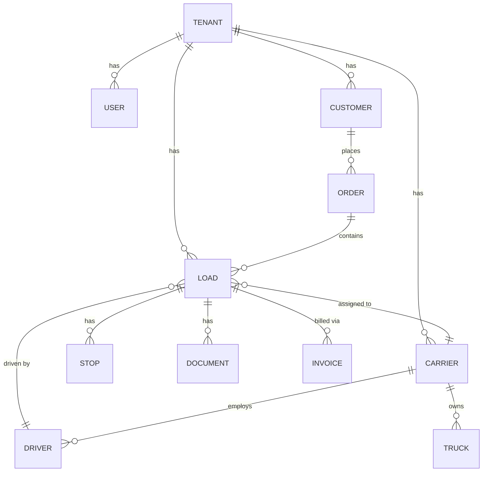

# Database Documentation Generator

**Purpose:** Read the database schema definition (Prisma, TypeORM, Django models,
Rails migrations, etc.) and produce comprehensive documentation including model
tables, relationship descriptions, pattern documentation, and an ERD in Mermaid format.

**Output:** `dev_docs/specs/database/schema-documentation.md`

---

## When to Run

Run this generator:

- At project kickoff (document existing schema)
- After adding or modifying database models
- Before designing new features (understand existing data model)
- After significant migrations

---

## Inputs Required

| Input | Location | What it provides |
| ----- | -------- | ---------------- |
| Schema file | Varies by ORM (see below) | Model definitions, fields, relations |
| Migration files | Migration directory | Schema evolution history |
| Seed files | Seed directory | Default data, enum values |
| Service specs | `dev_docs/specs/services/*.md` | Expected data model |

### Framework-Specific Schema Locations

| ORM | Schema location | Migration location |
| --- | --------------- | ------------------ |
| **Prisma** | `prisma/schema.prisma` or `apps/api/prisma/schema.prisma` | `prisma/migrations/` |
| **TypeORM** | `src/entities/*.entity.ts` or `src/modules/*/entities/` | `src/migrations/` |
| **Django** | `{app}/models.py` in each app | `{app}/migrations/` |
| **SQLAlchemy** | `models/*.py` or `app/models/` | `alembic/versions/` |
| **Rails** | `app/models/*.rb` | `db/migrate/` |
| **Drizzle** | `src/db/schema.ts` | `drizzle/` |

---

## Extraction Algorithm

### Step 1: Read the Schema

Read the schema definition file(s) for the project's ORM.

### Step 2: Extract Model Information

For each model/table, extract:

| Field | Description | Example |
| ----- | ----------- | ------- |
| **Model name** | Class/model name | `Load` |
| **Table name** | Actual DB table name (if mapped differently) | `loads` |
| **Description** | What this entity represents | "A freight shipment" |
| **Fields** | All columns with full detail (see below) | See field table |
| **Relations** | Foreign keys, associations | See relations table |
| **Indexes** | Non-PK indexes | See indexes table |
| **Constraints** | Unique, check, enum constraints | See constraints table |

### Field Detail

For each field, capture:

| Property | Description | Example |
| -------- | ----------- | ------- |
| Name | Column name | `status` |
| Type | Data type | `String`, `Int`, `DateTime`, `UUID`, `Enum(LoadStatus)` |
| Required | Nullable or not | Yes / No |
| Default | Default value | `now()`, `'draft'`, `auto-increment` |
| Unique | Unique constraint | Yes / No |
| Indexed | Has an index | Yes / No |
| Description | What this field stores | "Current status of the load" |

### Relation Detail

For each relation, capture:

| Property | Description | Example |
| -------- | ----------- | ------- |
| Type | Relationship type | `belongsTo`, `hasMany`, `manyToMany` |
| Related model | Target model | `Carrier` |
| Foreign key | FK column name | `carrierId` |
| Cascade | Cascade behavior | `onDelete: CASCADE`, `SET NULL` |
| Optional | Can be null | Yes / No |

### Step 3: Document Patterns

Identify and document recurring schema patterns:

#### Multi-Tenant Isolation

```text
Pattern: Every tenant-scoped model includes a `tenantId` field.

Fields:
  - tenantId: UUID (required, indexed, foreign key to Tenant)

Rules:
  - Every query MUST filter by tenantId
  - No cross-tenant data access is permitted
  - API layer adds tenantId from JWT automatically
  - Direct SQL queries must include WHERE tenantId = ?

Models using this pattern: {list all models with tenantId}
Models exempt from this pattern: {list exempt models, e.g., Tenant, SystemConfig}
```

#### Soft Deletes

```text
Pattern: Records are never physically deleted. Instead, deletedAt is set.

Fields:
  - deletedAt: DateTime? (nullable, defaults to null)

Rules:
  - All read queries filter: WHERE deletedAt IS NULL
  - "Delete" operations: UPDATE SET deletedAt = NOW()
  - No hard DELETE in application code
  - Prisma middleware or query scope handles this automatically

Models using this pattern: {list models}
Models using hard delete: {list models, with justification}
```

#### Timestamps

```text
Pattern: Standard audit timestamps on every model.

Fields:
  - createdAt: DateTime (auto-set to now() on create)
  - updatedAt: DateTime (auto-set to now() on every update)

All models should have both fields. Flag any model that is missing them.
```

#### Audit Trail

```text
Pattern: Track who created/modified records.

Fields:
  - createdBy: UUID (foreign key to User, set on create)
  - updatedBy: UUID (foreign key to User, set on update)

OR: Separate AuditLog table:
  - entityType: String (model name)
  - entityId: UUID (record ID)
  - action: Enum (CREATE, UPDATE, DELETE)
  - userId: UUID
  - changes: JSON (diff of old vs new values)
  - timestamp: DateTime
```

#### Enums

```text
For each enum type defined in the schema:

Enum: LoadStatus
Values: DRAFT, BOOKED, DISPATCHED, IN_TRANSIT, DELIVERED, CANCELLED
Used by: Load.status

Enum: CarrierStatus
Values: ACTIVE, INACTIVE, SUSPENDED, PENDING_REVIEW
Used by: Carrier.status
```

### Step 4: Generate ERD

Create a Mermaid entity-relationship diagram showing all models and their relationships.

**Rules for the ERD:**

- Include all models
- Show relationship cardinality: `||--o{` (one-to-many), `||--||` (one-to-one), `}o--o{` (many-to-many)
- Label relationships with the association name
- Group related models visually
- For large schemas (20+ models), create both an overview ERD (key entities only) and detailed per-service ERDs

Example:



### Step 5: Cross-Reference

Verify schema completeness:

- Every API endpoint's entity exists in the schema
- Every required field has validation in the DTO layer
- Every relation has proper cascade rules defined
- Soft delete is consistently applied across tenant-scoped models
- TenantId is present on every tenant-scoped model
- Indexes exist for fields commonly used in WHERE clauses and JOINs
- Enums in schema match enums used in application code

---

## Output Format

Write to `dev_docs/specs/database/schema-documentation.md`:

```markdown
# Database Schema Documentation

> **ORM:** {Prisma / TypeORM / Django ORM / etc.}
> **Database:** {PostgreSQL / MySQL / SQLite / MongoDB}
> **Total Models:** {N}
> **Total Enums:** {N}
> **Last Updated:** {date}

---

## Entity-Relationship Diagram

### Overview (Key Entities)

{Mermaid ERD -- top-level entities and their primary relationships}

### Detailed ERD

{Mermaid ERD -- all entities, all relationships}

---

## Models

### {ModelName}

**Table:** `{table_name}`
**Description:** {what this model represents in the business domain}

#### Fields

| Field | Type | Required | Default | Unique | Indexed | Description |
| ----- | ---- | -------- | ------- | ------ | ------- | ----------- |
| id | UUID | Yes | auto | Yes | PK | Primary key |
| tenantId | UUID | Yes | -- | No | Yes | Tenant FK |
| name | String | Yes | -- | No | Yes | Display name |
| status | Enum(Status) | Yes | 'DRAFT' | No | Yes | Current status |
| ... | | | | | | |
| createdAt | DateTime | Yes | now() | No | No | Auto timestamp |
| updatedAt | DateTime | Yes | now() | No | No | Auto timestamp |
| deletedAt | DateTime | No | null | No | No | Soft delete |

#### Relations

| Relation | Type | Related Model | Foreign Key | Cascade | Optional |
| -------- | ---- | ------------- | ----------- | ------- | -------- |
| tenant | belongsTo | Tenant | tenantId | RESTRICT | No |
| carrier | belongsTo | Carrier | carrierId | SET NULL | Yes |
| stops | hasMany | Stop | loadId | CASCADE | -- |

#### Indexes

| Name | Fields | Type | Notes |
| ---- | ------ | ---- | ----- |
| idx_loads_tenant | (tenantId) | btree | Tenant isolation |
| idx_loads_status | (tenantId, status) | btree | Filtered queries |
| uq_loads_ref | (tenantId, referenceNumber) | unique | Business key |

---

{repeat for all models}

---

## Enums

### {EnumName}

| Value | Description | Used By |
| ----- | ----------- | ------- |
| DRAFT | Initial state, not yet submitted | Load.status |
| BOOKED | Confirmed and assigned | Load.status |
| ... | | |

---

## Patterns

### Multi-Tenant Isolation

{documentation}

**Models with tenantId:** {list}
**Models without tenantId:** {list with justification}

### Soft Deletes

{documentation}

**Models with soft delete:** {list}
**Models with hard delete:** {list with justification}

### Timestamps

{documentation}

**Models missing timestamps:** {list -- these should be fixed}

### Audit Trail

{documentation}

---

## Schema Issues

Problems found during documentation:

| # | Issue | Severity | Model(s) | Recommendation |
| - | ----- | -------- | -------- | -------------- |
| 1 | Missing tenantId | P0 | {model} | Add tenantId field + index |
| 2 | No index on FK | P2 | {model.field} | Add index for query performance |
| 3 | Missing deletedAt | P2 | {model} | Add soft delete field |
| 4 | No cascade rule | P1 | {relation} | Define ON DELETE behavior |

---

## Migration History

| Date | Migration | Description |
| ---- | --------- | ----------- |
| {date} | {migration name} | {what changed} |
```

---

## Validation Checklist

After generation, verify:

- [ ] Every model in the schema file is documented
- [ ] Every field in every model is listed with correct type and constraints
- [ ] Every relation is documented with cardinality, FK, and cascade rule
- [ ] ERD accurately represents all models and their relationships
- [ ] Multi-tenant pattern is consistently documented
- [ ] Soft delete pattern is consistently documented
- [ ] Enums are listed with all values
- [ ] Schema issues are flagged with severity and recommendation
- [ ] Cross-reference with API catalog confirms all needed models exist
