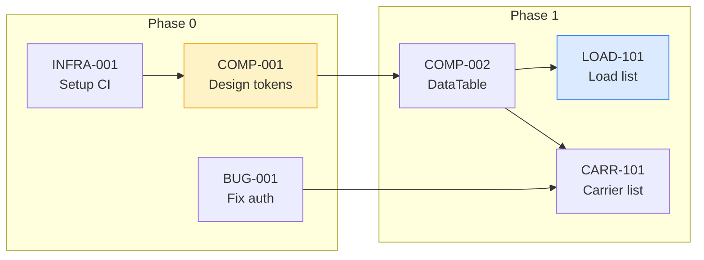

# Dependency Grapher

**Purpose:** Build a task dependency graph from all task files, identify the critical
path, find parallelization opportunities, and flag structural issues.

**Output:** Dependency analysis section in `dev_docs/STATUS.md` + optional Mermaid diagram

---

## When to Run

Run this generator:

- After the Phase Generator creates initial task files
- After adding or removing tasks
- When reassigning work between developers
- At sprint planning to identify parallel work streams

---

## Inputs Required

| Input | Location | What it provides |
| ----- | -------- | ---------------- |
| Task files | `dev_docs/tasks/*.md` | Task IDs, effort, dependencies, phase |
| STATUS.md | `dev_docs/STATUS.md` | Current task statuses |

---

## Step 1: Read All Task Files

Read every task file in `dev_docs/tasks/`. For each task, extract:

| Field | Source |
| ----- | ------ |
| Task ID | File name or `# {ID}:` heading |
| Title | Heading text after the ID |
| Phase | Metadata section |
| Effort | Metadata section (S/M/L/XL) |
| Effort Hours | Convert: S=1.5h, M=3h, L=6h, XL=12h |
| Status | Metadata section |
| Dependencies | "Blocked by" or "Dependencies" field |

---

## Step 2: Build the Dependency Graph

Create a directed acyclic graph (DAG) where:

- **Nodes** = tasks (with effort in hours)
- **Edges** = dependency relationships (A -> B means "A must complete before B can start")

Example:

```
INFRA-001 (3h) --> COMP-001 (3h) --> COMP-002 (3h) --> LOAD-101 (6h)
                                  --> COMP-003 (3h) --> CARR-101 (6h)
BUG-001 (1.5h) --> CARR-002 (3h)
BUG-003 (1.5h)                                        (no dependents)
```

### Data Structure

```
Graph = Map<TaskID, {
  id: string;
  title: string;
  phase: number;
  effortHours: number;
  status: string;
  dependsOn: TaskID[];    // incoming edges (prerequisites)
  blocks: TaskID[];       // outgoing edges (tasks that depend on this)
}>
```

---

## Step 3: Identify Critical Path

The critical path is the longest chain of dependent tasks measured by total hours.

**Algorithm:**

1. Find all tasks with no prerequisites (root nodes)
2. For each root, perform a depth-first traversal summing effort hours
3. The path with the maximum total hours is the critical path

**Output format:**

```markdown
## Critical Path

**Total: {N} hours across {M} tasks**

{TASK-A} ({Xh}) -> {TASK-B} ({Yh}) -> {TASK-C} ({Zh}) -> ... -> {TASK-N} ({Wh})

This is the minimum project duration. No amount of parallelization can reduce
time below {N} hours of sequential work.
```

---

## Step 4: Find Parallelizable Task Groups

Tasks with no dependency relationship between them can run in parallel.

**Algorithm:**

1. Group tasks by their "earliest start" (depth from root in the DAG)
2. Within each depth level, tasks are parallelizable
3. Assign tasks to developers considering:
   - Expertise (backend vs frontend)
   - Effort balance (roughly equal hours per developer per sprint)
   - Service affinity (keep one developer focused on one service)

**Output format:**

```markdown
## Parallelization Opportunities

### Sprint 1 (Week 1-2): Phase 0 Foundation

| Developer 1 (Claude Code) | Developer 2 (Codex/Gemini) |
| -------------------------- | -------------------------- |
| INFRA-001 (M, 3h) | BUG-001 (S, 1.5h) |
| COMP-001 (M, 3h) | BUG-002 (S, 1.5h) |
| COMP-002 (M, 3h) | BUG-003 (M, 3h) |
| **Total: 9h** | **Total: 6h** |

### Sprint 2 (Week 3-4): Phase 1 Start

| Developer 1 | Developer 2 |
| ----------- | ----------- |
| LOAD-101 (L, 6h) | CARR-101 (L, 6h) |
| LOAD-102 (M, 3h) | CARR-102 (M, 3h) |
| **Total: 9h** | **Total: 9h** |
```

---

## Step 5: Flag Structural Issues

Check for and report:

### 5a. Circular Dependencies

A depends on B, B depends on A. This is a bug in the task plan.

```markdown
### Circular Dependencies (MUST FIX)

| Cycle | Tasks Involved |
| ----- | -------------- |
| 1 | TASK-A -> TASK-B -> TASK-A |
```

**Resolution:** Break the cycle by splitting one task or removing one dependency edge.

### 5b. Bottleneck Tasks

Tasks that block 3 or more other tasks. These are high-risk -- if they slip, many
tasks are delayed.

```markdown
### Bottleneck Tasks (HIGH PRIORITY)

| Task | Blocks | Effort | Recommendation |
| ---- | ------ | ------ | -------------- |
| COMP-001 | COMP-002, COMP-003, PATT-001, LOAD-101 | M | Prioritize first. Assign strongest developer. |
```

### 5c. Orphan Tasks

Tasks with no dependencies AND no dependents. These might be:
- Standalone tasks (valid -- just verify they are intentional)
- Missing dependency declarations (bug -- fix the task file)

```markdown
### Orphan Tasks (VERIFY)

| Task | Phase | Notes |
| ---- | ----- | ----- |
| DOC-001 | 0 | Documentation task -- standalone is correct |
| LOAD-105 | 1 | Suspicious -- should this depend on LOAD-101? |
```

### 5d. Long Chains

Dependency chains longer than 5 tasks. Consider if any links can be parallelized.

```markdown
### Long Chains (>5 tasks)

| Chain | Length | Total Hours | Can any steps be parallelized? |
| ----- | ------ | ----------- | ----------------------------- |
| INFRA-001 -> COMP-001 -> ... -> LOAD-105 | 7 | 30h | COMP-002 and COMP-003 can run in parallel |
```

---

## Step 6: Generate Output

### Add to STATUS.md

Append or update the "Dependency Analysis" section in `dev_docs/STATUS.md`:

```markdown
## Dependency Analysis

> Generated: {date}

### Critical Path: {N} hours
{TASK-A} -> {TASK-B} -> ... -> {TASK-N}

### Bottleneck Tasks (block 3+ others)

| Task | Blocks | Effort | Priority |
| ---- | ------ | ------ | -------- |
| COMP-001 | COMP-002, COMP-003, PATT-001 | M | Assign first |

### Parallelization Plan

{Sprint-by-sprint developer assignment tables}

### Issues Found

- {N} circular dependencies (MUST FIX)
- {N} bottleneck tasks (HIGH PRIORITY)
- {N} orphan tasks (VERIFY)
- {N} long chains (REVIEW)
```

### Optional: Mermaid Diagram

Generate a visual dependency graph:



Color coding:

- Yellow: Bottleneck tasks
- Blue: Critical path tasks
- Green: Completed tasks
- Gray: Not yet started
- Red: Blocked tasks

---

## Validation Checklist

After generation, verify:

- [ ] Every task file is represented in the graph
- [ ] No circular dependencies exist (or they are flagged for resolution)
- [ ] Critical path hours are realistic (matches team capacity for the timeline)
- [ ] Parallelization plan balances work roughly equally between developers
- [ ] Bottleneck tasks are flagged and prioritized
- [ ] Sprint plans respect dependency order (no task scheduled before its prerequisites)
