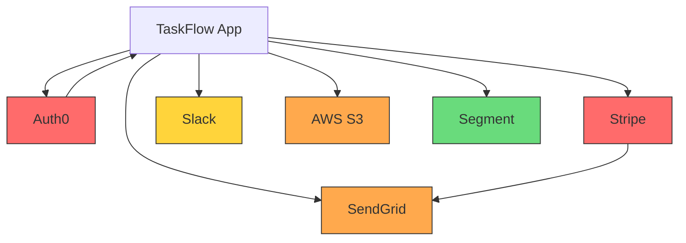

# TaskFlow SaaS — Integration Strategy (Example)

> **Owner:** Alex Chen (Lead Developer)
> **Maturity Level:** Standard
> **Integration Count:** 6
> **Last Updated:** 2024-07-15

---

## 1. Integration Inventory

| # | Service | Category | Direction | Criticality | Fallback Strategy | SLA Requirement | Monthly Cost | Sandbox Available |
|---|---------|----------|-----------|-------------|-------------------|-----------------|--------------|-------------------|
| 1 | Auth0 | Auth | Bidirectional | P0-Critical | Allow cached sessions, block new logins | 99.9% | $0 (free tier: 7,500 MAU) | Yes (dev tenant) |
| 2 | Stripe | Payments | Bidirectional | P0-Critical | Queue payments, notify user of delay | 99.9% | ~$0 + 2.9% per transaction | Yes (test mode) |
| 3 | SendGrid | Email | Outbound | P1-High | AWS SES fallback | 99.5% | $0 (free tier: 100/day) → $20/mo at scale | Yes (sandbox) |
| 4 | Slack | Communication | Outbound | P2-Medium | Queue notifications, deliver when available | 99.0% | $0 (free) | Yes (test workspace) |
| 5 | AWS S3 | Storage | Bidirectional | P1-High | Cloudflare R2 fallback | 99.9% | ~$5/month | Yes (separate bucket) |
| 6 | Segment | Analytics/CDP | Outbound | P3-Low | Drop events silently, log warning | N/A | $0 (free tier: 1,000 MTU) | Yes |

---

## 2. Integration Dependency Graph

**Dependency chains:**
- **Stripe → SendGrid:** Payment confirmation emails are triggered by Stripe webhook events. If SendGrid is down, payment succeeds but confirmation email is delayed (queued for retry).
- **Auth0 → Everything:** All authenticated API calls depend on Auth0 tokens being valid. Cached sessions mitigate short outages.

---

## 3. Implementation Timeline

### Phase 1: Foundation (Sprint 1–2)
| Integration | Reason | Blocks |
|-------------|--------|--------|
| Auth0 | Authentication required for all features | Every other integration |
| AWS S3 | File uploads needed for task attachments | Task creation with attachments |

### Phase 2: Core Features (Sprint 3–4)
| Integration | Reason | Blocks |
|-------------|--------|--------|
| Stripe | Paid plans launch in Sprint 4 | Billing page, plan enforcement |
| SendGrid | Transactional emails (invites, password reset) | User onboarding flow |

### Phase 3: Enhancement (Sprint 5+)
| Integration | Reason | Blocks |
|-------------|--------|--------|
| Slack | Team notification channel | Notification preferences page |
| Segment | Analytics tracking for growth metrics | None (can launch without) |

---

## 4. Data Flow Architecture

### Inbound Data Flows

| Source | Data Type | Mechanism | Frequency | Storage | Retention |
|--------|-----------|-----------|-----------|---------|-----------|
| Auth0 | User profile (name, email, avatar) | OAuth callback + Management API | On login / profile update | PostgreSQL `users` table | Account lifetime |
| Stripe | Payment events (succeeded, failed, refunded) | Webhooks | Real-time | PostgreSQL `payments` table | 7 years (compliance) |
| Stripe | Subscription status changes | Webhooks | Real-time | PostgreSQL `subscriptions` table | Account lifetime |

### Outbound Data Flows

| Destination | Data Type | Mechanism | Frequency | Contains PII | Encryption |
|-------------|-----------|-----------|-----------|-------------|------------|
| SendGrid | Email content (to, subject, body) | API call | On event | Yes (email address) | In-transit (TLS) |
| Slack | Notification text (task name, assignee) | API call (chat.postMessage) | On event | No (no email/phone in notifications) | In-transit (TLS) |
| S3 | File uploads (task attachments) | Presigned URL upload | On user action | Possibly (user-uploaded content) | Both (SSE-S3 + TLS) |
| Segment | Analytics events (feature usage, signups) | API call (server-side) | On event | Yes (user_id, email in identify) | In-transit (TLS) |

---

## 5. Credential Management Strategy

### Secrets Manager

| Environment | Secrets Solution | Access Pattern |
|-------------|-----------------|----------------|
| Local Development | `.env.local` (gitignored) | `process.env.VARIABLE` |
| CI/CD | GitHub Actions secrets | Environment injection |
| Staging | Vercel Environment Variables | `process.env.VARIABLE` |
| Production | Vercel Environment Variables (production scope) | `process.env.VARIABLE` |

### API Key Inventory

| Service | Key Type | Rotation Schedule | Last Rotated | Environments |
|---------|----------|-------------------|-------------|--------------|
| Auth0 | Client Secret + Management API Token | Annually | 2024-01-15 | Dev, Staging, Prod |
| Stripe | Secret Key (sk_test / sk_live) | Annually + on compromise | 2024-03-01 | Dev (test), Staging (test), Prod (live) |
| SendGrid | API Key (mail.send scope only) | Annually | 2024-01-15 | Dev, Staging, Prod |
| Slack | Bot Token | On app reinstall | 2024-02-01 | Prod only (dev uses test workspace) |
| AWS S3 | IAM Access Key + Secret | Every 90 days | 2024-06-15 | Dev, Staging, Prod |
| Segment | Write Key | Annually | 2024-01-15 | Dev (dev source), Prod (prod source) |

---

## 6. Integration Cost Budget

### Monthly Cost Projection

| Service | Free Tier Limit | Current Usage | Projected Usage (6mo) | Monthly Cost | Annual Cost |
|---------|----------------|---------------|----------------------|-------------|-------------|
| Auth0 | 7,500 MAU | 200 MAU | 2,000 MAU | $0 | $0 |
| Stripe | No limit (pay per transaction) | 50 transactions/mo | 500 transactions/mo | ~$150 in fees | ~$1,800 |
| SendGrid | 100 emails/day | 30/day | 200/day | $0 → $20/mo | $0 → $240 |
| Slack | Free | N/A | N/A | $0 | $0 |
| AWS S3 | 5 GB (12 mo) | 500 MB | 5 GB | $0 → $5 | $0 → $60 |
| Segment | 1,000 MTU | 200 MTU | 1,500 MTU | $0 → $120 | $0 → $1,440 |

**Total Monthly Integration Budget (at scale):** ~$295/month
**Annual Integration Budget:** ~$3,540

### Cost Alert Configuration

| Threshold | Action | Notification Channel |
|-----------|--------|---------------------|
| 50% of monthly budget (~$150) | Log warning | #ops Slack channel |
| 80% of monthly budget (~$236) | Alert team | #ops Slack channel + email to lead |
| 100% of monthly budget (~$295) | Page on-call | PagerDuty |
| 150% of monthly budget (~$443) | Investigate + throttle non-critical | Incident channel |

---

## 7. Environment Strategy

| Integration | Development | Staging | Production |
|-------------|------------|---------|------------|
| Auth0 | Dev tenant (sandbox) | Staging tenant | Production tenant |
| Stripe | Test mode (sk_test_xxx) | Test mode (sk_test_xxx) | Live mode (sk_live_xxx) |
| SendGrid | Sandbox mode (no real sends) | Sandbox mode | Live |
| Slack | Test workspace | Test workspace | Production workspace |
| AWS S3 | Dev bucket (taskflow-dev-uploads) | Staging bucket | Production bucket |
| Segment | Dev source (dev write key) | Dev source | Production source |

---

## 8. Architecture Decisions

### Decision 1: Webhook Processing Architecture
- **Decision:** Queue-based async (BullMQ)
- **Rationale:** Stripe webhooks must be acknowledged within 3 seconds. Processing payment logic synchronously risks timeouts. BullMQ provides retry, DLQ, and rate limiting out of the box.

### Decision 2: Circuit Breaker Strategy
- **Decision:** Per-integration circuit breakers for Auth0 and Stripe. No circuit breaker for SendGrid (queue handles retries), Slack (non-critical), S3 (highly reliable), Segment (fire-and-forget).
- **Rationale:** Only P0 integrations justify circuit breaker complexity. Opossum library for Node.js with 5 failures in 60s threshold.

### Decision 3: Multi-Provider Fallback
- **Decision:** Active-passive fallback for email (SendGrid → SES) and storage (S3 → R2). No fallback for Auth0 (too complex), Stripe (payment methods are provider-locked), Slack (non-critical), Segment (non-critical).
- **Rationale:** Email and storage are the easiest to implement fallback for (compatible APIs). Auth and payments have provider-specific stored data that can't transfer.

### Decision 4: Integration Testing Approach
- **Decision:** Hybrid — MSW mocks for unit tests, recorded fixtures for contract tests, Stripe test mode for integration tests.
- **Rationale:** MSW gives fast deterministic tests. Recorded fixtures catch API response format changes. Stripe test mode verifies end-to-end payment flows without real money.

---

## 9. Risk Register

| Risk | Likelihood | Impact | Mitigation | Owner |
|------|-----------|--------|------------|-------|
| Auth0 outage during business hours | Low | Critical | Cached sessions continue, monitor Auth0 status page | Alex |
| Stripe webhook events lost during deployment | Medium | High | BullMQ queue + zero-downtime deploys | Alex |
| SendGrid free tier exceeded before paid plan activated | Medium | Medium | Usage monitoring + SES fallback ready | Sarah |
| API key committed to public repo | Low | Critical | gitleaks pre-commit hook + immediate rotation protocol | All |
| S3 egress costs spike from unexpected traffic | Low | Low | Cloudflare CDN in front of S3, R2 migration planned for v2 | Alex |

---

## 10. Implementation Checklist

### Before First Integration
- [x] Vercel Environment Variables configured for all environments
- [x] Pre-commit hooks installed (gitleaks for secret scanning)
- [x] Integration health check endpoint created (`/api/health/integrations`)
- [ ] Integration monitoring dashboard deployed
- [x] Standard integration client wrapper with circuit breaker
- [ ] Billing alerts configured for all paid integrations
- [x] BullMQ webhook processing infrastructure set up

### Per-Integration Status
| Integration | In Inventory | Data Flows Documented | Health Check | Contract Tests | Mock/Sandbox | Monitoring |
|-------------|-------------|----------------------|-------------|----------------|-------------|------------|
| Auth0 | ✅ | ✅ | ✅ | ✅ | ✅ | ⬜ |
| Stripe | ✅ | ✅ | ✅ | ✅ | ✅ | ⬜ |
| SendGrid | ✅ | ✅ | ⬜ | ⬜ | ✅ | ⬜ |
| Slack | ✅ | ✅ | ⬜ | ⬜ | ✅ | ⬜ |
| AWS S3 | ✅ | ✅ | ✅ | ⬜ | ✅ | ⬜ |
| Segment | ✅ | ✅ | ⬜ | ⬜ | ✅ | ⬜ |

### Before Launch
- [ ] All P0/P1 integrations have health checks responding ✅
- [x] Circuit breakers configured for Auth0 and Stripe
- [ ] Email fallback (SendGrid → SES) tested end-to-end
- [x] All webhook endpoints verified with provider test events
- [x] BullMQ dead letter queue configured and monitored
- [ ] Credential rotation tested end-to-end
- [ ] Integration cost projections reviewed and budget set
- [ ] All integration tests passing in CI
- [ ] Runbook created for Auth0 and Stripe outage scenarios
