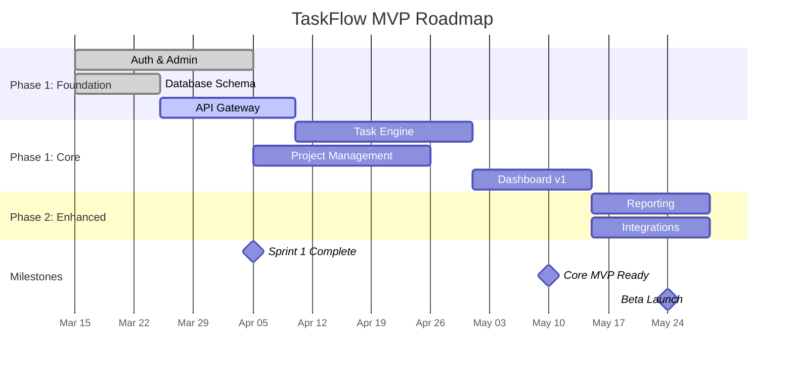

# Stakeholder Communications Example — TaskFlow SaaS

> This shows what `31-stakeholder-communications/` templates look like when filled in for the fictional TaskFlow project management SaaS.

---

## Filled Communication Plan (excerpt)

### Stakeholder Registry

| # | Name | Role | Audience Type | Preferred Channel | Update Cadence | Key Concerns |
|---|------|------|---------------|-------------------|----------------|--------------|
| 1 | Sarah Chen | CEO / Co-founder | executive | Email + Monthly video call | Weekly written, Monthly call | Timeline, budget, feature scope |
| 2 | Marcus Webb | Lead Investor (Series A) | investor | Email | Monthly | Burn rate, user growth, milestones |
| 3 | Priya Patel | Product Manager (Client) | client | Slack + Bi-weekly video | Sprint-aligned | Feature delivery, demo schedule, approvals |
| 4 | Dev Team (Jordan, Alex, Sam) | Engineering | team | Slack + Daily standup | Daily | Dependencies, blockers, technical decisions |

---

## Filled Kickoff Deck (excerpt)

### TaskFlow — Project Management That Actually Works

**Problem:** Teams waste 6+ hours/week switching between disconnected tools — Trello for tasks, Slack for updates, Google Sheets for timelines, email for approvals. Nothing talks to each other.

**Solution:** A unified project management platform where tasks, timelines, communication, and approvals live in one place. One login, one dashboard, one source of truth.

**Target Users:**
- **Project Managers** — Need real-time visibility across all projects without chasing updates
- **Team Members** — Need clear task assignments with context, not scattered post-its
- **Executives** — Need portfolio-level dashboards without manual status reports

**Scope Summary:**

| Service | Features | Phase | Status |
|---------|----------|-------|--------|
| Auth & Admin | Login, registration, roles, permissions | Phase 1 | [GREEN] Planned |
| Project Management | Projects, milestones, timelines, Gantt | Phase 1 | [GREEN] Planned |
| Task Engine | Tasks, subtasks, dependencies, assignments | Phase 1 | [GREEN] Planned |
| Dashboard | KPI widgets, status overview, notifications | Phase 1 | [GREEN] Planned |
| Reporting | Custom reports, exports, scheduled emails | Phase 2 | Planned |
| Integrations | Slack, GitHub, Google Calendar, Zapier | Phase 2 | Planned |

**Timeline:** 12 weeks to MVP | Team: 3 developers | Launch target: June 2026

---

## Filled Miro Export (system-mind-map.miro.md)

<!-- Copy everything below this line and paste into Miro -->

# TaskFlow System Overview

## Core Services
- **Auth & Admin** — User registration, login, role management, team invitations
- **Project Management** — Create projects, set milestones, manage timelines, Gantt views
- **Task Engine** — Create tasks, assign members, set dependencies, track progress
- **Dashboard** — Real-time KPI widgets, project status cards, notification center
- **Reporting** — Custom report builder, PDF/CSV export, scheduled email reports
- **Integrations** — Slack notifications, GitHub commit linking, calendar sync

## User Types
- **Project Manager** — Creates projects, assigns tasks, monitors progress, runs reports
- **Team Member** — Receives assignments, updates task status, logs time, collaborates
- **Executive** — Views portfolio dashboard, approves budgets, reviews KPIs
- **Admin** — Manages users, configures workspace, sets permissions

## Data & Storage
- **PostgreSQL** — Primary data store (projects, tasks, users, audit logs)
- **Redis** — Session cache, real-time notifications, rate limiting
- **S3** — File attachments, report exports, avatars

## Key Workflows
- **Task lifecycle** — Created → Assigned → In Progress → Review → Done
- **Project setup** — Create → Add members → Define milestones → Generate tasks
- **Sprint cycle** — Plan → Execute → Review → Retrospect → Repeat

---

## Filled Weekly Stakeholder Update (excerpt)

### What Changed Since Last Update
- Completed user authentication flow (login, register, password reset)
- Dashboard layout finalized — 4 KPI widgets + project status cards
- Identified risk: Gantt chart library has performance issues with 500+ tasks

### Overall Status: [GREEN] On track

### This Week's Highlights
| Accomplishment | Business Impact |
|----------------|-----------------|
| Auth flow complete | Users can sign up and log in — foundation for everything else |
| Dashboard wireframes approved | Executives will see real-time project health at a glance |
| API contracts for Task Engine | Backend and frontend can now develop in parallel |

### Metrics Snapshot

| Metric | Current | Last Week | Trend |
|--------|---------|-----------|-------|
| Features complete | 4/18 | 2/18 | ↑ Improving |
| Sprint progress | 85% | — | New sprint |
| Open bugs | 2 (0 critical) | 1 | → Stable |
| Test coverage | 72% | 65% | ↑ Improving |

### Milestone Progress

| Milestone | Target | Status | Progress |
|-----------|--------|--------|----------|
| Auth & Admin complete | Week 3 | [GREEN] On track | `[===============>    ] 75%` |
| Task Engine MVP | Week 6 | [GREEN] On track | `[=====>               ] 25%` |
| Dashboard v1 | Week 8 | [GREEN] On track | `[===>                 ] 15%` |
| Beta launch | Week 10 | [GREEN] On track | `[>                    ] 5%` |

---

## Filled Mermaid Gantt (excerpt)

---

## Filled Go/No-Go Decision (excerpt)

### Decision: CONDITIONAL GO

**Decision Date:** 2026-05-20
**Decision Makers:** Sarah Chen (CEO), Priya Patel (Product Manager), Jordan (Tech Lead)

### Readiness Assessment

| Area | Ready? | Confidence | Blockers |
|------|--------|------------|----------|
| Core Features | [GREEN] Yes | 95% | None |
| Performance | [YELLOW] Mostly | 80% | Gantt view slow with 500+ tasks |
| Security | [GREEN] Yes | 95% | None |
| Testing | [GREEN] Yes | 90% | 2 medium bugs remaining |
| Infrastructure | [GREEN] Yes | 95% | None |
| Documentation | [YELLOW] Mostly | 75% | Help center needs 3 more articles |

### Conditions for Go
1. Fix Gantt performance issue (ETA: 2 days) — must handle 1000+ tasks smoothly
2. Complete remaining help center articles (ETA: 1 day)
3. Zero critical bugs at launch time

### Sign-off

| Name | Role | Decision | Date |
|------|------|----------|------|
| Sarah Chen | CEO | GO (conditional) | 2026-05-20 |
| Priya Patel | Product Manager | GO (conditional) | 2026-05-20 |
| Jordan | Tech Lead | GO (conditional) | 2026-05-20 |
