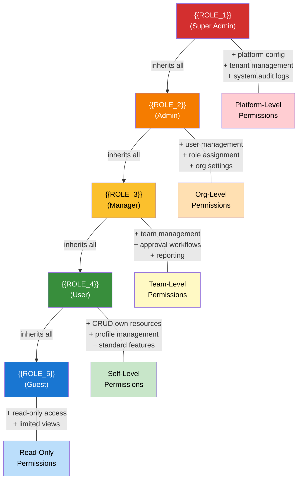

# Auth Role & Permission Matrix — {{PROJECT_NAME}}

Paste the Mermaid block below into any Mermaid-compatible renderer (GitHub, VS Code, Mermaid Live Editor). Replace all {{PLACEHOLDER}} values with project-specific data before rendering.

**Category:** 11 — UX & Navigation

---

## Role Hierarchy

## Permission Matrix

### {{SERVICE_1_NAME}} Permissions

| Permission | {{ROLE_1}} | {{ROLE_2}} | {{ROLE_3}} | {{ROLE_4}} | {{ROLE_5}} |
|-----------|:---------:|:---------:|:---------:|:---------:|:---------:|
| {{SERVICE_1_NAME}}: Create | &#10003; | &#10003; | &#10003; | &#10003; | &#10007; |
| {{SERVICE_1_NAME}}: Read Own | &#10003; | &#10003; | &#10003; | &#10003; | &#10003; |
| {{SERVICE_1_NAME}}: Read Team | &#10003; | &#10003; | &#10003; | &#10007; | &#10007; |
| {{SERVICE_1_NAME}}: Read All | &#10003; | &#10003; | &#10007; | &#10007; | &#10007; |
| {{SERVICE_1_NAME}}: Update Own | &#10003; | &#10003; | &#10003; | &#10003; | &#10007; |
| {{SERVICE_1_NAME}}: Update Any | &#10003; | &#10003; | &#10003; | &#10007; | &#10007; |
| {{SERVICE_1_NAME}}: Delete Own | &#10003; | &#10003; | &#10003; | &#10003; | &#10007; |
| {{SERVICE_1_NAME}}: Delete Any | &#10003; | &#10003; | &#10007; | &#10007; | &#10007; |
| {{SERVICE_1_NAME}}: Export | &#10003; | &#10003; | &#10003; | &#10007; | &#10007; |
| {{SERVICE_1_NAME}}: Bulk Operations | &#10003; | &#10003; | &#10007; | &#10007; | &#10007; |

### {{SERVICE_2_NAME}} Permissions

| Permission | {{ROLE_1}} | {{ROLE_2}} | {{ROLE_3}} | {{ROLE_4}} | {{ROLE_5}} |
|-----------|:---------:|:---------:|:---------:|:---------:|:---------:|
| {{SERVICE_2_NAME}}: Create | &#10003; | &#10003; | &#10003; | &#10003; | &#10007; |
| {{SERVICE_2_NAME}}: Read Own | &#10003; | &#10003; | &#10003; | &#10003; | &#10003; |
| {{SERVICE_2_NAME}}: Read All | &#10003; | &#10003; | &#10003; | &#10007; | &#10007; |
| {{SERVICE_2_NAME}}: Update Own | &#10003; | &#10003; | &#10003; | &#10003; | &#10007; |
| {{SERVICE_2_NAME}}: Update Any | &#10003; | &#10003; | &#10003; | &#10007; | &#10007; |
| {{SERVICE_2_NAME}}: Delete | &#10003; | &#10003; | &#10007; | &#10007; | &#10007; |
| {{SERVICE_2_NAME}}: Approve | &#10003; | &#10003; | &#10003; | &#10007; | &#10007; |
| {{SERVICE_2_NAME}}: Archive | &#10003; | &#10003; | &#10003; | &#10007; | &#10007; |

### User & Organization Management

| Permission | {{ROLE_1}} | {{ROLE_2}} | {{ROLE_3}} | {{ROLE_4}} | {{ROLE_5}} |
|-----------|:---------:|:---------:|:---------:|:---------:|:---------:|
| Users: Invite | &#10003; | &#10003; | &#10003; | &#10007; | &#10007; |
| Users: Deactivate | &#10003; | &#10003; | &#10007; | &#10007; | &#10007; |
| Users: Assign Roles | &#10003; | &#10003; | &#10007; | &#10007; | &#10007; |
| Users: View Audit Log | &#10003; | &#10003; | &#10007; | &#10007; | &#10007; |
| Org: Update Settings | &#10003; | &#10003; | &#10007; | &#10007; | &#10007; |
| Org: Manage Billing | &#10003; | &#10003; | &#10007; | &#10007; | &#10007; |
| Org: View Analytics | &#10003; | &#10003; | &#10003; | &#10007; | &#10007; |
| Profile: Update Own | &#10003; | &#10003; | &#10003; | &#10003; | &#10003; |

### Platform Administration

| Permission | {{ROLE_1}} | {{ROLE_2}} | {{ROLE_3}} | {{ROLE_4}} | {{ROLE_5}} |
|-----------|:---------:|:---------:|:---------:|:---------:|:---------:|
| Platform: Manage Tenants | &#10003; | &#10007; | &#10007; | &#10007; | &#10007; |
| Platform: System Configuration | &#10003; | &#10007; | &#10007; | &#10007; | &#10007; |
| Platform: View System Logs | &#10003; | &#10007; | &#10007; | &#10007; | &#10007; |
| Platform: Feature Flags | &#10003; | &#10007; | &#10007; | &#10007; | &#10007; |
| Platform: Impersonate User | &#10003; | &#10007; | &#10007; | &#10007; | &#10007; |
| API: Manage Keys | &#10003; | &#10003; | &#10007; | &#10007; | &#10007; |
| API: View Rate Limits | &#10003; | &#10003; | &#10003; | &#10007; | &#10007; |
| Webhooks: Configure | &#10003; | &#10003; | &#10007; | &#10007; | &#10007; |

## MFA Requirements

| Role | MFA Required | Allowed Methods | Session Timeout | Max Concurrent Sessions |
|------|:-----------:|-----------------|-----------------|------------------------|
| {{ROLE_1}} | **Yes** | Hardware key, TOTP | {{SA_SESSION_TIMEOUT}} | {{SA_MAX_SESSIONS}} |
| {{ROLE_2}} | **Yes** | Hardware key, TOTP, SMS | {{ADMIN_SESSION_TIMEOUT}} | {{ADMIN_MAX_SESSIONS}} |
| {{ROLE_3}} | {{MANAGER_MFA_REQUIRED}} | TOTP, SMS, Email | {{MANAGER_SESSION_TIMEOUT}} | {{MANAGER_MAX_SESSIONS}} |
| {{ROLE_4}} | {{USER_MFA_REQUIRED}} | TOTP, SMS, Email | {{USER_SESSION_TIMEOUT}} | {{USER_MAX_SESSIONS}} |
| {{ROLE_5}} | No | N/A | {{GUEST_SESSION_TIMEOUT}} | {{GUEST_MAX_SESSIONS}} |

## Data Access Boundaries

| Role | Can Access Own Data | Can Access Team Data | Can Access All Org Data | Cross-Org Data | Admin Functions |
|------|:------------------:|:-------------------:|:----------------------:|:--------------:|:--------------:|
| {{ROLE_1}} | &#10003; | &#10003; | &#10003; | &#10003; | &#10003; Full platform |
| {{ROLE_2}} | &#10003; | &#10003; | &#10003; | &#10007; | &#10003; Own org only |
| {{ROLE_3}} | &#10003; | &#10003; | &#10007; | &#10007; | Limited (team scope) |
| {{ROLE_4}} | &#10003; | &#10007; | &#10007; | &#10007; | &#10007; |
| {{ROLE_5}} | Read-only (shared) | &#10007; | &#10007; | &#10007; | &#10007; |

> **Row-Level Security Note:** All data queries are filtered by `organization_id` at the database level. {{ROLE_1}} bypasses tenant filtering for cross-org operations. All other roles are strictly scoped to their organization.

> **Audit Trail:** All permission checks are logged. Failed authorization attempts trigger alerts after {{AUTH_FAILURE_THRESHOLD}} consecutive failures within {{AUTH_FAILURE_WINDOW}}.

---

## Cross-References

- **Database ERD:** `database-erd-visual.template.md` — see the `users`, `roles`, `permissions` tables underlying this matrix
- **Data Security:** `stakeholder-data-security.template.md` — data classification tiers that inform access boundaries
- **System Architecture:** `system-architecture-flowchart.template.md` — where auth service sits in the platform
- **Mobile Navigation:** `mobile-navigation-map.template.md` — navigation guards that enforce these permissions
