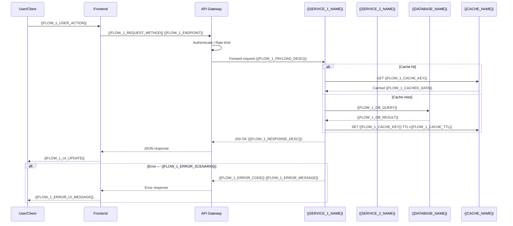
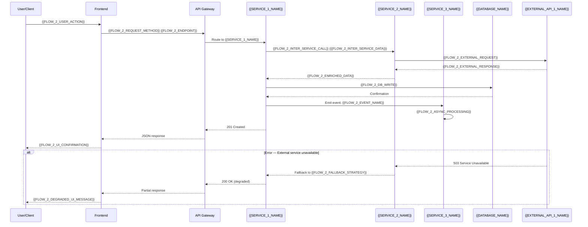
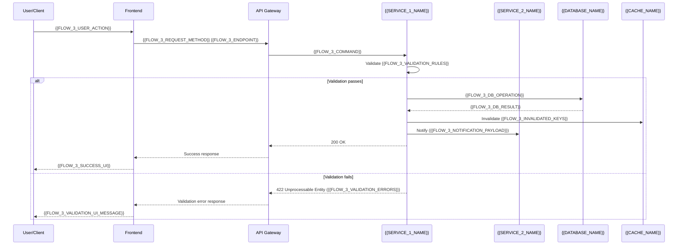
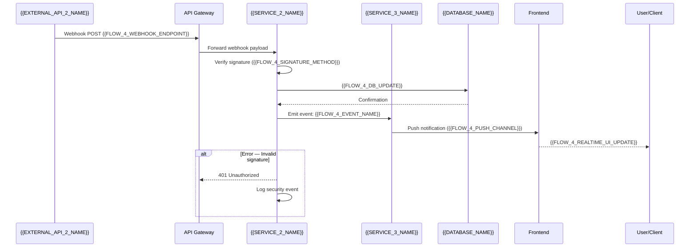
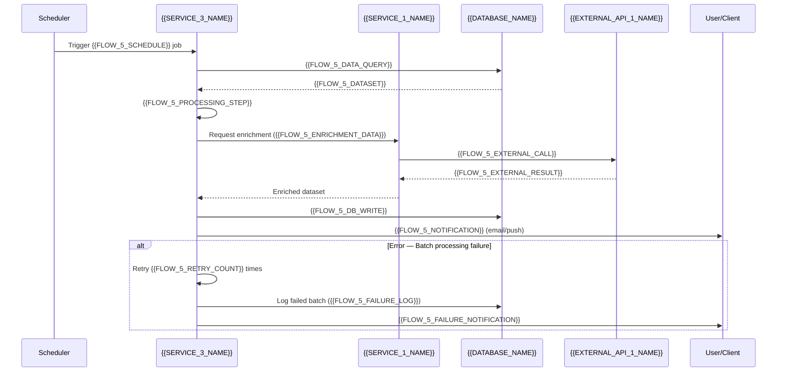

# Data Flow Diagram — {{PROJECT_NAME}}

Paste the Mermaid block below into any Mermaid-compatible renderer (GitHub, VS Code, Mermaid Live Editor). Replace all {{PLACEHOLDER}} values with project-specific data before rendering.

---

## Flow 1: {{FLOW_1_NAME}}

## Flow 2: {{FLOW_2_NAME}}

## Flow 3: {{FLOW_3_NAME}}

## Flow 4: {{FLOW_4_NAME}}

## Flow 5: {{FLOW_5_NAME}}

---

## Data Flow Summary

| Flow | Trigger | Services Involved | Data Exchanged | Storage Points |
|------|---------|-------------------|----------------|----------------|
| {{FLOW_1_NAME}} | {{FLOW_1_USER_ACTION}} | {{SERVICE_1_NAME}}, Cache | {{FLOW_1_PAYLOAD_DESC}} → {{FLOW_1_RESPONSE_DESC}} | {{DATABASE_NAME}}, {{CACHE_NAME}} |
| {{FLOW_2_NAME}} | {{FLOW_2_USER_ACTION}} | {{SERVICE_1_NAME}}, {{SERVICE_2_NAME}}, {{SERVICE_3_NAME}} | {{FLOW_2_INTER_SERVICE_DATA}} + {{FLOW_2_EXTERNAL_RESPONSE}} | {{DATABASE_NAME}} |
| {{FLOW_3_NAME}} | {{FLOW_3_USER_ACTION}} | {{SERVICE_1_NAME}}, {{SERVICE_2_NAME}} | {{FLOW_3_COMMAND}} → {{FLOW_3_DB_RESULT}} | {{DATABASE_NAME}} |
| {{FLOW_4_NAME}} | External webhook | {{SERVICE_2_NAME}}, {{SERVICE_3_NAME}} | {{FLOW_4_WEBHOOK_ENDPOINT}} payload | {{DATABASE_NAME}} |
| {{FLOW_5_NAME}} | Scheduled ({{FLOW_5_SCHEDULE}}) | {{SERVICE_3_NAME}}, {{SERVICE_1_NAME}} | {{FLOW_5_DATASET}} → {{FLOW_5_ENRICHMENT_DATA}} | {{DATABASE_NAME}} |

## Notes

- **Authentication:** All requests through the API Gateway carry a `Bearer {{AUTH_TOKEN_TYPE}}` header. Gateway validates before routing.
- **Rate limiting:** Gateway enforces {{RATE_LIMIT_REQUESTS}}/{{RATE_LIMIT_WINDOW}} per client.
- **Timeouts:** Service-to-service calls use a {{INTER_SERVICE_TIMEOUT_MS}}ms timeout with {{RETRY_POLICY}} retry policy.
- **Idempotency:** Flows 2 and 4 use idempotency keys (`X-Idempotency-Key`) to prevent duplicate processing.

## Cross-References

- **System architecture:** `system-architecture-flowchart.template.md`
- **Service dependencies:** `df-cross-service-dependencies.template.md`
- **Value chain:** `df-value-chain.template.md`
- **Real-time paths:** `df-realtime-paths.template.md`
- **Integration registry:** `int-phase1-mvp.template.md`
