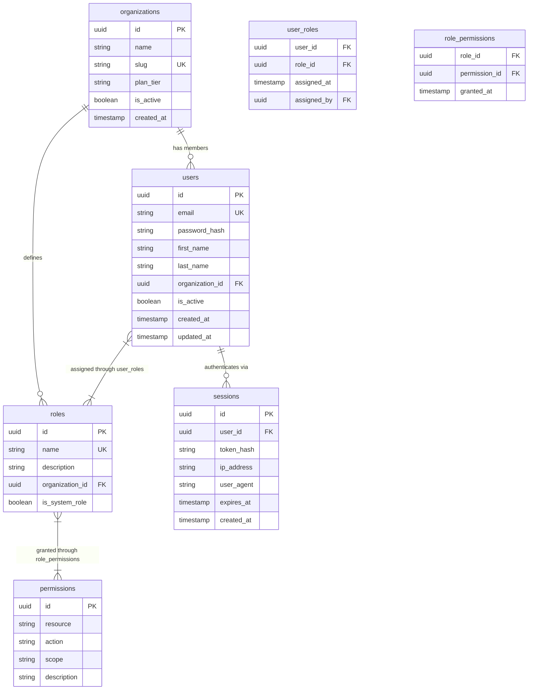

# Database Entity-Relationship Diagram — {{PROJECT_NAME}}

Paste the Mermaid block below into any Mermaid-compatible renderer (GitHub, VS Code, Mermaid Live Editor). Replace all {{PLACEHOLDER}} values with project-specific data before rendering.

**Category:** 9 — Data Architecture

---

## Core & Auth Domain



## {{SERVICE_1_NAME}} Domain

```mermaid
erDiagram
    {{SERVICE_1_TABLE_1}} {
        uuid id PK
        uuid organization_id FK
        string {{SERVICE_1_TABLE_1_FIELD_1}}
        string {{SERVICE_1_TABLE_1_FIELD_2}}
        string status
        timestamp created_at
        timestamp updated_at
    }

    {{SERVICE_1_TABLE_2}} {
        uuid id PK
        uuid {{SERVICE_1_TABLE_1}}_id FK
        string {{SERVICE_1_TABLE_2_FIELD_1}}
        text {{SERVICE_1_TABLE_2_FIELD_2}}
        integer {{SERVICE_1_TABLE_2_FIELD_3}}
        timestamp created_at
    }

    {{SERVICE_1_TABLE_3}} {
        uuid id PK
        uuid {{SERVICE_1_TABLE_1}}_id FK
        uuid user_id FK
        string type
        jsonb metadata
        timestamp created_at
    }

    {{SERVICE_1_TABLE_4}} {
        uuid id PK
        uuid {{SERVICE_1_TABLE_2}}_id FK
        string {{SERVICE_1_TABLE_4_FIELD_1}}
        decimal {{SERVICE_1_TABLE_4_FIELD_2}}
        timestamp effective_date
    }

    {{SERVICE_1_TABLE_1}} ||--o{ {{SERVICE_1_TABLE_2}} : "contains"
    {{SERVICE_1_TABLE_1}} ||--o{ {{SERVICE_1_TABLE_3}} : "tracks"
    {{SERVICE_1_TABLE_2}} ||--o{ {{SERVICE_1_TABLE_4}} : "has"
```

## {{SERVICE_2_NAME}} Domain

```mermaid
erDiagram
    {{SERVICE_2_TABLE_1}} {
        uuid id PK
        uuid organization_id FK
        uuid created_by FK
        string {{SERVICE_2_TABLE_1_FIELD_1}}
        string {{SERVICE_2_TABLE_1_FIELD_2}}
        string status
        timestamp created_at
        timestamp updated_at
    }

    {{SERVICE_2_TABLE_2}} {
        uuid id PK
        uuid {{SERVICE_2_TABLE_1}}_id FK
        string {{SERVICE_2_TABLE_2_FIELD_1}}
        text {{SERVICE_2_TABLE_2_FIELD_2}}
        boolean is_completed
        timestamp due_date
    }

    {{SERVICE_2_TABLE_3}} {
        uuid id PK
        uuid {{SERVICE_2_TABLE_1}}_id FK
        uuid user_id FK
        text content
        timestamp created_at
    }

    {{SERVICE_2_TABLE_1}} ||--o{ {{SERVICE_2_TABLE_2}} : "includes"
    {{SERVICE_2_TABLE_1}} ||--o{ {{SERVICE_2_TABLE_3}} : "has"
    {{SERVICE_2_TABLE_2}} ||--|| {{SERVICE_2_TABLE_1}} : "belongs to"
```

## {{SERVICE_3_NAME}} Domain

```mermaid
erDiagram
    {{SERVICE_3_TABLE_1}} {
        uuid id PK
        uuid organization_id FK
        string {{SERVICE_3_TABLE_1_FIELD_1}}
        string channel
        string status
        jsonb payload
        timestamp scheduled_at
        timestamp sent_at
    }

    {{SERVICE_3_TABLE_2}} {
        uuid id PK
        uuid user_id FK
        string channel
        boolean is_enabled
        jsonb preferences
        timestamp updated_at
    }

    {{SERVICE_3_TABLE_3}} {
        uuid id PK
        string name
        string channel
        text body_template
        jsonb variables
        boolean is_active
    }

    {{SERVICE_3_TABLE_1}} ||--|| {{SERVICE_3_TABLE_3}} : "uses"
    {{SERVICE_3_TABLE_2}} ||--o{ {{SERVICE_3_TABLE_1}} : "controls delivery of"
```

## Cross-Domain Relationships

```mermaid
erDiagram
    users ||--o{ {{SERVICE_1_TABLE_1}} : "owns"
    users ||--o{ {{SERVICE_2_TABLE_1}} : "creates"
    users ||--o{ {{SERVICE_3_TABLE_2}} : "configures"
    organizations ||--o{ {{SERVICE_1_TABLE_1}} : "scopes"
    organizations ||--o{ {{SERVICE_2_TABLE_1}} : "scopes"
    {{SERVICE_1_TABLE_1}} ||--o{ {{SERVICE_3_TABLE_1}} : "triggers"
    {{SERVICE_2_TABLE_1}} ||--o{ {{SERVICE_3_TABLE_1}} : "triggers"
    {{SERVICE_1_TABLE_3}} }|--|| users : "performed by"
    {{SERVICE_2_TABLE_3}} }|--|| users : "authored by"
```

---

## Table Ownership

| Table | Domain | Service Owner | Multi-Tenant Column | Row Estimate |
|-------|--------|---------------|---------------------|--------------|
| `users` | Core & Auth | {{AUTH_SERVICE}} | `organization_id` | {{USERS_ROW_ESTIMATE}} |
| `organizations` | Core & Auth | {{AUTH_SERVICE}} | `id` (root) | {{ORGS_ROW_ESTIMATE}} |
| `roles` | Core & Auth | {{AUTH_SERVICE}} | `organization_id` | {{ROLES_ROW_ESTIMATE}} |
| `permissions` | Core & Auth | {{AUTH_SERVICE}} | N/A (global) | {{PERMISSIONS_ROW_ESTIMATE}} |
| `sessions` | Core & Auth | {{AUTH_SERVICE}} | via `user_id` | {{SESSIONS_ROW_ESTIMATE}} |
| `{{SERVICE_1_TABLE_1}}` | {{SERVICE_1_NAME}} | {{SERVICE_1_OWNER}} | `organization_id` | {{SERVICE_1_TABLE_1_ROW_ESTIMATE}} |
| `{{SERVICE_1_TABLE_2}}` | {{SERVICE_1_NAME}} | {{SERVICE_1_OWNER}} | via parent | {{SERVICE_1_TABLE_2_ROW_ESTIMATE}} |
| `{{SERVICE_1_TABLE_3}}` | {{SERVICE_1_NAME}} | {{SERVICE_1_OWNER}} | via parent | {{SERVICE_1_TABLE_3_ROW_ESTIMATE}} |
| `{{SERVICE_1_TABLE_4}}` | {{SERVICE_1_NAME}} | {{SERVICE_1_OWNER}} | via parent | {{SERVICE_1_TABLE_4_ROW_ESTIMATE}} |
| `{{SERVICE_2_TABLE_1}}` | {{SERVICE_2_NAME}} | {{SERVICE_2_OWNER}} | `organization_id` | {{SERVICE_2_TABLE_1_ROW_ESTIMATE}} |
| `{{SERVICE_2_TABLE_2}}` | {{SERVICE_2_NAME}} | {{SERVICE_2_OWNER}} | via parent | {{SERVICE_2_TABLE_2_ROW_ESTIMATE}} |
| `{{SERVICE_2_TABLE_3}}` | {{SERVICE_2_NAME}} | {{SERVICE_2_OWNER}} | via parent | {{SERVICE_2_TABLE_3_ROW_ESTIMATE}} |
| `{{SERVICE_3_TABLE_1}}` | {{SERVICE_3_NAME}} | {{SERVICE_3_OWNER}} | `organization_id` | {{SERVICE_3_TABLE_1_ROW_ESTIMATE}} |
| `{{SERVICE_3_TABLE_2}}` | {{SERVICE_3_NAME}} | {{SERVICE_3_OWNER}} | via `user_id` | {{SERVICE_3_TABLE_2_ROW_ESTIMATE}} |
| `{{SERVICE_3_TABLE_3}}` | {{SERVICE_3_NAME}} | {{SERVICE_3_OWNER}} | N/A (global) | {{SERVICE_3_TABLE_3_ROW_ESTIMATE}} |

## Relationship Summary

| Relationship | Type | From Table | To Table | Cascade Rule |
|-------------|------|------------|----------|--------------|
| Organization → Users | One-to-Many | `organizations` | `users` | SET NULL |
| User → Sessions | One-to-Many | `users` | `sessions` | CASCADE DELETE |
| User ↔ Roles | Many-to-Many | `users` | `roles` | CASCADE DELETE (junction) |
| Role ↔ Permissions | Many-to-Many | `roles` | `permissions` | CASCADE DELETE (junction) |
| User → {{SERVICE_1_TABLE_1}} | One-to-Many | `users` | `{{SERVICE_1_TABLE_1}}` | SET NULL |
| {{SERVICE_1_TABLE_1}} → {{SERVICE_1_TABLE_2}} | One-to-Many | `{{SERVICE_1_TABLE_1}}` | `{{SERVICE_1_TABLE_2}}` | CASCADE DELETE |
| User → {{SERVICE_2_TABLE_1}} | One-to-Many | `users` | `{{SERVICE_2_TABLE_1}}` | SET NULL |
| {{SERVICE_2_TABLE_1}} → {{SERVICE_2_TABLE_2}} | One-to-Many | `{{SERVICE_2_TABLE_1}}` | `{{SERVICE_2_TABLE_2}}` | CASCADE DELETE |
| {{SERVICE_1_TABLE_1}} → {{SERVICE_3_TABLE_1}} | One-to-Many | `{{SERVICE_1_TABLE_1}}` | `{{SERVICE_3_TABLE_1}}` | SET NULL |

---

## Cross-References

- **System Architecture:** `system-architecture-flowchart.template.md` — see how these databases map to services
- **Data Flow:** `data-flow.template.md` — see read/write patterns across domains
- **Multi-Tenant:** `xc-multi-tenant.template.md` — tenant isolation strategy for shared tables
- **Auth & Roles:** `auth-role-permission-matrix.template.md` — permission model built on the roles/permissions tables above
