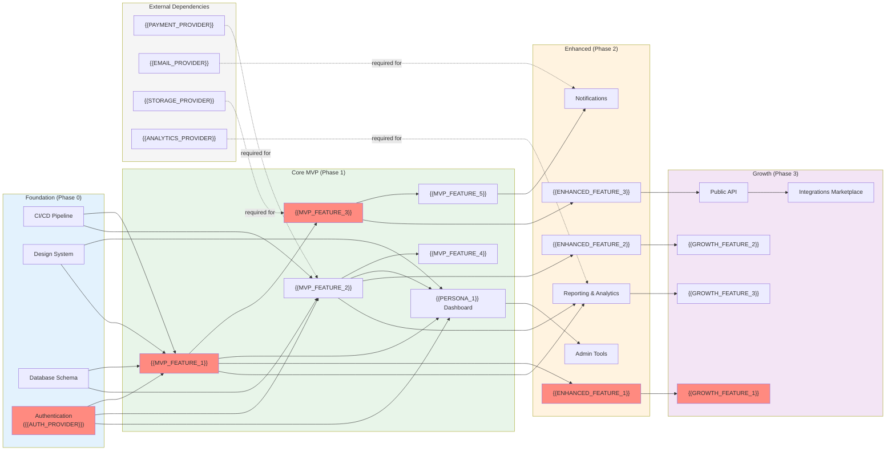

# Dependency Graph — {{PROJECT_NAME}}

Paste the Mermaid block below into any Mermaid-compatible renderer. Replace all `{{PLACEHOLDER}}` values before rendering.

**Legend:**
- Red-highlighted nodes indicate the **critical path** — the longest chain of dependent tasks that determines the minimum project duration.
- Dashed arrows from external services indicate **third-party dependencies** that require vendor setup or API access.
- Adjust node connections to match your actual feature dependency structure.
