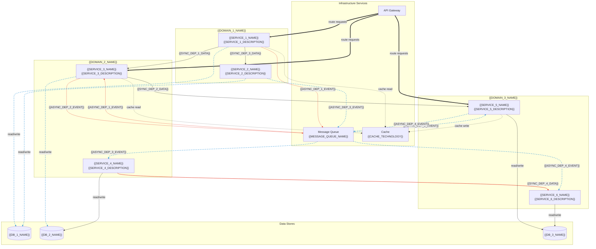

# Cross-Service Data Dependencies — {{PROJECT_NAME}}

Paste the Mermaid block below into any Mermaid-compatible renderer (GitHub, VS Code, Mermaid Live Editor). Replace all {{PLACEHOLDER}} values with project-specific data before rendering.

---

### Legend

| Arrow Style | Meaning |
|-------------|---------|
| **Solid line** (`-->`) | Synchronous dependency — caller blocks until response |
| **Dashed line** (`-.->`) | Asynchronous dependency — event-driven, non-blocking |
| **Bold line** (`==>`) | Gateway routing — entry point for external requests |

---

## Dependency Matrix

| Producer Service | Data Produced | Consumer Service | Type | Coupling Level |
|------------------|---------------|------------------|------|----------------|
| {{SERVICE_1_NAME}} | {{SYNC_DEP_1_DATA}} | {{SERVICE_3_NAME}} | Sync | {{COUPLING_1_LEVEL}} |
| {{SERVICE_3_NAME}} | {{SYNC_DEP_2_DATA}} | {{SERVICE_5_NAME}} | Sync | {{COUPLING_2_LEVEL}} |
| {{SERVICE_1_NAME}} | {{SYNC_DEP_3_DATA}} | {{SERVICE_2_NAME}} | Sync | {{COUPLING_3_LEVEL}} |
| {{SERVICE_4_NAME}} | {{SYNC_DEP_4_DATA}} | {{SERVICE_6_NAME}} | Sync | {{COUPLING_4_LEVEL}} |
| {{SERVICE_1_NAME}} | {{ASYNC_DEP_1_EVENT}} | {{SERVICE_3_NAME}} | Async | Loose |
| {{SERVICE_3_NAME}} | {{ASYNC_DEP_2_EVENT}} | {{SERVICE_5_NAME}} | Async | Loose |
| {{SERVICE_2_NAME}} | {{ASYNC_DEP_3_EVENT}} | {{SERVICE_4_NAME}} | Async | Loose |
| {{SERVICE_5_NAME}} | {{ASYNC_DEP_4_EVENT}} | {{SERVICE_6_NAME}} | Async | Loose |

## Circular Dependency Check

| Potential Cycle | Services | Mitigation |
|-----------------|----------|------------|
| {{CYCLE_1_DESCRIPTION}} | {{CYCLE_1_SERVICES}} | {{CYCLE_1_MITIGATION}} |
| {{CYCLE_2_DESCRIPTION}} | {{CYCLE_2_SERVICES}} | {{CYCLE_2_MITIGATION}} |

## Failure Cascade Analysis

| If This Service Fails | Directly Affected | Indirectly Affected | Blast Radius |
|-----------------------|-------------------|---------------------|--------------|
| {{SERVICE_1_NAME}} | {{SERVICE_1_DIRECT_IMPACT}} | {{SERVICE_1_INDIRECT_IMPACT}} | {{SERVICE_1_BLAST_RADIUS}} |
| {{SERVICE_3_NAME}} | {{SERVICE_3_DIRECT_IMPACT}} | {{SERVICE_3_INDIRECT_IMPACT}} | {{SERVICE_3_BLAST_RADIUS}} |
| {{SERVICE_5_NAME}} | {{SERVICE_5_DIRECT_IMPACT}} | {{SERVICE_5_INDIRECT_IMPACT}} | {{SERVICE_5_BLAST_RADIUS}} |
| {{MESSAGE_QUEUE_NAME}} | All async consumers | All downstream services | Critical |

## Notes

- **Coupling targets:** No service should have more than {{MAX_SYNC_DEPENDENCIES}} synchronous dependencies. Prefer async for cross-domain communication.
- **Data ownership:** Each database is owned by a single domain. Cross-domain reads go through the owning service's API, never directly to the database.
- **Event schema registry:** All async events are registered in {{EVENT_SCHEMA_REGISTRY}} with versioned schemas.

## Cross-References

- **Data flow sequences:** `data-flow.template.md`
- **Value chain:** `df-value-chain.template.md`
- **System architecture:** `system-architecture-flowchart.template.md`
- **Real-time paths:** `df-realtime-paths.template.md`
