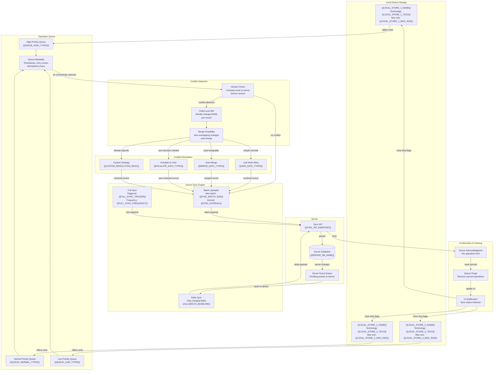

<!-- CONDITIONAL: Generate only if {{HAS_MOBILE}} == "true" AND {{HAS_OFFLINE}} == "true" -->

# Mobile Offline Sync — {{PROJECT_NAME}}

Paste the Mermaid block below into any Mermaid-compatible renderer (GitHub, VS Code, Mermaid Live Editor). Replace all {{PLACEHOLDER}} values with project-specific data before rendering.

---

---

## Sync Strategy by Data Type

| Data Type | Local Storage | Queue Priority | Conflict Strategy | Max Offline Duration |
|-----------|---------------|----------------|-------------------|----------------------|
| {{DATA_TYPE_1_NAME}} | {{DATA_TYPE_1_STORAGE}} | High | Last-Write-Wins | {{DATA_TYPE_1_MAX_OFFLINE}} |
| {{DATA_TYPE_2_NAME}} | {{DATA_TYPE_2_STORAGE}} | High | Auto-Merge (field-level) | {{DATA_TYPE_2_MAX_OFFLINE}} |
| {{DATA_TYPE_3_NAME}} | {{DATA_TYPE_3_STORAGE}} | Normal | Escalate to User | {{DATA_TYPE_3_MAX_OFFLINE}} |
| {{DATA_TYPE_4_NAME}} | {{DATA_TYPE_4_STORAGE}} | Normal | Auto-Merge (append-only) | {{DATA_TYPE_4_MAX_OFFLINE}} |
| {{DATA_TYPE_5_NAME}} | {{DATA_TYPE_5_STORAGE}} | Low | Last-Write-Wins | {{DATA_TYPE_5_MAX_OFFLINE}} |
| {{DATA_TYPE_6_NAME}} | {{DATA_TYPE_6_STORAGE}} | Low | {{DATA_TYPE_6_STRATEGY}} | {{DATA_TYPE_6_MAX_OFFLINE}} |

## Offline Capability Matrix

| Feature | Available Offline | Data Freshness | Sync Behavior on Reconnect |
|---------|-------------------|----------------|----------------------------|
| {{FEATURE_1_NAME}} | {{FEATURE_1_OFFLINE}} | {{FEATURE_1_FRESHNESS}} | {{FEATURE_1_RECONNECT}} |
| {{FEATURE_2_NAME}} | {{FEATURE_2_OFFLINE}} | {{FEATURE_2_FRESHNESS}} | {{FEATURE_2_RECONNECT}} |
| {{FEATURE_3_NAME}} | {{FEATURE_3_OFFLINE}} | {{FEATURE_3_FRESHNESS}} | {{FEATURE_3_RECONNECT}} |
| {{FEATURE_4_NAME}} | {{FEATURE_4_OFFLINE}} | {{FEATURE_4_FRESHNESS}} | {{FEATURE_4_RECONNECT}} |
| {{FEATURE_5_NAME}} | {{FEATURE_5_OFFLINE}} | {{FEATURE_5_FRESHNESS}} | {{FEATURE_5_RECONNECT}} |

## Conflict Resolution Decision Tree

1. **Version vectors match** → No conflict, proceed with sync.
2. **Version vectors diverge, non-overlapping fields** → Auto-merge both changes.
3. **Version vectors diverge, overlapping fields, data type = LWW** → Server timestamp wins.
4. **Version vectors diverge, overlapping fields, data type = merge** → Apply {{MERGE_ALGORITHM}} merge.
5. **Version vectors diverge, overlapping fields, data type = escalate** → Queue for user resolution with side-by-side diff.
6. **Operation queue exceeds {{MAX_QUEUE_SIZE}} entries** → Trigger compaction (collapse sequential edits to same record).

## Storage Budget

| Store | Technology | Capacity | Eviction Policy | Encryption |
|-------|-----------|----------|-----------------|------------|
| {{LOCAL_STORE_1_NAME}} | {{LOCAL_STORE_1_TECH}} | {{LOCAL_STORE_1_MAX_SIZE}} | {{LOCAL_STORE_1_EVICTION}} | {{LOCAL_STORE_1_ENCRYPTION}} |
| {{LOCAL_STORE_2_NAME}} | {{LOCAL_STORE_2_TECH}} | {{LOCAL_STORE_2_MAX_SIZE}} | {{LOCAL_STORE_2_EVICTION}} | {{LOCAL_STORE_2_ENCRYPTION}} |
| {{LOCAL_STORE_3_NAME}} | {{LOCAL_STORE_3_TECH}} | {{LOCAL_STORE_3_MAX_SIZE}} | {{LOCAL_STORE_3_EVICTION}} | {{LOCAL_STORE_3_ENCRYPTION}} |

## Notes

- **Sync on wake:** The sync engine triggers on app foreground, network change, and every {{SYNC_INTERVAL}} while active.
- **Bandwidth awareness:** On metered connections (cellular), only high-priority queue items sync. Full sync deferred to Wi-Fi.
- **Data encryption:** All local stores use {{LOCAL_ENCRYPTION_METHOD}}. Encryption key derived from {{ENCRYPTION_KEY_SOURCE}}.
- **Queue persistence:** Operation queue survives app termination. Stored in {{QUEUE_PERSISTENCE_TECH}}.

## Cross-References

- **Data flow sequences:** `data-flow.template.md`
- **Real-time paths:** `df-realtime-paths.template.md`
- **Service dependencies:** `df-cross-service-dependencies.template.md`
- **System architecture:** `system-architecture-flowchart.template.md`
