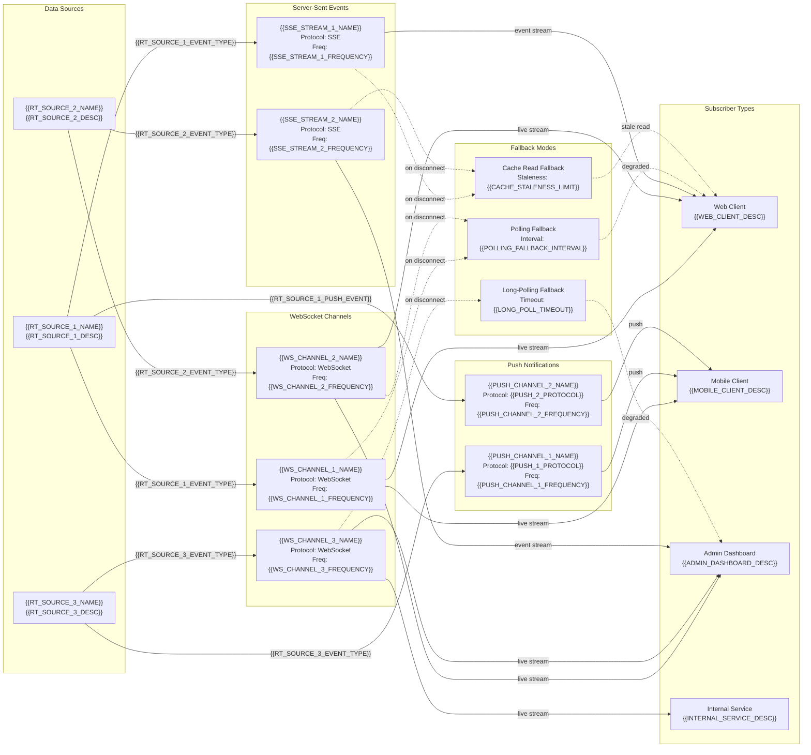

<!-- CONDITIONAL: Generate only if {{HAS_REALTIME}} == "true" -->

# Real-Time Data Paths — {{PROJECT_NAME}}

Paste the Mermaid block below into any Mermaid-compatible renderer (GitHub, VS Code, Mermaid Live Editor). Replace all {{PLACEHOLDER}} values with project-specific data before rendering.

---

---

## Real-Time Channel Registry

| Channel | Protocol | Source | Subscribers | Frequency | Payload Size | Fallback |
|---------|----------|--------|-------------|-----------|--------------|----------|
| {{WS_CHANNEL_1_NAME}} | WebSocket | {{RT_SOURCE_1_NAME}} | Web, Mobile | {{WS_CHANNEL_1_FREQUENCY}} | {{WS_CHANNEL_1_PAYLOAD_SIZE}} | Polling ({{POLLING_FALLBACK_INTERVAL}}) |
| {{WS_CHANNEL_2_NAME}} | WebSocket | {{RT_SOURCE_2_NAME}} | Web, Admin | {{WS_CHANNEL_2_FREQUENCY}} | {{WS_CHANNEL_2_PAYLOAD_SIZE}} | Polling ({{POLLING_FALLBACK_INTERVAL}}) |
| {{WS_CHANNEL_3_NAME}} | WebSocket | {{RT_SOURCE_3_NAME}} | Admin, Service | {{WS_CHANNEL_3_FREQUENCY}} | {{WS_CHANNEL_3_PAYLOAD_SIZE}} | Long-polling ({{LONG_POLL_TIMEOUT}}) |
| {{SSE_STREAM_1_NAME}} | SSE | {{RT_SOURCE_1_NAME}} | Web | {{SSE_STREAM_1_FREQUENCY}} | {{SSE_STREAM_1_PAYLOAD_SIZE}} | Cache read ({{CACHE_STALENESS_LIMIT}}) |
| {{SSE_STREAM_2_NAME}} | SSE | {{RT_SOURCE_2_NAME}} | Admin | {{SSE_STREAM_2_FREQUENCY}} | {{SSE_STREAM_2_PAYLOAD_SIZE}} | Cache read ({{CACHE_STALENESS_LIMIT}}) |
| {{PUSH_CHANNEL_1_NAME}} | {{PUSH_1_PROTOCOL}} | {{RT_SOURCE_3_NAME}} | Mobile | {{PUSH_CHANNEL_1_FREQUENCY}} | {{PUSH_CHANNEL_1_PAYLOAD_SIZE}} | In-app inbox |
| {{PUSH_CHANNEL_2_NAME}} | {{PUSH_2_PROTOCOL}} | {{RT_SOURCE_1_NAME}} | Mobile | {{PUSH_CHANNEL_2_FREQUENCY}} | {{PUSH_CHANNEL_2_PAYLOAD_SIZE}} | In-app inbox |

## Connection Management

| Parameter | Value | Notes |
|-----------|-------|-------|
| Max concurrent WS connections | {{MAX_WS_CONNECTIONS}} | Per server instance |
| WS heartbeat interval | {{WS_HEARTBEAT_INTERVAL}} | Keepalive ping/pong |
| WS reconnect backoff | {{WS_RECONNECT_BACKOFF}} | Exponential: {{WS_RECONNECT_BASE_MS}}ms base |
| SSE retry header | {{SSE_RETRY_MS}}ms | Browser-managed reconnect |
| Connection auth | {{RT_AUTH_METHOD}} | Token refresh before expiry |
| Message ordering guarantee | {{MESSAGE_ORDERING}} | Per-channel / global |

## Scaling Considerations

- **Horizontal scaling:** Real-time connections balanced via {{RT_LOAD_BALANCER}} with sticky sessions ({{STICKY_SESSION_METHOD}}).
- **Pub/Sub backbone:** {{RT_PUBSUB_TECHNOLOGY}} distributes events across server instances.
- **Backpressure:** When subscriber lag exceeds {{BACKPRESSURE_THRESHOLD}}, the channel switches to {{BACKPRESSURE_STRATEGY}}.
- **Fan-out limit:** Maximum {{MAX_FANOUT}} subscribers per channel before sharding.

## Notes

- **Graceful degradation:** All real-time channels have a fallback mode. The client SDK automatically switches when connectivity drops.
- **Message deduplication:** Each message carries an idempotency ID (`{{RT_IDEMPOTENCY_HEADER}}`). Clients deduplicate within a {{RT_DEDUP_WINDOW}} window.
- **Bandwidth budget:** Total real-time bandwidth target: {{RT_BANDWIDTH_BUDGET}} per active user.

## Cross-References

- **Data flow sequences:** `data-flow.template.md`
- **Service dependencies:** `df-cross-service-dependencies.template.md`
- **System architecture:** `system-architecture-flowchart.template.md`
- **Mobile offline sync:** `df-mobile-offline-sync.template.md`
