```mermaid
flowchart LR
    subgraph INGESTION["Stage 1: Data Ingestion"]
        UI_INPUT["User Input<br/>{{INGESTION_UI_DESCRIPTION}}"]
        API_INPUT["API Inbound<br/>{{INGESTION_API_DESCRIPTION}}"]
        IMPORT_INPUT["Bulk Import<br/>{{INGESTION_IMPORT_DESCRIPTION}}"]
        WEBHOOK_INPUT["Webhook Receiver<br/>{{INGESTION_WEBHOOK_DESCRIPTION}}"]
    end

    subgraph VALIDATION["Stage 2: Validation & Normalization"]
        SCHEMA_VAL["Schema Validation<br/>{{VALIDATION_SCHEMA_RULES}}"]
        BIZ_VAL["Business Rules<br/>{{VALIDATION_BUSINESS_RULES}}"]
        NORMALIZE["Normalization<br/>{{NORMALIZATION_RULES}}"]
        DEDUP["Deduplication<br/>{{DEDUP_STRATEGY}}"]
    end

    subgraph PROCESSING["Stage 3: Core Processing"]
        TRANSFORM["Transformation<br/>{{PROCESSING_TRANSFORM_DESC}}"]
        ENRICH["Enrichment<br/>{{PROCESSING_ENRICH_DESC}}"]
        COMPUTE["Computation<br/>{{PROCESSING_COMPUTE_DESC}}"]
        AGGREGATE["Aggregation<br/>{{PROCESSING_AGGREGATE_DESC}}"]
    end

    subgraph STORAGE["Stage 4: Persistence"]
        PRIMARY_DB[("Primary DB<br/>{{PRIMARY_DB_NAME}}")]
        CACHE[("Cache Layer<br/>{{CACHE_TECHNOLOGY}}")]
        SEARCH_IDX[("Search Index<br/>{{SEARCH_INDEX_NAME}}")]
        FILE_STORE[("File Storage<br/>{{FILE_STORAGE_NAME}}")]
    end

    subgraph DELIVERY["Stage 5: Output & Delivery"]
        API_RESP["API Responses<br/>{{DELIVERY_API_DESC}}"]
        REPORTS["Reports & Dashboards<br/>{{DELIVERY_REPORTS_DESC}}"]
        EXPORTS["Data Exports<br/>{{DELIVERY_EXPORT_FORMATS}}"]
        NOTIFICATIONS["Notifications<br/>{{DELIVERY_NOTIFICATION_CHANNELS}}"]
        EVENTS["Event Stream<br/>{{DELIVERY_EVENT_STREAM}}"]
    end

    %% Ingestion → Validation
    UI_INPUT -->|"JSON payload"| SCHEMA_VAL
    API_INPUT -->|"REST / GraphQL"| SCHEMA_VAL
    IMPORT_INPUT -->|"CSV / XLSX / JSON"| SCHEMA_VAL
    WEBHOOK_INPUT -->|"webhook event"| BIZ_VAL

    %% Validation → Processing
    SCHEMA_VAL --> BIZ_VAL
    BIZ_VAL --> NORMALIZE
    NORMALIZE --> DEDUP
    DEDUP -->|"clean record"| TRANSFORM

    %% Processing internal
    TRANSFORM -->|"{{TRANSFORM_OUTPUT_FORMAT}}"| ENRICH
    ENRICH -->|"{{ENRICH_OUTPUT_FORMAT}}"| COMPUTE
    COMPUTE -->|"{{COMPUTE_OUTPUT_FORMAT}}"| AGGREGATE

    %% Processing → Storage
    AGGREGATE -->|"write"| PRIMARY_DB
    AGGREGATE -->|"index"| SEARCH_IDX
    COMPUTE -->|"cache hot path"| CACHE
    ENRICH -->|"binary assets"| FILE_STORE

    %% Storage → Delivery
    PRIMARY_DB -->|"query results"| API_RESP
    PRIMARY_DB -->|"scheduled query"| REPORTS
    PRIMARY_DB -->|"bulk export"| EXPORTS
    CACHE -->|"fast read"| API_RESP
    SEARCH_IDX -->|"search results"| API_RESP
    PRIMARY_DB -->|"trigger"| NOTIFICATIONS
    PRIMARY_DB -->|"CDC stream"| EVENTS
```

# Data Value Chain — {{PROJECT_NAME}}

Paste the Mermaid block below into any Mermaid-compatible renderer (GitHub, VS Code, Mermaid Live Editor). Replace all {{PLACEHOLDER}} values with project-specific data before rendering.

---

---

## Value Chain Stage Detail

| Stage | Input | Transformation | Output | Service |
|-------|-------|----------------|--------|---------|
| 1 — Ingestion | {{INGESTION_INPUT_TYPES}} | Accept, authenticate, parse raw input | Parsed request objects | {{INGESTION_SERVICE_NAME}} |
| 2 — Validation | Parsed request objects | {{VALIDATION_SCHEMA_RULES}}, {{VALIDATION_BUSINESS_RULES}}, {{NORMALIZATION_RULES}} | Clean, normalized records | {{VALIDATION_SERVICE_NAME}} |
| 3a — Transformation | Normalized records | {{PROCESSING_TRANSFORM_DESC}} | {{TRANSFORM_OUTPUT_FORMAT}} | {{TRANSFORM_SERVICE_NAME}} |
| 3b — Enrichment | Transformed data | {{PROCESSING_ENRICH_DESC}} (via {{ENRICHMENT_SOURCE}}) | {{ENRICH_OUTPUT_FORMAT}} | {{ENRICH_SERVICE_NAME}} |
| 3c — Computation | Enriched data | {{PROCESSING_COMPUTE_DESC}} | {{COMPUTE_OUTPUT_FORMAT}} | {{COMPUTE_SERVICE_NAME}} |
| 3d — Aggregation | Computed results | {{PROCESSING_AGGREGATE_DESC}} | Aggregate records | {{AGGREGATE_SERVICE_NAME}} |
| 4 — Persistence | Processed data | Write to {{PRIMARY_DB_NAME}}, index in {{SEARCH_INDEX_NAME}}, cache in {{CACHE_TECHNOLOGY}} | Stored records + indexes | {{STORAGE_SERVICE_NAME}} |
| 5 — Delivery | Stored data | Format for consumers ({{DELIVERY_EXPORT_FORMATS}}) | API responses, reports, exports, notifications | {{DELIVERY_SERVICE_NAME}} |

## Data Format Transitions

| Transition Point | From Format | To Format | Responsible Service |
|------------------|-------------|-----------|---------------------|
| Ingestion → Validation | Raw HTTP / file bytes | Parsed JSON object | {{INGESTION_SERVICE_NAME}} |
| Validation → Processing | JSON object | Validated domain entity | {{VALIDATION_SERVICE_NAME}} |
| Processing → Storage | Domain entity | DB row / document | {{TRANSFORM_SERVICE_NAME}} |
| Storage → Delivery | DB row / document | Serialized response ({{DELIVERY_EXPORT_FORMATS}}) | {{DELIVERY_SERVICE_NAME}} |

## Notes

- **Throughput targets:** Ingestion: {{INGESTION_THROUGHPUT}}/sec | Processing: {{PROCESSING_THROUGHPUT}}/sec | Delivery: {{DELIVERY_THROUGHPUT}}/sec
- **Latency budget:** End-to-end user-facing path target: {{E2E_LATENCY_TARGET_MS}}ms
- **Failure handling:** Each stage writes to a dead-letter queue ({{DLQ_NAME}}) on unrecoverable errors for manual review.

## Cross-References

- **Detailed per-flow diagrams:** `data-flow.template.md`
- **Service dependencies:** `df-cross-service-dependencies.template.md`
- **System architecture:** `system-architecture-flowchart.template.md`
- **Real-time paths:** `df-realtime-paths.template.md`
