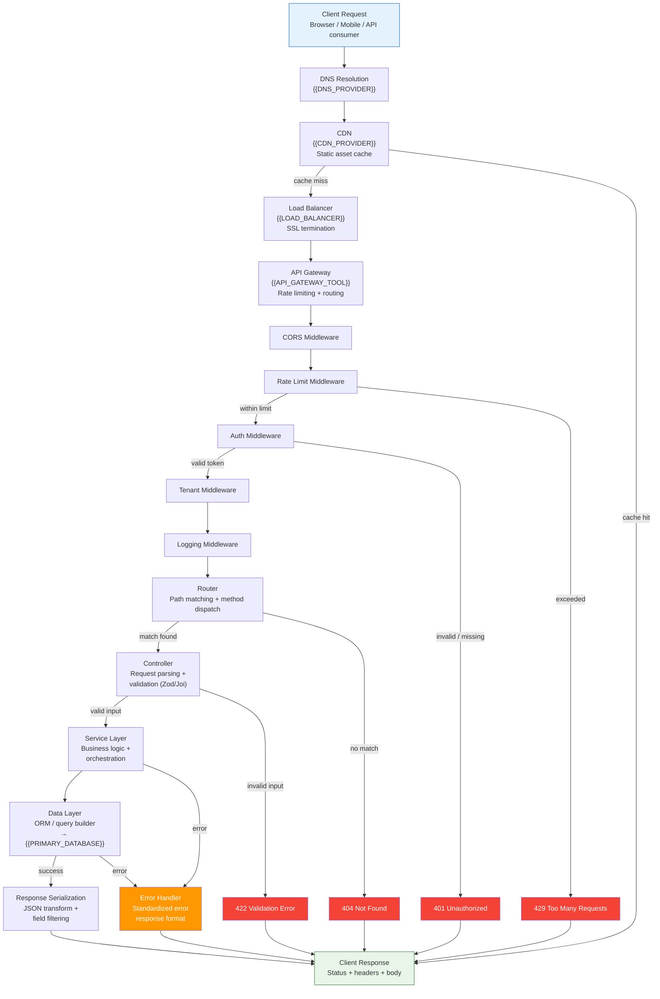

# API Architecture & Topology — {{PROJECT_NAME}}

Paste the Mermaid block below into any Mermaid-compatible renderer (GitHub, VS Code, Mermaid Live Editor). Replace all {{PLACEHOLDER}} values with project-specific data before rendering.

```mermaid
flowchart TB
    subgraph RouterHierarchy["Router Hierarchy"]
        MAIN_ROUTER["Main Router<br/>{{API_BASE_PATH}}"]

        SVC_1_ROUTER["{{SERVICE_1_NAME}} Router<br/>{{SERVICE_1_MOUNT_PATH}}<br/>Endpoints: {{SERVICE_1_ENDPOINT_COUNT}}"]
        SVC_2_ROUTER["{{SERVICE_2_NAME}} Router<br/>{{SERVICE_2_MOUNT_PATH}}<br/>Endpoints: {{SERVICE_2_ENDPOINT_COUNT}}"]
        SVC_3_ROUTER["{{SERVICE_3_NAME}} Router<br/>{{SERVICE_3_MOUNT_PATH}}<br/>Endpoints: {{SERVICE_3_ENDPOINT_COUNT}}"]
        SVC_N_ROUTER["{{SERVICE_N_NAME}} Router<br/>{{SERVICE_N_MOUNT_PATH}}<br/>Endpoints: {{SERVICE_N_ENDPOINT_COUNT}}"]

        MAIN_ROUTER --> SVC_1_ROUTER
        MAIN_ROUTER --> SVC_2_ROUTER
        MAIN_ROUTER --> SVC_3_ROUTER
        MAIN_ROUTER --> SVC_N_ROUTER
    end

    subgraph MiddlewareStack["Middleware Stack — Execution Order"]
        MW_1["1. CORS<br/>Origins: {{ALLOWED_ORIGINS}}<br/>Methods: {{ALLOWED_METHODS}}"]
        MW_2["2. Rate Limiter<br/>{{RATE_LIMIT_REQUESTS}}/{{RATE_LIMIT_WINDOW}}<br/>per IP + per user"]
        MW_3["3. Auth Middleware<br/>{{AUTH_PROVIDER}}<br/>Token validation + decode"]
        MW_4["4. Tenant Middleware<br/>Resolve tenant context<br/>from token / header"]
        MW_5["5. Request Logger<br/>Structured JSON logging<br/>request_id, method, path"]
        MW_6["6. Error Handler<br/>Catch-all error formatting<br/>Standardized error response"]

        MW_1 --> MW_2
        MW_2 --> MW_3
        MW_3 --> MW_4
        MW_4 --> MW_5
        MW_5 --> MW_6
    end

    subgraph WebSocketChannels["WebSocket Channels (if applicable)"]
        WS_1["{{WS_CHANNEL_1}}<br/>Subscribers: {{WS_CHANNEL_1_SUBSCRIBERS}}<br/>Frequency: {{WS_CHANNEL_1_FREQUENCY}}"]
        WS_2["{{WS_CHANNEL_2}}<br/>Subscribers: {{WS_CHANNEL_2_SUBSCRIBERS}}<br/>Frequency: {{WS_CHANNEL_2_FREQUENCY}}"]
        WS_N["{{WS_CHANNEL_N}}<br/>Subscribers: {{WS_CHANNEL_N_SUBSCRIBERS}}<br/>Frequency: {{WS_CHANNEL_N_FREQUENCY}}"]

        WS_HUB["WebSocket Hub<br/>{{WS_PROVIDER}}<br/>Connection limit: {{WS_MAX_CONNECTIONS}}"]

        WS_HUB --> WS_1
        WS_HUB --> WS_2
        WS_HUB --> WS_N
    end

    MAIN_ROUTER -.->|"upgrade"| WS_HUB

    style MiddlewareStack fill:#E3F2FD,stroke:#1565C0
    style RouterHierarchy fill:#E8F5E9,stroke:#2E7D32
    style WebSocketChannels fill:#F3E5F5,stroke:#6A1B9A
```

## Request Lifecycle

---

## Router Summary

| Router | Mount Path | Endpoints | Auth Required | Rate Limit | Description |
|---|---|---|---|---|---|
| {{SERVICE_1_NAME}} | {{SERVICE_1_MOUNT_PATH}} | {{SERVICE_1_ENDPOINT_COUNT}} | {{SERVICE_1_AUTH}} | {{SERVICE_1_RATE_LIMIT}} | {{SERVICE_1_DESCRIPTION}} |
| {{SERVICE_2_NAME}} | {{SERVICE_2_MOUNT_PATH}} | {{SERVICE_2_ENDPOINT_COUNT}} | {{SERVICE_2_AUTH}} | {{SERVICE_2_RATE_LIMIT}} | {{SERVICE_2_DESCRIPTION}} |
| {{SERVICE_3_NAME}} | {{SERVICE_3_MOUNT_PATH}} | {{SERVICE_3_ENDPOINT_COUNT}} | {{SERVICE_3_AUTH}} | {{SERVICE_3_RATE_LIMIT}} | {{SERVICE_3_DESCRIPTION}} |
| {{SERVICE_N_NAME}} | {{SERVICE_N_MOUNT_PATH}} | {{SERVICE_N_ENDPOINT_COUNT}} | {{SERVICE_N_AUTH}} | {{SERVICE_N_RATE_LIMIT}} | {{SERVICE_N_DESCRIPTION}} |
| Health | /health | 1 | No | None | Liveness + readiness probes |
| Docs | /docs | 1 | No | None | OpenAPI / Swagger UI |

## Middleware Execution Order

| Order | Middleware | Purpose | Failure Response | Skippable Routes |
|---|---|---|---|---|
| 1 | CORS | Cross-origin request filtering | Blocked by browser (no response) | None — applies to all |
| 2 | Rate Limiter | Abuse prevention | 429 Too Many Requests + Retry-After header | /health |
| 3 | Auth | Token validation and user context | 401 Unauthorized | Public routes ({{PUBLIC_ROUTES}}) |
| 4 | Tenant | Tenant context resolution | 403 Forbidden (invalid tenant) | Non-tenant routes |
| 5 | Request Logger | Structured request/response logging | N/A (pass-through) | None — logs all |
| 6 | Error Handler | Catch-all error formatting | Standardized JSON error body | N/A — catches only |

## WebSocket Channels (if applicable)

| Channel | Event Pattern | Subscribers | Frequency | Auth Required | Payload Size Limit |
|---|---|---|---|---|---|
| {{WS_CHANNEL_1}} | {{WS_CHANNEL_1_EVENTS}} | {{WS_CHANNEL_1_SUBSCRIBERS}} | {{WS_CHANNEL_1_FREQUENCY}} | {{WS_CHANNEL_1_AUTH}} | {{WS_CHANNEL_1_PAYLOAD_LIMIT}} |
| {{WS_CHANNEL_2}} | {{WS_CHANNEL_2_EVENTS}} | {{WS_CHANNEL_2_SUBSCRIBERS}} | {{WS_CHANNEL_2_FREQUENCY}} | {{WS_CHANNEL_2_AUTH}} | {{WS_CHANNEL_2_PAYLOAD_LIMIT}} |
| {{WS_CHANNEL_N}} | {{WS_CHANNEL_N_EVENTS}} | {{WS_CHANNEL_N_SUBSCRIBERS}} | {{WS_CHANNEL_N_FREQUENCY}} | {{WS_CHANNEL_N_AUTH}} | {{WS_CHANNEL_N_PAYLOAD_LIMIT}} |

---

## Cross-References

- **Auth & Security:** `xc-auth-security.template.md`
- **Security Zones:** `infra-security-zones.template.md`
- **System Architecture:** `system-architecture-flowchart.template.md`
- **Data Flow:** `data-flow.template.md`
- **Monitoring & Observability:** `infra-monitoring-observability.template.md`
