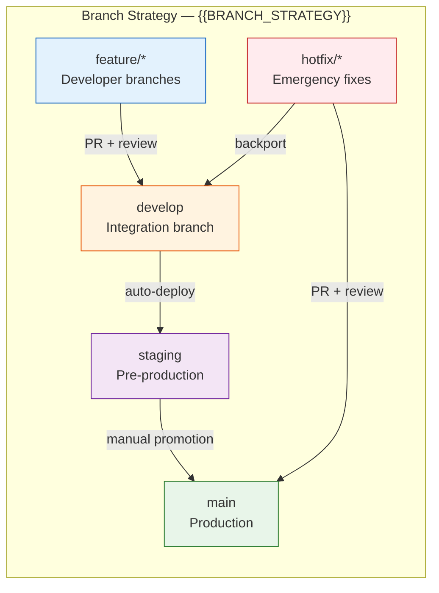

# CI/CD Pipeline — {{PROJECT_NAME}}

Paste the Mermaid block below into any Mermaid-compatible renderer (GitHub, VS Code, Mermaid Live Editor). Replace all {{PLACEHOLDER}} values with project-specific data before rendering.

```mermaid
flowchart LR
    subgraph Commit["Source Control"]
        PUSH["Code Commit<br/>Push to branch"]
        PR["Pull Request<br/>Triggers pipeline"]
        PUSH --> PR
    end

    subgraph StaticAnalysis["Static Analysis ~{{STATIC_ANALYSIS_DURATION}}"]
        LINT["Lint<br/>ESLint + Prettier<br/>~{{LINT_DURATION}}"]
        TYPE["Type Check<br/>TypeScript tsc<br/>~{{TYPE_CHECK_DURATION}}"]
        ANTI["Anti-Pattern Scan<br/>Custom rules<br/>~{{ANTI_PATTERN_DURATION}}"]

        LINT --> TYPE
        TYPE --> ANTI
    end

    subgraph Testing["Test Suite ~{{TEST_SUITE_DURATION}}"]
        UNIT["Unit Tests<br/>{{TEST_FRAMEWORK}}<br/>~{{UNIT_TEST_DURATION}}"]
        INTEG["Integration Tests<br/>{{TEST_FRAMEWORK}}<br/>~{{INTEGRATION_TEST_DURATION}}"]
        E2E["E2E Tests<br/>{{E2E_FRAMEWORK}}<br/>~{{E2E_TEST_DURATION}}"]

        UNIT --> INTEG
        INTEG --> E2E
    end

    subgraph Build["Build & Scan ~{{BUILD_SCAN_DURATION}}"]
        BUILD_STEP["Build<br/>{{BUILD_TOOL}}<br/>~{{BUILD_DURATION}}"]
        SEC_SCAN["Security Scan<br/>SAST: {{SAST_TOOL}}<br/>DAST: {{DAST_TOOL}}<br/>~{{SECURITY_SCAN_DURATION}}"]
        REGISTRY["Push to Registry<br/>{{REGISTRY_PROVIDER}}<br/>Tag: {{IMAGE_TAG_STRATEGY}}"]

        BUILD_STEP --> SEC_SCAN
        SEC_SCAN --> REGISTRY
    end

    subgraph StagingDeploy["Staging Deploy"]
        DEPLOY_STG["Deploy to Staging<br/>{{DEPLOY_TARGET}}<br/>~{{STAGING_DEPLOY_DURATION}}"]
        SMOKE["Smoke Tests<br/>Health + critical paths<br/>~{{SMOKE_TEST_DURATION}}"]
        APPROVAL{{"Manual Approval Gate<br/>Required reviewers:<br/>{{APPROVAL_REVIEWERS}}"}}

        DEPLOY_STG --> SMOKE
        SMOKE -->|"pass"| APPROVAL
    end

    subgraph ProdDeploy["Production Deploy"]
        DEPLOY_PROD["Deploy to Production<br/>{{DEPLOY_STRATEGY}}<br/>~{{PROD_DEPLOY_DURATION}}"]
        HEALTH["Post-Deploy Health Check<br/>~{{HEALTH_CHECK_DURATION}}"]
        ROLLBACK["Rollback<br/>Revert to previous<br/>~{{ROLLBACK_DURATION}}"]

        APPROVAL -->|"approved"| DEPLOY_PROD
        DEPLOY_PROD --> HEALTH
        HEALTH -->|"unhealthy"| ROLLBACK
        HEALTH -->|"healthy"| DONE["Deploy Complete"]
    end

    %% Pipeline flow
    PR --> LINT
    ANTI --> UNIT
    E2E --> BUILD_STEP
    REGISTRY --> DEPLOY_STG

    %% Failure paths
    LINT -->|"fail"| FAIL_1["Block: fix lint errors"]
    TYPE -->|"fail"| FAIL_2["Block: fix type errors"]
    UNIT -->|"fail"| FAIL_3["Block: fix failing tests"]
    SEC_SCAN -->|"critical"| FAIL_4["Block: fix vulnerabilities"]
    SMOKE -->|"fail"| FAIL_5["Block: investigate staging"]

    style FAIL_1 fill:#F44336,color:#fff
    style FAIL_2 fill:#F44336,color:#fff
    style FAIL_3 fill:#F44336,color:#fff
    style FAIL_4 fill:#F44336,color:#fff
    style FAIL_5 fill:#F44336,color:#fff
    style ROLLBACK fill:#FF9800,color:#fff
    style DONE fill:#4CAF50,color:#fff
    style APPROVAL fill:#FF9800,color:#fff
```

---

## Pipeline Stage Summary

| Stage | Tool | Estimated Duration | Failure Action | Blocks Merge |
|---|---|---|---|---|
| Lint | ESLint + Prettier | ~{{LINT_DURATION}} | Show inline errors, block | Yes |
| Type Check | TypeScript (tsc --noEmit) | ~{{TYPE_CHECK_DURATION}} | Show type errors, block | Yes |
| Anti-Pattern Scan | {{ANTI_PATTERN_TOOL}} | ~{{ANTI_PATTERN_DURATION}} | Report findings, block | Yes |
| Unit Tests | {{TEST_FRAMEWORK}} | ~{{UNIT_TEST_DURATION}} | Report failures, block | Yes |
| Integration Tests | {{TEST_FRAMEWORK}} | ~{{INTEGRATION_TEST_DURATION}} | Report failures, block | Yes |
| E2E Tests | {{E2E_FRAMEWORK}} | ~{{E2E_TEST_DURATION}} | Report failures with screenshots, block | Yes |
| Build | {{BUILD_TOOL}} | ~{{BUILD_DURATION}} | Report build errors, block | Yes |
| Security Scan (SAST) | {{SAST_TOOL}} | ~{{SECURITY_SCAN_DURATION}} | Block on critical/high findings | Critical only |
| Security Scan (DAST) | {{DAST_TOOL}} | ~{{SECURITY_SCAN_DURATION}} | Block on critical findings | Critical only |
| Deploy to Staging | {{CI_TOOL}} → {{DEPLOY_TARGET}} | ~{{STAGING_DEPLOY_DURATION}} | Alert team, retry once | N/A |
| Smoke Tests | Custom health checks | ~{{SMOKE_TEST_DURATION}} | Block promotion to prod | N/A |
| Manual Approval | {{CI_TOOL}} approval gate | Variable | Timeout after {{APPROVAL_TIMEOUT}} | N/A |
| Deploy to Production | {{DEPLOY_STRATEGY}} | ~{{PROD_DEPLOY_DURATION}} | Auto-rollback on health failure | N/A |
| Post-Deploy Health | Endpoint health checks | ~{{HEALTH_CHECK_DURATION}} | Trigger rollback | N/A |
| Rollback | Revert to previous image | ~{{ROLLBACK_DURATION}} | Page on-call engineer | N/A |

## Branch Strategy

| Branch | Purpose | Deploys To | Merge Requirements | Auto-Deploy |
|---|---|---|---|---|
| `feature/*` | New features and changes | Preview environments (optional) | 1+ approval, all checks pass | No |
| `develop` | Integration branch | — | Feature branch merge | No |
| `staging` | Pre-production validation | Staging environment | Develop merge | Yes |
| `main` | Production release | Production environment | Manual approval gate | Yes |
| `hotfix/*` | Emergency production fixes | Production (fast-track) | 1+ approval, critical checks | After approval |

---

## Cross-References

- **Deployment Topology:** `infra-deployment-topology.template.md`
- **Design System & CI/CD Overview:** `xc-design-system-cicd.template.md`
- **Monitoring & Observability:** `infra-monitoring-observability.template.md`
- **Security Zones:** `infra-security-zones.template.md`
- **Secrets Management:** `infra-secrets-management.template.md`
