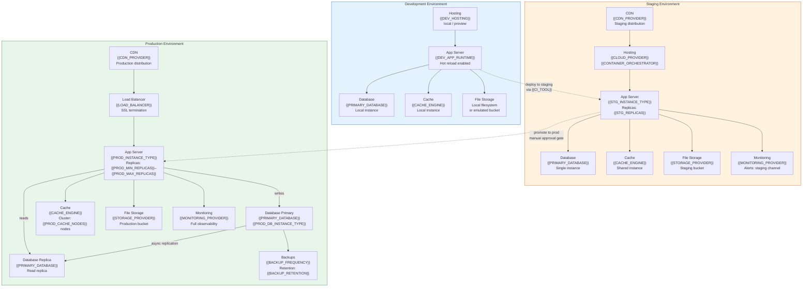
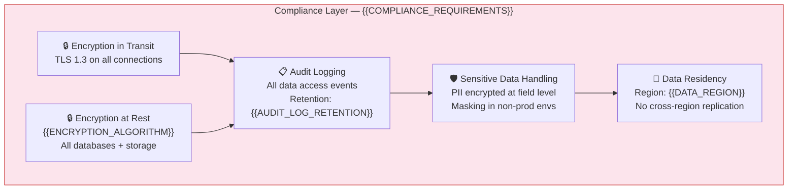

# Deployment Topology — {{PROJECT_NAME}}

Paste the Mermaid block below into any Mermaid-compatible renderer (GitHub, VS Code, Mermaid Live Editor). Replace all {{PLACEHOLDER}} values with project-specific data before rendering.

<!-- IF {{COMPLIANCE_REQUIREMENTS}} != "none" -->

<!-- END IF -->

---

## Environment Comparison

| Component | Development | Staging | Production |
|---|---|---|---|
| Hosting | Local / {{DEV_HOSTING}} | {{CLOUD_PROVIDER}} | {{CLOUD_PROVIDER}} |
| Orchestration | None (direct run) | {{CONTAINER_ORCHESTRATOR}} | {{CONTAINER_ORCHESTRATOR}} |
| App Replicas | 1 | {{STG_REPLICAS}} | {{PROD_MIN_REPLICAS}}–{{PROD_MAX_REPLICAS}} (auto-scale) |
| Database | Local {{PRIMARY_DATABASE}} | Single instance | Primary + read replica |
| DB Instance | Local | {{STG_DB_INSTANCE_TYPE}} | {{PROD_DB_INSTANCE_TYPE}} |
| Cache | Local {{CACHE_ENGINE}} | Shared instance | {{PROD_CACHE_NODES}}-node cluster |
| CDN | None | {{CDN_PROVIDER}} (staging) | {{CDN_PROVIDER}} (production) |
| File Storage | Local filesystem | {{STORAGE_PROVIDER}} staging bucket | {{STORAGE_PROVIDER}} production bucket |
| SSL/TLS | Self-signed / localhost | Managed certificate | Managed certificate |
| Monitoring | Console logging | {{MONITORING_PROVIDER}} (basic) | {{MONITORING_PROVIDER}} (full) |
| Backups | None | Daily | {{BACKUP_FREQUENCY}} |
| Data | Seed / fixtures | Anonymized production subset | Live data |

## Scaling Configuration

| Resource | Metric | Threshold | Scale Action | Cooldown |
|---|---|---|---|---|
| App Servers | CPU utilization | > {{CPU_SCALE_UP_THRESHOLD}}% | Add 1 replica (max {{PROD_MAX_REPLICAS}}) | {{SCALE_COOLDOWN}} |
| App Servers | CPU utilization | < {{CPU_SCALE_DOWN_THRESHOLD}}% | Remove 1 replica (min {{PROD_MIN_REPLICAS}}) | {{SCALE_COOLDOWN}} |
| Database Replicas | Read query latency | > {{DB_LATENCY_THRESHOLD}}ms | Add read replica | Manual |
| Cache Cluster | Memory utilization | > {{CACHE_MEMORY_THRESHOLD}}% | Resize node / add shard | Manual |
| CDN | Cache hit ratio | < {{CDN_HIT_RATIO_MIN}}% | Review cache rules | N/A |
| File Storage | Storage usage | > {{STORAGE_WARN_THRESHOLD}} | Alert + review retention | N/A |

---

## Cross-References

- **CI/CD Pipeline:** `infra-cicd-pipeline.template.md`
- **Security Zones:** `infra-security-zones.template.md`
- **Monitoring & Observability:** `infra-monitoring-observability.template.md`
- **Disaster Recovery:** `infra-disaster-recovery.template.md`
- **System Architecture:** `system-architecture-flowchart.template.md`
