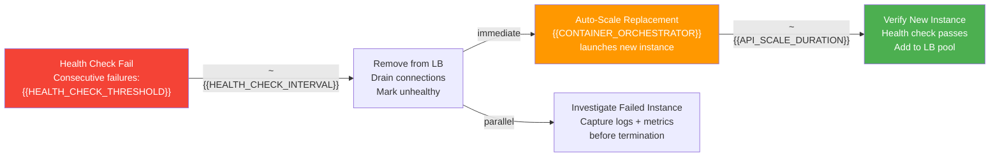
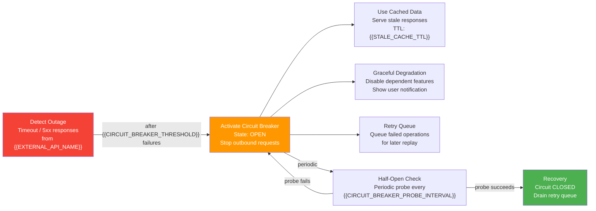

# Disaster Recovery Architecture — {{PROJECT_NAME}}

Paste the Mermaid block below into any Mermaid-compatible renderer (GitHub, VS Code, Mermaid Live Editor). Replace all {{PLACEHOLDER}} values with project-specific data before rendering.

## RTO/RPO Targets by Service Tier

```mermaid
flowchart TB
    subgraph ServiceTiers["Service Tier Classification"]
        TIER1["Tier 1 — Critical<br/>{{TIER_1_SERVICES}}<br/>RTO: {{RTO_TIER_1}}<br/>RPO: {{RPO_TIER_1}}"]
        TIER2["Tier 2 — Important<br/>{{TIER_2_SERVICES}}<br/>RTO: {{RTO_TIER_2}}<br/>RPO: {{RPO_TIER_2}}"]
        TIER3["Tier 3 — Non-Critical<br/>{{TIER_3_SERVICES}}<br/>RTO: {{RTO_TIER_3}}<br/>RPO: {{RPO_TIER_3}}"]

        TIER1 -->|"recover first"| TIER2
        TIER2 -->|"recover second"| TIER3
    end

    subgraph BackupStrategy["Backup Strategy"]
        FULL_BACKUP["Full Backup<br/>{{FULL_BACKUP_SCHEDULE}}"]
        INCR_BACKUP["Incremental Backup<br/>{{INCREMENTAL_BACKUP_SCHEDULE}}"]
        WAL_ARCHIVE["WAL / Binlog Archive<br/>Continuous"]
        SNAP["Storage Snapshots<br/>{{SNAPSHOT_SCHEDULE}}"]

        FULL_BACKUP --> INCR_BACKUP
        INCR_BACKUP --> WAL_ARCHIVE
        FULL_BACKUP --> SNAP
    end

    subgraph FailoverInfra["Failover Infrastructure"]
        PRIMARY_REGION["Primary Region<br/>{{PRIMARY_REGION}}"]
        FAILOVER_REGION["Failover Region<br/>{{FAILOVER_REGION}}"]
        DNS_FAILOVER["DNS Failover<br/>TTL: {{DNS_TTL}}"]

        PRIMARY_REGION -->|"replication"| FAILOVER_REGION
        DNS_FAILOVER -->|"active"| PRIMARY_REGION
        DNS_FAILOVER -.->|"failover"| FAILOVER_REGION
    end

    style TIER1 fill:#F44336,color:#fff
    style TIER2 fill:#FF9800,color:#fff
    style TIER3 fill:#FFC107,color:#000
```

## Scenario 1: Database Failure

```mermaid
flowchart LR
    DB_DETECT["Detect Failure<br/>Health check fails<br/>Connection timeout"]
    DB_ASSESS["Assess Scope<br/>Primary down?<br/>Corruption? Network?"]
    DB_FAILOVER["Failover to Replica<br/>Promote read replica<br/>to primary"]
    DB_RECONNECT["Reconnect Apps<br/>Update connection string<br/>Clear connection pools"]
    DB_VERIFY["Verify Data Integrity<br/>Run consistency checks<br/>Compare checksums"]
    DB_NOTIFY["Notify Stakeholders<br/>Incident status update"]
    DB_POSTMORTEM["Post-Incident<br/>Rebuild replica<br/>Root cause analysis"]

    DB_DETECT -->|"< 1 min"| DB_ASSESS
    DB_ASSESS -->|"primary failure"| DB_FAILOVER
    DB_FAILOVER -->|"~{{DB_FAILOVER_DURATION}}"| DB_RECONNECT
    DB_RECONNECT -->|"~2 min"| DB_VERIFY
    DB_VERIFY -->|"pass"| DB_NOTIFY
    DB_VERIFY -->|"fail"| DB_RESTORE["Restore from Backup<br/>Point-in-time recovery"]
    DB_RESTORE --> DB_VERIFY
    DB_NOTIFY --> DB_POSTMORTEM

    style DB_DETECT fill:#F44336,color:#fff
    style DB_FAILOVER fill:#FF9800,color:#fff
    style DB_VERIFY fill:#4CAF50,color:#fff
```

## Scenario 2: API Server Failure

## Scenario 3: Hosting / Cloud Outage

```mermaid
flowchart LR
    CLOUD_DETECT["Detect Outage<br/>Multi-signal: external monitor<br/>+ provider status page"]
    CLOUD_ASSESS["Assess Duration<br/>Check provider ETA<br/>Scope of impact"]
    CLOUD_DNS["DNS Failover<br/>Switch to {{FAILOVER_REGION}}<br/>TTL: {{DNS_TTL}}"]
    CLOUD_ACTIVATE["Activate Standby<br/>Scale up standby region<br/>Verify services healthy"]
    CLOUD_SYNC["Data Sync<br/>Verify replication<br/>caught up"]
    CLOUD_VALIDATE["Validate<br/>Run smoke tests<br/>Confirm user access"]
    CLOUD_RETURN["Return to Primary<br/>When outage resolved<br/>Reverse DNS + sync"]

    CLOUD_DETECT -->|"< 5 min"| CLOUD_ASSESS
    CLOUD_ASSESS -->|"outage > {{FAILOVER_TRIGGER_THRESHOLD}}"| CLOUD_DNS
    CLOUD_DNS -->|"~{{DNS_TTL}}"| CLOUD_ACTIVATE
    CLOUD_ACTIVATE -->|"~{{STANDBY_ACTIVATION_DURATION}}"| CLOUD_SYNC
    CLOUD_SYNC --> CLOUD_VALIDATE
    CLOUD_VALIDATE -->|"when primary returns"| CLOUD_RETURN

    style CLOUD_DETECT fill:#F44336,color:#fff
    style CLOUD_DNS fill:#FF9800,color:#fff
    style CLOUD_VALIDATE fill:#4CAF50,color:#fff
```

## Scenario 4: Third-Party API Outage

## Scenario 5: Client Connectivity Loss

```mermaid
flowchart LR
    CL_DETECT["Detect Offline<br/>Navigator.onLine = false<br/>or request timeout"]
    CL_NOTIFY["Notify User<br/>Offline banner /<br/>toast notification"]
    CL_QUEUE["Queue Operations<br/>Store mutations in<br/>IndexedDB / localStorage"]
    CL_RECONNECT["Reconnect<br/>Detect connectivity restored<br/>exponential backoff"]
    CL_SYNC["Sync Queued Operations<br/>Replay in order<br/>Handle conflicts"]
    CL_VERIFY["Verify Consistency<br/>Compare local vs server<br/>Resolve conflicts"]
    CL_RESUME["Resume Normal<br/>Clear offline indicator<br/>Flush queue"]

    CL_DETECT --> CL_NOTIFY
    CL_NOTIFY --> CL_QUEUE
    CL_QUEUE -->|"connectivity restored"| CL_RECONNECT
    CL_RECONNECT --> CL_SYNC
    CL_SYNC --> CL_VERIFY
    CL_VERIFY -->|"consistent"| CL_RESUME
    CL_VERIFY -->|"conflicts"| CL_RESOLVE["Conflict Resolution<br/>{{CONFLICT_STRATEGY}}<br/>Last-write-wins / merge"]
    CL_RESOLVE --> CL_RESUME

    style CL_DETECT fill:#F44336,color:#fff
    style CL_QUEUE fill:#FF9800,color:#fff
    style CL_RESUME fill:#4CAF50,color:#fff
```

---

## Service Tier Classification

| Tier | Services | RTO Target | RPO Target | Backup Strategy | Failover Type |
|---|---|---|---|---|---|
| Tier 1 — Critical | {{TIER_1_SERVICES}} | {{RTO_TIER_1}} | {{RPO_TIER_1}} | Continuous replication + {{BACKUP_FREQUENCY}} snapshots | Automatic failover |
| Tier 2 — Important | {{TIER_2_SERVICES}} | {{RTO_TIER_2}} | {{RPO_TIER_2}} | {{BACKUP_FREQUENCY}} backups + WAL archiving | Semi-automatic (manual trigger) |
| Tier 3 — Non-Critical | {{TIER_3_SERVICES}} | {{RTO_TIER_3}} | {{RPO_TIER_3}} | Daily backups | Manual restoration |

## Backup Schedule

| Resource | Method | Frequency | Retention | Storage Location | Encryption | Verified |
|---|---|---|---|---|---|---|
| {{PRIMARY_DATABASE}} | Full dump | {{FULL_BACKUP_SCHEDULE}} | {{BACKUP_RETENTION}} | {{BACKUP_STORAGE_LOCATION}} | AES-256 | {{BACKUP_VERIFICATION_SCHEDULE}} |
| {{PRIMARY_DATABASE}} | Incremental / WAL | {{INCREMENTAL_BACKUP_SCHEDULE}} | 7 days | {{BACKUP_STORAGE_LOCATION}} | AES-256 | Continuous |
| File Storage | Snapshot | {{SNAPSHOT_SCHEDULE}} | {{BACKUP_RETENTION}} | Cross-region replica | AES-256 | Weekly |
| Application Config | Git | Every commit | Indefinite | {{GIT_PROVIDER}} | TLS in transit | N/A |
| Secrets | Export | {{SECRET_BACKUP_SCHEDULE}} | {{BACKUP_RETENTION}} | Encrypted vault backup | AES-256 | Monthly |

## Recovery Runbook Checklist

- [ ] **Incident declared** — Severity assigned, incident commander identified
- [ ] **Communication started** — Status page updated, stakeholders notified
- [ ] **Scope assessed** — Affected services, data loss window, user impact quantified
- [ ] **Tier 1 recovery initiated** — Critical services failover/restoration started
- [ ] **Tier 1 verified** — Critical services operational, data integrity confirmed
- [ ] **Tier 2 recovery initiated** — Important services failover/restoration started
- [ ] **Tier 2 verified** — Important services operational
- [ ] **Tier 3 recovery initiated** — Non-critical services restoration started
- [ ] **Full system verified** — All services operational, end-to-end tests pass
- [ ] **Monitoring confirmed** — All alerts green, no residual errors
- [ ] **User communication** — Resolution notice sent, ETA for any remaining issues
- [ ] **Post-incident review scheduled** — Within {{POSTMORTEM_DEADLINE}} of resolution
- [ ] **Root cause documented** — Incident report filed with timeline and remediation
- [ ] **Preventive actions created** — Tickets for improvements with owners and deadlines

---

## Cross-References

- **Deployment Topology:** `infra-deployment-topology.template.md`
- **Monitoring & Observability:** `infra-monitoring-observability.template.md`
- **Security Zones:** `infra-security-zones.template.md`
- **Secrets Management:** `infra-secrets-management.template.md`
- **CI/CD Pipeline:** `infra-cicd-pipeline.template.md`
