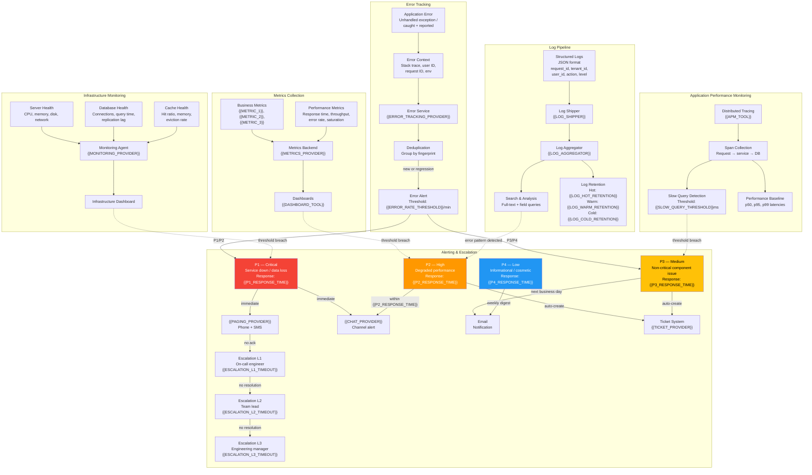

# Monitoring & Observability Architecture — {{PROJECT_NAME}}

Paste the Mermaid block below into any Mermaid-compatible renderer (GitHub, VS Code, Mermaid Live Editor). Replace all {{PLACEHOLDER}} values with project-specific data before rendering.

---

## SLO Targets

| Service | Metric | Target | Measurement Window | Burn Rate Alert |
|---|---|---|---|---|
| {{SERVICE_1_NAME}} | Availability | {{SLO_AVAILABILITY_1}}% | 30-day rolling | > 2x in 1h |
| {{SERVICE_1_NAME}} | Latency (p95) | < {{SLO_LATENCY_P95_1}}ms | 30-day rolling | > 1.5x in 6h |
| {{SERVICE_2_NAME}} | Availability | {{SLO_AVAILABILITY_2}}% | 30-day rolling | > 2x in 1h |
| {{SERVICE_2_NAME}} | Latency (p95) | < {{SLO_LATENCY_P95_2}}ms | 30-day rolling | > 1.5x in 6h |
| {{SERVICE_N_NAME}} | Availability | {{SLO_AVAILABILITY_N}}% | 30-day rolling | > 2x in 1h |
| Overall Error Rate | Error ratio | < {{SLO_ERROR_RATE}}% | 30-day rolling | > 3x in 1h |

## Alert Severity Definitions

| Level | Description | Response Time | Notification Channel | Escalation Path | Example |
|---|---|---|---|---|---|
| P1 — Critical | Service outage, data loss risk, security breach | {{P1_RESPONSE_TIME}} | {{PAGING_PROVIDER}} + {{CHAT_PROVIDER}} | L1 → L2 → L3 | Database unreachable, auth service down |
| P2 — High | Degraded performance, partial feature outage | {{P2_RESPONSE_TIME}} | {{CHAT_PROVIDER}} + auto-ticket | L1 → L2 | API latency > 5x baseline, cache cluster down |
| P3 — Medium | Non-critical issue, single component degraded | {{P3_RESPONSE_TIME}} | Email + auto-ticket | L1 (next business day) | Background job failures, non-critical API errors |
| P4 — Low | Informational, cosmetic, minor degradation | {{P4_RESPONSE_TIME}} | Weekly email digest | None (backlog) | Deprecation warnings, minor UI issues |

## Log Retention Policy

| Log Category | Hot Storage | Warm Storage | Cold / Archive | Total Retention | Compliance Requirement |
|---|---|---|---|---|---|
| Application logs | {{LOG_HOT_RETENTION}} | {{LOG_WARM_RETENTION}} | {{LOG_COLD_RETENTION}} | {{LOG_TOTAL_RETENTION}} | {{LOG_COMPLIANCE}} |
| Access logs | {{LOG_HOT_RETENTION}} | {{LOG_WARM_RETENTION}} | {{LOG_COLD_RETENTION}} | {{LOG_TOTAL_RETENTION}} | {{LOG_COMPLIANCE}} |
| Security / audit logs | 90 days | 1 year | {{AUDIT_LOG_RETENTION}} | {{AUDIT_LOG_RETENTION}} | {{COMPLIANCE_REQUIREMENTS}} |
| Error tracking | 30 days | 90 days | 1 year | 1 year | None |
| Performance traces | 7 days | 30 days | None | 30 days | None |

---

## Cross-References

- **Deployment Topology:** `infra-deployment-topology.template.md`
- **Disaster Recovery:** `infra-disaster-recovery.template.md`
- **Security Zones:** `infra-security-zones.template.md`
- **CI/CD Pipeline:** `infra-cicd-pipeline.template.md`
- **API Topology:** `infra-api-topology.template.md`
