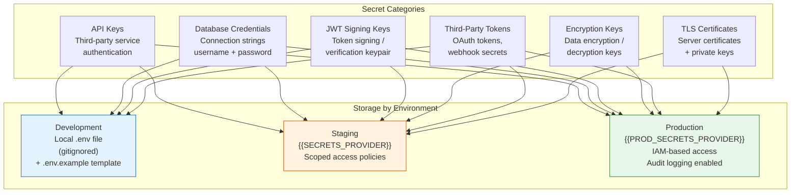

# Secrets Management Lifecycle — {{PROJECT_NAME}}

Paste the Mermaid block below into any Mermaid-compatible renderer (GitHub, VS Code, Mermaid Live Editor). Replace all {{PLACEHOLDER}} values with project-specific data before rendering.

```mermaid
flowchart LR
    subgraph Creation["Secret Creation"]
        GEN["Generate Secret<br/>Cryptographically random<br/>Min entropy: {{SECRET_MIN_ENTROPY}}"]
        VALIDATE["Validate Format<br/>Length, charset,<br/>policy compliance"]
        STORE["Store in Vault<br/>{{SECRETS_PROVIDER}}<br/>Encrypted at rest"]

        GEN --> VALIDATE
        VALIDATE -->|"valid"| STORE
        VALIDATE -->|"invalid"| GEN
    end

    subgraph Distribution["Secret Distribution"]
        INJECT["Inject at Runtime<br/>Environment variable /<br/>mounted file / API call"]
        VERIFY["Verify Injection<br/>App confirms secret<br/>loaded successfully"]
        AUDIT_D["Audit Access<br/>Log: who, when, what,<br/>from where"]

        STORE --> INJECT
        INJECT --> VERIFY
        VERIFY --> AUDIT_D
    end

    subgraph Rotation["Secret Rotation"]
        SCHEDULE["Rotation Schedule<br/>{{ROTATION_SCHEDULE}}"]
        GEN_NEW["Generate New Secret<br/>Same policy as creation"]
        SWAP["Swap Active Secret<br/>Update vault entry<br/>Dual-active window: {{DUAL_ACTIVE_WINDOW}}"]
        VERIFY_R["Verify New Secret<br/>All consumers using<br/>new secret successfully"]
        REVOKE_OLD["Revoke Old Secret<br/>Remove from vault<br/>Invalidate permanently"]

        SCHEDULE --> GEN_NEW
        GEN_NEW --> SWAP
        SWAP --> VERIFY_R
        VERIFY_R -->|"all consumers migrated"| REVOKE_OLD
        VERIFY_R -->|"migration incomplete"| SWAP
    end

    subgraph Emergency["Emergency Procedures"]
        BREAK_GLASS["Break-Glass Access<br/>Emergency credential<br/>retrieval"]
        EMERGENCY_ACCESS["Emergency Access<br/>Requires: {{BREAK_GLASS_APPROVERS}}<br/>approvals"]
        AUDIT_E["Full Audit Trail<br/>Alert all security team<br/>Incident created"]
        ROTATE_ALL["Rotate All Secrets<br/>Assume compromise<br/>Full rotation cycle"]

        BREAK_GLASS --> EMERGENCY_ACCESS
        EMERGENCY_ACCESS --> AUDIT_E
        AUDIT_E --> ROTATE_ALL
    end

    %% Flow connections
    AUDIT_D -->|"scheduled"| SCHEDULE
    AUDIT_D -->|"compromise detected"| BREAK_GLASS
    REVOKE_OLD -.->|"next cycle"| SCHEDULE

    style Creation fill:#E3F2FD,stroke:#1565C0
    style Distribution fill:#E8F5E9,stroke:#2E7D32
    style Rotation fill:#FFF3E0,stroke:#E65100
    style Emergency fill:#FFEBEE,stroke:#C62828
```

---

## Secret Inventory

| Secret Name | Category | Storage Location | Rotation Period | Last Rotated | Owner |
|---|---|---|---|---|---|
| {{SECRET_1_NAME}} | API Key | {{SECRETS_PROVIDER}} | {{SECRET_1_ROTATION}} | {{SECRET_1_LAST_ROTATED}} | {{SECRET_1_OWNER}} |
| {{SECRET_2_NAME}} | Database Credential | {{SECRETS_PROVIDER}} | {{SECRET_2_ROTATION}} | {{SECRET_2_LAST_ROTATED}} | {{SECRET_2_OWNER}} |
| {{SECRET_3_NAME}} | JWT Signing Key | {{SECRETS_PROVIDER}} | {{SECRET_3_ROTATION}} | {{SECRET_3_LAST_ROTATED}} | {{SECRET_3_OWNER}} |
| {{SECRET_4_NAME}} | Encryption Key | {{SECRETS_PROVIDER}} | {{SECRET_4_ROTATION}} | {{SECRET_4_LAST_ROTATED}} | {{SECRET_4_OWNER}} |
| {{SECRET_5_NAME}} | Third-Party Token | {{SECRETS_PROVIDER}} | {{SECRET_5_ROTATION}} | {{SECRET_5_LAST_ROTATED}} | {{SECRET_5_OWNER}} |
| {{SECRET_6_NAME}} | TLS Certificate | {{SECRETS_PROVIDER}} | {{SECRET_6_ROTATION}} | {{SECRET_6_LAST_ROTATED}} | {{SECRET_6_OWNER}} |

## Access Control Matrix

| Role | Read Secrets | Write / Create | Rotate | Revoke | Break-Glass Access |
|---|---|---|---|---|---|
| {{ROLE_1}} (Super Admin) | All | All | All | All | Approve + Execute |
| {{ROLE_2}} (Admin) | All | Scoped | Scoped | Scoped | Approve |
| {{ROLE_3}} (Developer) | Own service secrets | None (request via PR) | None | None | Request only |
| CI/CD Pipeline | Deployment secrets | None | None | None | None |
| Application Runtime | Injected secrets only | None | None | None | None |
| Security Team | Audit logs only | Emergency override | Emergency rotation | Emergency revocation | Execute |

## Break-Glass Procedure

- [ ] **Incident detected** — Suspected secret compromise identified
- [ ] **Incident declared** — Security incident created with severity level
- [ ] **Break-glass initiated** — Emergency access requested with justification
- [ ] **Approval obtained** — {{BREAK_GLASS_APPROVERS}} approval(s) received
- [ ] **Emergency access granted** — Temporary elevated access with time limit: {{BREAK_GLASS_TTL}}
- [ ] **Compromised secret identified** — Determine which secrets are affected
- [ ] **Immediate revocation** — Revoke compromised secrets across all environments
- [ ] **New secrets generated** — Generate replacements following creation policy
- [ ] **Distribution verified** — All consumers updated and verified with new secrets
- [ ] **Old secrets confirmed dead** — Verify revoked secrets reject authentication
- [ ] **Audit trail completed** — Full access log preserved for compliance
- [ ] **Related secrets assessed** — Evaluate if adjacent secrets need rotation
- [ ] **Elevated access revoked** — Break-glass access removed, normal permissions restored
- [ ] **Post-incident review** — Document root cause, timeline, and preventive measures

---

## Cross-References

- **Security Zones:** `infra-security-zones.template.md`
- **Auth & Security:** `xc-auth-security.template.md`
- **Disaster Recovery:** `infra-disaster-recovery.template.md`
- **CI/CD Pipeline:** `infra-cicd-pipeline.template.md`
- **Deployment Topology:** `infra-deployment-topology.template.md`
