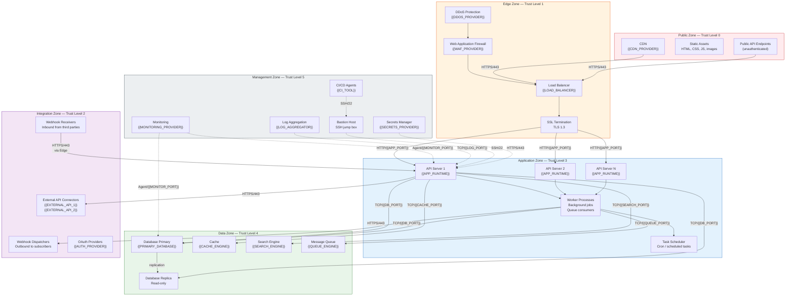
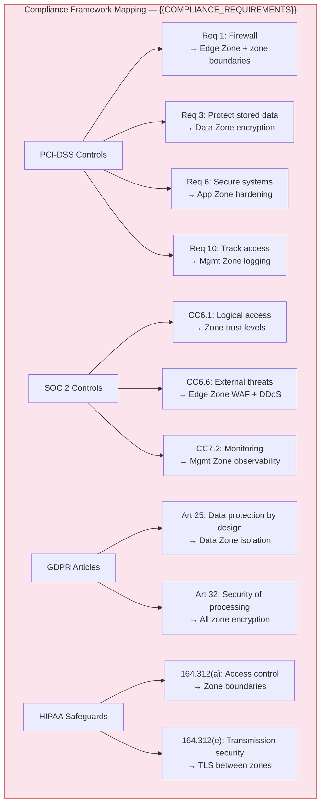

# Network Security Zones — {{PROJECT_NAME}}

Paste the Mermaid block below into any Mermaid-compatible renderer (GitHub, VS Code, Mermaid Live Editor). Replace all {{PLACEHOLDER}} values with project-specific data before rendering.

<!-- IF {{COMPLIANCE_REQUIREMENTS}} != "none" -->

<!-- END IF -->

---

## Zone Trust Matrix

| Source Zone | Public (0) | Edge (1) | Integration (2) | Application (3) | Data (4) | Management (5) |
|---|---|---|---|---|---|---|
| **Public (0)** | -- | HTTPS/443 only | Denied | Denied | Denied | Denied |
| **Edge (1)** | Response traffic | -- | Denied | HTTP/{{APP_PORT}} | Denied | Denied |
| **Integration (2)** | Denied | Via Edge only | -- | HTTPS/443 (webhook) | Denied | Denied |
| **Application (3)** | Denied | Denied | HTTPS/443 (outbound) | Internal | TCP/{{DB_PORT}}, {{CACHE_PORT}} | Agent ports |
| **Data (4)** | Denied | Denied | Denied | Response traffic | Internal replication | Backup agents |
| **Management (5)** | Denied | Read-only metrics | Denied | SSH via bastion | Read-only metrics | Internal |

## Firewall Rules

| Rule ID | Source Zone | Dest Zone | Protocol | Port | Direction | Purpose |
|---|---|---|---|---|---|---|
| FW-001 | Public | Edge | TCP | 443 | Inbound | Client HTTPS traffic |
| FW-002 | Edge | Application | TCP | {{APP_PORT}} | Inbound | Decrypted app traffic |
| FW-003 | Application | Data | TCP | {{DB_PORT}} | Outbound | Database queries |
| FW-004 | Application | Data | TCP | {{CACHE_PORT}} | Outbound | Cache reads/writes |
| FW-005 | Application | Data | TCP | {{SEARCH_PORT}} | Outbound | Search queries |
| FW-006 | Application | Data | TCP | {{QUEUE_PORT}} | Outbound | Queue publish/consume |
| FW-007 | Application | Integration | TCP | 443 | Outbound | External API calls |
| FW-008 | Integration | Edge | TCP | 443 | Inbound | Inbound webhooks |
| FW-009 | Management | Application | TCP | 22 | Inbound | SSH via bastion only |
| FW-010 | Management | All zones | TCP | {{MONITOR_PORT}} | Inbound | Monitoring agents |
| FW-011 | Management | Application | TCP | {{LOG_PORT}} | Inbound | Log collection |
| FW-012 | ALL | ALL | * | * | Both | **Default: DENY** |

---

## Cross-References

- **Deployment Topology:** `infra-deployment-topology.template.md`
- **Auth & Security:** `xc-auth-security.template.md`
- **Secrets Management:** `infra-secrets-management.template.md`
- **Monitoring & Observability:** `infra-monitoring-observability.template.md`
- **API Topology:** `infra-api-topology.template.md`
