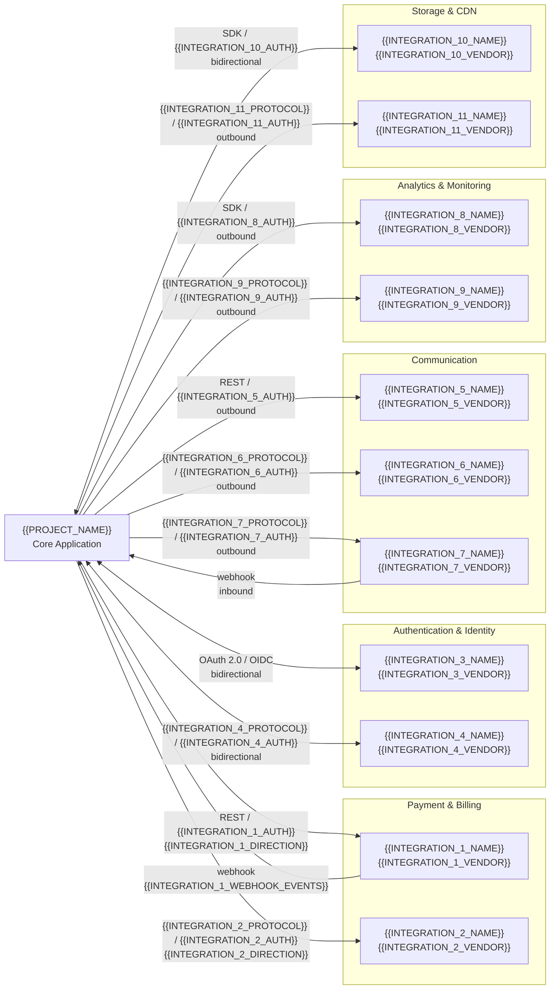

# Phase 1 MVP Integrations — {{PROJECT_NAME}}

Paste the Mermaid block below into any Mermaid-compatible renderer (GitHub, VS Code, Mermaid Live Editor). Replace all {{PLACEHOLDER}} values with project-specific data before rendering.

---

---

## Integration Registry — Phase 1 (MVP)

| Integration | Vendor | Protocol | Direction | Data Exchanged | Auth Method | SLA / Uptime |
|-------------|--------|----------|-----------|----------------|-------------|--------------|
| {{INTEGRATION_1_NAME}} | {{INTEGRATION_1_VENDOR}} | REST | {{INTEGRATION_1_DIRECTION}} | {{INTEGRATION_1_DATA}} | {{INTEGRATION_1_AUTH}} | {{INTEGRATION_1_SLA}} |
| {{INTEGRATION_2_NAME}} | {{INTEGRATION_2_VENDOR}} | {{INTEGRATION_2_PROTOCOL}} | {{INTEGRATION_2_DIRECTION}} | {{INTEGRATION_2_DATA}} | {{INTEGRATION_2_AUTH}} | {{INTEGRATION_2_SLA}} |
| {{INTEGRATION_3_NAME}} | {{INTEGRATION_3_VENDOR}} | OAuth 2.0 / OIDC | Bidirectional | {{INTEGRATION_3_DATA}} | {{INTEGRATION_3_AUTH}} | {{INTEGRATION_3_SLA}} |
| {{INTEGRATION_4_NAME}} | {{INTEGRATION_4_VENDOR}} | {{INTEGRATION_4_PROTOCOL}} | Bidirectional | {{INTEGRATION_4_DATA}} | {{INTEGRATION_4_AUTH}} | {{INTEGRATION_4_SLA}} |
| {{INTEGRATION_5_NAME}} | {{INTEGRATION_5_VENDOR}} | REST | Outbound | {{INTEGRATION_5_DATA}} | {{INTEGRATION_5_AUTH}} | {{INTEGRATION_5_SLA}} |
| {{INTEGRATION_6_NAME}} | {{INTEGRATION_6_VENDOR}} | {{INTEGRATION_6_PROTOCOL}} | Outbound | {{INTEGRATION_6_DATA}} | {{INTEGRATION_6_AUTH}} | {{INTEGRATION_6_SLA}} |
| {{INTEGRATION_7_NAME}} | {{INTEGRATION_7_VENDOR}} | {{INTEGRATION_7_PROTOCOL}} | Bidirectional | {{INTEGRATION_7_DATA}} | {{INTEGRATION_7_AUTH}} | {{INTEGRATION_7_SLA}} |
| {{INTEGRATION_8_NAME}} | {{INTEGRATION_8_VENDOR}} | SDK | Outbound | {{INTEGRATION_8_DATA}} | {{INTEGRATION_8_AUTH}} | {{INTEGRATION_8_SLA}} |
| {{INTEGRATION_9_NAME}} | {{INTEGRATION_9_VENDOR}} | {{INTEGRATION_9_PROTOCOL}} | Outbound | {{INTEGRATION_9_DATA}} | {{INTEGRATION_9_AUTH}} | {{INTEGRATION_9_SLA}} |
| {{INTEGRATION_10_NAME}} | {{INTEGRATION_10_VENDOR}} | SDK | Bidirectional | {{INTEGRATION_10_DATA}} | {{INTEGRATION_10_AUTH}} | {{INTEGRATION_10_SLA}} |
| {{INTEGRATION_11_NAME}} | {{INTEGRATION_11_VENDOR}} | {{INTEGRATION_11_PROTOCOL}} | Outbound | {{INTEGRATION_11_DATA}} | {{INTEGRATION_11_AUTH}} | {{INTEGRATION_11_SLA}} |

## Environment Configuration

| Integration | Sandbox / Dev URL | Production URL | Rate Limits |
|-------------|-------------------|----------------|-------------|
| {{INTEGRATION_1_NAME}} | {{INTEGRATION_1_SANDBOX_URL}} | {{INTEGRATION_1_PROD_URL}} | {{INTEGRATION_1_RATE_LIMIT}} |
| {{INTEGRATION_3_NAME}} | {{INTEGRATION_3_SANDBOX_URL}} | {{INTEGRATION_3_PROD_URL}} | {{INTEGRATION_3_RATE_LIMIT}} |
| {{INTEGRATION_5_NAME}} | {{INTEGRATION_5_SANDBOX_URL}} | {{INTEGRATION_5_PROD_URL}} | {{INTEGRATION_5_RATE_LIMIT}} |
| {{INTEGRATION_8_NAME}} | {{INTEGRATION_8_SANDBOX_URL}} | {{INTEGRATION_8_PROD_URL}} | {{INTEGRATION_8_RATE_LIMIT}} |
| {{INTEGRATION_10_NAME}} | {{INTEGRATION_10_SANDBOX_URL}} | {{INTEGRATION_10_PROD_URL}} | {{INTEGRATION_10_RATE_LIMIT}} |

## Failure Handling

| Integration | Failure Mode | Retry Strategy | Fallback | User Impact |
|-------------|-------------|----------------|----------|-------------|
| {{INTEGRATION_1_NAME}} | {{INTEGRATION_1_FAILURE_MODE}} | {{INTEGRATION_1_RETRY}} | {{INTEGRATION_1_FALLBACK}} | {{INTEGRATION_1_USER_IMPACT}} |
| {{INTEGRATION_3_NAME}} | {{INTEGRATION_3_FAILURE_MODE}} | {{INTEGRATION_3_RETRY}} | {{INTEGRATION_3_FALLBACK}} | {{INTEGRATION_3_USER_IMPACT}} |
| {{INTEGRATION_5_NAME}} | {{INTEGRATION_5_FAILURE_MODE}} | {{INTEGRATION_5_RETRY}} | {{INTEGRATION_5_FALLBACK}} | {{INTEGRATION_5_USER_IMPACT}} |

## Notes

- **Secret management:** All API keys and credentials stored in {{SECRET_MANAGER}}. Never hardcoded.
- **Webhook security:** All inbound webhooks verified via {{WEBHOOK_VERIFICATION_METHOD}} before processing.
- **Circuit breaker:** Each integration wrapped in a circuit breaker (open after {{CIRCUIT_BREAKER_THRESHOLD}} failures in {{CIRCUIT_BREAKER_WINDOW}}).
- **MVP scope:** These integrations are the minimum required for launch. Post-launch integrations are in `int-phase2-post-launch.template.md`.

## Cross-References

- **Post-launch integrations:** `int-phase2-post-launch.template.md`
- **Expansion integrations:** `int-phase3-expansion.template.md`
- **Data flow sequences:** `data-flow.template.md`
- **System architecture:** `system-architecture-flowchart.template.md`
- **Service dependencies:** `df-cross-service-dependencies.template.md`
