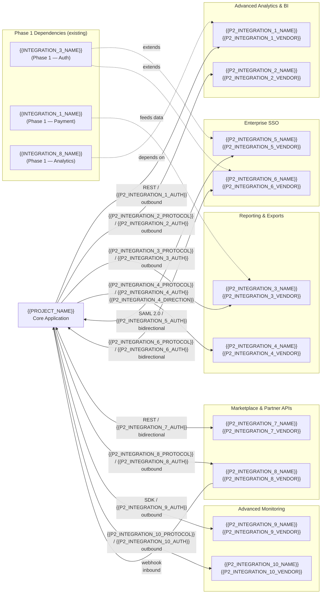

# Phase 2 Post-Launch Integrations — {{PROJECT_NAME}}

Paste the Mermaid block below into any Mermaid-compatible renderer (GitHub, VS Code, Mermaid Live Editor). Replace all {{PLACEHOLDER}} values with project-specific data before rendering.

---

---

## Integration Registry — Phase 2 (Post-Launch)

| Integration | Vendor | Protocol | Direction | Data Exchanged | Auth Method | SLA / Uptime | Depends On |
|-------------|--------|----------|-----------|----------------|-------------|--------------|------------|
| {{P2_INTEGRATION_1_NAME}} | {{P2_INTEGRATION_1_VENDOR}} | REST | Outbound | {{P2_INTEGRATION_1_DATA}} | {{P2_INTEGRATION_1_AUTH}} | {{P2_INTEGRATION_1_SLA}} | {{INTEGRATION_8_NAME}} (Phase 1 Analytics) |
| {{P2_INTEGRATION_2_NAME}} | {{P2_INTEGRATION_2_VENDOR}} | {{P2_INTEGRATION_2_PROTOCOL}} | Outbound | {{P2_INTEGRATION_2_DATA}} | {{P2_INTEGRATION_2_AUTH}} | {{P2_INTEGRATION_2_SLA}} | None |
| {{P2_INTEGRATION_3_NAME}} | {{P2_INTEGRATION_3_VENDOR}} | {{P2_INTEGRATION_3_PROTOCOL}} | Outbound | {{P2_INTEGRATION_3_DATA}} | {{P2_INTEGRATION_3_AUTH}} | {{P2_INTEGRATION_3_SLA}} | {{INTEGRATION_1_NAME}} (Phase 1 Payment) |
| {{P2_INTEGRATION_4_NAME}} | {{P2_INTEGRATION_4_VENDOR}} | {{P2_INTEGRATION_4_PROTOCOL}} | {{P2_INTEGRATION_4_DIRECTION}} | {{P2_INTEGRATION_4_DATA}} | {{P2_INTEGRATION_4_AUTH}} | {{P2_INTEGRATION_4_SLA}} | None |
| {{P2_INTEGRATION_5_NAME}} | {{P2_INTEGRATION_5_VENDOR}} | SAML 2.0 | Bidirectional | {{P2_INTEGRATION_5_DATA}} | {{P2_INTEGRATION_5_AUTH}} | {{P2_INTEGRATION_5_SLA}} | {{INTEGRATION_3_NAME}} (Phase 1 Auth) |
| {{P2_INTEGRATION_6_NAME}} | {{P2_INTEGRATION_6_VENDOR}} | {{P2_INTEGRATION_6_PROTOCOL}} | Bidirectional | {{P2_INTEGRATION_6_DATA}} | {{P2_INTEGRATION_6_AUTH}} | {{P2_INTEGRATION_6_SLA}} | {{INTEGRATION_3_NAME}} (Phase 1 Auth) |
| {{P2_INTEGRATION_7_NAME}} | {{P2_INTEGRATION_7_VENDOR}} | REST | Bidirectional | {{P2_INTEGRATION_7_DATA}} | {{P2_INTEGRATION_7_AUTH}} | {{P2_INTEGRATION_7_SLA}} | None |
| {{P2_INTEGRATION_8_NAME}} | {{P2_INTEGRATION_8_VENDOR}} | {{P2_INTEGRATION_8_PROTOCOL}} | Bidirectional | {{P2_INTEGRATION_8_DATA}} | {{P2_INTEGRATION_8_AUTH}} | {{P2_INTEGRATION_8_SLA}} | None |
| {{P2_INTEGRATION_9_NAME}} | {{P2_INTEGRATION_9_VENDOR}} | SDK | Outbound | {{P2_INTEGRATION_9_DATA}} | {{P2_INTEGRATION_9_AUTH}} | {{P2_INTEGRATION_9_SLA}} | None |
| {{P2_INTEGRATION_10_NAME}} | {{P2_INTEGRATION_10_VENDOR}} | {{P2_INTEGRATION_10_PROTOCOL}} | Outbound | {{P2_INTEGRATION_10_DATA}} | {{P2_INTEGRATION_10_AUTH}} | {{P2_INTEGRATION_10_SLA}} | {{P2_INTEGRATION_9_NAME}} |

## Phase 2 Rollout Plan

| Integration | Target Launch | Prerequisites | Estimated Effort | Priority |
|-------------|--------------|---------------|------------------|----------|
| {{P2_INTEGRATION_5_NAME}} | {{P2_INT_5_TARGET_DATE}} | Phase 1 Auth stable, enterprise customer pipeline | {{P2_INT_5_EFFORT}} | {{P2_INT_5_PRIORITY}} |
| {{P2_INTEGRATION_1_NAME}} | {{P2_INT_1_TARGET_DATE}} | Phase 1 Analytics data flowing | {{P2_INT_1_EFFORT}} | {{P2_INT_1_PRIORITY}} |
| {{P2_INTEGRATION_9_NAME}} | {{P2_INT_9_TARGET_DATE}} | Production environment stable | {{P2_INT_9_EFFORT}} | {{P2_INT_9_PRIORITY}} |
| {{P2_INTEGRATION_3_NAME}} | {{P2_INT_3_TARGET_DATE}} | Payment data history available | {{P2_INT_3_EFFORT}} | {{P2_INT_3_PRIORITY}} |
| {{P2_INTEGRATION_7_NAME}} | {{P2_INT_7_TARGET_DATE}} | Partner agreements signed | {{P2_INT_7_EFFORT}} | {{P2_INT_7_PRIORITY}} |

## Migration & Compatibility Notes

| Integration | Replaces / Extends | Migration Path | Breaking Changes |
|-------------|-------------------|----------------|------------------|
| {{P2_INTEGRATION_5_NAME}} | Extends {{INTEGRATION_3_NAME}} | {{P2_INT_5_MIGRATION}} | {{P2_INT_5_BREAKING}} |
| {{P2_INTEGRATION_1_NAME}} | Extends {{INTEGRATION_8_NAME}} | {{P2_INT_1_MIGRATION}} | {{P2_INT_1_BREAKING}} |
| {{P2_INTEGRATION_10_NAME}} | New addition | N/A | None |

## Notes

- **Phased rollout:** Each integration is feature-flagged (`{{FEATURE_FLAG_PREFIX}}_<integration_name>`) and rolled out incrementally.
- **Enterprise SSO:** SSO integrations require per-tenant configuration. Use {{SSO_CONFIG_STORAGE}} for tenant-specific IdP metadata.
- **Partner API versioning:** Marketplace integrations must support at least {{PARTNER_API_MIN_VERSIONS}} concurrent API versions.
- **Monitoring upgrade:** Phase 2 monitoring replaces basic Phase 1 health checks with distributed tracing and APM.

## Cross-References

- **Phase 1 MVP integrations:** `int-phase1-mvp.template.md`
- **Phase 3 expansion integrations:** `int-phase3-expansion.template.md`
- **Data flow sequences:** `data-flow.template.md`
- **System architecture:** `system-architecture-flowchart.template.md`
