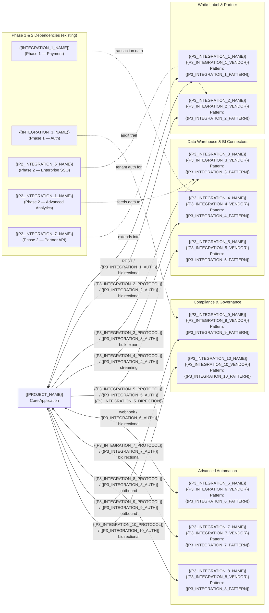

<!-- CONDITIONAL: Generate only if {{INTEGRATION_PHASE_COUNT}} >= 3 -->

# Phase 3 Expansion Integrations — {{PROJECT_NAME}}

Paste the Mermaid block below into any Mermaid-compatible renderer (GitHub, VS Code, Mermaid Live Editor). Replace all {{PLACEHOLDER}} values with project-specific data before rendering.

---

---

## Integration Registry — Phase 3 (Expansion)

| Integration | Vendor | Protocol | Direction | Data Exchanged | Auth Method | SLA / Uptime | Depends On | Integration Pattern |
|-------------|--------|----------|-----------|----------------|-------------|--------------|------------|---------------------|
| {{P3_INTEGRATION_1_NAME}} | {{P3_INTEGRATION_1_VENDOR}} | REST | Bidirectional | {{P3_INTEGRATION_1_DATA}} | {{P3_INTEGRATION_1_AUTH}} | {{P3_INTEGRATION_1_SLA}} | {{P2_INTEGRATION_7_NAME}} (Phase 2) | {{P3_INTEGRATION_1_PATTERN}} |
| {{P3_INTEGRATION_2_NAME}} | {{P3_INTEGRATION_2_VENDOR}} | {{P3_INTEGRATION_2_PROTOCOL}} | Bidirectional | {{P3_INTEGRATION_2_DATA}} | {{P3_INTEGRATION_2_AUTH}} | {{P3_INTEGRATION_2_SLA}} | {{P2_INTEGRATION_5_NAME}} (Phase 2) | {{P3_INTEGRATION_2_PATTERN}} |
| {{P3_INTEGRATION_3_NAME}} | {{P3_INTEGRATION_3_VENDOR}} | {{P3_INTEGRATION_3_PROTOCOL}} | Outbound | {{P3_INTEGRATION_3_DATA}} | {{P3_INTEGRATION_3_AUTH}} | {{P3_INTEGRATION_3_SLA}} | {{P2_INTEGRATION_1_NAME}} (Phase 2) | {{P3_INTEGRATION_3_PATTERN}} |
| {{P3_INTEGRATION_4_NAME}} | {{P3_INTEGRATION_4_VENDOR}} | {{P3_INTEGRATION_4_PROTOCOL}} | Outbound | {{P3_INTEGRATION_4_DATA}} | {{P3_INTEGRATION_4_AUTH}} | {{P3_INTEGRATION_4_SLA}} | {{INTEGRATION_1_NAME}} (Phase 1) | {{P3_INTEGRATION_4_PATTERN}} |
| {{P3_INTEGRATION_5_NAME}} | {{P3_INTEGRATION_5_VENDOR}} | {{P3_INTEGRATION_5_PROTOCOL}} | {{P3_INTEGRATION_5_DIRECTION}} | {{P3_INTEGRATION_5_DATA}} | {{P3_INTEGRATION_5_AUTH}} | {{P3_INTEGRATION_5_SLA}} | None | {{P3_INTEGRATION_5_PATTERN}} |
| {{P3_INTEGRATION_6_NAME}} | {{P3_INTEGRATION_6_VENDOR}} | Webhook | Bidirectional | {{P3_INTEGRATION_6_DATA}} | {{P3_INTEGRATION_6_AUTH}} | {{P3_INTEGRATION_6_SLA}} | None | {{P3_INTEGRATION_6_PATTERN}} |
| {{P3_INTEGRATION_7_NAME}} | {{P3_INTEGRATION_7_VENDOR}} | {{P3_INTEGRATION_7_PROTOCOL}} | Bidirectional | {{P3_INTEGRATION_7_DATA}} | {{P3_INTEGRATION_7_AUTH}} | {{P3_INTEGRATION_7_SLA}} | None | {{P3_INTEGRATION_7_PATTERN}} |
| {{P3_INTEGRATION_8_NAME}} | {{P3_INTEGRATION_8_VENDOR}} | {{P3_INTEGRATION_8_PROTOCOL}} | Outbound | {{P3_INTEGRATION_8_DATA}} | {{P3_INTEGRATION_8_AUTH}} | {{P3_INTEGRATION_8_SLA}} | {{P3_INTEGRATION_6_NAME}} | {{P3_INTEGRATION_8_PATTERN}} |
| {{P3_INTEGRATION_9_NAME}} | {{P3_INTEGRATION_9_VENDOR}} | {{P3_INTEGRATION_9_PROTOCOL}} | Outbound | {{P3_INTEGRATION_9_DATA}} | {{P3_INTEGRATION_9_AUTH}} | {{P3_INTEGRATION_9_SLA}} | {{INTEGRATION_3_NAME}} (Phase 1) | {{P3_INTEGRATION_9_PATTERN}} |
| {{P3_INTEGRATION_10_NAME}} | {{P3_INTEGRATION_10_VENDOR}} | {{P3_INTEGRATION_10_PROTOCOL}} | Bidirectional | {{P3_INTEGRATION_10_DATA}} | {{P3_INTEGRATION_10_AUTH}} | {{P3_INTEGRATION_10_SLA}} | {{P3_INTEGRATION_9_NAME}} | {{P3_INTEGRATION_10_PATTERN}} |

## Integration Pattern Reference

| Pattern | Description | Best For | Considerations |
|---------|-------------|----------|----------------|
| Polling | Periodic API calls on a schedule | Batch data sync, non-time-sensitive data | Rate limit awareness, wasted calls when no changes |
| Webhook | Event-driven HTTP callbacks | Real-time notifications, state changes | Delivery guarantees, retry handling, idempotency |
| Streaming | Persistent connection with continuous data flow | High-volume data pipelines, CDC | Connection management, backpressure, reconnection |
| Bulk | Large dataset transfer in batches | Data warehouse loads, migrations | Scheduling, progress tracking, partial failure handling |

## White-Label Configuration

| Parameter | Description | Default | Per-Tenant Override |
|-----------|-------------|---------|---------------------|
| {{WL_PARAM_1_NAME}} | {{WL_PARAM_1_DESC}} | {{WL_PARAM_1_DEFAULT}} | {{WL_PARAM_1_OVERRIDE}} |
| {{WL_PARAM_2_NAME}} | {{WL_PARAM_2_DESC}} | {{WL_PARAM_2_DEFAULT}} | {{WL_PARAM_2_OVERRIDE}} |
| {{WL_PARAM_3_NAME}} | {{WL_PARAM_3_DESC}} | {{WL_PARAM_3_DEFAULT}} | {{WL_PARAM_3_OVERRIDE}} |
| {{WL_PARAM_4_NAME}} | {{WL_PARAM_4_DESC}} | {{WL_PARAM_4_DEFAULT}} | {{WL_PARAM_4_OVERRIDE}} |

## Compliance Integration Requirements

| Regulation | Integration | Data Scope | Retention | Audit Frequency |
|------------|-------------|------------|-----------|-----------------|
| {{REGULATION_1_NAME}} | {{P3_INTEGRATION_9_NAME}} | {{REGULATION_1_SCOPE}} | {{REGULATION_1_RETENTION}} | {{REGULATION_1_AUDIT_FREQ}} |
| {{REGULATION_2_NAME}} | {{P3_INTEGRATION_10_NAME}} | {{REGULATION_2_SCOPE}} | {{REGULATION_2_RETENTION}} | {{REGULATION_2_AUDIT_FREQ}} |
| {{REGULATION_3_NAME}} | {{P3_INTEGRATION_9_NAME}}, {{P3_INTEGRATION_10_NAME}} | {{REGULATION_3_SCOPE}} | {{REGULATION_3_RETENTION}} | {{REGULATION_3_AUDIT_FREQ}} |

## Phase 3 Rollout Plan

| Integration | Target Launch | Prerequisites | Estimated Effort | Priority |
|-------------|--------------|---------------|------------------|----------|
| {{P3_INTEGRATION_1_NAME}} | {{P3_INT_1_TARGET_DATE}} | {{P3_INT_1_PREREQS}} | {{P3_INT_1_EFFORT}} | {{P3_INT_1_PRIORITY}} |
| {{P3_INTEGRATION_3_NAME}} | {{P3_INT_3_TARGET_DATE}} | {{P3_INT_3_PREREQS}} | {{P3_INT_3_EFFORT}} | {{P3_INT_3_PRIORITY}} |
| {{P3_INTEGRATION_6_NAME}} | {{P3_INT_6_TARGET_DATE}} | {{P3_INT_6_PREREQS}} | {{P3_INT_6_EFFORT}} | {{P3_INT_6_PRIORITY}} |
| {{P3_INTEGRATION_9_NAME}} | {{P3_INT_9_TARGET_DATE}} | {{P3_INT_9_PREREQS}} | {{P3_INT_9_EFFORT}} | {{P3_INT_9_PRIORITY}} |

## Notes

- **Multi-tenancy:** White-label integrations require strict tenant isolation. Data never crosses tenant boundaries.
- **Data warehouse ETL:** Warehouse connectors run on a {{DW_ETL_SCHEDULE}} schedule. Use {{DW_ETL_TOOL}} for orchestration.
- **Automation rate limits:** Zapier/n8n integrations share a pool of {{AUTOMATION_RATE_LIMIT}} API calls per tenant per {{AUTOMATION_RATE_WINDOW}}.
- **Compliance audit trail:** All compliance integration calls are logged to {{COMPLIANCE_AUDIT_LOG}} with {{COMPLIANCE_LOG_RETENTION}} retention.

## Cross-References

- **Phase 1 MVP integrations:** `int-phase1-mvp.template.md`
- **Phase 2 post-launch integrations:** `int-phase2-post-launch.template.md`
- **Data flow sequences:** `data-flow.template.md`
- **Service dependencies:** `df-cross-service-dependencies.template.md`
- **System architecture:** `system-architecture-flowchart.template.md`
