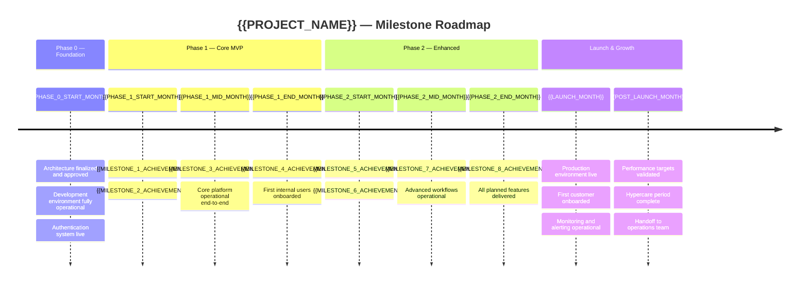
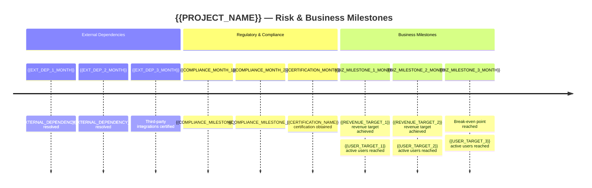

# Milestone Roadmap — {{PROJECT_NAME}}

Paste the Mermaid block below into any Mermaid-compatible renderer (GitHub, VS Code, Mermaid Live Editor). Replace all {{PLACEHOLDER}} values with project-specific data before rendering.

**Category:** 10 — Timeline & Roadmap

---

## Achievement Milestones by Phase

## Risk & Business Milestones

---

## Milestone Detail

| Milestone | Phase | Target Date | Gate Criteria | Stakeholder Deliverable |
|-----------|-------|-------------|---------------|------------------------|
| Architecture finalized | Phase 0 | {{ARCH_DATE}} | All ADRs approved, tech stack confirmed | Architecture decision summary document |
| Development environment operational | Phase 0 | {{DEVENV_DATE}} | CI/CD green, all environments provisioned | Environment access credentials distributed |
| Authentication system live | Phase 0 | {{AUTH_DATE}} | Login, registration, RBAC functional | Security review sign-off |
| {{MILESTONE_1_ACHIEVEMENT}} | Phase 1 | {{MILESTONE_1_DATE}} | {{MILESTONE_1_GATE}} | {{MILESTONE_1_DELIVERABLE}} |
| {{MILESTONE_2_ACHIEVEMENT}} | Phase 1 | {{MILESTONE_2_DATE}} | {{MILESTONE_2_GATE}} | {{MILESTONE_2_DELIVERABLE}} |
| {{MILESTONE_3_ACHIEVEMENT}} | Phase 1 | {{MILESTONE_3_DATE}} | {{MILESTONE_3_GATE}} | {{MILESTONE_3_DELIVERABLE}} |
| {{MILESTONE_4_ACHIEVEMENT}} | Phase 1 | {{MILESTONE_4_DATE}} | {{MILESTONE_4_GATE}} | {{MILESTONE_4_DELIVERABLE}} |
| {{MILESTONE_5_ACHIEVEMENT}} | Phase 2 | {{MILESTONE_5_DATE}} | {{MILESTONE_5_GATE}} | {{MILESTONE_5_DELIVERABLE}} |
| {{MILESTONE_6_ACHIEVEMENT}} | Phase 2 | {{MILESTONE_6_DATE}} | {{MILESTONE_6_GATE}} | {{MILESTONE_6_DELIVERABLE}} |
| {{MILESTONE_7_ACHIEVEMENT}} | Phase 2 | {{MILESTONE_7_DATE}} | {{MILESTONE_7_GATE}} | {{MILESTONE_7_DELIVERABLE}} |
| {{MILESTONE_8_ACHIEVEMENT}} | Phase 2 | {{MILESTONE_8_DATE}} | {{MILESTONE_8_GATE}} | {{MILESTONE_8_DELIVERABLE}} |
| Production launch | Launch | {{LAUNCH_DATE}} | Go/no-go checklist passed, rollback tested | Launch announcement, customer access |
| Hypercare complete | Post-Launch | {{HYPERCARE_END_DATE}} | Error rates stable, no P0 for {{STABLE_DAYS}} days | Operations handoff report |

## Stakeholder Deliverables Matrix

| Milestone | CEO | Investors | Customers | Engineering |
|-----------|-----|-----------|-----------|-------------|
| Architecture finalized | Executive summary (1-page) | Technical capability brief | N/A | Full ADR documentation |
| Core platform operational | Demo walkthrough | Progress report with KPIs | N/A | Internal release notes |
| {{MILESTONE_1_ACHIEVEMENT}} | {{CEO_DELIV_M1}} | {{INVESTOR_DELIV_M1}} | {{CUSTOMER_DELIV_M1}} | {{ENG_DELIV_M1}} |
| {{MILESTONE_3_ACHIEVEMENT}} | {{CEO_DELIV_M3}} | {{INVESTOR_DELIV_M3}} | {{CUSTOMER_DELIV_M3}} | {{ENG_DELIV_M3}} |
| {{MILESTONE_5_ACHIEVEMENT}} | {{CEO_DELIV_M5}} | {{INVESTOR_DELIV_M5}} | {{CUSTOMER_DELIV_M5}} | {{ENG_DELIV_M5}} |
| {{MILESTONE_7_ACHIEVEMENT}} | {{CEO_DELIV_M7}} | {{INVESTOR_DELIV_M7}} | {{CUSTOMER_DELIV_M7}} | {{ENG_DELIV_M7}} |
| Production launch | Board presentation | Investor update + metrics | Welcome email + onboarding guide | Production runbook |
| Hypercare complete | Stability report | Unit economics update | Support SLA confirmation | Post-mortem + retrospective |

## Quarterly Summary

| Quarter | Key Milestones | Status | Risk Level |
|---------|---------------|--------|------------|
| {{Q1_LABEL}} | {{Q1_MILESTONES}} | {{Q1_STATUS}} | {{Q1_RISK}} |
| {{Q2_LABEL}} | {{Q2_MILESTONES}} | {{Q2_STATUS}} | {{Q2_RISK}} |
| {{Q3_LABEL}} | {{Q3_MILESTONES}} | {{Q3_STATUS}} | {{Q3_RISK}} |
| {{Q4_LABEL}} | {{Q4_MILESTONES}} | {{Q4_STATUS}} | {{Q4_RISK}} |

---

## Cross-References

- **Full Project Timeline:** `timeline-full-project.template.md` — detailed Gantt with all tasks and durations
- **Phased Roadmap:** `overview-phased-roadmap.template.md` — phase-by-phase feature breakdown
- **Stakeholder Communication Plan:** `../communication-plan.template.md` — when and how to deliver milestone updates
- **Audience Matrix:** `../audience-matrix.template.md` — stakeholder-specific communication preferences
