<!-- CONDITIONAL: Generate only if {{HAS_MOBILE}} == "true" -->

# Mobile Navigation Map — {{PROJECT_NAME}}

Paste the Mermaid block below into any Mermaid-compatible renderer (GitHub, VS Code, Mermaid Live Editor). Replace all {{PLACEHOLDER}} values with project-specific data before rendering.

**Category:** 11 — UX & Navigation

---

## Full Mobile Navigation Hierarchy

```mermaid
flowchart TD
    %% Deep Link Entry Points
    DL1["Deep Link:<br/>{{DEEP_LINK_1_PATH}}"] -.->|"deep link"| TAB1_DETAIL
    DL2["Deep Link:<br/>{{DEEP_LINK_2_PATH}}"] -.->|"deep link"| TAB2_DETAIL
    DL3["Deep Link:<br/>{{DEEP_LINK_3_PATH}}"] -.->|"deep link"| TAB3_LIST
    DL4["Deep Link:<br/>{{DEEP_LINK_4_PATH}}"] -.->|"deep link"| TAB4_HOME

    %% Auth Stack
    subgraph AUTH["Auth Stack"]
        SPLASH["Splash Screen"]
        LOGIN["Login"]
        REGISTER["Register"]
        FORGOT["Forgot Password"]
        VERIFY["Email / Phone<br/>Verification"]
        RESET["Reset Password"]
        ONBOARD["Onboarding<br/>Walkthrough"]

        SPLASH --> LOGIN
        SPLASH --> REGISTER
        LOGIN --> FORGOT
        FORGOT --> RESET
        REGISTER --> VERIFY
        VERIFY --> ONBOARD
    end

    ONBOARD --> TABS
    LOGIN -->|"authenticated"| TABS

    %% Tab Navigator
    subgraph TABS["Tab Navigator"]
        direction LR
        T1["{{MOBILE_TAB_1}}"]
        T2["{{MOBILE_TAB_2}}"]
        T3["{{MOBILE_TAB_3}}"]
        T4["{{MOBILE_TAB_4}}"]
        T5["{{MOBILE_TAB_5}}"]
    end

    %% Tab 1 Hierarchy
    subgraph TAB1_STACK["{{MOBILE_TAB_1}} Stack"]
        TAB1_HOME["{{MOBILE_TAB_1}}<br/>Home / Dashboard"]
        TAB1_LIST["{{TAB_1_LIST_SCREEN}}"]
        TAB1_DETAIL["{{TAB_1_DETAIL_SCREEN}}"]
        TAB1_EDIT["{{TAB_1_EDIT_SCREEN}}"]
        TAB1_SUB1["{{TAB_1_SUB_SCREEN_1}}"]

        TAB1_HOME --> TAB1_LIST
        TAB1_LIST --> TAB1_DETAIL
        TAB1_DETAIL --> TAB1_EDIT
        TAB1_DETAIL --> TAB1_SUB1
    end

    %% Tab 2 Hierarchy
    subgraph TAB2_STACK["{{MOBILE_TAB_2}} Stack"]
        TAB2_LIST["{{TAB_2_LIST_SCREEN}}"]
        TAB2_DETAIL["{{TAB_2_DETAIL_SCREEN}}"]
        TAB2_EDIT["{{TAB_2_EDIT_SCREEN}}"]
        TAB2_CREATE["{{TAB_2_CREATE_SCREEN}}"]
        TAB2_SUB1["{{TAB_2_SUB_SCREEN_1}}"]

        TAB2_LIST --> TAB2_DETAIL
        TAB2_LIST --> TAB2_CREATE
        TAB2_DETAIL --> TAB2_EDIT
        TAB2_DETAIL --> TAB2_SUB1
    end

    %% Tab 3 Hierarchy
    subgraph TAB3_STACK["{{MOBILE_TAB_3}} Stack"]
        TAB3_LIST["{{TAB_3_LIST_SCREEN}}"]
        TAB3_DETAIL["{{TAB_3_DETAIL_SCREEN}}"]
        TAB3_FILTER["{{TAB_3_FILTER_SCREEN}}"]
        TAB3_SUB1["{{TAB_3_SUB_SCREEN_1}}"]

        TAB3_LIST --> TAB3_DETAIL
        TAB3_LIST --> TAB3_FILTER
        TAB3_DETAIL --> TAB3_SUB1
    end

    %% Tab 4 Hierarchy
    subgraph TAB4_STACK["{{MOBILE_TAB_4}} Stack"]
        TAB4_HOME["{{TAB_4_HOME_SCREEN}}"]
        TAB4_DETAIL["{{TAB_4_DETAIL_SCREEN}}"]
        TAB4_ACTION["{{TAB_4_ACTION_SCREEN}}"]
        TAB4_SUB1["{{TAB_4_SUB_SCREEN_1}}"]

        TAB4_HOME --> TAB4_DETAIL
        TAB4_DETAIL --> TAB4_ACTION
        TAB4_DETAIL --> TAB4_SUB1
    end

    %% Tab 5 Hierarchy
    subgraph TAB5_STACK["{{MOBILE_TAB_5}} Stack"]
        TAB5_PROFILE["Profile"]
        TAB5_SETTINGS["Settings"]
        TAB5_PREFS["Preferences"]
        TAB5_ABOUT["About / Legal"]
        TAB5_SUPPORT["Help & Support"]

        TAB5_PROFILE --> TAB5_SETTINGS
        TAB5_SETTINGS --> TAB5_PREFS
        TAB5_SETTINGS --> TAB5_ABOUT
        TAB5_SETTINGS --> TAB5_SUPPORT
    end

    T1 --> TAB1_STACK
    T2 --> TAB2_STACK
    T3 --> TAB3_STACK
    T4 --> TAB4_STACK
    T5 --> TAB5_STACK

    %% Modal Overlays
    subgraph MODALS["Modal Overlays"]
        MOD_CREATE["Quick Create<br/>Modal"]
        MOD_SEARCH["Global Search<br/>Modal"]
        MOD_NOTIFY["Notifications<br/>Panel"]
        MOD_CONFIRM["Confirmation<br/>Dialog"]
        MOD_MEDIA["Media Viewer<br/>Modal"]
    end

    TABS -.->|"FAB / header action"| MOD_CREATE
    TABS -.->|"search icon"| MOD_SEARCH
    TABS -.->|"bell icon"| MOD_NOTIFY
    TAB1_EDIT -.->|"save / delete"| MOD_CONFIRM
    TAB2_EDIT -.->|"save / delete"| MOD_CONFIRM
    TAB1_DETAIL -.->|"image tap"| MOD_MEDIA

    %% Offline-capable styling (green fill)
    style TAB1_HOME fill:#4CAF50,color:#fff
    style TAB1_LIST fill:#4CAF50,color:#fff
    style TAB1_DETAIL fill:#4CAF50,color:#fff
    style TAB2_LIST fill:#4CAF50,color:#fff
    style TAB2_DETAIL fill:#4CAF50,color:#fff
    style TAB3_LIST fill:#4CAF50,color:#fff
    style TAB4_HOME fill:#4CAF50,color:#fff
    style TAB5_PROFILE fill:#4CAF50,color:#fff
    style TAB5_SETTINGS fill:#4CAF50,color:#fff

    %% Online-required styling (red fill)
    style TAB1_EDIT fill:#F44336,color:#fff
    style TAB2_EDIT fill:#F44336,color:#fff
    style TAB2_CREATE fill:#F44336,color:#fff
    style TAB4_ACTION fill:#F44336,color:#fff
    style MOD_CREATE fill:#F44336,color:#fff
    style MOD_SEARCH fill:#F44336,color:#fff

    %% Auth stack styling
    style AUTH fill:#E3F2FD,color:#000
    style MODALS fill:#FFF3E0,color:#000
```

**Legend:**
- **Green screens** = Offline-capable (cached data available)
- **Red screens** = Online-required (needs network for data or actions)
- **Dashed arrows** = Modal overlays (presented on top of current screen)
- **Solid arrows** = Standard navigation push transitions

---

## Screen Inventory

| Screen | Tab | Auth Required | Offline Capable | Deep Link Path |
|--------|-----|:------------:|:---------------:|----------------|
| Splash | Auth | No | Yes | N/A |
| Login | Auth | No | No | N/A |
| Register | Auth | No | No | N/A |
| Forgot Password | Auth | No | No | N/A |
| Verification | Auth | No | No | N/A |
| Onboarding | Auth | No | Yes | N/A |
| {{TAB_1_LIST_SCREEN}} | {{MOBILE_TAB_1}} | Yes | Yes | `{{DEEP_LINK_PREFIX}}/{{TAB_1_PATH}}` |
| {{TAB_1_DETAIL_SCREEN}} | {{MOBILE_TAB_1}} | Yes | Yes | `{{DEEP_LINK_PREFIX}}/{{TAB_1_PATH}}/:id` |
| {{TAB_1_EDIT_SCREEN}} | {{MOBILE_TAB_1}} | Yes | No | N/A |
| {{TAB_1_SUB_SCREEN_1}} | {{MOBILE_TAB_1}} | Yes | {{TAB_1_SUB1_OFFLINE}} | N/A |
| {{TAB_2_LIST_SCREEN}} | {{MOBILE_TAB_2}} | Yes | Yes | `{{DEEP_LINK_PREFIX}}/{{TAB_2_PATH}}` |
| {{TAB_2_DETAIL_SCREEN}} | {{MOBILE_TAB_2}} | Yes | Yes | `{{DEEP_LINK_PREFIX}}/{{TAB_2_PATH}}/:id` |
| {{TAB_2_EDIT_SCREEN}} | {{MOBILE_TAB_2}} | Yes | No | N/A |
| {{TAB_2_CREATE_SCREEN}} | {{MOBILE_TAB_2}} | Yes | No | N/A |
| {{TAB_2_SUB_SCREEN_1}} | {{MOBILE_TAB_2}} | Yes | {{TAB_2_SUB1_OFFLINE}} | N/A |
| {{TAB_3_LIST_SCREEN}} | {{MOBILE_TAB_3}} | Yes | Yes | `{{DEEP_LINK_PREFIX}}/{{TAB_3_PATH}}` |
| {{TAB_3_DETAIL_SCREEN}} | {{MOBILE_TAB_3}} | Yes | {{TAB_3_DETAIL_OFFLINE}} | N/A |
| {{TAB_3_FILTER_SCREEN}} | {{MOBILE_TAB_3}} | Yes | Yes | N/A |
| {{TAB_3_SUB_SCREEN_1}} | {{MOBILE_TAB_3}} | Yes | {{TAB_3_SUB1_OFFLINE}} | N/A |
| {{TAB_4_HOME_SCREEN}} | {{MOBILE_TAB_4}} | Yes | Yes | `{{DEEP_LINK_PREFIX}}/{{TAB_4_PATH}}` |
| {{TAB_4_DETAIL_SCREEN}} | {{MOBILE_TAB_4}} | Yes | {{TAB_4_DETAIL_OFFLINE}} | N/A |
| {{TAB_4_ACTION_SCREEN}} | {{MOBILE_TAB_4}} | Yes | No | N/A |
| {{TAB_4_SUB_SCREEN_1}} | {{MOBILE_TAB_4}} | Yes | {{TAB_4_SUB1_OFFLINE}} | N/A |
| Profile | {{MOBILE_TAB_5}} | Yes | Yes | `{{DEEP_LINK_PREFIX}}/profile` |
| Settings | {{MOBILE_TAB_5}} | Yes | Yes | `{{DEEP_LINK_PREFIX}}/settings` |
| Preferences | {{MOBILE_TAB_5}} | Yes | {{PREFS_OFFLINE}} | N/A |
| About / Legal | {{MOBILE_TAB_5}} | Yes | Yes | N/A |
| Help & Support | {{MOBILE_TAB_5}} | Yes | No | N/A |

## Navigation Guards

| Screen | Guard | Redirect If Fail |
|--------|-------|-----------------|
| All Tab Screens | `isAuthenticated` | Login screen |
| {{TAB_1_EDIT_SCREEN}} | `isAuthenticated` + `hasPermission('{{SERVICE_1_NAME}}:update')` | {{TAB_1_DETAIL_SCREEN}} (read-only) |
| {{TAB_2_CREATE_SCREEN}} | `isAuthenticated` + `hasPermission('{{SERVICE_2_NAME}}:create')` | {{TAB_2_LIST_SCREEN}} |
| {{TAB_2_EDIT_SCREEN}} | `isAuthenticated` + `hasPermission('{{SERVICE_2_NAME}}:update')` | {{TAB_2_DETAIL_SCREEN}} (read-only) |
| {{TAB_4_ACTION_SCREEN}} | `isAuthenticated` + `hasPermission('{{SERVICE_4_NAME}}:execute')` | {{TAB_4_DETAIL_SCREEN}} |
| Settings | `isAuthenticated` + `isOwnerOrAdmin` | Profile (limited view) |
| Quick Create Modal | `isAuthenticated` + `isOnline` | Offline banner + dismiss |
| Global Search Modal | `isAuthenticated` + `isOnline` | Offline banner + local search fallback |

## Tab Badge Logic

| Tab | Badge Type | Source | Update Frequency | Offline Behavior |
|-----|-----------|--------|------------------|-----------------|
| {{MOBILE_TAB_1}} | Count | {{TAB_1_BADGE_SOURCE}} | {{TAB_1_BADGE_FREQUENCY}} | Show last known count |
| {{MOBILE_TAB_2}} | Count | {{TAB_2_BADGE_SOURCE}} | {{TAB_2_BADGE_FREQUENCY}} | Show last known count |
| {{MOBILE_TAB_3}} | Dot (new content) | {{TAB_3_BADGE_SOURCE}} | {{TAB_3_BADGE_FREQUENCY}} | Hide badge |
| {{MOBILE_TAB_4}} | Count | {{TAB_4_BADGE_SOURCE}} | {{TAB_4_BADGE_FREQUENCY}} | Show last known count |
| {{MOBILE_TAB_5}} | Dot (action required) | {{TAB_5_BADGE_SOURCE}} | {{TAB_5_BADGE_FREQUENCY}} | Hide badge |

---

## Cross-References

- **User Journey:** `user-journey-flowchart.template.md` — end-to-end user flows that traverse these screens
- **Auth & Permissions:** `auth-role-permission-matrix.template.md` — role-based access that drives navigation guards
- **System Architecture:** `system-architecture-flowchart.template.md` — backend services powering each tab
- **Feature Mind Map:** `feature-mind-map.template.md` — feature breakdown mapped to navigation structure
