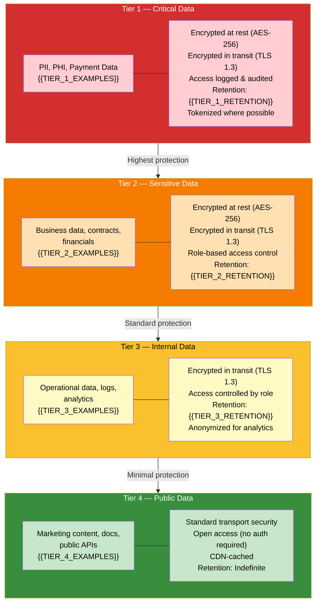
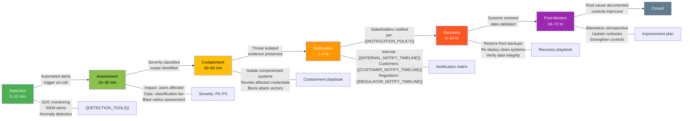
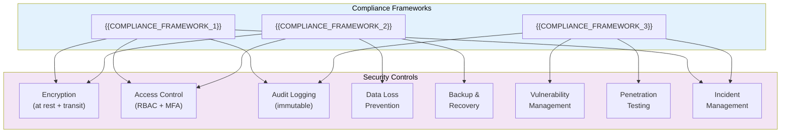

# Data Security Architecture — {{PROJECT_NAME}}

Paste the Mermaid block below into any Mermaid-compatible renderer (GitHub, VS Code, Mermaid Live Editor). Replace all {{PLACEHOLDER}} values with project-specific data before rendering.

**Category:** 12 — Stakeholder Communications

---

## Data Classification & Protection Controls

## Incident Response Timeline

<!-- IF {{COMPLIANCE_REQUIREMENTS}} != "none" -->

## Compliance Framework Mapping

<!-- END IF -->

---

## Data Classification Table

| Classification | Tier | Examples | Encryption at Rest | Encryption in Transit | Access Logging | Retention | Backup Frequency |
|---------------|------|---------|:------------------:|:---------------------:|:--------------:|-----------|-----------------|
| Critical | 1 | {{TIER_1_EXAMPLES}} | AES-256 | TLS 1.3 | Full audit trail | {{TIER_1_RETENTION}} | {{TIER_1_BACKUP_FREQ}} |
| Sensitive | 2 | {{TIER_2_EXAMPLES}} | AES-256 | TLS 1.3 | Access logged | {{TIER_2_RETENTION}} | {{TIER_2_BACKUP_FREQ}} |
| Internal | 3 | {{TIER_3_EXAMPLES}} | {{TIER_3_ENCRYPTION_AT_REST}} | TLS 1.3 | Aggregated | {{TIER_3_RETENTION}} | {{TIER_3_BACKUP_FREQ}} |
| Public | 4 | {{TIER_4_EXAMPLES}} | N/A | TLS 1.2+ | N/A | Indefinite | {{TIER_4_BACKUP_FREQ}} |

## Protection Controls

| Control | Tier 1 | Tier 2 | Tier 3 | Tier 4 | Implementation |
|---------|:------:|:------:|:------:|:------:|---------------|
| Encryption at rest | Required | Required | {{TIER_3_EAR}} | N/A | {{ENCRYPTION_IMPLEMENTATION}} |
| Encryption in transit | TLS 1.3 | TLS 1.3 | TLS 1.3 | TLS 1.2+ | {{TLS_IMPLEMENTATION}} |
| MFA for access | Required | Required | {{TIER_3_MFA}} | N/A | {{MFA_IMPLEMENTATION}} |
| Audit logging | Full (immutable) | Full | Aggregated | N/A | {{AUDIT_IMPLEMENTATION}} |
| Data masking | Required (display) | {{TIER_2_MASKING}} | N/A | N/A | {{MASKING_IMPLEMENTATION}} |
| Tokenization | Required (storage) | {{TIER_2_TOKENIZATION}} | N/A | N/A | {{TOKENIZATION_IMPLEMENTATION}} |
| DLP scanning | Required | Required | {{TIER_3_DLP}} | N/A | {{DLP_IMPLEMENTATION}} |
| Key rotation | Every {{TIER_1_KEY_ROTATION}} | Every {{TIER_2_KEY_ROTATION}} | Every {{TIER_3_KEY_ROTATION}} | N/A | {{KEY_ROTATION_IMPLEMENTATION}} |
| Backup encryption | Required | Required | {{TIER_3_BACKUP_ENC}} | N/A | {{BACKUP_IMPLEMENTATION}} |
| Geo-restriction | {{TIER_1_GEO_RESTRICTION}} | {{TIER_2_GEO_RESTRICTION}} | None | None | {{GEO_IMPLEMENTATION}} |

## Compliance Mapping

| Requirement | Framework | Control(s) | Status | Evidence |
|------------|-----------|-----------|--------|----------|
| {{REQUIREMENT_1}} | {{COMPLIANCE_FRAMEWORK_1}} | Encryption, Access Control | {{REQ_1_STATUS}} | {{REQ_1_EVIDENCE}} |
| {{REQUIREMENT_2}} | {{COMPLIANCE_FRAMEWORK_1}} | Audit Logging, Incident Mgmt | {{REQ_2_STATUS}} | {{REQ_2_EVIDENCE}} |
| {{REQUIREMENT_3}} | {{COMPLIANCE_FRAMEWORK_2}} | DLP, Data Classification | {{REQ_3_STATUS}} | {{REQ_3_EVIDENCE}} |
| {{REQUIREMENT_4}} | {{COMPLIANCE_FRAMEWORK_2}} | Backup & Recovery | {{REQ_4_STATUS}} | {{REQ_4_EVIDENCE}} |
| {{REQUIREMENT_5}} | {{COMPLIANCE_FRAMEWORK_3}} | Vulnerability Mgmt, Pen Testing | {{REQ_5_STATUS}} | {{REQ_5_EVIDENCE}} |
| {{REQUIREMENT_6}} | {{COMPLIANCE_FRAMEWORK_3}} | Access Control, MFA | {{REQ_6_STATUS}} | {{REQ_6_EVIDENCE}} |
| Data residency | {{APPLICABLE_FRAMEWORK}} | Geo-restriction, Hosting region | {{RESIDENCY_STATUS}} | Hosting: {{HOSTING_REGION}} |
| Right to deletion | {{APPLICABLE_FRAMEWORK}} | Data lifecycle management | {{DELETION_STATUS}} | Automated purge pipeline |
| Breach notification | {{APPLICABLE_FRAMEWORK}} | Incident Management | {{BREACH_NOTIFY_STATUS}} | Notification within {{BREACH_NOTIFY_HOURS}} hours |

---

## Cross-References

- **Auth & Permissions:** `auth-role-permission-matrix.template.md` — role-based access controls referenced in Tier 1/2 protections
- **Database ERD:** `database-erd-visual.template.md` — which tables store Tier 1 vs Tier 2 data
- **System Architecture:** `system-architecture-flowchart.template.md` — where encryption and access control are enforced
- **Product Overview:** `stakeholder-product-overview.template.md` — how security is positioned as a feature for customers
