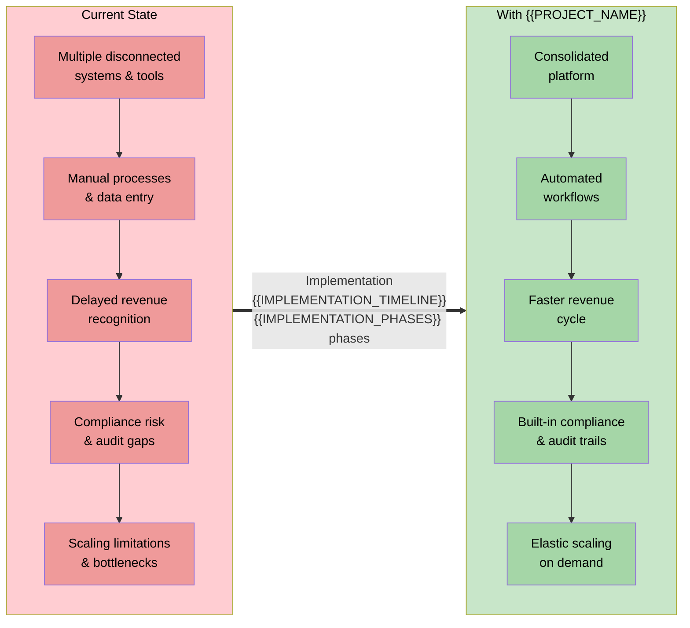

<!-- CONDITIONAL: Generate only if {{IS_B2B}} == "true" -->

# ROI Model — {{PROJECT_NAME}}

Paste the Mermaid block below into any Mermaid-compatible renderer (GitHub, VS Code, Mermaid Live Editor). Replace all {{PLACEHOLDER}} values with project-specific data before rendering.

**Category:** 12 — Stakeholder Communications

---

## Current State vs Future State

---

## Cost Savings Model — Small Customer ({{SMALL_CUSTOMER_USERS}} users)

| Cost Category | Current Annual Cost | With {{PROJECT_NAME}} | Annual Savings |
|--------------|:------------------:|:--------------------:|:--------------:|
| {{COST_CATEGORY_1}} (tools & licenses) | {{SMALL_CURRENT_TOOLS}} | {{SMALL_FUTURE_TOOLS}} | {{SMALL_SAVINGS_TOOLS}} |
| {{COST_CATEGORY_2}} (manual labor) | {{SMALL_CURRENT_LABOR}} | {{SMALL_FUTURE_LABOR}} | {{SMALL_SAVINGS_LABOR}} |
| {{COST_CATEGORY_3}} (error correction) | {{SMALL_CURRENT_ERRORS}} | {{SMALL_FUTURE_ERRORS}} | {{SMALL_SAVINGS_ERRORS}} |
| {{COST_CATEGORY_4}} (compliance & audit) | {{SMALL_CURRENT_COMPLIANCE}} | {{SMALL_FUTURE_COMPLIANCE}} | {{SMALL_SAVINGS_COMPLIANCE}} |
| {{COST_CATEGORY_5}} (opportunity cost) | {{SMALL_CURRENT_OPPORTUNITY}} | {{SMALL_FUTURE_OPPORTUNITY}} | {{SMALL_SAVINGS_OPPORTUNITY}} |
| **Total** | **{{SMALL_CURRENT_TOTAL}}** | **{{SMALL_FUTURE_TOTAL}}** | **{{SMALL_SAVINGS_TOTAL}}** |

| Metric | Value |
|--------|-------|
| {{PROJECT_NAME}} Annual Cost | {{SMALL_PRODUCT_COST}} |
| **Net Annual Savings** | **{{SMALL_NET_SAVINGS}}** |
| **ROI %** | **{{SMALL_ROI_PCT}}** |
| **Payback Period** | **{{SMALL_PAYBACK_MONTHS}} months** |

## Cost Savings Model — Medium Customer ({{MEDIUM_CUSTOMER_USERS}} users)

| Cost Category | Current Annual Cost | With {{PROJECT_NAME}} | Annual Savings |
|--------------|:------------------:|:--------------------:|:--------------:|
| {{COST_CATEGORY_1}} (tools & licenses) | {{MEDIUM_CURRENT_TOOLS}} | {{MEDIUM_FUTURE_TOOLS}} | {{MEDIUM_SAVINGS_TOOLS}} |
| {{COST_CATEGORY_2}} (manual labor) | {{MEDIUM_CURRENT_LABOR}} | {{MEDIUM_FUTURE_LABOR}} | {{MEDIUM_SAVINGS_LABOR}} |
| {{COST_CATEGORY_3}} (error correction) | {{MEDIUM_CURRENT_ERRORS}} | {{MEDIUM_FUTURE_ERRORS}} | {{MEDIUM_SAVINGS_ERRORS}} |
| {{COST_CATEGORY_4}} (compliance & audit) | {{MEDIUM_CURRENT_COMPLIANCE}} | {{MEDIUM_FUTURE_COMPLIANCE}} | {{MEDIUM_SAVINGS_COMPLIANCE}} |
| {{COST_CATEGORY_5}} (opportunity cost) | {{MEDIUM_CURRENT_OPPORTUNITY}} | {{MEDIUM_FUTURE_OPPORTUNITY}} | {{MEDIUM_SAVINGS_OPPORTUNITY}} |
| **Total** | **{{MEDIUM_CURRENT_TOTAL}}** | **{{MEDIUM_FUTURE_TOTAL}}** | **{{MEDIUM_SAVINGS_TOTAL}}** |

| Metric | Value |
|--------|-------|
| {{PROJECT_NAME}} Annual Cost | {{MEDIUM_PRODUCT_COST}} |
| **Net Annual Savings** | **{{MEDIUM_NET_SAVINGS}}** |
| **ROI %** | **{{MEDIUM_ROI_PCT}}** |
| **Payback Period** | **{{MEDIUM_PAYBACK_MONTHS}} months** |

## Cost Savings Model — Large Customer ({{LARGE_CUSTOMER_USERS}} users)

| Cost Category | Current Annual Cost | With {{PROJECT_NAME}} | Annual Savings |
|--------------|:------------------:|:--------------------:|:--------------:|
| {{COST_CATEGORY_1}} (tools & licenses) | {{LARGE_CURRENT_TOOLS}} | {{LARGE_FUTURE_TOOLS}} | {{LARGE_SAVINGS_TOOLS}} |
| {{COST_CATEGORY_2}} (manual labor) | {{LARGE_CURRENT_LABOR}} | {{LARGE_FUTURE_LABOR}} | {{LARGE_SAVINGS_LABOR}} |
| {{COST_CATEGORY_3}} (error correction) | {{LARGE_CURRENT_ERRORS}} | {{LARGE_FUTURE_ERRORS}} | {{LARGE_SAVINGS_ERRORS}} |
| {{COST_CATEGORY_4}} (compliance & audit) | {{LARGE_CURRENT_COMPLIANCE}} | {{LARGE_FUTURE_COMPLIANCE}} | {{LARGE_SAVINGS_COMPLIANCE}} |
| {{COST_CATEGORY_5}} (opportunity cost) | {{LARGE_CURRENT_OPPORTUNITY}} | {{LARGE_FUTURE_OPPORTUNITY}} | {{LARGE_SAVINGS_OPPORTUNITY}} |
| **Total** | **{{LARGE_CURRENT_TOTAL}}** | **{{LARGE_FUTURE_TOTAL}}** | **{{LARGE_SAVINGS_TOTAL}}** |

| Metric | Value |
|--------|-------|
| {{PROJECT_NAME}} Annual Cost | {{LARGE_PRODUCT_COST}} |
| **Net Annual Savings** | **{{LARGE_NET_SAVINGS}}** |
| **ROI %** | **{{LARGE_ROI_PCT}}** |
| **Payback Period** | **{{LARGE_PAYBACK_MONTHS}} months** |

---

## ROI Summary Across Customer Sizes

| Customer Size | Users | Current Cost | Product Cost | Net Savings | ROI % | Payback |
|:------------:|:-----:|:-----------:|:-----------:|:----------:|:-----:|:-------:|
| Small | {{SMALL_CUSTOMER_USERS}} | {{SMALL_CURRENT_TOTAL}} | {{SMALL_PRODUCT_COST}} | {{SMALL_NET_SAVINGS}} | {{SMALL_ROI_PCT}} | {{SMALL_PAYBACK_MONTHS}} mo |
| Medium | {{MEDIUM_CUSTOMER_USERS}} | {{MEDIUM_CURRENT_TOTAL}} | {{MEDIUM_PRODUCT_COST}} | {{MEDIUM_NET_SAVINGS}} | {{MEDIUM_ROI_PCT}} | {{MEDIUM_PAYBACK_MONTHS}} mo |
| Large | {{LARGE_CUSTOMER_USERS}} | {{LARGE_CURRENT_TOTAL}} | {{LARGE_PRODUCT_COST}} | {{LARGE_NET_SAVINGS}} | {{LARGE_ROI_PCT}} | {{LARGE_PAYBACK_MONTHS}} mo |

## Qualitative Benefits

Beyond the quantifiable cost savings above, {{PROJECT_NAME}} delivers strategic value that compounds over time:

- **Risk Reduction** — {{QUAL_RISK_REDUCTION}}. Eliminates single points of failure from disconnected systems and reduces exposure to compliance penalties.
- **Compliance Confidence** — {{QUAL_COMPLIANCE}}. Built-in audit trails, automated policy enforcement, and pre-configured controls for {{COMPLIANCE_FRAMEWORKS}} reduce audit preparation from weeks to hours.
- **Scalability Without Proportional Cost** — {{QUAL_SCALABILITY}}. Cloud-native architecture means growing from {{SMALL_CUSTOMER_USERS}} to {{LARGE_CUSTOMER_USERS}} users does not require proportional headcount or infrastructure investment.
- **Team Efficiency** — {{QUAL_TEAM_EFFICIENCY}}. Automating {{AUTOMATED_PROCESS_COUNT}} manual processes frees up an estimated {{HOURS_FREED_MONTHLY}} hours per month for higher-value work.
- **Faster Time-to-Value** — {{QUAL_TIME_TO_VALUE}}. New team members become productive in {{ONBOARDING_DAYS}} days instead of {{CURRENT_ONBOARDING_DAYS}} days with current tooling.
- **Data-Driven Decisions** — {{QUAL_DATA_DECISIONS}}. Consolidated platform provides unified analytics across all operations, replacing fragmented reporting from {{CURRENT_TOOL_COUNT}} separate tools.
- **Competitive Advantage** — {{QUAL_COMPETITIVE}}. Customers using {{PROJECT_NAME}} can respond to market changes {{RESPONSE_TIME_IMPROVEMENT}} faster than those using legacy alternatives.

---

## Cross-References

- **Product Overview:** `stakeholder-product-overview.template.md` — value propositions that drive these ROI calculations
- **Competitive Landscape:** `stakeholder-competitive-landscape.template.md` — competitor pricing context
- **Data Security:** `stakeholder-data-security.template.md` — compliance controls that reduce audit costs
- **Milestone Roadmap:** `milestone-roadmap.template.md` — implementation timeline referenced in the ROI model
- **Communication Plan:** `../communication-plan.template.md` — how to present ROI to different stakeholder audiences
