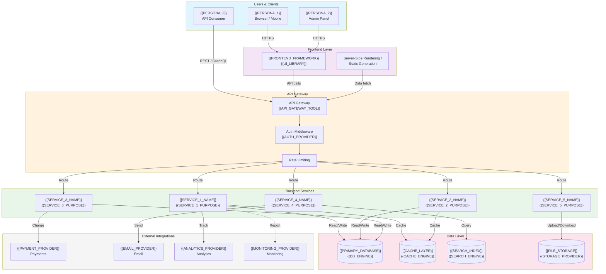

# System Architecture Flowchart — {{PROJECT_NAME}}

Paste the Mermaid block below into any Mermaid-compatible renderer. Replace all `{{PLACEHOLDER}}` values before rendering.

```mermaid
flowchart TB
    subgraph Users["Users & Clients"]
        U1["{{PERSONA_1}}<br/>Browser / Mobile"]
        U2["{{PERSONA_2}}<br/>Admin Panel"]
        U3["{{PERSONA_3}}<br/>API Consumer"]
    end

    subgraph Frontend["Frontend Layer"]
        FE["{{FRONTEND_FRAMEWORK}}<br/>{{UI_LIBRARY}}"]
        SSR["Server-Side Rendering /<br/>Static Generation"]
    end

    subgraph Gateway["API Gateway"]
        AG["API Gateway<br/>{{API_GATEWAY_TOOL}}"]
        AUTH["Auth Middleware<br/>{{AUTH_PROVIDER}}"]
        RL["Rate Limiting"]
    end

    subgraph Services["Backend Services"]
        S1["{{SERVICE_1_NAME}}<br/>{{SERVICE_1_PURPOSE}}"]
        S2["{{SERVICE_2_NAME}}<br/>{{SERVICE_2_PURPOSE}}"]
        S3["{{SERVICE_3_NAME}}<br/>{{SERVICE_3_PURPOSE}}"]
        S4["{{SERVICE_4_NAME}}<br/>{{SERVICE_4_PURPOSE}}"]
        S5["{{SERVICE_5_NAME}}<br/>{{SERVICE_5_PURPOSE}}"]
    end

    subgraph Data["Data Layer"]
        DB[("{{PRIMARY_DATABASE}}<br/>{{DB_ENGINE}}")]
        CACHE[("{{CACHE_LAYER}}<br/>{{CACHE_ENGINE}}")]
        SEARCH[("{{SEARCH_INDEX}}<br/>{{SEARCH_ENGINE}}")]
        FILES[("{{FILE_STORAGE}}<br/>{{STORAGE_PROVIDER}}")]
    end

    subgraph External["External Integrations"]
        PAY["{{PAYMENT_PROVIDER}}<br/>Payments"]
        EMAIL["{{EMAIL_PROVIDER}}<br/>Email"]
        ANALYTICS["{{ANALYTICS_PROVIDER}}<br/>Analytics"]
        MONITOR["{{MONITORING_PROVIDER}}<br/>Monitoring"]
    end

    U1 -->|"HTTPS"| FE
    U2 -->|"HTTPS"| FE
    U3 -->|"REST / GraphQL"| AG
    FE -->|"API calls"| AG
    SSR -->|"Data fetch"| AG
    AG --> AUTH
    AUTH --> RL
    RL -->|"Route"| S1
    RL -->|"Route"| S2
    RL -->|"Route"| S3
    RL -->|"Route"| S4
    RL -->|"Route"| S5
    S1 -->|"Read/Write"| DB
    S2 -->|"Read/Write"| DB
    S3 -->|"Read/Write"| DB
    S4 -->|"Query"| SEARCH
    S5 -->|"Upload/Download"| FILES
    S1 -->|"Cache"| CACHE
    S2 -->|"Cache"| CACHE
    S3 -->|"Charge"| PAY
    S4 -->|"Send"| EMAIL
    S1 -->|"Track"| ANALYTICS
    S1 -.->|"Report"| MONITOR

    style Users fill:#e1f5fe
    style Frontend fill:#f3e5f5
    style Gateway fill:#fff3e0
    style Services fill:#e8f5e9
    style Data fill:#fce4ec
    style External fill:#f5f5f5
```
