# Full Project Timeline — {{PROJECT_NAME}}

Paste the Mermaid block below into any Mermaid-compatible renderer (GitHub, VS Code, Mermaid Live Editor). Replace all {{PLACEHOLDER}} values with project-specific data before rendering.

**Category:** 10 — Timeline & Roadmap

---

## Complete Project Gantt

```mermaid
gantt
    title {{PROJECT_NAME}} — Full Project Timeline
    dateFormat YYYY-MM-DD
    axisFormat %b %d

    section Phase 0 — Foundation
    Project setup & repo init              :done, p0_1, {{PHASE_0_START_DATE}}, {{PHASE_0_TASK_1_DURATION}}
    Architecture design & ADR sign-off     :done, p0_2, after p0_1, {{PHASE_0_TASK_2_DURATION}}
    CI/CD pipeline & environments          :done, p0_3, after p0_1, {{PHASE_0_TASK_3_DURATION}}
    Database schema & migrations           :done, p0_4, after p0_2, {{PHASE_0_TASK_4_DURATION}}
    Auth service & RBAC foundation         :done, p0_5, after p0_4, {{PHASE_0_TASK_5_DURATION}}
    Design system & component library      :done, p0_6, after p0_1, {{PHASE_0_TASK_6_DURATION}}
    Phase 0 buffer                         :done, p0_buf, after p0_5, {{PHASE_0_BUFFER_DURATION}}

    section Phase 1 — Core MVP
    {{SPRINT_1_NAME}}                      :active, p1_1, after p0_buf, {{SPRINT_1_DURATION}}
    {{SPRINT_2_NAME}}                      :active, p1_2, after p1_1, {{SPRINT_2_DURATION}}
    {{SPRINT_3_NAME}}                      :p1_3, after p1_2, {{SPRINT_3_DURATION}}
    {{SPRINT_4_NAME}}                      :p1_4, after p1_3, {{SPRINT_4_DURATION}}
    {{MVP_FEATURE_1}}                      :p1_5, after p1_1, {{MVP_FEATURE_1_DURATION}}
    {{MVP_FEATURE_2}}                      :p1_6, after p1_2, {{MVP_FEATURE_2_DURATION}}
    {{MVP_FEATURE_3}}                      :p1_7, after p1_4, {{MVP_FEATURE_3_DURATION}}
    Phase 1 integration & stabilization    :p1_stab, after p1_7, {{PHASE_1_STAB_DURATION}}
    Phase 1 buffer                         :p1_buf, after p1_stab, {{PHASE_1_BUFFER_DURATION}}

    section Phase 2 — Enhanced
    {{SPRINT_5_NAME}}                      :p2_1, after p1_buf, {{SPRINT_5_DURATION}}
    {{SPRINT_6_NAME}}                      :p2_2, after p2_1, {{SPRINT_6_DURATION}}
    {{SPRINT_7_NAME}}                      :p2_3, after p2_2, {{SPRINT_7_DURATION}}
    {{ENHANCED_FEATURE_1}}                 :p2_4, after p2_1, {{ENHANCED_FEATURE_1_DURATION}}
    {{ENHANCED_FEATURE_2}}                 :p2_5, after p2_2, {{ENHANCED_FEATURE_2_DURATION}}
    {{ENHANCED_FEATURE_3}}                 :p2_6, after p2_3, {{ENHANCED_FEATURE_3_DURATION}}
    {{ENHANCED_FEATURE_4}}                 :p2_7, after p2_4, {{ENHANCED_FEATURE_4_DURATION}}
    Phase 2 integration                    :p2_stab, after p2_7, {{PHASE_2_STAB_DURATION}}
    Phase 2 buffer                         :p2_buf, after p2_stab, {{PHASE_2_BUFFER_DURATION}}

    section Testing & Stabilization
    End-to-end test suite execution        :t_1, after p2_buf, {{E2E_TEST_DURATION}}
    Performance & load testing             :t_2, after p2_buf, {{PERF_TEST_DURATION}}
    Security audit & pen testing           :t_3, after t_1, {{SECURITY_TEST_DURATION}}
    Bug fix sprint                         :t_4, after t_2, {{BUGFIX_DURATION}}
    UAT with stakeholders                  :t_5, after t_4, {{UAT_DURATION}}
    Testing buffer                         :t_buf, after t_5, {{TESTING_BUFFER_DURATION}}

    section Launch
    Staging deployment & smoke tests       :l_1, after t_buf, {{STAGING_DURATION}}
    Data migration dry run                 :l_2, after l_1, {{MIGRATION_DRY_RUN_DURATION}}
    Production deployment                  :milestone, l_3, after l_2, 0d
    Post-launch monitoring (hypercare)     :l_4, after l_3, {{HYPERCARE_DURATION}}
    Launch retrospective                   :l_5, after l_4, {{RETRO_DURATION}}
```

## Parallel Development Tracks

```mermaid
gantt
    title {{PROJECT_NAME}} — Parallel Work Streams
    dateFormat YYYY-MM-DD
    axisFormat %b %d

    section Backend API
    Core API endpoints                     :be_1, {{PHASE_1_START_DATE}}, {{BACKEND_CORE_DURATION}}
    Service integrations                   :be_2, after be_1, {{BACKEND_INTEGRATION_DURATION}}
    Performance optimization               :be_3, after be_2, {{BACKEND_PERF_DURATION}}

    section Frontend Web
    Component library & design system      :fe_1, {{PHASE_1_START_DATE}}, {{FRONTEND_DESIGN_DURATION}}
    Core UI screens                        :fe_2, after fe_1, {{FRONTEND_CORE_DURATION}}
    Advanced interactions & polish         :fe_3, after fe_2, {{FRONTEND_POLISH_DURATION}}

    section Infrastructure
    Cloud provisioning & IaC               :inf_1, {{PHASE_0_START_DATE}}, {{INFRA_PROVISION_DURATION}}
    Monitoring & alerting                  :inf_2, after inf_1, {{INFRA_MONITORING_DURATION}}
    Scaling & DR setup                     :inf_3, after inf_2, {{INFRA_SCALING_DURATION}}

    section QA & Testing
    Test framework & automation setup      :qa_1, {{PHASE_1_START_DATE}}, {{QA_SETUP_DURATION}}
    Continuous integration testing         :qa_2, after qa_1, {{QA_CI_DURATION}}
    Final regression & sign-off            :qa_3, after qa_2, {{QA_FINAL_DURATION}}

    section Documentation
    API documentation                      :doc_1, after be_1, {{DOC_API_DURATION}}
    User guides & help content             :doc_2, after fe_2, {{DOC_USER_DURATION}}
    Ops runbooks & SRE playbooks           :doc_3, after inf_2, {{DOC_OPS_DURATION}}
```

---

## Key Dates Summary

| Milestone | Target Date | Gate Criteria |
|-----------|-------------|---------------|
| Phase 0 Complete | {{PHASE_0_END_DATE}} | All ADRs signed, CI/CD green, auth working, schema deployed |
| MVP Feature Complete | {{MVP_COMPLETE_DATE}} | All Phase 1 features merged, unit test coverage ≥ {{MIN_COVERAGE}}% |
| Phase 2 Feature Complete | {{PHASE_2_COMPLETE_DATE}} | All enhanced features merged, integration tests passing |
| Testing Sign-Off | {{TESTING_SIGNOFF_DATE}} | All P0/P1 bugs resolved, performance targets met, security audit passed |
| Staging Deployment | {{STAGING_DATE}} | Staging mirrors production, data migration validated |
| Production Launch | {{LAUNCH_DATE}} | Go/no-go checklist complete, rollback plan tested |
| Hypercare Complete | {{HYPERCARE_END_DATE}} | Error rates below {{ERROR_RATE_TARGET}}%, no P0 incidents for {{HYPERCARE_STABLE_DAYS}} days |

## Phase Summary

| Phase | Sprints | Weeks | Tasks | Subtasks | Hours |
|-------|---------|-------|-------|----------|-------|
| Phase 0 — Foundation | {{PHASE_0_SPRINTS}} | {{PHASE_0_WEEKS}} | {{PHASE_0_TASKS}} | {{PHASE_0_SUBTASKS}} | {{PHASE_0_HOURS}} |
| Phase 1 — Core MVP | {{PHASE_1_SPRINTS}} | {{PHASE_1_WEEKS}} | {{PHASE_1_TASKS}} | {{PHASE_1_SUBTASKS}} | {{PHASE_1_HOURS}} |
| Phase 2 — Enhanced | {{PHASE_2_SPRINTS}} | {{PHASE_2_WEEKS}} | {{PHASE_2_TASKS}} | {{PHASE_2_SUBTASKS}} | {{PHASE_2_HOURS}} |
| Testing & Stabilization | {{TESTING_SPRINTS}} | {{TESTING_WEEKS}} | {{TESTING_TASKS}} | {{TESTING_SUBTASKS}} | {{TESTING_HOURS}} |
| Launch | {{LAUNCH_SPRINTS}} | {{LAUNCH_WEEKS}} | {{LAUNCH_TASKS}} | {{LAUNCH_SUBTASKS}} | {{LAUNCH_HOURS}} |
| **Total** | **{{TOTAL_SPRINTS}}** | **{{TOTAL_WEEKS}}** | **{{TOTAL_TASKS}}** | **{{TOTAL_SUBTASKS}}** | **{{TOTAL_HOURS}}** |

## Critical Path

```mermaid
flowchart LR
    A["Architecture<br/>Design"] --> B["Database<br/>Schema"]
    B --> C["Auth<br/>Service"]
    C --> D["{{MVP_FEATURE_1}}"]
    D --> E["{{MVP_FEATURE_2}}"]
    E --> F["Integration<br/>Testing"]
    F --> G["{{ENHANCED_FEATURE_1}}"]
    G --> H["E2E<br/>Testing"]
    H --> I["Security<br/>Audit"]
    I --> J["UAT"]
    J --> K["Production<br/>Launch"]

    style A fill:#4CAF50,color:#fff
    style K fill:#F44336,color:#fff
    style D fill:#FF9800,color:#fff
    style E fill:#FF9800,color:#fff
    style G fill:#FF9800,color:#fff
```



> **Critical path duration:** {{CRITICAL_PATH_WEEKS}} weeks
> **Total float available:** {{TOTAL_FLOAT_WEEKS}} weeks
> **Schedule risk:** Tasks on the critical path have zero float — any delay shifts the launch date.

## Resource Scaling

| Phase | Developers | Reviewers | Notes |
|-------|-----------|-----------|-------|
| Phase 0 — Foundation | {{PHASE_0_DEVS}} | {{PHASE_0_REVIEWERS}} | {{PHASE_0_RESOURCE_NOTES}} |
| Phase 1 — Core MVP | {{PHASE_1_DEVS}} | {{PHASE_1_REVIEWERS}} | {{PHASE_1_RESOURCE_NOTES}} |
| Phase 2 — Enhanced | {{PHASE_2_DEVS}} | {{PHASE_2_REVIEWERS}} | {{PHASE_2_RESOURCE_NOTES}} |
| Testing & Stabilization | {{TESTING_DEVS}} | {{TESTING_REVIEWERS}} | {{TESTING_RESOURCE_NOTES}} |
| Launch & Hypercare | {{LAUNCH_DEVS}} | {{LAUNCH_REVIEWERS}} | {{LAUNCH_RESOURCE_NOTES}} |

---

## Cross-References

- **Milestone Roadmap:** `milestone-roadmap.template.md` — achievement-focused view for stakeholders
- **Phased Roadmap:** `overview-phased-roadmap.template.md` — high-level phase overview
- **Gantt (Sprint-Level):** `roadmap-gantt.template.md` — sprint-by-sprint breakdown
- **Dependency Graph:** `dependency-graph.template.md` — task dependency visualization
