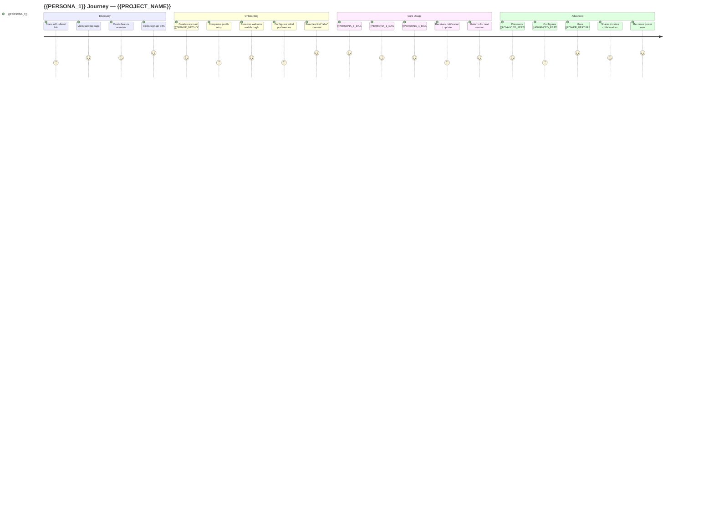
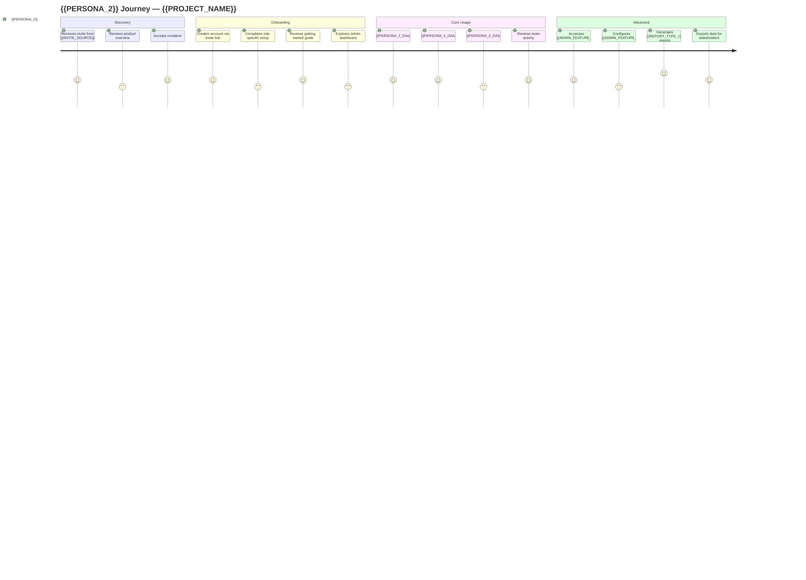

# User Journey Diagram — {{PROJECT_NAME}}

Paste the Mermaid block below into any Mermaid-compatible renderer. Replace all `{{PLACEHOLDER}}` values before rendering.

---

## Additional Persona Journey (copy and customize)

