# Workflow Diagram — {{WORKFLOW_NAME}} — {{PROJECT_NAME}}

Paste the Mermaid block below into any Mermaid-compatible renderer (GitHub, VS Code, Mermaid Live Editor). Replace all `{{PLACEHOLDER}}` values with project-specific data before rendering.

```mermaid
flowchart LR
    %% ===== TRIGGER =====
    TRIGGER(["{{TRIGGER_EVENT}}"])

    %% ===== SERVICE 1: {{SERVICE_A_NAME}} =====
    subgraph SVC_A["{{SERVICE_A_NAME}}"]
        direction TB
        A1["{{STEP_1_LABEL}}<br/>Actor: {{STEP_1_ACTOR}}<br/>Screen: {{STEP_1_SCREEN}}"]
        A2["{{STEP_2_LABEL}}<br/>API: {{STEP_2_API_CALL}}"]
        A3{"{{DECISION_1_LABEL}}"}
        A4["{{STEP_3_LABEL}}<br/>Data: {{STEP_3_DATA_CHANGE}}"]
        A5["{{STEP_4_LABEL}}<br/>API: {{STEP_4_API_CALL}}"]
    end

    %% ===== SERVICE 2: {{SERVICE_B_NAME}} =====
    subgraph SVC_B["{{SERVICE_B_NAME}}"]
        direction TB
        B1["{{STEP_5_LABEL}}<br/>Actor: {{STEP_5_ACTOR}}<br/>Screen: {{STEP_5_SCREEN}}"]
        B2{"{{DECISION_2_LABEL}}"}
        B3["{{STEP_6_LABEL}}<br/>API: {{STEP_6_API_CALL}}<br/>Data: {{STEP_6_DATA_CHANGE}}"]
        B4["{{STEP_7_LABEL}}<br/>API: {{STEP_7_API_CALL}}"]
    end

    %% ===== SERVICE 3: {{SERVICE_C_NAME}} =====
    subgraph SVC_C["{{SERVICE_C_NAME}}"]
        direction TB
        C1["{{STEP_8_LABEL}}<br/>Actor: {{STEP_8_ACTOR}}"]
        C2["{{STEP_9_LABEL}}<br/>API: {{STEP_9_API_CALL}}<br/>Data: {{STEP_9_DATA_CHANGE}}"]
        C3{"{{DECISION_3_LABEL}}"}
        C4["{{STEP_10_LABEL}}<br/>Data: {{STEP_10_DATA_CHANGE}}"]
    end

    %% ===== ERROR HANDLING =====
    subgraph ERRORS["Error Handling"]
        direction TB
        ERR1["{{ERROR_1_LABEL}}<br/>Retry: {{ERROR_1_RETRY}}"]
        ERR2["{{ERROR_2_LABEL}}<br/>Fallback: {{ERROR_2_FALLBACK}}"]
        ERR3["{{ERROR_3_LABEL}}<br/>Alert: {{ERROR_3_ALERT}}"]
    end

    %% ===== COMPLETION =====
    SUCCESS(["{{SUCCESS_OUTCOME}}"])
    ABANDON(["{{ABANDON_OUTCOME}}"])

    %% ===== HAPPY PATH (green) =====
    TRIGGER --> A1
    A1 --> A2
    A2 --> A3
    A3 -->|"{{DECISION_1_YES}}"| A4
    A4 --> A5
    A5 --> B1
    B1 --> B2
    B2 -->|"{{DECISION_2_YES}}"| B3
    B3 --> B4
    B4 --> C1
    C1 --> C2
    C2 --> C3
    C3 -->|"{{DECISION_3_YES}}"| C4
    C4 --> SUCCESS

    %% ===== ERROR BRANCHES (red) =====
    A3 -->|"{{DECISION_1_NO}}"| ERR1
    B2 -->|"{{DECISION_2_NO}}"| ERR2
    C3 -->|"{{DECISION_3_NO}}"| ERR3
    ERR1 -->|"retry"| A2
    ERR2 -->|"fallback"| B1
    ERR3 -->|"escalate"| ABANDON

    %% ===== ABANDONMENT PATHS (gray) =====
    A1 -->|"{{ABANDON_CONDITION_1}}"| ABANDON
    B1 -->|"{{ABANDON_CONDITION_2}}"| ABANDON

    %% ===== STYLING =====
    %% Happy path nodes
    style TRIGGER fill:#e8f5e9,stroke:#2e7d32,color:#1b5e20
    style SUCCESS fill:#e8f5e9,stroke:#2e7d32,color:#1b5e20
    style A4 fill:#e8f5e9,stroke:#2e7d32
    style B3 fill:#e8f5e9,stroke:#2e7d32
    style C4 fill:#e8f5e9,stroke:#2e7d32

    %% Error nodes (red)
    style ERR1 fill:#ffebee,stroke:#c62828,color:#b71c1c
    style ERR2 fill:#ffebee,stroke:#c62828,color:#b71c1c
    style ERR3 fill:#ffebee,stroke:#c62828,color:#b71c1c
    style ERRORS fill:#fff5f5,stroke:#e53e3e

    %% Abandonment (gray)
    style ABANDON fill:#f5f5f5,stroke:#9e9e9e,color:#616161

    %% Service subgraphs
    style SVC_A fill:#e3f2fd,stroke:#1565c0
    style SVC_B fill:#f3e5f5,stroke:#7b1fa2
    style SVC_C fill:#fff3e0,stroke:#e65100
```



---

## Workflow Summary Table

| Step | Actor | Screen | API Call | Data Change | Service |
|------|-------|--------|----------|-------------|---------|
| 1. {{STEP_1_LABEL}} | {{STEP_1_ACTOR}} | {{STEP_1_SCREEN}} | -- | -- | {{SERVICE_A_NAME}} |
| 2. {{STEP_2_LABEL}} | System | -- | {{STEP_2_API_CALL}} | -- | {{SERVICE_A_NAME}} |
| 3. {{DECISION_1_LABEL}} | System | -- | -- | -- | {{SERVICE_A_NAME}} |
| 4. {{STEP_3_LABEL}} | System | -- | -- | {{STEP_3_DATA_CHANGE}} | {{SERVICE_A_NAME}} |
| 5. {{STEP_4_LABEL}} | System | -- | {{STEP_4_API_CALL}} | -- | {{SERVICE_A_NAME}} |
| 6. {{STEP_5_LABEL}} | {{STEP_5_ACTOR}} | {{STEP_5_SCREEN}} | -- | -- | {{SERVICE_B_NAME}} |
| 7. {{DECISION_2_LABEL}} | System | -- | -- | -- | {{SERVICE_B_NAME}} |
| 8. {{STEP_6_LABEL}} | System | -- | {{STEP_6_API_CALL}} | {{STEP_6_DATA_CHANGE}} | {{SERVICE_B_NAME}} |
| 9. {{STEP_7_LABEL}} | System | -- | {{STEP_7_API_CALL}} | -- | {{SERVICE_B_NAME}} |
| 10. {{STEP_8_LABEL}} | {{STEP_8_ACTOR}} | -- | -- | -- | {{SERVICE_C_NAME}} |
| 11. {{STEP_9_LABEL}} | System | -- | {{STEP_9_API_CALL}} | {{STEP_9_DATA_CHANGE}} | {{SERVICE_C_NAME}} |
| 12. {{DECISION_3_LABEL}} | System | -- | -- | -- | {{SERVICE_C_NAME}} |
| 13. {{STEP_10_LABEL}} | System | -- | -- | {{STEP_10_DATA_CHANGE}} | {{SERVICE_C_NAME}} |

---

## Workflow Metadata

| Property | Value |
|----------|-------|
| Workflow ID | {{WORKFLOW_ID}} |
| Trigger | {{TRIGGER_EVENT}} |
| Primary actor | {{PRIMARY_ACTOR}} |
| Services involved | {{SERVICE_A_NAME}}, {{SERVICE_B_NAME}}, {{SERVICE_C_NAME}} |
| Happy path steps | {{HAPPY_PATH_STEP_COUNT}} |
| Decision points | {{DECISION_POINT_COUNT}} |
| Error branches | {{ERROR_BRANCH_COUNT}} |
| Estimated node count | 25-60 |
| Frequency | {{WORKFLOW_FREQUENCY}} |
| SLA | {{WORKFLOW_SLA}} |

---

## File Naming Convention

Generate one file per workflow using this naming pattern:

```
wf-{workflow-name}.md
```

**Examples:**
- `wf-user-registration.md`
- `wf-order-checkout.md`
- `wf-invoice-approval.md`
- `wf-support-ticket-escalation.md`
- `wf-subscription-renewal.md`

Replace `{workflow-name}` with the kebab-case workflow name.

---

## Instructions

1. Copy this template once per major cross-service workflow in your project.
2. Replace all `{{PLACEHOLDER}}` values with workflow-specific data from service specs and task files.
3. Adjust the number of services (subgraphs) -- most workflows span 2-4 services.
4. Adjust the number of steps, decisions, and error branches to match the actual workflow complexity.
5. Target 25-60 nodes per workflow diagram. If a workflow exceeds 60 nodes, consider splitting it into sub-workflow diagrams.
6. The error handling subgraph should capture the most common failure modes. Add more error nodes as needed.
7. Styling: green = happy path data-change nodes, red = error handling nodes, gray = abandonment terminal.
8. Add or remove abandonment paths based on where users can exit the workflow.
9. Update the Workflow Summary Table to match the flowchart content exactly.

---

## Cross-References

- **Service feature maps:** `svc-feature-map.template.md`
- **State machines (entity lifecycle):** `sm-state-machine.template.md`
- **System architecture:** `system-architecture-flowchart.template.md`
- **User journeys:** `user-journey-flowchart.template.md`
- **MASTER mind map:** `MASTER-mind-map-generator.md`
- **Dependency graph:** `dependency-graph.template.md`
