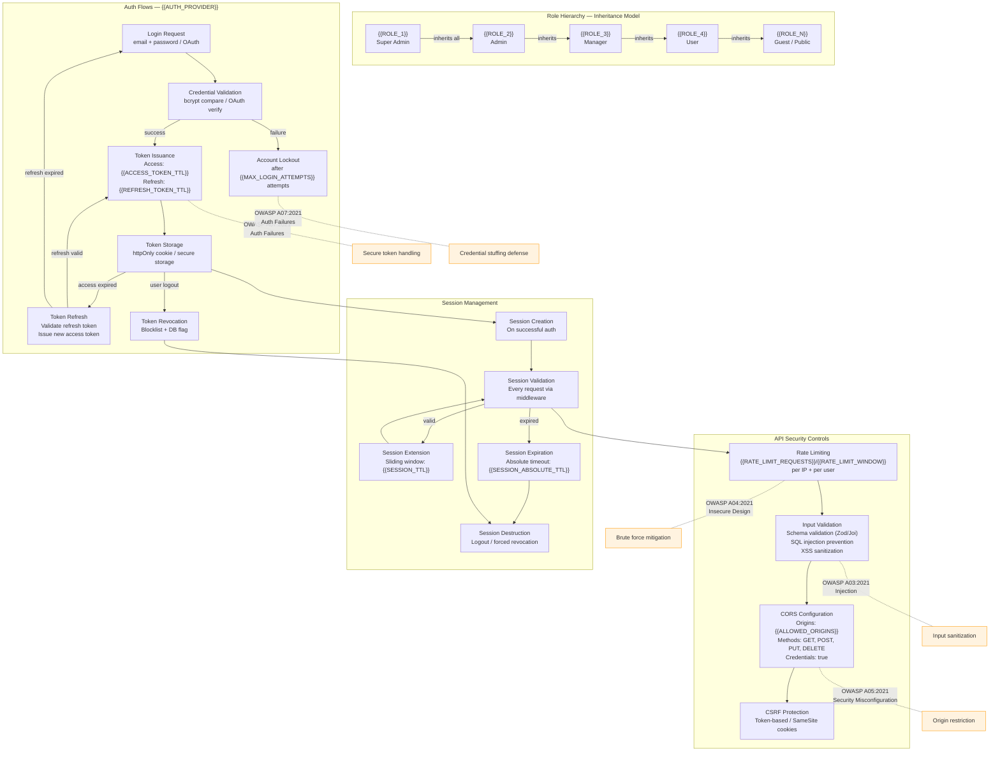

# Auth & Security Architecture — {{PROJECT_NAME}}

Paste the Mermaid block below into any Mermaid-compatible renderer (GitHub, VS Code, Mermaid Live Editor). Replace all {{PLACEHOLDER}} values with project-specific data before rendering.

---

## Role Permission Summary

| Role | {{PERMISSION_1}} | {{PERMISSION_2}} | {{PERMISSION_3}} | {{PERMISSION_4}} | Admin Panel | User Mgmt |
|---|---|---|---|---|---|---|
| {{ROLE_1}} (Super Admin) | Full | Full | Full | Full | Full | Full |
| {{ROLE_2}} (Admin) | Full | Full | Full | Full | Read/Write | Create/Edit |
| {{ROLE_3}} (Manager) | Full | Full | Read/Write | Read | Read | None |
| {{ROLE_4}} (User) | Own | Own | Read | None | None | None |
| {{ROLE_N}} (Guest) | None | None | Read (public) | None | None | None |

**Permission levels:** Full = CRUD + admin operations, Read/Write = create + read + update, Read = read only, Own = CRUD own resources only, None = no access

## Auth Flow Summary

| Flow | Trigger | Steps | Token Output | Error Handling |
|---|---|---|---|---|
| Email/Password Login | User submits credentials | Validate email → compare hash → issue tokens | Access + Refresh | Lockout after {{MAX_LOGIN_ATTEMPTS}} attempts |
| OAuth Login | User clicks "Sign in with {{AUTH_PROVIDER}}" | Redirect → consent → callback → issue tokens | Access + Refresh | Fallback to email login |
| Token Refresh | Access token expired | Validate refresh token → issue new access token | New Access token | Force re-login if refresh expired |
| Logout | User clicks logout | Revoke tokens → destroy session → clear cookies | None | Best-effort revocation |
| Password Reset | User requests reset | Send email → validate link → update password → revoke all sessions | None (re-login required) | Rate-limited to prevent abuse |

## OWASP Top 10 Control Checklist

| OWASP ID | Category | Control | Implementation | Status |
|---|---|---|---|---|
| A01:2021 | Broken Access Control | Role-based access enforcement | Middleware checks on every route | {{STATUS_A01}} |
| A02:2021 | Cryptographic Failures | TLS everywhere + encryption at rest | {{ENCRYPTION_ALGORITHM}} + forced HTTPS | {{STATUS_A02}} |
| A03:2021 | Injection | Parameterized queries + input validation | ORM + Zod/Joi schemas | {{STATUS_A03}} |
| A04:2021 | Insecure Design | Rate limiting + account lockout | {{RATE_LIMIT_REQUESTS}}/{{RATE_LIMIT_WINDOW}} | {{STATUS_A04}} |
| A05:2021 | Security Misconfiguration | CORS + CSP + security headers | Helmet.js / equivalent middleware | {{STATUS_A05}} |
| A06:2021 | Vulnerable Components | Dependency scanning | npm audit / Snyk in CI pipeline | {{STATUS_A06}} |
| A07:2021 | Auth Failures | Secure token handling + MFA option | httpOnly cookies + bcrypt + optional TOTP | {{STATUS_A07}} |
| A08:2021 | Software & Data Integrity | Signed deployments + SRI | CI/CD integrity checks | {{STATUS_A08}} |
| A09:2021 | Logging & Monitoring | Structured security event logging | {{MONITORING_PROVIDER}} integration | {{STATUS_A09}} |
| A10:2021 | SSRF | URL validation + allowlisting | Outbound request filtering | {{STATUS_A10}} |

---

## Cross-References

- **Multi-Tenant Isolation:** `xc-multi-tenant.template.md`
- **Security Zones:** `infra-security-zones.template.md`
- **Secrets Management:** `infra-secrets-management.template.md`
- **API Topology:** `infra-api-topology.template.md`
- **System Architecture:** `system-architecture-flowchart.template.md`
