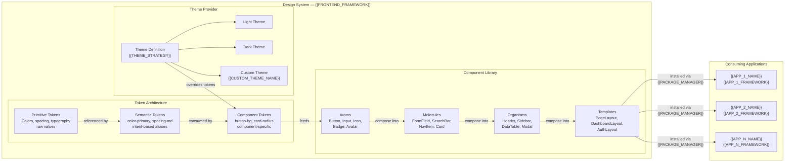
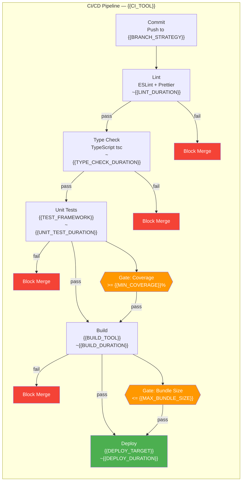

# Design System & CI/CD Pipeline Overview — {{PROJECT_NAME}}

Paste the Mermaid block below into any Mermaid-compatible renderer (GitHub, VS Code, Mermaid Live Editor). Replace all {{PLACEHOLDER}} values with project-specific data before rendering.

---

## Design Token Categories

| Category | Primitive Example | Semantic Alias | Component Usage | Format |
|---|---|---|---|---|
| Color | `blue-500: #2196F3` | `color-primary: blue-500` | `button-bg: color-primary` | CSS custom properties |
| Spacing | `space-4: 16px` | `spacing-md: space-4` | `card-padding: spacing-md` | rem / px |
| Typography | `font-size-16: 1rem` | `text-body: font-size-16` | `input-font: text-body` | rem |
| Border Radius | `radius-4: 4px` | `radius-md: radius-4` | `card-radius: radius-md` | px |
| Shadow | `shadow-2: 0 2px 4px...` | `shadow-card: shadow-2` | `card-shadow: shadow-card` | CSS box-shadow |
| Breakpoint | `bp-768: 768px` | `screen-md: bp-768` | Media query threshold | px |
| Z-Index | `z-100: 100` | `z-modal: z-100` | `modal-z: z-modal` | unitless |
| Animation | `dur-200: 200ms` | `transition-fast: dur-200` | `button-transition: transition-fast` | ms |

## Pipeline Stage Summary

| Stage | Tool | Estimated Duration | Failure Action | Required to Merge |
|---|---|---|---|---|
| Lint | ESLint + Prettier | ~{{LINT_DURATION}} | Block merge, show inline errors | Yes |
| Type Check | TypeScript (tsc --noEmit) | ~{{TYPE_CHECK_DURATION}} | Block merge, show type errors | Yes |
| Unit Tests | {{TEST_FRAMEWORK}} | ~{{UNIT_TEST_DURATION}} | Block merge, report failures | Yes |
| Coverage Gate | {{TEST_FRAMEWORK}} --coverage | Included in unit tests | Block if < {{MIN_COVERAGE}}% | Yes |
| Build | {{BUILD_TOOL}} | ~{{BUILD_DURATION}} | Block merge, report build errors | Yes |
| Bundle Size Gate | {{BUNDLE_ANALYZER}} | Included in build | Warn if > {{MAX_BUNDLE_SIZE}} | Advisory |
| Deploy | {{DEPLOY_TARGET}} via {{CI_TOOL}} | ~{{DEPLOY_DURATION}} | Alert team, auto-rollback | Yes (for main) |

---

## Cross-References

- **System Architecture:** `system-architecture-flowchart.template.md`
- **CI/CD Pipeline (detailed):** `infra-cicd-pipeline.template.md`
- **Deployment Topology:** `infra-deployment-topology.template.md`
- **Dependency Graph:** `dependency-graph.template.md`
- **Phased Roadmap:** `overview-phased-roadmap.template.md`
