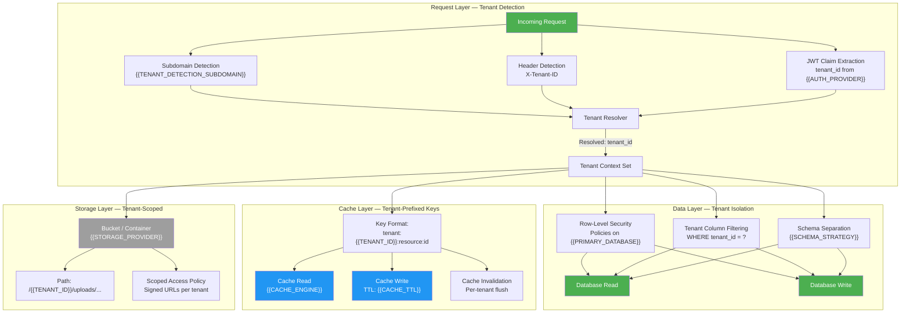
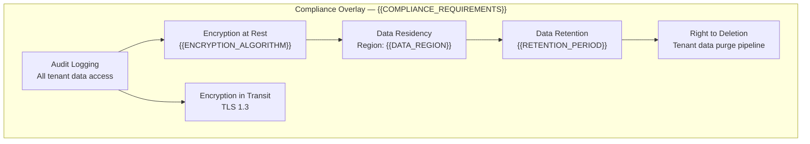

# Multi-Tenant Isolation Architecture — {{PROJECT_NAME}}

<!-- CONDITIONAL: Generate only if {{IS_MULTI_TENANT}} == "true" -->

Paste the Mermaid block below into any Mermaid-compatible renderer (GitHub, VS Code, Mermaid Live Editor). Replace all {{PLACEHOLDER}} values with project-specific data before rendering.

<!-- IF {{COMPLIANCE_REQUIREMENTS}} != "none" -->

<!-- END IF -->

---

## Data Classification

| Data Type | Scope | Isolation Method | Encryption | Example |
|---|---|---|---|---|
| {{DATA_TYPE_1}} | Tenant-scoped | Row-Level Security | AES-256 at rest, TLS in transit | User profiles, orders |
| {{DATA_TYPE_2}} | Tenant-scoped | Tenant column filter | AES-256 at rest, TLS in transit | Documents, uploads |
| {{DATA_TYPE_3}} | Reference (shared read) | Read-only global table | TLS in transit | Country codes, categories |
| {{DATA_TYPE_4}} | Global | No isolation needed | TLS in transit | System configuration |
| {{DATA_TYPE_5}} | Tenant-scoped | Schema separation | AES-256 at rest, TLS in transit | Financial records |

**Legend:**
- Tenant-scoped (green): Fully isolated per tenant; no cross-tenant access permitted
- Reference data (blue): Shared read-only data; tenants cannot modify
- Global data (gray): System-level data; not tenant-specific

## Tenant Operations

| Operation | Description | Isolation Impact | Rollback Strategy |
|---|---|---|---|
| Tenant Provisioning | Create tenant record, schema, cache namespace, storage path | Full isolation from creation | Delete all tenant artifacts |
| Tenant Suspension | Disable access while retaining data | Block at Request Layer | Re-enable tenant context |
| Tenant Deletion | Purge all tenant data across all layers | Remove RLS rows, cache keys, storage path | {{BACKUP_FREQUENCY}} backup restore |
| Tenant Migration | Move tenant data to different region/shard | Re-route at Data Layer | Revert DNS + data pointer |
| Tenant Data Export | Export all tenant data (GDPR/compliance) | Read-only cross-layer scan | N/A |

---

## Cross-References

- **System Architecture:** `system-architecture-flowchart.template.md`
- **Security Zones:** `infra-security-zones.template.md`
- **Auth & Security:** `xc-auth-security.template.md`
- **Data Flow:** `data-flow.template.md`
- **Secrets Management:** `infra-secrets-management.template.md`
