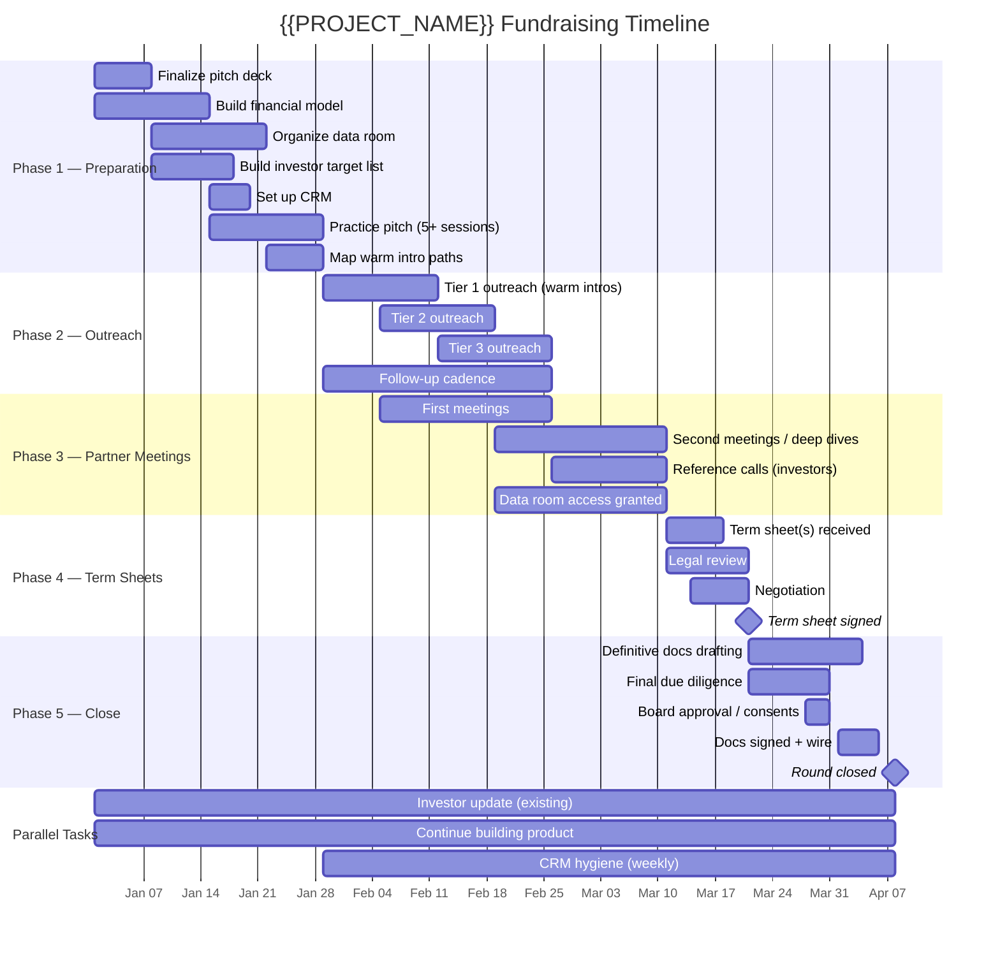

# Fundraising Timeline

> A 16-week phased fundraising timeline for {{PROJECT_NAME}} with phase gates, weekly checklists, parallel tasks, and a Mermaid Gantt chart. Designed for a {{FUNDRAISING_STAGE}} raise of {{TARGET_RAISE_AMOUNT}} targeting {{INVESTOR_TYPE}} investors.

---

## Timeline Overview



**Note:** Replace the dates in the Gantt chart with your actual timeline. The relative durations are calibrated for a {{FUNDRAISING_STAGE}} raise.

---

## Phase 1 — Preparation (Weeks 1-4)

### Phase 1 Gate

**Do not proceed to Phase 2 until all items are complete:**

- [ ] Pitch deck finalized and reviewed by 3+ external people
- [ ] Financial model complete with defensible assumptions
- [ ] Data room organized with all critical documents uploaded
- [ ] Investor target list built with 50+ names (seed) or 30+ names (Series A)
- [ ] CRM set up with all target investors entered
- [ ] Warm introduction paths mapped for top 20 targets
- [ ] Pitch practiced 5+ times with feedback incorporated
- [ ] 30 common questions have prepared answers
- [ ] Co-founders aligned on terms, valuation expectations, and negotiation priorities
- [ ] Legal counsel engaged and briefed

### Week 1 Checklist

- [ ] Kick off pitch deck — complete first draft
- [ ] Begin financial model build or update
- [ ] List 20 potential investor targets (initial research)
- [ ] Select and set up CRM tool ({{FUNDRAISING_CRM}})
- [ ] Identify 5 people to review your pitch deck
- [ ] Engage legal counsel — initial conversation about round structure

### Week 2 Checklist

- [ ] Finalize pitch deck — incorporate first round of feedback
- [ ] Complete financial model — document all assumptions
- [ ] Expand investor target list to 40+ names
- [ ] Begin data room organization — set up folder structure in {{DATA_ROOM_TOOL}}
- [ ] Start uploading corporate and financial documents to data room
- [ ] Research warm introduction paths for top 20 investors

### Week 3 Checklist

- [ ] Polish pitch deck — second round of feedback
- [ ] Finalize data room — all documents uploaded and organized
- [ ] Complete investor target list (50+ for seed, 30+ for Series A)
- [ ] Enter all investors into CRM with tags and warm intro paths
- [ ] Practice pitch session #1 and #2 (with advisors or friendly founders)
- [ ] Prepare one-pager / executive summary (PDF, 1 page)

### Week 4 Checklist

- [ ] Final pitch deck review — lock version for outreach
- [ ] Practice pitch sessions #3, #4, and #5 — refine based on feedback
- [ ] Prepare answers for 30 common investor questions
- [ ] Request warm introductions for Tier 1 investors (top 10-15)
- [ ] Align with co-founders: valuation range, terms priorities, walk-away points
- [ ] Run pre-data room audit (see `due-diligence-prep.template.md`)
- [ ] **PHASE 1 GATE CHECK — all items above complete?**

---

## Phase 2 — Outreach (Weeks 5-8)

### Phase 2 Gate

**Monitor these metrics weekly during outreach:**

| Metric | Target | Week 5 | Week 6 | Week 7 | Week 8 |
|---|---|---|---|---|---|
| Outreach emails sent | 50-80 total | | | | |
| Response rate | >15% (warm), >5% (cold) | | | | |
| First meetings scheduled | 15-25 | | | | |
| First meetings completed | 10-20 | | | | |

### Week 5 Checklist

- [ ] Send Tier 1 warm introductions (top 10-15 investors)
- [ ] Send first cold outreach to Tier 2 investors (next 15-20)
- [ ] Begin scheduling first meetings as responses come in
- [ ] Log all outreach in CRM with dates and status
- [ ] Send monthly investor update to existing investors (if applicable)
- [ ] Continue building product — do not stop execution

### Week 6 Checklist

- [ ] Follow up on Week 5 outreach (no-response investors)
- [ ] Send Tier 2 warm introductions
- [ ] Begin Tier 3 outreach (remaining investors)
- [ ] Conduct first meetings (target: 5-8 this week)
- [ ] Send same-day follow-ups after every first meeting
- [ ] Update CRM: move investors through pipeline stages
- [ ] Debrief with co-founders: which investors showed strongest interest?

### Week 7 Checklist

- [ ] Continue first meetings (target: 5-8 this week)
- [ ] Follow up on all outstanding outreach
- [ ] Schedule second meetings / partner meetings for interested investors
- [ ] Grant data room access to investors in deep dive stage
- [ ] Refine pitch based on recurring questions or objections
- [ ] Update CRM and run weekly pipeline report

### Week 8 Checklist

- [ ] Complete remaining first meetings
- [ ] Advance strong-interest investors to deep dive stage
- [ ] Send "final follow-up" to any outstanding no-responses
- [ ] Assess pipeline: do you have enough investor interest to generate term sheets?
- [ ] If pipeline is thin, add 10-20 more investors and restart outreach for them
- [ ] Update CRM and run funnel conversion report
- [ ] **PHASE 2 ASSESSMENT — enough investor interest to proceed?**

---

## Phase 3 — Partner Meetings & Deep Dives (Weeks 9-11)

### Phase 3 Gate

**Proceed to Phase 4 when:**

- [ ] At least 3-5 investors are in deep dive stage
- [ ] At least 1 investor has signaled strong interest in leading
- [ ] Data room has been accessed by 3+ investors
- [ ] Reference calls are underway

### Week 9 Checklist

- [ ] Conduct partner meetings (target: 3-5 this week)
- [ ] Prepare custom materials for deep dive requests (detailed financials, cohort data, etc.)
- [ ] Provide customer references to investors who request them
- [ ] Brief reference customers on what to expect
- [ ] Continue nurturing pipeline — do not stop outreach entirely
- [ ] Track data room activity — who is reviewing what?

### Week 10 Checklist

- [ ] Continue partner meetings and deep dives
- [ ] Follow up on data room access — answer questions promptly
- [ ] Conduct your own reference calls on investors (speak with their portfolio founders)
- [ ] Begin aligning expectations on timing — "We expect to have term sheets by [date]"
- [ ] Prepare for term sheet evaluation — review `term-sheet-analysis.template.md`
- [ ] Update CRM — assess which investors are likely to issue term sheets

### Week 11 Checklist

- [ ] Final deep dive meetings
- [ ] Create urgency (truthfully): communicate timeline for decisions
- [ ] Ensure all investor questions have been answered
- [ ] Prepare co-founders for term sheet evaluation and negotiation
- [ ] Alert legal counsel that term sheets may be incoming
- [ ] **PHASE 3 ASSESSMENT — are term sheets likely within 1-2 weeks?**

---

## Phase 4 — Term Sheets (Weeks 12-13)

### Week 12 Checklist

- [ ] Receive term sheet(s) — acknowledge within 24 hours
- [ ] Send term sheet(s) to legal counsel for review
- [ ] Founders review independently, then align on priorities
- [ ] Complete reference calls on lead investor (3+ portfolio founders)
- [ ] Prepare counter-proposal if needed (see `term-sheet-analysis.template.md` negotiation playbook)
- [ ] If multiple term sheets: complete comparison matrix
- [ ] If no term sheets: assess pipeline, adjust strategy, extend timeline

### Week 13 Checklist

- [ ] Negotiate terms — typically 1-3 rounds of revision
- [ ] Align on final terms with lead investor
- [ ] Notify other investors of your decision (for those who also issued term sheets)
- [ ] Sign term sheet — begins exclusivity period
- [ ] Notify all participating investors of round parameters
- [ ] Begin definitive document drafting process
- [ ] **TERM SHEET SIGNED — proceed to Phase 5**

---

## Phase 5 — Close (Weeks 14-16)

### Week 14 Checklist

- [ ] Kick off definitive document drafting with lead investor's counsel
- [ ] Complete any remaining due diligence items
- [ ] Resolve any outstanding legal issues (IP assignments, corporate cleanup)
- [ ] Coordinate with follow-on investors on participation amounts
- [ ] Begin cap table modeling with final round terms
- [ ] Set up wire transfer logistics with your bank

### Week 15 Checklist

- [ ] Review and comment on definitive documents (SPA, IRA, etc.)
- [ ] Negotiate any remaining document-level issues
- [ ] Obtain board approval / written consent for the financing
- [ ] Circulate final cap table to all investors for confirmation
- [ ] Prepare wire instructions
- [ ] Coordinate signing schedule — all parties and documents

### Week 16 Checklist

- [ ] Execute all definitive documents (electronic signatures)
- [ ] Confirm wire transfers — funds received
- [ ] Update cap table in {{CAP_TABLE_TOOL}}
- [ ] File amended Certificate of Incorporation (if priced round)
- [ ] Send closing announcement to all investors (see `fundraising-process.template.md`)
- [ ] Schedule first board meeting post-close
- [ ] Set up investor update cadence (see `investor-update-cadence.template.md`)
- [ ] Celebrate with the team (briefly)
- [ ] **ROUND CLOSED**

---

## Parallel Tasks (Throughout)

These activities run concurrently with the fundraising process and must not be neglected:

| Task | Cadence | Owner | Notes |
|---|---|---|---|
| Product development | Daily | CTO / Engineering | Do not stop building — investors watch velocity |
| Customer acquisition | Daily | Sales / Marketing | Growing metrics during the raise strengthens your position |
| Monthly investor update (existing) | Monthly | CEO | Keep existing investors informed |
| CRM hygiene | Weekly | CEO / point person | Every interaction logged within 24 hours |
| Financial tracking | Weekly | CEO / Finance | Keep actuals current — investors may ask for latest numbers |
| Team management | Daily | CEO / Founders | Keep team focused; shield them from fundraising stress |
| Legal housekeeping | As needed | CEO + Counsel | Fix any corporate issues that surface during DD prep |

---

## Timeline Adjustment Scenarios

| Scenario | Adjustment | New Timeline |
|---|---|---|
| **Strong demand** — multiple term sheets by Week 10 | Compress Phase 3-4, move to close faster | 12-14 weeks total |
| **Moderate interest** — deep dives happening but no term sheets by Week 11 | Extend Phase 3 by 2-3 weeks, add more investors | 18-20 weeks total |
| **Weak pipeline** — few first meetings, low response rate | Pause at Week 6, reassess pitch/targeting, restart outreach | Reset to Week 5 with new approach |
| **Single term sheet** — one offer but no competition | Evaluate carefully; consider extending outreach for 2-3 weeks to create alternatives | 18-20 weeks total |
| **Market downturn** — investor sentiment shifts during raise | Adjust valuation expectations; consider bridge from existing investors; extend timeline | 20-24 weeks total |
| **Founder availability** — key founder has limited bandwidth | Assign more fundraising tasks to co-founder; reduce meeting load per week | 20-22 weeks total |

---

## Weekly Status Report Template

Send this to co-founders and advisors every Friday during the raise:

```
## Fundraising Weekly Status — Week [#]

**Phase:** [1-5]
**Overall Status:** On Track / Caution / At Risk

### Pipeline Summary
- Outreach sent this week: [#]
- Responses received: [#]
- First meetings this week: [#]
- Deep dives active: [#]
- Term sheets received: [#]
- Committed capital: $[amount]

### Key Developments
1. [Most important thing that happened]
2. [Second]
3. [Third]

### Blockers / Risks
1. [What could slow us down]

### Next Week Priorities
1. [Top priority]
2. [Second]
3. [Third]

### Morale Check
[One sentence — how are the founders feeling about the raise?]
```
