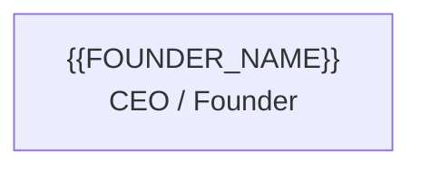
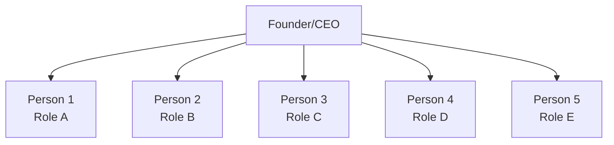
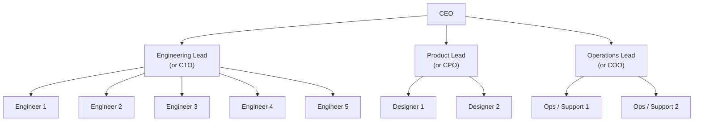
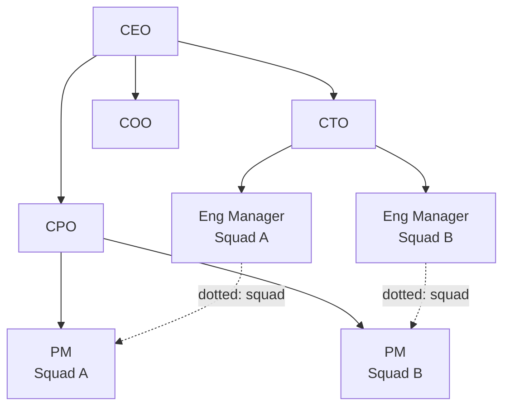
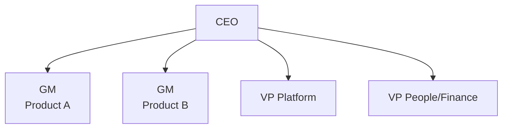
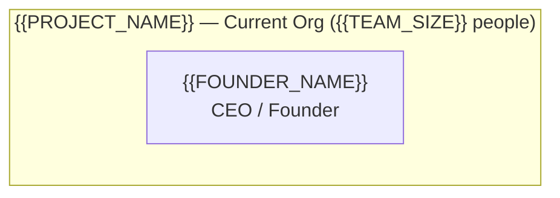
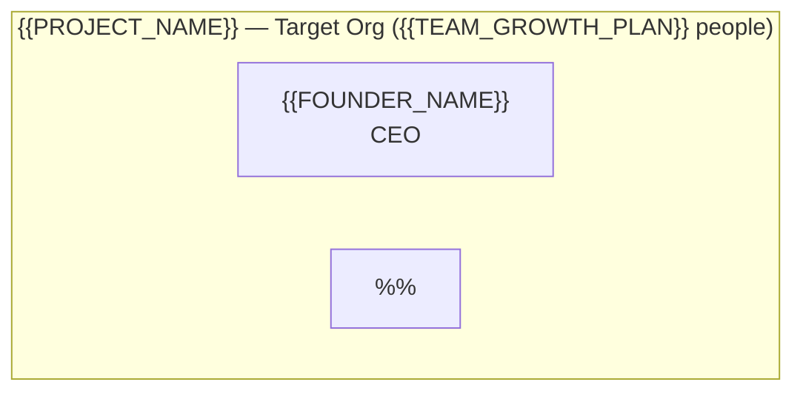

# Org Chart Planning

> Your org chart is not a vanity diagram — it is a decision-making architecture. Who reports to whom determines information flow, decision speed, and accountability. Get it wrong and you create bottlenecks, politics, and confusion. Get it right and the org chart becomes invisible — people know who to talk to, who decides what, and where they fit.

---

## 1. Current Team Structure

Document your current team before planning changes. Clarity about where you are prevents planning for where you think you are.

### Team Roster

| Name | Role | Reports To | Start Date | Location | Timezone | Key Responsibilities |
|------|------|-----------|------------|----------|----------|---------------------|
| {{FOUNDER_NAME}} | CEO / Founder | — | {{PROJECT_START_DATE}} | {{FOUNDER_LOCATION}} | {{FOUNDER_TIMEZONE}} | Product vision, fundraising, strategy |
| | | | | | | |
| | | | | | | |
| | | | | | | |

### Current Org Visualization

### Current Pain Points

Identify organizational pain points before restructuring:

- [ ] **Bottleneck:** All decisions flow through one person (usually the founder)
- [ ] **Unclear ownership:** Multiple people think they own the same area
- [ ] **Gaps:** No one owns critical functions (security, QA, customer success)
- [ ] **Overload:** Someone has 8+ direct reports and cannot give adequate attention
- [ ] **Isolation:** Someone works alone with no peers, mentorship, or feedback
- [ ] **Bus factor:** Only one person understands a critical system or relationship

---

## 2. Stage-Appropriate Org Models

Your org structure should match your team size. Premature organizational complexity creates overhead; delayed structure creates chaos. Use the model that fits your current stage, not the one you aspire to.

### Stage 1: Flat (2-8 people)

**When:** Pre-seed through early seed. Everyone reports to the founder. Communication happens in a single room (physical or virtual).

**Structure:**

**Characteristics:**
- No managers except the founder
- Everyone talks to everyone directly
- Roles are broad and overlapping ("full-stack engineer" means front-end, back-end, infrastructure, and on-call)
- Decision-making is fast — the founder decides or delegates ad hoc
- No formal processes (standups, planning, reviews) unless they solve an observed problem
- Titles are descriptive, not hierarchical

**What works:**
- Speed of communication (no intermediaries)
- Shared context (everyone knows everything)
- Flexibility (people shift between tasks as needed)
- Low overhead (no management layer consuming bandwidth)

**What breaks:**
- Founder becomes the bottleneck at 6-8 direct reports
- Tribal knowledge replaces documentation
- No career path for employees (everyone is "just an engineer")
- Conflict resolution defaults to founder intervention
- New hires cannot absorb context fast enough through osmosis

**Transition trigger:** When the founder spends more than 50% of their time on management rather than product/strategy, introduce the first management layer.

### Stage 2: Functional (8-25 people)

**When:** Seed through Series A. First management layer appears. Teams are organized by function (engineering, design, product, operations).

**Structure:**

**Characteristics:**
- 2-4 functional leads report to CEO
- Engineers report to engineering lead, designers to design/product lead, etc.
- Functional leads are player-coaches (50-70% IC work, 30-50% management)
- Cross-functional collaboration happens through product leads or direct communication
- Weekly leadership sync aligns priorities across functions
- Career paths begin to emerge within functions

**What works:**
- Clear expertise grouping (engineers review engineers, designers review designers)
- Scalable to 25 people without dramatic restructuring
- Natural mentorship within functions
- CEO's direct reports drop from 8+ to 3-4

**What breaks:**
- Cross-functional coordination becomes the bottleneck ("engineering is done but design has not started")
- Functional silos — engineering optimizes for technical excellence, product optimizes for features, nobody optimizes for the customer
- Player-coach leads burn out trying to do both IC and management
- Decision-making slows because functional leads need to align before committing

**Transition trigger:** When cross-functional coordination consumes more than 30% of leadership time, consider cross-functional squads (matrix organization).

### Stage 3: Matrix (25-100 people)

**When:** Series A through Series B. Cross-functional squads form around product areas or customer segments. People have both a functional manager (for growth, skills, standards) and a squad/project lead (for day-to-day work).

**Structure:**

**Characteristics:**
- Engineers are organized into squads of 4-8, each owning a product area
- Each squad has engineering, design, and product representation
- Functional managers handle career growth, skill development, hiring, and standards
- Squad leads handle day-to-day priorities, sprint planning, and deliverables
- Platform/infrastructure teams emerge to support product squads
- Formal processes become necessary (planning cadence, review cycles, promotion committees)

**What works:**
- Cross-functional collaboration is built into the structure
- Squads can move independently without waiting on other teams
- Career growth paths are clear within functions
- Specialization is possible without silos

**What breaks:**
- Dual reporting creates ambiguity ("who is my real boss?")
- Resource allocation conflicts between squads
- Management overhead increases significantly
- Communication channels multiply (N squads x M functions)
- Consensus-driven decision-making slows velocity

### Stage 4: Divisional (100+ people)

**When:** Series B+ or mature companies. Divisions are self-contained units organized around products, markets, or customer segments. Each division has its own engineering, product, design, and operations teams.

**Structure:**

**Characteristics:**
- Each division operates semi-autonomously with its own P&L
- Shared services (platform, infrastructure, HR, finance) serve all divisions
- Division GMs have hiring authority and budget control
- Cross-division collaboration requires deliberate mechanisms
- Company culture must be actively maintained against division identity

**Note:** Most users of this kit will not reach this stage. If you are planning for 100+ people, you likely need a dedicated organizational design consultant in addition to these templates.

---

## 3. Span of Control Guidelines

Span of control is the number of direct reports a manager has. Too few creates unnecessary hierarchy. Too many creates neglected reports.

| Manager Level | Recommended Span | Maximum Span | Notes |
|---------------|-----------------|--------------|-------|
| First-line manager (EM) | 5-7 | 9 | Player-coaches should be at 4-5 |
| Director | 4-6 | 8 | Managing managers requires more 1:1 time |
| VP / C-level | 3-5 | 7 | Strategic roles need bandwidth for cross-functional work |
| CEO (early stage) | 4-6 | 8 | Beyond 8, CEO becomes a full-time manager |
| CEO (growth stage) | 5-8 | 10 | With an EA and strong leadership team |

**Warning signs of span problems:**
- Manager cancels 1:1s regularly → span too wide
- Manager has no time for strategic work → span too wide
- Reports go weeks without meaningful feedback → span too wide
- Manager has 2 reports and schedules 4 recurring meetings → span too narrow
- Multiple management layers exist between IC and CEO in a 15-person company → too much hierarchy

---

## 4. Role Redundancy & Bus Factor Analysis

Bus factor measures how many people would need to be unavailable before a critical function stops. A bus factor of 1 means a single departure (vacation, illness, resignation) halts that function.

### Bus Factor Assessment

| Critical Function | Primary Owner | Backup / Secondary | Bus Factor | Risk Level | Mitigation Plan |
|-------------------|---------------|-------------------|------------|------------|-----------------|
| Production deployments | | | | | |
| Database administration | | | | | |
| Customer billing | | | | | |
| Security incident response | | | | | |
| Customer escalation (enterprise) | | | | | |
| Hiring / interview process | | | | | |
| Financial reporting | | | | | |
| Key vendor relationships | | | | | |
| Product roadmap decisions | | | | | |
| On-call / incident response | | | | | |

**Risk levels:**
- **CRITICAL (bus factor = 1, high impact):** Single person owns a function that, if disrupted, stops revenue or creates legal/security risk. Immediate action required — document processes, cross-train, or hire backup.
- **HIGH (bus factor = 1, medium impact):** Single person owns a function that would cause significant slowdown. Plan cross-training within 30 days.
- **MEDIUM (bus factor = 2, high impact):** Two people can handle it, but both being unavailable simultaneously is plausible. Document processes as insurance.
- **LOW (bus factor = 3+, or low impact):** Adequate redundancy or the function can be paused without material harm.

### Mitigation Strategies

For every CRITICAL and HIGH risk:

1. **Document:** Write runbooks for the critical processes (see Section 03)
2. **Cross-train:** Pair the primary owner with a backup for 2-4 weeks of shadowing
3. **Rotate:** Periodically rotate on-call and operational duties
4. **Hire:** If cross-training is insufficient, the bus factor analysis justifies a hire
5. **Automate:** Reduce human dependency on repetitive critical tasks

---

## 5. Planned Hires by Quarter

Map your hiring plan against business milestones and budget. Every hire should connect to a specific business outcome, not just a headcount target.

### Hiring Roadmap

| Quarter | Role | Level | Structure | Rationale | Budget Impact (Monthly) | Dependencies |
|---------|------|-------|-----------|-----------|------------------------|--------------|
| Q{{CURRENT_QUARTER}} | {{FIRST_HIRE_ROLE}} | | FTE / Contractor | | | |
| Q{{CURRENT_QUARTER + 1}} | | | | | | |
| Q{{CURRENT_QUARTER + 2}} | | | | | | |
| Q{{CURRENT_QUARTER + 3}} | | | | | | |

### Hiring Capacity Constraints

Before adding roles to the roadmap, verify these constraints:

- [ ] **Budget:** Each hire's fully loaded cost (salary + benefits + equity + equipment) fits within {{HIRING_BUDGET_MONTHLY}} monthly budget
- [ ] **Management capacity:** The manager for this role has span of control room (current reports < recommended span)
- [ ] **Interview bandwidth:** You have enough interviewers to run {{INTERVIEW_ROUNDS}} rounds without burning out the team
- [ ] **Onboarding capacity:** You can dedicate an onboarding buddy for {{ONBOARDING_DURATION_DAYS}} days without impacting delivery commitments
- [ ] **Runway:** Adding this hire does not reduce runway below 12 months (verify with Section 25 financial model)

---

## 6. Org Chart Visualization

Use this Mermaid template to create your planned org chart. Update quarterly as your team evolves.

### Current State (Today)

### Target State ({{TEAM_GROWTH_PLAN}} people, 12 months)

### Transition Plan

| Current State | Target State | Change Required | Timeline | Risk |
|---------------|-------------|-----------------|----------|------|
| Founder manages all engineers directly | Engineering Lead manages engineers | Promote or hire Engineering Lead | Q__ | High — wrong lead choice sets engineering culture |
| No dedicated product person | Product Manager reports to CEO | Hire PM | Q__ | Medium — premature if team < 5 engineers |
| Operations handled by founder | Operations Lead owns admin, HR, vendor | Hire Ops Lead | Q__ | Low — well-scoped role |

---

## Checklist

- [ ] Documented current team roster with roles, locations, and timezones
- [ ] Identified current organizational pain points
- [ ] Selected the stage-appropriate org model (flat / functional / matrix / divisional)
- [ ] Reviewed span of control for all managers
- [ ] Completed bus factor analysis for all critical functions
- [ ] Created mitigation plans for CRITICAL and HIGH bus factor risks
- [ ] Mapped planned hires by quarter with budget impact
- [ ] Verified hiring plan against runway and management capacity constraints
- [ ] Created current-state and target-state org chart visualizations
- [ ] Defined transition plan from current to target org structure
