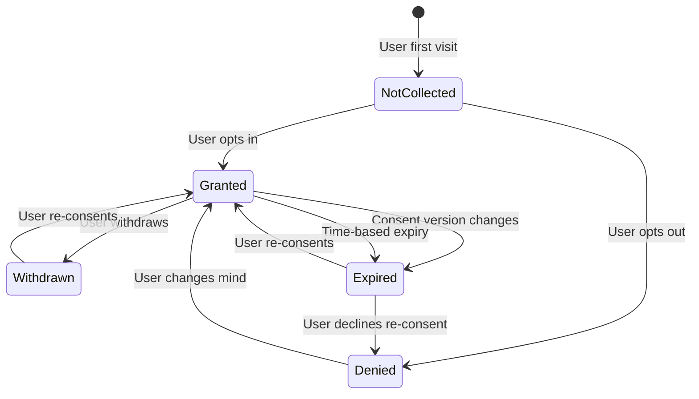

# Consent Management Architecture

> {{PROJECT_NAME}} — Consent collection, storage, signal propagation, withdrawal mechanisms, versioning, and granular consent strategy.

---

## 1. Consent Collection Points

Every point where {{PROJECT_NAME}} collects personal data must have a corresponding consent mechanism (unless processing is under a different legal basis like contract necessity or legitimate interest). Map every collection point to its consent requirement.

### Consent Collection Point Inventory

| Collection Point | Data Categories | Legal Basis | Consent Category | Collection Method | Granularity |
|-----------------|-----------------|-------------|-----------------|-------------------|-------------|
| Registration form | Email, name, password | Contract | N/A (contract) | Terms acceptance | Bundled (core service) |
| Profile settings | Phone, avatar, bio | Contract | N/A (contract) | Implicit (user-initiated) | Bundled (core service) |
| Cookie banner | Tracking cookies, device ID | Consent | `analytics`, `marketing`, `functional` | Explicit opt-in banner | Granular per category |
| Email subscription | Email | Consent | `marketing_emails` | Checkbox (unchecked by default) | Per mailing list |
| Analytics tracking | Page views, clicks, session | {{CONSENT_MODEL}} | `analytics` | Cookie consent banner | Category-level |
| Location services | GPS coordinates | Consent | `location` | Runtime permission prompt | Per-feature |
| Push notifications | Device token | Consent | `push_notifications` | OS permission prompt | Binary |
| Third-party login | OAuth profile data | Consent | `social_login` | OAuth consent screen | Per-provider |
| File uploads | User documents | Contract | N/A (contract) | User-initiated action | N/A |
| Feedback surveys | Free-text responses | Consent | `feedback` | Survey opt-in | Per-survey |

### Consent Collection UX Guidelines

- **Never pre-check consent checkboxes.** GDPR requires affirmative action — pre-checked boxes are not valid consent.
- **Do not bundle optional consent with terms acceptance.** "I agree to the Terms AND consent to marketing" is not granular consent.
- **Provide equal visual weight to accept and reject options.** Dark patterns (large "Accept" button, tiny "Reject" link) are increasingly penalized by regulators.
- **Explain purposes in plain language.** "We use cookies for analytics" is better than "We process data for legitimate business purposes pursuant to applicable regulations."
- **Make withdrawal as easy as collection.** If consent was one click to give, it must be one click to withdraw.

---

## 2. Consent Storage Schema

Consent records must be durable, timestamped, versioned, and auditable. A single `has_consented: boolean` column is legally insufficient. Each consent record must capture what was consented to, when, under which version of the privacy notice, and how.

### Database Schema

```sql
-- src/privacy/schema/consent.sql

-- Consent purposes define what users can consent to
CREATE TABLE consent_purposes (
    id VARCHAR(50) PRIMARY KEY,
    -- e.g., 'analytics', 'marketing_emails', 'location', 'push_notifications'
    display_name VARCHAR(255) NOT NULL,
    description TEXT NOT NULL,
    category VARCHAR(50) NOT NULL CHECK (category IN (
        'necessary', 'functional', 'analytics', 'marketing', 'third_party'
    )),
    is_required BOOLEAN DEFAULT FALSE,
    -- Required purposes cannot be opted out of (e.g., security cookies)
    default_state BOOLEAN DEFAULT FALSE,
    -- Default state for new users (false = opt-in required)
    privacy_policy_section VARCHAR(255),
    -- Reference to the specific section in privacy policy
    data_categories JSONB NOT NULL DEFAULT '[]',
    -- What data is collected under this purpose
    processors JSONB DEFAULT '[]',
    -- Which third parties receive data under this purpose
    retention_period VARCHAR(100),
    active BOOLEAN DEFAULT TRUE,
    created_at TIMESTAMP WITH TIME ZONE DEFAULT NOW(),
    updated_at TIMESTAMP WITH TIME ZONE DEFAULT NOW()
);

-- Individual consent records — one per user per purpose per version
CREATE TABLE consent_records (
    id UUID PRIMARY KEY DEFAULT gen_random_uuid(),
    user_id UUID NOT NULL,
    purpose_id VARCHAR(50) NOT NULL REFERENCES consent_purposes(id),
    granted BOOLEAN NOT NULL,
    -- true = consent given, false = consent denied/withdrawn
    consent_version VARCHAR(20) NOT NULL,
    -- Version of the consent text shown (e.g., '2.3')
    privacy_policy_version VARCHAR(20) NOT NULL,
    -- Version of the privacy policy in effect
    collection_method VARCHAR(50) NOT NULL CHECK (collection_method IN (
        'banner', 'checkbox', 'settings_page', 'api', 'os_permission',
        'oauth_screen', 'verbal', 'written', 'implicit'
    )),
    collection_context VARCHAR(255),
    -- Where in the app consent was collected (e.g., 'registration_form', 'settings_privacy_tab')
    ip_address INET,
    user_agent TEXT,
    jurisdiction VARCHAR(10),
    -- Detected jurisdiction at time of consent (e.g., 'eu', 'us-ca', 'br')
    expires_at TIMESTAMP WITH TIME ZONE,
    -- Some consent has expiry (re-consent required)
    superseded_by UUID REFERENCES consent_records(id),
    -- Points to the newer consent record that replaces this one
    created_at TIMESTAMP WITH TIME ZONE DEFAULT NOW()
);

CREATE INDEX idx_consent_records_user ON consent_records(user_id);
CREATE INDEX idx_consent_records_purpose ON consent_records(purpose_id);
CREATE INDEX idx_consent_records_user_purpose ON consent_records(user_id, purpose_id);
CREATE INDEX idx_consent_records_created ON consent_records(created_at);

-- Consent audit log — immutable record of all consent changes
CREATE TABLE consent_audit_log (
    id UUID PRIMARY KEY DEFAULT gen_random_uuid(),
    consent_record_id UUID NOT NULL REFERENCES consent_records(id),
    action VARCHAR(20) NOT NULL CHECK (action IN (
        'granted', 'denied', 'withdrawn', 'expired', 'renewed', 'migrated'
    )),
    previous_state BOOLEAN,
    new_state BOOLEAN NOT NULL,
    triggered_by VARCHAR(50) NOT NULL CHECK (triggered_by IN (
        'user_action', 'api_call', 'gpc_signal', 'expiry_cron',
        'policy_update', 'admin_action', 'migration'
    )),
    metadata JSONB DEFAULT '{}',
    created_at TIMESTAMP WITH TIME ZONE DEFAULT NOW()
);

-- Never DELETE from consent_audit_log — append only
```

---

## 3. Consent Signals Architecture

Consent is not just storage — it is a runtime signal that gates data processing across the entire system. When a user withdraws consent for analytics, the analytics pipeline must stop processing their events immediately, not at the next batch run.

### Consent Service Implementation

```typescript
// src/privacy/consent-service.ts

interface ConsentStatus {
  purposeId: string;
  granted: boolean;
  consentVersion: string;
  grantedAt: Date | null;
  expiresAt: Date | null;
}

interface ConsentCheckResult {
  allowed: boolean;
  reason: 'consent_granted' | 'consent_denied' | 'consent_not_collected' |
          'purpose_required' | 'consent_expired' | 'gpc_active';
  consentRecordId?: string;
}

class ConsentService {
  /**
   * Check if a user has valid consent for a specific purpose.
   * This is the primary gate — call before any data processing.
   */
  async checkConsent(
    userId: string,
    purposeId: string,
    options?: { jurisdiction?: string }
  ): Promise<ConsentCheckResult> {
    // 1. Check if purpose is required (e.g., security cookies) — always allowed
    const purpose = await this.getPurpose(purposeId);
    if (purpose.isRequired) {
      return { allowed: true, reason: 'purpose_required' };
    }

    // 2. Check for Global Privacy Control signal
    if (options?.jurisdiction && await this.isGPCActive(userId)) {
      // GPC = automatic opt-out for sale/sharing (CCPA)
      if (['analytics', 'marketing', 'third_party'].includes(purpose.category)) {
        return { allowed: false, reason: 'gpc_active' };
      }
    }

    // 3. Get the latest consent record for this user + purpose
    const latestConsent = await this.getLatestConsent(userId, purposeId);

    if (!latestConsent) {
      return { allowed: false, reason: 'consent_not_collected' };
    }

    // 4. Check expiry
    if (latestConsent.expiresAt && latestConsent.expiresAt < new Date()) {
      await this.recordExpiry(latestConsent.id);
      return { allowed: false, reason: 'consent_expired' };
    }

    // 5. Check consent version — if privacy policy changed, re-consent may be needed
    const currentPolicyVersion = await this.getCurrentPolicyVersion();
    if (this.requiresReconsent(latestConsent.privacyPolicyVersion, currentPolicyVersion)) {
      return { allowed: false, reason: 'consent_expired' };
    }

    return {
      allowed: latestConsent.granted,
      reason: latestConsent.granted ? 'consent_granted' : 'consent_denied',
      consentRecordId: latestConsent.id,
    };
  }

  /**
   * Record a new consent decision.
   */
  async recordConsent(params: {
    userId: string;
    purposeId: string;
    granted: boolean;
    collectionMethod: string;
    collectionContext: string;
    ipAddress?: string;
    userAgent?: string;
    jurisdiction?: string;
  }): Promise<string> {
    const purpose = await this.getPurpose(params.purposeId);
    const policyVersion = await this.getCurrentPolicyVersion();
    const consentVersion = await this.getCurrentConsentVersion(params.purposeId);

    // Supersede previous consent record
    const previousConsent = await this.getLatestConsent(
      params.userId,
      params.purposeId
    );

    const recordId = await db.insert(consentRecords).values({
      userId: params.userId,
      purposeId: params.purposeId,
      granted: params.granted,
      consentVersion,
      privacyPolicyVersion: policyVersion,
      collectionMethod: params.collectionMethod,
      collectionContext: params.collectionContext,
      ipAddress: params.ipAddress,
      userAgent: params.userAgent,
      jurisdiction: params.jurisdiction,
    }).returning('id');

    // Supersede previous record
    if (previousConsent) {
      await db.update(consentRecords)
        .set({ supersededBy: recordId })
        .where(eq(consentRecords.id, previousConsent.id));
    }

    // Audit log
    await db.insert(consentAuditLog).values({
      consentRecordId: recordId,
      action: params.granted ? 'granted' : 'denied',
      previousState: previousConsent?.granted ?? null,
      newState: params.granted,
      triggeredBy: 'user_action',
    });

    // Propagate consent change to downstream systems
    await this.propagateConsentChange(params.userId, params.purposeId, params.granted);

    return recordId;
  }

  /**
   * Propagate consent changes to all downstream systems.
   * This is the critical path — consent changes must take effect immediately.
   */
  private async propagateConsentChange(
    userId: string,
    purposeId: string,
    granted: boolean
  ): Promise<void> {
    const purpose = await this.getPurpose(purposeId);

    // Publish event for all services to consume
    await eventBus.publish('consent.changed', {
      userId,
      purposeId,
      granted,
      category: purpose.category,
      timestamp: new Date().toISOString(),
    });

    // Direct integrations for critical paths
    if (purposeId === 'analytics' && !granted) {
      await this.disableAnalyticsForUser(userId);
    }
    if (purposeId === 'marketing_emails' && !granted) {
      await this.unsubscribeFromMarketing(userId);
    }
    if (purposeId === 'location' && !granted) {
      await this.purgeLocationData(userId);
    }
  }

  /**
   * Get all consent statuses for a user (for privacy settings page).
   */
  async getUserConsentProfile(userId: string): Promise<ConsentStatus[]> {
    const purposes = await db.query.consentPurposes.findMany({
      where: eq(consentPurposes.active, true),
    });

    return Promise.all(
      purposes.map(async (purpose) => {
        const latest = await this.getLatestConsent(userId, purpose.id);
        return {
          purposeId: purpose.id,
          granted: latest?.granted ?? purpose.defaultState,
          consentVersion: latest?.consentVersion ?? 'none',
          grantedAt: latest?.createdAt ?? null,
          expiresAt: latest?.expiresAt ?? null,
        };
      })
    );
  }
}
```

### Consent-Gated Analytics Pipeline

```typescript
// src/privacy/consent-gated-analytics.ts

/**
 * Middleware that gates analytics event ingestion on consent status.
 * Place this BEFORE the analytics SDK sends any data.
 */
async function consentGatedAnalytics(
  event: AnalyticsEvent,
  consentService: ConsentService
): Promise<boolean> {
  const { userId } = event;

  // Check consent for analytics purpose
  const consent = await consentService.checkConsent(userId, 'analytics');

  if (!consent.allowed) {
    // Do NOT send the event — log the block for monitoring
    await logConsentBlock({
      userId,
      eventType: event.type,
      reason: consent.reason,
      timestamp: new Date(),
    });
    return false;
  }

  // Consent granted — pseudonymize before sending
  const pseudonymizedEvent = pseudonymize(event);
  await analyticsClient.track(pseudonymizedEvent);
  return true;
}
```

---

## 4. Withdrawal Mechanism

Under GDPR, withdrawing consent must be as easy as giving it. If consent was a single click, withdrawal must be a single click. A withdrawal mechanism buried five clicks deep in account settings while the consent banner was front-and-center is a compliance failure.

### Withdrawal Implementation

```typescript
// src/privacy/consent-withdrawal.ts

class ConsentWithdrawalService {
  /**
   * Withdraw consent for a specific purpose.
   * Must be as easy as granting consent.
   */
  async withdrawConsent(params: {
    userId: string;
    purposeId: string;
    source: 'settings_page' | 'email_unsubscribe' | 'api' | 'gpc_signal' | 'support_request';
  }): Promise<void> {
    // 1. Record the withdrawal
    await this.consentService.recordConsent({
      userId: params.userId,
      purposeId: params.purposeId,
      granted: false,
      collectionMethod: params.source,
      collectionContext: `withdrawal_via_${params.source}`,
    });

    // 2. Stop all processing under this purpose IMMEDIATELY
    await this.haltProcessing(params.userId, params.purposeId);

    // 3. Notify third-party processors
    await this.notifyProcessors(params.userId, params.purposeId);

    // 4. Confirm withdrawal to user
    await this.sendWithdrawalConfirmation(params.userId, params.purposeId);
  }

  private async haltProcessing(userId: string, purposeId: string): Promise<void> {
    switch (purposeId) {
      case 'analytics':
        await this.analyticsService.deleteUserProfile(userId);
        await this.analyticsService.blockFutureTracking(userId);
        break;
      case 'marketing_emails':
        await this.emailService.unsubscribe(userId);
        await this.emailService.removeFromAllLists(userId);
        break;
      case 'location':
        await this.locationService.purgeHistory(userId);
        await this.locationService.disableTracking(userId);
        break;
      case 'push_notifications':
        await this.pushService.revokeToken(userId);
        break;
    }
  }
}
```

### Withdrawal Access Points

Consent withdrawal must be accessible from multiple locations:

- [ ] **Privacy settings page** — Dedicated page with toggle for each consent category
- [ ] **Email footer** — One-click unsubscribe for marketing emails (CAN-SPAM + GDPR)
- [ ] **Cookie banner re-access** — Persistent link in footer to re-open cookie preferences
- [ ] **Account deletion flow** — Withdrawal of all consent as part of account deletion
- [ ] **API endpoint** — `DELETE /api/v1/consent/{purposeId}` for programmatic withdrawal
- [ ] **Support channel** — Process for support agents to record verbal withdrawal requests

---

## 5. Consent Versioning

When you change what a consent purpose covers — new data categories, new processors, new retention periods — existing consent may no longer be valid. Consent versioning tracks these changes and triggers re-consent when necessary.

### Version Change Matrix

| Change Type | Re-Consent Required? | Action |
|------------|---------------------|--------|
| Adding new data categories to a purpose | Yes | Invalidate existing consent, trigger re-consent flow |
| Adding a new third-party processor | Yes (if materially different) | Notify users, request re-consent for affected purpose |
| Extending retention period | Yes | Trigger re-consent with updated retention info |
| Shortening retention period | No | Update records, no user action needed |
| Clarifying purpose description (no material change) | No | Update version, no re-consent needed |
| Removing a data category | No | Update records, no user action needed |
| Changing the consent collection method | No | Applies to new consent only |
| Privacy policy update (material change) | Yes (for affected purposes) | Trigger re-consent for affected purposes |

### Re-Consent Flow

```typescript
// src/privacy/reconsent.ts

async function triggerReconsent(params: {
  purposeId: string;
  newVersion: string;
  changeDescription: string;
  affectedUsers: 'all' | string[]; // user IDs or 'all'
}): Promise<void> {
  // 1. Invalidate existing consent records for this purpose
  await db.update(consentRecords)
    .set({ expiresAt: new Date() }) // Expire immediately
    .where(
      and(
        eq(consentRecords.purposeId, params.purposeId),
        eq(consentRecords.granted, true),
        isNull(consentRecords.supersededBy)
      )
    );

  // 2. Queue re-consent notifications
  const users = params.affectedUsers === 'all'
    ? await getAllUsersWithConsent(params.purposeId)
    : params.affectedUsers;

  for (const userId of users) {
    await consentNotificationQueue.add({
      userId,
      purposeId: params.purposeId,
      newVersion: params.newVersion,
      changeDescription: params.changeDescription,
    });
  }

  // 3. Update the consent purpose version
  await db.update(consentPurposes)
    .set({ updatedAt: new Date() })
    .where(eq(consentPurposes.id, params.purposeId));

  // 4. Log the version change
  await logComplianceEvent({
    type: 'consent_version_change',
    purposeId: params.purposeId,
    newVersion: params.newVersion,
    changeDescription: params.changeDescription,
    affectedUserCount: users.length,
  });
}
```

---

## 6. Granular vs. Bundled Consent Strategy

GDPR requires granular consent — users must be able to consent to each purpose separately. But excessive granularity creates consent fatigue and decision paralysis. The right strategy balances legal compliance with usable UX.

### Recommended Consent Categories for {{PROJECT_NAME}}

| Category | Purposes Included | Can Be Declined? | Default State | Presentation |
|----------|------------------|-------------------|---------------|-------------|
| **Necessary** | Authentication, security, fraud prevention | No (legitimate interest / contract) | Always on | Shown but not toggleable |
| **Functional** | Preferences, language, saved settings | Yes | On (opt-out) | Toggle in settings |
| **Analytics** | Product usage, performance monitoring, A/B testing | Yes | Off (opt-in) | Cookie banner + settings |
| **Marketing** | Email campaigns, retargeting, personalization | Yes | Off (opt-in) | Separate checkbox + cookie banner |
| **Third-Party** | Social media integration, embedded content | Yes | Off (opt-in) | Cookie banner |

### Consent Fatigue Mitigation

- **Progressive disclosure:** Show 3-4 categories on the banner, offer "Advanced settings" for fine-grained control
- **Smart defaults:** Necessary = on, everything else = off (GDPR-safe and transparent)
- **Remembering preferences:** Never ask again if the user has already made a choice (until re-consent is needed)
- **Contextual consent:** Ask for location permission when the user taps a map feature, not during onboarding
- **One-click category control:** "Accept analytics" is better than 8 individual checkboxes for 8 analytics tools
- **Respect platform signals:** Honor the browser's Global Privacy Control signal automatically

### Consent State Machine



### Consent Implementation Checklist

- [ ] Consent purposes are defined and documented
- [ ] Consent storage schema is implemented with full audit trail
- [ ] Consent service provides real-time consent checks
- [ ] Consent gates are integrated into analytics pipeline
- [ ] Consent gates are integrated into email service
- [ ] Consent gates are integrated into third-party data flows
- [ ] Withdrawal mechanism is accessible from settings, email footer, and cookie banner
- [ ] Withdrawal is confirmed to the user
- [ ] Consent versioning triggers re-consent when purposes change
- [ ] GPC signal is detected and honored
- [ ] Consent banner meets accessibility requirements (WCAG 2.1 AA)
- [ ] Consent state is testable (see privacy-testing-checklist.template.md)
