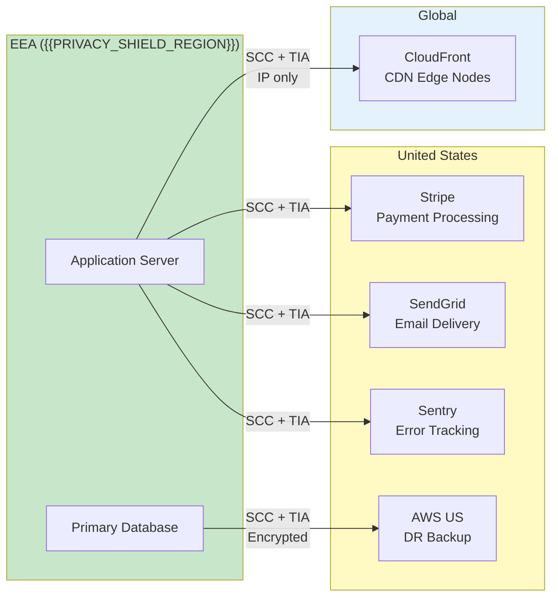

# Cross-Border Data Transfers

> {{PROJECT_NAME}} — Transfer mapping, adequacy decisions, Standard Contractual Clauses, Transfer Impact Assessments, supplementary measures, and US Data Privacy Framework.

---

<!-- IF {{CROSS_BORDER_MECHANISM}} != "none" -->

## 1. Transfer Mapping

Every flow of personal data outside the jurisdiction where it was collected must be documented, assessed, and protected by a legal transfer mechanism. This template maps all cross-border flows for {{PROJECT_NAME}} and documents the mechanisms that make them lawful.

### Transfer Inventory

| Transfer ID | Source Country/Region | Destination Country/Region | Data Categories | Third Party / Internal | Purpose | Volume (Records) | Legal Mechanism | TIA Status |
|------------|----------------------|---------------------------|-----------------|----------------------|---------|------------------|----------------|-----------|
| CBT-001 | {{PRIVACY_SHIELD_REGION}} | US (Stripe) | Payment data, billing address | Third party (processor) | Payment processing | All paying users | SCC | Complete |
| CBT-002 | {{PRIVACY_SHIELD_REGION}} | US (AWS us-east-1) | Application data (backup) | Third party (processor) | Disaster recovery | All users | SCC | Complete |
| CBT-003 | {{PRIVACY_SHIELD_REGION}} | US (SendGrid) | Email, name | Third party (processor) | Email delivery | All users | SCC | Complete |
| CBT-004 | {{PRIVACY_SHIELD_REGION}} | US (Sentry) | Error context, user ID | Third party (processor) | Error tracking | All users | SCC | Complete |
| CBT-005 | {{PRIVACY_SHIELD_REGION}} | Global (CDN edges) | IP addresses (logs) | Third party (processor) | Content delivery | All users | SCC | Complete |
| *(Add all cross-border flows)* | | | | | | | | |

### Transfer Flow Diagram

---

## 2. Adequacy Decision Coverage

The European Commission determines which countries provide an "adequate" level of data protection. Transfers to adequate countries require no additional safeguards beyond standard data protection measures.

### Current Adequacy Decisions (verify current status — decisions can be invalidated)

| Country/Territory | Adequacy Status | Effective Date | Notes |
|------------------|----------------|---------------|-------|
| Andorra | Adequate | 2010 | Full adequacy |
| Argentina | Adequate | 2003 | Full adequacy |
| Canada (PIPEDA) | Adequate (partial) | 2001 | Commercial sector only |
| Faroe Islands | Adequate | 2010 | Full adequacy |
| Guernsey | Adequate | 2003 | Full adequacy |
| Israel | Adequate | 2011 | Full adequacy |
| Isle of Man | Adequate | 2004 | Full adequacy |
| Japan | Adequate | 2019 | Full adequacy |
| Jersey | Adequate | 2008 | Full adequacy |
| New Zealand | Adequate | 2012 | Full adequacy |
| Republic of Korea | Adequate | 2022 | Full adequacy |
| Switzerland | Adequate | 2000 | Full adequacy |
| United Kingdom | Adequate | 2021 | Renewed, sunset clause — monitor |
| United States | Adequate (DPF) | 2023 | EU-US Data Privacy Framework — limited to certified orgs |
| Uruguay | Adequate | 2012 | Full adequacy |

**Important:** Adequacy decisions can be invalidated (as happened with US Safe Harbor in 2015 and Privacy Shield in 2020). Monitor the European Commission's adequacy decision page and build contingency mechanisms.

### Adequacy Check for {{PROJECT_NAME}}

For each transfer destination, determine if adequacy applies:

| Destination | Adequacy Applies? | If No, Mechanism Needed |
|------------|------------------|----------------------|
| *(List each transfer destination from the transfer inventory)* | | |

---

## 3. Standard Contractual Clauses

SCCs are the most common transfer mechanism for EEA-to-non-adequate-country transfers. The EU Commission adopted new SCCs in June 2021, replacing the previous versions. All transfers must use the new SCCs.

### SCC Module Selection

The new SCCs have four modules. Select the module that matches each transfer relationship:

| Module | Controller/Processor Relationship | Use When |
|--------|----------------------------------|----------|
| **Module 1** | Controller to Controller | You transfer data to another company that determines its own purposes |
| **Module 2** | Controller to Processor | You transfer data to a company that processes it on your behalf (most common for SaaS) |
| **Module 3** | Processor to Processor | Your processor transfers data to a sub-processor |
| **Module 4** | Processor to Controller | A non-EEA processor transfers data back to an EEA controller |

### SCC Execution Tracker

| Transfer ID | Third Party | Module | SCC Signed | Effective Date | Annex I (Parties) | Annex II (Technical Measures) | Annex III (Sub-Processors) | TIA Attached |
|------------|------------|--------|-----------|---------------|-------------------|----------------------------|--------------------------| -------------|
| CBT-001 | Stripe | Module 2 | Yes | YYYY-MM-DD | Complete | Complete | Complete | Yes |
| CBT-002 | AWS | Module 2 | Yes | YYYY-MM-DD | Complete | Complete | Complete | Yes |
| *(Track all SCC-covered transfers)* | | | | | | | | |

### SCC Annex II Template — Technical and Organizational Measures

Document the security measures for each transfer:

- [ ] **Pseudonymization and encryption:** Data is encrypted at rest (AES-256) and in transit (TLS 1.3)
- [ ] **Confidentiality:** Access restricted to authorized personnel with need-to-know
- [ ] **Integrity:** Data modification logging, checksums, backup verification
- [ ] **Availability:** Redundant systems, backup procedures, disaster recovery
- [ ] **Resilience:** Auto-scaling, failover mechanisms, incident response plan
- [ ] **Regular testing:** Penetration testing, vulnerability scanning, security audits
- [ ] **User identification and authorization:** Multi-factor authentication, role-based access
- [ ] **Physical security:** Data center certifications (SOC 2, ISO 27001)
- [ ] **Event logging:** Tamper-proof audit logs for all data access
- [ ] **Data minimization:** Only necessary data categories are transferred

---

## 4. Transfer Impact Assessment

Post-Schrems II, every SCC-backed transfer requires a Transfer Impact Assessment (TIA). The TIA evaluates whether the laws of the destination country provide adequate protection for the transferred data.

### TIA Template

**Transfer:** *(Transfer ID from inventory)*
**Destination country:** *(country name)*
**Date of assessment:** *(date)*

#### Step 1: Identify the Transfer

| Field | Value |
|-------|-------|
| Data exporter | {{PROJECT_NAME}} |
| Data importer | *(third party name)* |
| Data categories transferred | *(list)* |
| Transfer mechanism | SCC Module *(N)* |
| Purpose of transfer | *(purpose)* |

#### Step 2: Assess Destination Country Laws

Evaluate the following factors for the destination country:

| Factor | Assessment | Risk Level |
|--------|-----------|-----------|
| **Government access laws** | Does the government have legal authority to access the data? | Low / Medium / High |
| **Scope of access** | Is access targeted or bulk/mass surveillance? | Low / Medium / High |
| **Oversight mechanisms** | Is there independent judicial oversight of government access? | Low / Medium / High |
| **Individual rights** | Can data subjects challenge government access? | Low / Medium / High |
| **Practical application** | Has the government actually accessed similar data? | Low / Medium / High |
| **Rule of law** | Is the legal system independent and predictable? | Low / Medium / High |

#### Step 3: Assess Supplementary Measures

If the destination country assessment reveals risks, document supplementary measures:

| Risk Identified | Supplementary Measure | Effectiveness |
|----------------|----------------------|---------------|
| Government access to data in transit | End-to-end encryption with exporter-held keys | High — government cannot decrypt |
| Government access to data at rest | Encryption at rest with exporter-controlled key management | High — if keys are not accessible to importer |
| Bulk surveillance of communications | Pseudonymization before transfer | Medium — reduces re-identification risk |
| Lack of judicial oversight | Contractual commitment to challenge access requests | Low — contractual only |

#### Step 4: Conclusion

- [ ] Transfer may proceed with current SCC + supplementary measures
- [ ] Transfer may proceed only with additional supplementary measures (specify)
- [ ] Transfer cannot proceed — risk cannot be mitigated to adequate level
- [ ] Alternative: relocate processing to adequate country

---

## 5. Supplementary Measures

When SCCs alone do not provide adequate protection, supplementary measures bridge the gap. These fall into three categories.

### Technical Measures (Strongest)

| Measure | Description | Effectiveness | Implementation Effort |
|---------|------------|---------------|----------------------|
| **End-to-end encryption** | Encrypt before transfer, only exporter holds keys | Very high | High |
| **Pseudonymization** | Replace identifiers with tokens before transfer | High | Medium |
| **Split processing** | Process sensitive fields in EEA, transfer only non-sensitive | High | High |
| **Key management isolation** | Store encryption keys in EEA, not accessible to importer | Very high | Medium |
| **Homomorphic encryption** | Process encrypted data without decryption | Very high | Very high (emerging) |

### Organizational Measures (Medium)

| Measure | Description | Effectiveness |
|---------|------------|---------------|
| **Transparency reports** | Importer publishes government access statistics | Medium |
| **Access challenge commitment** | Importer commits to legally challenge access requests | Medium |
| **Data minimization** | Transfer only strictly necessary data categories | Medium |
| **Audit rights** | Exporter retains right to audit importer's compliance | Medium |
| **Incident notification** | Immediate notification of government access attempts | Medium |

### Contractual Measures (Weakest Alone)

| Measure | Description | Effectiveness |
|---------|------------|---------------|
| **Notification obligation** | Importer must notify exporter of access requests (where legally possible) | Low |
| **Legal challenge obligation** | Importer must exhaust legal remedies before complying | Low-Medium |
| **Warrant canary** | Importer maintains canary statement updated regularly | Low |

---

## 6. US Data Privacy Framework

The EU-US Data Privacy Framework (DPF) was adopted in July 2023, replacing Privacy Shield. It provides an adequacy-like mechanism for transfers to US organizations that self-certify under the DPF.

### DPF Applicability Check

| Question | Answer |
|----------|--------|
| Is the data importer a US organization? | Yes / No |
| Is the data importer certified under the DPF? | Yes / No (check dataprivacyframework.gov) |
| Is the certification current and active? | Yes / No |
| Does the certification cover the relevant data categories? | Yes / No (HR data vs commercial data) |

**If all answers are Yes:** Transfer may proceed under DPF adequacy decision — no SCCs or TIA required for this specific transfer.

**If any answer is No:** DPF does not apply. Use SCCs + TIA instead.

### DPF Monitoring

The DPF could be invalidated like its predecessors (Safe Harbor, Privacy Shield). Build contingency:

- [ ] Track DPF status via EU Commission announcements
- [ ] Maintain signed SCCs as backup for all DPF-covered transfers
- [ ] Have a 90-day migration plan to switch from DPF to SCCs if invalidated
- [ ] Document all DPF-covered transfers separately for quick identification

<!-- ENDIF -->

<!-- IF {{CROSS_BORDER_MECHANISM}} == "none" -->

## Cross-Border Transfers — Not Applicable

{{PROJECT_NAME}} processes all personal data within a single jurisdiction ({{PRIVACY_SHIELD_REGION}}). No cross-border transfer mechanisms are required at this time.

### Monitoring Checklist

Even without current cross-border transfers, monitor for changes:

- [ ] Review quarterly: has any new third-party integration introduced a cross-border flow?
- [ ] Verify cloud infrastructure remains in-region (check provider console)
- [ ] Confirm CDN does not log PII at edge locations outside the jurisdiction
- [ ] If expanding to new markets, re-evaluate cross-border requirements before launch

<!-- ENDIF -->

### Cross-Border Transfer Checklist

- [ ] All cross-border transfers are inventoried in the transfer map
- [ ] Each transfer has a documented legal mechanism (adequacy, SCC, DPF, BCR)
- [ ] TIAs are completed for all SCC-backed transfers
- [ ] Supplementary measures are documented where TIA identifies risks
- [ ] SCCs use the June 2021 version (not the deprecated 2010 versions)
- [ ] SCC annexes are complete (parties, technical measures, sub-processors)
- [ ] DPF certifications are verified and current (if relying on DPF)
- [ ] Contingency plan exists for adequacy decision invalidation
- [ ] Transfer inventory is reviewed quarterly
- [ ] New transfers trigger a TIA before data flows begin
