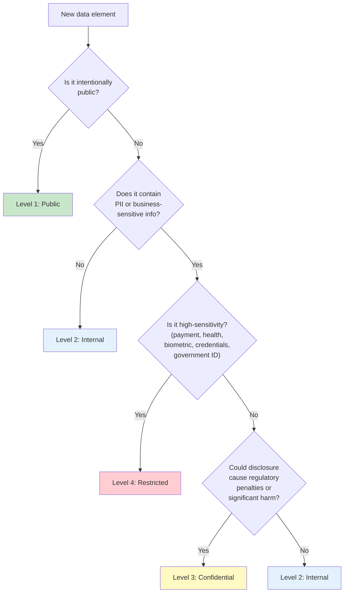

# Data Classification Framework

> {{PROJECT_NAME}} — Classification levels, data category assignments, handling rules per level, classification decision flowchart, and labeling standards.

---

## 1. Classification Levels

Every piece of data in {{PROJECT_NAME}} must be assigned a classification level. The level determines handling rules — how data is stored, who can access it, how it is transmitted, how long it is retained, and how it is disposed of. Misclassification in either direction is costly: over-classification creates unnecessary friction; under-classification creates compliance risk.

<!-- IF {{DATA_CLASSIFICATION_LEVELS}} == "4" -->

### Four-Tier Classification

| Level | Name | Definition | Access Scope | Examples |
|-------|------|-----------|-------------|---------|
| **L1** | **Public** | Information intentionally made available to the public. No impact if disclosed. | Unrestricted | Marketing content, public API docs, published blog posts, open-source code |
| **L2** | **Internal** | Information for internal use. Low impact if disclosed — minor embarrassment or inconvenience. | All employees / team members | Internal dashboards, aggregated metrics, architecture diagrams, team policies |
| **L3** | **Confidential** | Personal data and business-sensitive information. Moderate to significant impact if disclosed — regulatory penalties, competitive harm, user trust damage. | Role-based access (need-to-know) | User PII (name, email, phone), customer lists, revenue data, product roadmap, source code |
| **L4** | **Restricted** | Highly sensitive data. Severe impact if disclosed — legal liability, financial harm to individuals, regulatory fines. | Named individuals only (explicit grant) | Passwords/hashes, payment data, MFA secrets, health data, biometric data, SSN/national ID, encryption keys |

<!-- ENDIF -->

<!-- IF {{DATA_CLASSIFICATION_LEVELS}} == "3" -->

### Three-Tier Classification

| Level | Name | Definition | Access Scope | Examples |
|-------|------|-----------|-------------|---------|
| **L1** | **Public** | Information intentionally made available to the public. | Unrestricted | Marketing content, public docs |
| **L2** | **Internal** | Information for internal use, including standard PII. | Team-based access | User profiles, internal metrics, customer lists |
| **L3** | **Restricted** | Highly sensitive data requiring maximum protection. | Named individuals only | Passwords, payment data, health data, encryption keys |

<!-- ENDIF -->

---

## 2. Data Categories with Level Assignments

### Data Category Inventory

| Category | Data Elements | Classification Level | Justification |
|----------|--------------|---------------------|---------------|
| **Authentication credentials** | Password hash, MFA secret, recovery codes | Restricted (L4) | Compromise enables account takeover |
| **Payment information** | Payment tokens, billing address, transaction history | Restricted (L4) | Financial harm if exposed, PCI-DSS |
| **Government identifiers** | SSN, passport number, national ID, driver's license | Restricted (L4) | Identity theft risk |
| **Health data** | Medical records, health conditions, prescriptions | Restricted (L4) | HIPAA, special category under GDPR |
| **Biometric data** | Fingerprints, facial geometry, voice patterns | Restricted (L4) | Irreplaceable — cannot be changed if compromised |
| **Encryption keys** | Symmetric keys, private keys, API secrets | Restricted (L4) | Compromise exposes all encrypted data |
| **Contact information** | Email address, phone number, mailing address | Confidential (L3) | Standard PII, regulated under GDPR/CCPA |
| **User profile** | Display name, avatar, bio, preferences | Confidential (L3) | Personally identifiable |
| **User-generated content** | Posts, comments, messages, uploads | Confidential (L3) | May contain sensitive information |
| **Account metadata** | Account creation date, plan type, subscription status | Confidential (L3) | Business-sensitive |
| **Customer lists** | Organization names, contract values, account managers | Confidential (L3) | Competitive intelligence risk |
| **Source code** | Application code, infrastructure configuration | Confidential (L3) | Intellectual property |
| **Product roadmap** | Feature plans, priorities, timelines | Confidential (L3) | Competitive intelligence risk |
| **Revenue data** | MRR, ARR, churn rates, unit economics | Confidential (L3) | Business-sensitive |
| **Aggregated analytics** | Feature usage counts, funnel metrics, retention curves | Internal (L2) | No individual identification possible |
| **System metrics** | CPU usage, memory, error rates, latency | Internal (L2) | Operational data, no PII |
| **Architecture docs** | System diagrams, API schemas, database models | Internal (L2) | Could aid attacks if public |
| **Team policies** | Engineering standards, onboarding docs, runbooks | Internal (L2) | Internal process information |
| **Marketing content** | Blog posts, landing pages, case studies (published) | Public (L1) | Intentionally public |
| **API documentation** | Public API reference, SDKs, integration guides | Public (L1) | Intentionally public |
| **Open-source code** | Published libraries, examples | Public (L1) | Intentionally public |

---

## 3. Handling Rules per Level

### Storage Rules

| Rule | Public (L1) | Internal (L2) | Confidential (L3) | Restricted (L4) |
|------|-------------|---------------|-------------------|-----------------|
| **Encryption at rest** | Not required | Recommended (disk-level) | Required (database-level) | Required (field-level AES-256) |
| **Encryption in transit** | TLS recommended | TLS required | TLS 1.2+ required | TLS 1.3 required |
| **Storage location** | Any (CDN, public bucket) | Company-managed infrastructure | Company-managed, region-locked | Company-managed, region-locked, dedicated |
| **Backup encryption** | Not required | Standard | Required | Required + per-record encryption keys |
| **Development environments** | May use real data | May use real data | Synthetic data only | Synthetic data only |

### Access Control Rules

| Rule | Public (L1) | Internal (L2) | Confidential (L3) | Restricted (L4) |
|------|-------------|---------------|-------------------|-----------------|
| **Authentication** | None | SSO required | SSO + MFA recommended | SSO + MFA required |
| **Authorization** | None | Team-based RBAC | Role-based, need-to-know | Named individual, explicit grant |
| **Access logging** | Not required | Recommended | Required | Required (tamper-proof) |
| **Access review** | Not required | Annual | Quarterly | Monthly |
| **Shared accounts** | Allowed | Discouraged | Prohibited | Prohibited |
| **Temporary access** | N/A | Standard process | Approval required, auto-expire | Senior approval, auto-expire (4hr max) |

### Transmission Rules

| Rule | Public (L1) | Internal (L2) | Confidential (L3) | Restricted (L4) |
|------|-------------|---------------|-------------------|-----------------|
| **Email** | Allowed | Allowed | Allowed (encrypted) | Prohibited (use secure portal) |
| **Chat (Slack/Teams)** | Allowed | Allowed | Discouraged | Prohibited |
| **File sharing** | Any platform | Company-approved | Company-approved, access-controlled | Dedicated secure channel only |
| **API transmission** | HTTPS | HTTPS | HTTPS + auth | HTTPS + mutual TLS + auth |
| **Cross-border** | No restrictions | No restrictions | Transfer mechanism required | Transfer mechanism + supplementary measures |
| **Third-party sharing** | Allowed | With NDA | With DPA | With DPA + security assessment |

### Retention Rules

| Rule | Public (L1) | Internal (L2) | Confidential (L3) | Restricted (L4) |
|------|-------------|---------------|-------------------|-----------------|
| **Default retention** | Indefinite | {{DATA_RETENTION_DEFAULT}} | {{DATA_RETENTION_DEFAULT}} | Shortest defensible period |
| **Retention review** | Not required | Annual | Quarterly | Quarterly |
| **Automated purging** | Not required | Recommended | Required | Required |
| **Litigation hold** | Not required | Supported | Supported | Supported |

### Disposal Rules

| Rule | Public (L1) | Internal (L2) | Confidential (L3) | Restricted (L4) |
|------|-------------|---------------|-------------------|-----------------|
| **Digital disposal** | Standard delete | Standard delete | Secure delete (overwrite) | Cryptographic erasure |
| **Physical media** | Standard recycling | Shredding | Certified destruction | Certified destruction + certificate |
| **Backup disposal** | Standard rotation | Standard rotation | Verified purge | Cryptographic erasure + key deletion |
| **Disposal verification** | Not required | Not required | Spot-check | Full verification log |

---

## 4. Classification Decision Flowchart

Use this flowchart when classifying a new data element.



### Classification Escalation Rules

- **When in doubt, classify UP.** It is better to over-protect than under-protect.
- **Mixed-level records:** If a record contains fields at different levels, the record inherits the HIGHEST level present.
- **Aggregation can change level:** Individual L3 records may become L2 when aggregated (if re-identification is impossible).
- **Context can change level:** A display name (L3) published on a public leaderboard with user consent becomes L1 in that context.
- **Derived data inherits level:** Data derived from L4 data is at minimum L3, unless the derivation process eliminates sensitivity (e.g., counting records without exposing values).

---

## 5. Labeling Standards

Every data store, API endpoint, and documentation page should indicate the classification level of the data it handles.

### Database Labeling

```sql
-- Add classification metadata to tables
COMMENT ON TABLE users IS 'Classification: L3 (Confidential) — Contains PII';
COMMENT ON COLUMN users.password_hash IS 'Classification: L4 (Restricted) — Authentication credential';
COMMENT ON COLUMN users.email IS 'Classification: L3 (Confidential) — Contact PII';
COMMENT ON COLUMN users.display_name IS 'Classification: L3 (Confidential) — Personally identifiable';
COMMENT ON TABLE analytics_events IS 'Classification: L2 (Internal) — Pseudonymized analytics';
```

### API Response Labeling

```typescript
// src/privacy/patterns/response-labeling.ts

// Add classification headers to API responses
function addClassificationHeaders(
  response: Response,
  level: 'L1' | 'L2' | 'L3' | 'L4'
): void {
  response.headers.set('X-Data-Classification', level);
  response.headers.set('X-Data-Handling', getHandlingInstructions(level));
}

// Example: GET /api/v1/users/:id returns L3 data
router.get('/api/v1/users/:id', async (req, res) => {
  addClassificationHeaders(res, 'L3');
  // ...
});
```

### Documentation Labeling

Include classification level in API documentation and data dictionaries:

```
## GET /api/v1/users/:id

**Data Classification:** L3 (Confidential)
**Access:** Authenticated users (own profile) or Support role
**Audit Logging:** Enabled

### Response Fields
| Field | Type | Classification |
|-------|------|---------------|
| id | UUID | L2 |
| email | string | L3 |
| displayName | string | L3 |
| plan | string | L2 |
```

### Classification Implementation Checklist

- [ ] Classification levels are defined and documented
- [ ] All data categories are assigned to classification levels
- [ ] Handling rules are defined for each level (storage, access, transmission, retention, disposal)
- [ ] Classification decision flowchart is available to all team members
- [ ] Database tables and columns are annotated with classification metadata
- [ ] API endpoints indicate the classification level of response data
- [ ] New data collection points trigger a classification review
- [ ] Development environments use synthetic data for L3/L4 data categories
- [ ] Access reviews follow the frequency defined for each level
- [ ] Classification training is included in developer onboarding
- [ ] Classification assignments are reviewed when data usage changes
