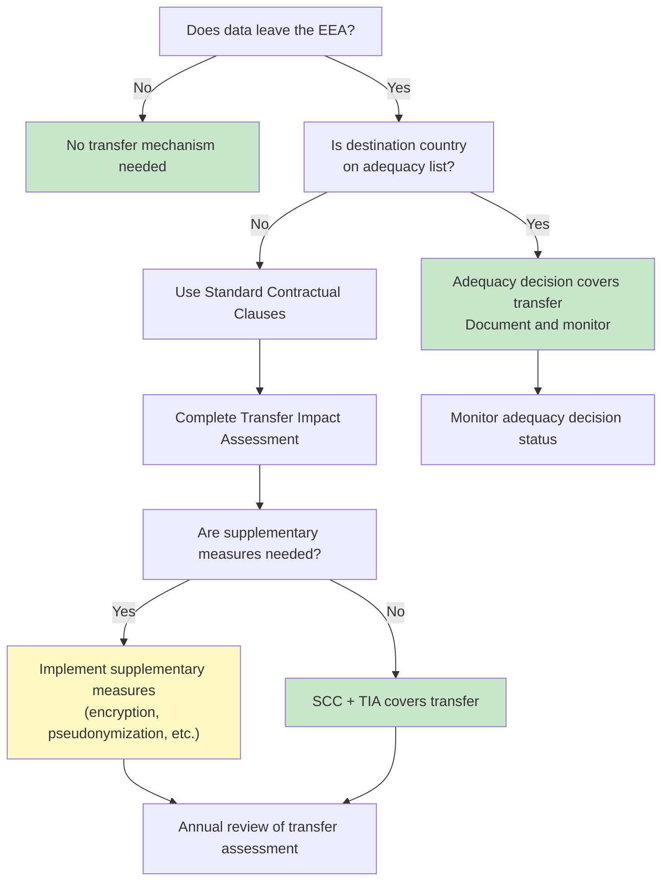

# Data Flow Mapping

> {{PROJECT_NAME}} — Visual data flow diagrams showing how personal data moves through every system, with classification overlays and third-party flow identification.

---

## 1. System Inventory

Before you can map data flows, you must inventory every system that touches personal data. Most organizations discover 30-50% more data touchpoints than they expected during this exercise. The inventory is the single most important privacy artifact — you cannot protect what you have not found.

### System Inventory Template

| System | Type | Data Categories | Storage Location | Owner | Access Controls | Retention | Classification |
|--------|------|-----------------|-----------------|-------|-----------------|-----------|---------------|
| Primary database | PostgreSQL | User profiles, preferences, content | {{PRIVACY_SHIELD_REGION}} | Backend team | Role-based, encrypted at rest | {{DATA_RETENTION_DEFAULT}} | Confidential |
| Authentication service | Auth0 / Custom | Email, password hash, MFA secrets | {{PRIVACY_SHIELD_REGION}} | Platform team | Encrypted, access-logged | Account lifetime | Restricted |
| Payment system | Stripe | Payment tokens, billing address | US (Stripe infrastructure) | Finance team | PCI-DSS, tokenized | 7 years (tax) | Restricted |
| Analytics warehouse | BigQuery / Snowflake | Pseudonymized events, device info | {{PRIVACY_SHIELD_REGION}} | Data team | Column-level security | {{DATA_RETENTION_DEFAULT}} | Internal |
| Log aggregator | Datadog / ELK | IP addresses, user agents, request bodies | {{PRIVACY_SHIELD_REGION}} | DevOps | Team-restricted | 90 days | Internal |
| Email service | SendGrid / SES | Email addresses, names | US (with SCC) | Marketing team | API key, encrypted transit | Until unsubscribe | Confidential |
| Error tracking | Sentry | Stack traces, user context, IP | US (with SCC) | Engineering | Team-restricted | 90 days | Internal |
| CDN | CloudFront / Fastly | IP addresses (access logs) | Global edge | DevOps | Encrypted transit | 7 days | Internal |
| Object storage | S3 | User uploads, avatars, documents | {{PRIVACY_SHIELD_REGION}} | Backend team | Bucket policies, encrypted at rest | User-controlled | Confidential |
| Search index | Elasticsearch / Algolia | Indexed user content, metadata | {{PRIVACY_SHIELD_REGION}} | Backend team | API key, filtered access | Synced with primary | Confidential |
| Cache | Redis | Session data, temporary tokens | {{PRIVACY_SHIELD_REGION}} | Backend team | VPC-restricted, no persistence | TTL-based (hours) | Internal |
| Backup system | AWS Backup / pg_dump | Full database snapshots | {{PRIVACY_SHIELD_REGION}} | DevOps | Encrypted, restricted access | 30-day rolling | Restricted |
| *(Add all systems — expect 15-30 for a typical SaaS product)* | | | | | | | |

### Hidden Data Store Audit

These are data stores teams commonly forget during inventory:

- [ ] **Browser localStorage/sessionStorage** — Does your frontend store PII client-side?
- [ ] **Mobile app local storage** — SQLite databases, Keychain/Keystore, shared preferences
- [ ] **CI/CD artifacts** — Do build logs contain user data from test environments?
- [ ] **Developer local machines** — Are developers pulling production data for debugging?
- [ ] **Slack/Teams channels** — Are support conversations with PII stored in chat history?
- [ ] **Spreadsheets and shared drives** — Customer lists, export files, one-off analyses
- [ ] **Staging/QA environments** — Are they using production data or synthetic data?
- [ ] **Email inboxes** — Support inbox, sales inbox, founder inbox with customer PII
- [ ] **Third-party form builders** — Typeform, Google Forms collecting user data
- [ ] **DNS/access logs** — Cloudflare, nginx, load balancer logs with IP addresses
- [ ] **Feature flag service** — User targeting rules may contain PII segments

---

## 2. Data Flow Diagram

This Mermaid diagram maps how personal data flows through {{PROJECT_NAME}}. Update it whenever you add a new data collection point, integrate a new service, or change data routing.

### Primary Data Flow

```mermaid
flowchart TB
    subgraph Collection["Data Collection Layer"]
        WebApp["Web Application<br/>Browser"]
        MobileApp["Mobile App"]
        API["Public API"]
        Webhook["Incoming Webhooks"]
    end

    subgraph Processing["Data Processing Layer"]
        Gateway["API Gateway<br/>Rate limiting, auth"]
        AppServer["Application Server<br/>Business logic"]
        Queue["Message Queue<br/>Async processing"]
        Workers["Background Workers<br/>Jobs, notifications"]
    end

    subgraph Storage["Data Storage Layer"]
        PrimaryDB["Primary Database<br/>PostgreSQL<br/>{{PRIVACY_SHIELD_REGION}}"]
        Cache["Cache Layer<br/>Redis<br/>Session, tokens"]
        ObjectStore["Object Storage<br/>S3<br/>Uploads, avatars"]
        SearchIdx["Search Index<br/>Elasticsearch<br/>Content index"]
    end

    subgraph Analytics["Analytics & Monitoring"]
        AnalyticsPipe["Analytics Pipeline<br/>Event processing"]
        Warehouse["Data Warehouse<br/>Pseudonymized"]
        ErrorTrack["Error Tracking<br/>Sentry"]
        Logs["Log Aggregator<br/>Datadog/ELK"]
    end

    subgraph ThirdParty["Third-Party Processors"]
        PaymentProc["Payment Processor<br/>Stripe"]
        EmailSvc["Email Service<br/>SendGrid"]
        AuthSvc["Auth Provider<br/>Auth0"]
        SupportPlat["Support Platform<br/>Zendesk/Intercom"]
    end

    subgraph Compliance["Privacy Controls"]
        ConsentSvc["Consent Service<br/>Consent checks"]
        DSREngine["DSR Engine<br/>Data subject requests"]
        PurgeJob["Purge Service<br/>Retention enforcement"]
        AuditLog["Audit Log<br/>Tamper-proof"]
    end

    WebApp -->|"PII: name, email,<br/>preferences"| Gateway
    MobileApp -->|"PII: device ID,<br/>location (if consented)"| Gateway
    API -->|"API keys,<br/>request data"| Gateway
    Webhook -->|"Event data"| Gateway

    Gateway -->|"Authenticated<br/>requests"| AppServer
    AppServer -->|"Validated data"| PrimaryDB
    AppServer -->|"Session data"| Cache
    AppServer -->|"File uploads"| ObjectStore
    AppServer -->|"Searchable content"| SearchIdx
    AppServer -->|"Async tasks"| Queue
    Queue -->|"Job payloads"| Workers

    AppServer -->|"Events<br/>(consent-gated)"| AnalyticsPipe
    AnalyticsPipe -->|"Pseudonymized<br/>events"| Warehouse
    AppServer -->|"Errors + context"| ErrorTrack
    AppServer -->|"Request logs"| Logs

    AppServer -->|"Payment tokens"| PaymentProc
    Workers -->|"Email + recipient"| EmailSvc
    Gateway -->|"Auth tokens"| AuthSvc
    AppServer -->|"Ticket data"| SupportPlat

    ConsentSvc -.->|"Consent check"| AppServer
    ConsentSvc -.->|"Consent gate"| AnalyticsPipe
    DSREngine -.->|"Discovery query"| PrimaryDB
    DSREngine -.->|"Discovery query"| ObjectStore
    DSREngine -.->|"Discovery query"| SearchIdx
    DSREngine -.->|"Erasure request"| PaymentProc
    DSREngine -.->|"Erasure request"| EmailSvc
    DSREngine -.->|"Erasure request"| SupportPlat
    PurgeJob -.->|"Retention purge"| PrimaryDB
    PurgeJob -.->|"Retention purge"| Warehouse
    PurgeJob -.->|"Retention purge"| Logs
    AuditLog -.->|"Audit trail"| PrimaryDB

    style Collection fill:#e3f2fd
    style Processing fill:#fff3e0
    style Storage fill:#e8f5e9
    style Analytics fill:#f3e5f5
    style ThirdParty fill:#fce4ec
    style Compliance fill:#e0f2f1
```



### Data Flow Annotations

For each arrow in the diagram, document:

| Flow | Data Categories | Legal Basis | Consent Required | Encrypted in Transit | Classification |
|------|-----------------|-------------|-----------------|---------------------|---------------|
| WebApp → Gateway | Name, email, preferences, content | Contract | No (core service) | TLS 1.3 | Confidential |
| MobileApp → Gateway | Device ID, location, usage data | Consent (location), Contract (core) | Yes (location) | TLS 1.3 + cert pinning | Confidential |
| AppServer → Analytics Pipeline | Page views, clicks, session duration | {{CONSENT_MODEL}} | Yes (if opt-in model) | TLS 1.3 | Internal |
| AppServer → Payment Processor | Payment token, amount, billing address | Contract | No | TLS 1.3 | Restricted |
| AppServer → Email Service | Email address, name, template data | Contract / Consent | Yes (marketing), No (transactional) | TLS 1.3 | Confidential |
| AppServer → Error Tracking | Stack trace, user ID, IP, user agent | Legitimate interest | No | TLS 1.3 | Internal |
| AppServer → Logs | Request path, IP, user agent, timing | Legitimate interest | No | Internal network | Internal |
| Workers → Email Service | Email address, notification content | Contract / Consent | Depends on email type | TLS 1.3 | Confidential |

---

## 3. Data Classification Overlay

Map each data element to its classification level. This overlay determines handling rules (encryption, access, retention, disposal) for every piece of data in the system.

### Data Element Classification

| Data Element | Classification | Encryption at Rest | Encryption in Transit | Access Level | Retention | Disposal Method |
|-------------|---------------|-------------------|---------------------|-------------|-----------|----------------|
| Password hash | Restricted | AES-256 | TLS 1.3 | Auth service only | Account lifetime | Cryptographic deletion |
| Payment token | Restricted | PCI-DSS (processor) | TLS 1.3 | Payment service only | 7 years | Processor handles |
| MFA secrets | Restricted | AES-256 + HSM | TLS 1.3 | Auth service only | Until MFA reset | Cryptographic deletion |
| Email address | Confidential | AES-256 | TLS 1.3 | Service-level access | {{DATA_RETENTION_DEFAULT}} | Hard delete |
| Full name | Confidential | AES-256 | TLS 1.3 | Service-level access | {{DATA_RETENTION_DEFAULT}} | Hard delete |
| Phone number | Confidential | AES-256 | TLS 1.3 | Support + billing | {{DATA_RETENTION_DEFAULT}} | Hard delete |
| Mailing address | Confidential | AES-256 | TLS 1.3 | Billing service | {{DATA_RETENTION_DEFAULT}} | Hard delete |
| User-generated content | Confidential | AES-256 | TLS 1.3 | User + authorized | User-controlled | Hard delete |
| IP address | Internal | Standard | TLS 1.3 | DevOps + security | 90 days | Automated purge |
| User agent | Internal | Standard | TLS 1.3 | DevOps | 90 days | Automated purge |
| Session token | Internal | Standard | TLS 1.3 | Auth service | Session duration | TTL expiry |
| Pseudonymized analytics | Internal | Standard | TLS 1.3 | Data team | {{DATA_RETENTION_DEFAULT}} | Automated purge |
| Aggregated statistics | Public | None required | TLS 1.3 | All internal | Indefinite | N/A |

---

## 4. Third-Party Data Flows

Document every data flow to a third party. This is legally required under GDPR and essential for DSR fulfillment — you cannot delete user data from processors you have not documented.

### Third-Party Flow Register

| Third Party | Direction | Data Categories | Purpose | Legal Basis | DPA Signed | Transfer Mechanism | Consent Category |
|------------|-----------|-----------------|---------|-------------|-----------|-------------------|-----------------|
| Stripe | Outbound | Payment tokens, billing address | Payment processing | Contract | Yes | SCC | N/A (contract) |
| SendGrid | Outbound | Email, name | Email delivery | Contract / Consent | Yes | SCC | marketing_emails |
| Sentry | Outbound | Error context, user ID, IP | Error tracking | Legitimate interest | Yes | SCC | N/A (legitimate interest) |
| Google Analytics | Outbound | Pseudonymized events, device info | Product analytics | Consent | Yes | SCC | analytics |
| Intercom | Bidirectional | Name, email, conversation history | Customer support | Contract | Yes | SCC | N/A (contract) |
| Auth0 | Bidirectional | Email, password hash, MFA | Authentication | Contract | Yes | SCC | N/A (contract) |

### Third-Party Data Flow Verification Script

```typescript
// src/privacy/third-party-audit.ts

interface ThirdPartyFlow {
  name: string;
  dataCategories: string[];
  dpaStatus: 'signed' | 'pending' | 'expired' | 'missing';
  lastAuditDate: Date;
  consentRequired: boolean;
  consentCategory?: string;
}

async function auditThirdPartyFlows(): Promise<{
  compliant: ThirdPartyFlow[];
  nonCompliant: ThirdPartyFlow[];
  warnings: string[];
}> {
  const flows = await db.query.thirdPartyFlows.findMany();
  const compliant: ThirdPartyFlow[] = [];
  const nonCompliant: ThirdPartyFlow[] = [];
  const warnings: string[] = [];

  for (const flow of flows) {
    // Check DPA status
    if (flow.dpaStatus !== 'signed') {
      nonCompliant.push(flow);
      warnings.push(`${flow.name}: DPA is ${flow.dpaStatus}`);
      continue;
    }

    // Check audit freshness (must be within last 12 months)
    const twelveMonthsAgo = new Date();
    twelveMonthsAgo.setMonth(twelveMonthsAgo.getMonth() - 12);
    if (flow.lastAuditDate < twelveMonthsAgo) {
      warnings.push(`${flow.name}: Last audit was ${flow.lastAuditDate.toISOString()} — overdue`);
    }

    // Check consent alignment
    if (flow.consentRequired && !flow.consentCategory) {
      nonCompliant.push(flow);
      warnings.push(`${flow.name}: Requires consent but no consent category mapped`);
      continue;
    }

    compliant.push(flow);
  }

  return { compliant, nonCompliant, warnings };
}
```

---

## 5. Cross-Border Flow Identification

Identify every data flow that crosses jurisdictional boundaries. Under GDPR, any transfer of personal data outside the EEA requires a legal mechanism (adequacy decision, SCCs, BCRs, or derogation).

### Cross-Border Flow Map

| Source Region | Destination Region | Data Categories | Third Party | Transfer Mechanism | TIA Completed | Supplementary Measures |
|--------------|-------------------|-----------------|------------|-------------------|--------------|----------------------|
| {{PRIVACY_SHIELD_REGION}} | US (Stripe) | Payment data | Stripe | SCC | Yes | Encryption, pseudonymization |
| {{PRIVACY_SHIELD_REGION}} | US (SendGrid) | Email, name | SendGrid | SCC | Yes | Encryption in transit |
| {{PRIVACY_SHIELD_REGION}} | US (Sentry) | Error context | Sentry | SCC | Yes | PII scrubbing, pseudonymization |
| {{PRIVACY_SHIELD_REGION}} | Global (CDN) | IP addresses (logs) | CloudFront | SCC | Yes | Log rotation (7 days), IP truncation |

### Cross-Border Decision Flowchart



### Data Flow Map Maintenance

- [ ] Review the complete data flow map quarterly
- [ ] Update when any new integration is added
- [ ] Update when any new data collection point is created
- [ ] Verify all third-party DPAs are current
- [ ] Re-run the hidden data store audit semi-annually
- [ ] Validate cross-border flows against current adequacy decisions
- [ ] Ensure the Mermaid diagram matches actual infrastructure
- [ ] Archive previous versions for audit trail
