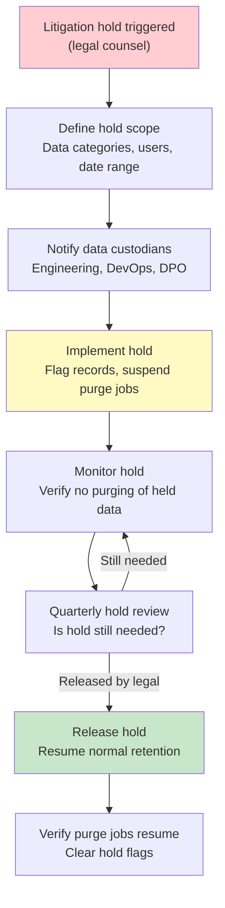

# Data Retention Policy

> {{PROJECT_NAME}} — Retention schedules by data category, automated purge architecture, backup alignment, audit log retention, and litigation hold processes.

---

## 1. Retention Schedule by Data Category

Every piece of personal data must have a defined retention period with a documented justification. "We keep it forever" is never an acceptable retention policy. Data you no longer need is liability — it increases breach impact, storage costs, and compliance burden.

### Retention Schedule Template

| Data Category | Retention Period | Justification | Legal Basis | Purge Method | Automation Level |
|--------------|-----------------|---------------|-------------|-------------|-----------------|
| User account data (name, email, preferences) | Account lifetime + 30 days | Required to provide the service | Contract | Hard delete | {{PURGE_AUTOMATION}} |
| Password hashes | Account lifetime | Required for authentication | Contract | Hard delete | {{PURGE_AUTOMATION}} |
| Payment records (invoices, transactions) | 7 years | Tax and financial reporting obligations | Legal obligation | Anonymize after 7 years | Semi-automated |
| Payment methods (tokenized) | Until payment method removed or account deleted | Required for recurring billing | Contract | Token revocation via processor | Automated |
| Support tickets | 24 months after resolution | Service improvement, dispute resolution | Legitimate interest | Anonymize | Semi-automated |
| Analytics events (pseudonymized) | {{DATA_RETENTION_DEFAULT}} | Product improvement | {{CONSENT_MODEL}} | Hard delete | {{PURGE_AUTOMATION}} |
| Analytics events (aggregated) | Indefinite | Statistical analysis (no PII) | N/A (not personal data) | N/A | N/A |
| Application logs (with PII) | 90 days | Debugging, security monitoring | Legitimate interest | Automated rotation | Fully automated |
| Access logs (IP addresses) | 90 days | Security monitoring, abuse prevention | Legitimate interest | Automated rotation | Fully automated |
| Error tracking data | 90 days | Application stability | Legitimate interest | Automated via provider | Fully automated |
| Email marketing engagement | Until unsubscribe + 30 days | Marketing compliance | Consent | Hard delete | Automated |
| Cookie consent records | 3 years from last consent action | Proof of consent | Legal obligation | Hard delete | Semi-automated |
| DSR records | 3 years from completion | Compliance audit trail | Legal obligation | Anonymize | Semi-automated |
| User-generated content | User-controlled (until deletion) | User value | Contract | Hard delete | User-initiated |
| File uploads (avatars, documents) | Account lifetime + 30 days | User value | Contract | Hard delete from object storage | {{PURGE_AUTOMATION}} |
| Session tokens | Session duration (max 24 hours) | Authentication | Contract | TTL expiry | Fully automated |
| Refresh tokens | 30 days | Authentication continuity | Contract | TTL expiry | Fully automated |
| Backup snapshots | 30 days rolling | Disaster recovery | Legitimate interest | Automated rotation | Fully automated |
| Audit trail | 7 years | Compliance, forensics | Legal obligation | Retain (immutable) | N/A |
<!-- IF {{DATA_SENSITIVITY_LEVEL}} == "high" -->
| Health data | As required by regulation (HIPAA: 6 years) | Legal obligation | Legal obligation | Cryptographic erasure | Semi-automated |
| Financial assessment data | 5 years | Regulatory requirement | Legal obligation | Anonymize | Semi-automated |
| Biometric data | Until purpose fulfilled | Consent-dependent | Consent | Cryptographic erasure | Manual review required |
<!-- ENDIF -->

### Retention Period Decision Criteria

When defining retention periods, evaluate against these criteria:

1. **Legal minimum** — Is there a law requiring minimum retention? (tax records, financial regulations, HIPAA)
2. **Legal maximum** — Does a regulation cap retention? (GDPR data minimization principle)
3. **Business necessity** — How long do you actually need this data to provide the service?
4. **Risk exposure** — How much breach liability does retaining this data create?
5. **Storage cost** — What is the ongoing cost of retaining this data?
6. **User expectation** — Would users expect their data to be retained this long?

**Rule of thumb:** Start with the shortest defensible retention period and extend only with documented justification.

---

## 2. Automated Purge Architecture

Manual data purging does not scale and does not happen. If purging depends on someone remembering to run a script, data accumulates indefinitely. Build automated purge infrastructure from day one.

### Purge Job Architecture

```typescript
// src/privacy/retention/purge-scheduler.ts

interface PurgeJob {
  name: string;
  dataSource: string;
  schedule: string; // Cron expression
  retentionDays: number;
  purgeMethod: 'hard_delete' | 'anonymize' | 'crypto_erase';
  batchSize: number;
  dryRunFirst: boolean; // Always dry-run before first execution
}

const purgeJobs: PurgeJob[] = [
  {
    name: 'purge_deleted_accounts',
    dataSource: 'users',
    schedule: '0 3 * * *', // Daily at 3 AM
    retentionDays: 30, // 30 days after account deletion
    purgeMethod: 'hard_delete',
    batchSize: 100,
    dryRunFirst: true,
  },
  {
    name: 'purge_analytics_events',
    dataSource: 'analytics_events',
    schedule: '0 4 * * 0', // Weekly on Sunday at 4 AM
    retentionDays: Number('{{DATA_RETENTION_DEFAULT}}'.replace('-months', '')) * 30,
    purgeMethod: 'hard_delete',
    batchSize: 10000,
    dryRunFirst: true,
  },
  {
    name: 'purge_application_logs',
    dataSource: 'application_logs',
    schedule: '0 2 * * *', // Daily at 2 AM
    retentionDays: 90,
    purgeMethod: 'hard_delete',
    batchSize: 50000,
    dryRunFirst: true,
  },
  {
    name: 'purge_support_tickets',
    dataSource: 'support_tickets',
    schedule: '0 5 1 * *', // Monthly on 1st at 5 AM
    retentionDays: 730, // 24 months
    purgeMethod: 'anonymize',
    batchSize: 500,
    dryRunFirst: true,
  },
  {
    name: 'anonymize_billing_records',
    dataSource: 'billing_records',
    schedule: '0 5 1 1 *', // Annually on Jan 1st at 5 AM
    retentionDays: 2555, // 7 years
    purgeMethod: 'anonymize',
    batchSize: 1000,
    dryRunFirst: true,
  },
  {
    name: 'purge_expired_sessions',
    dataSource: 'sessions',
    schedule: '*/15 * * * *', // Every 15 minutes
    retentionDays: 1,
    purgeMethod: 'hard_delete',
    batchSize: 5000,
    dryRunFirst: false, // Well-understood operation
  },
];
```

### Purge Execution Engine

```typescript
// src/privacy/retention/purge-engine.ts

interface PurgeResult {
  jobName: string;
  recordsScanned: number;
  recordsPurged: number;
  recordsSkipped: number; // Skipped due to litigation hold, etc.
  errors: string[];
  duration: number; // milliseconds
  dryRun: boolean;
}

async function executePurgeJob(job: PurgeJob, dryRun: boolean = false): Promise<PurgeResult> {
  const startTime = Date.now();
  const cutoffDate = new Date();
  cutoffDate.setDate(cutoffDate.getDate() - job.retentionDays);

  let totalScanned = 0;
  let totalPurged = 0;
  let totalSkipped = 0;
  const errors: string[] = [];

  // Process in batches to avoid overwhelming the database
  let hasMore = true;
  while (hasMore) {
    const candidates = await findPurgeCandidates(
      job.dataSource,
      cutoffDate,
      job.batchSize
    );

    if (candidates.length === 0) {
      hasMore = false;
      break;
    }

    totalScanned += candidates.length;

    for (const record of candidates) {
      // Check litigation hold
      if (await isUnderLitigationHold(record.id, job.dataSource)) {
        totalSkipped++;
        continue;
      }

      // Check for DSR exceptions
      if (await hasPendingDSR(record.userId)) {
        totalSkipped++;
        continue;
      }

      if (!dryRun) {
        try {
          switch (job.purgeMethod) {
            case 'hard_delete':
              await hardDelete(job.dataSource, record.id);
              break;
            case 'anonymize':
              await anonymize(job.dataSource, record.id);
              break;
            case 'crypto_erase':
              await cryptoErase(job.dataSource, record.id);
              break;
          }
          totalPurged++;
        } catch (error) {
          errors.push(`Failed to purge ${record.id}: ${error.message}`);
        }
      } else {
        totalPurged++; // Would have purged
      }
    }

    // Rate limiting — pause between batches
    await sleep(1000);
  }

  const result: PurgeResult = {
    jobName: job.name,
    recordsScanned: totalScanned,
    recordsPurged: totalPurged,
    recordsSkipped: totalSkipped,
    errors,
    duration: Date.now() - startTime,
    dryRun,
  };

  // Log the purge result
  await logComplianceEvent({
    type: 'purge_execution',
    ...result,
    timestamp: new Date(),
  });

  // Alert on errors
  if (errors.length > 0) {
    await alertChannel.send({
      severity: 'high',
      message: `Purge job ${job.name} completed with ${errors.length} errors`,
      details: errors.slice(0, 10), // First 10 errors
    });
  }

  return result;
}
```

### Purge Monitoring Dashboard Queries

```sql
-- Daily purge summary
SELECT
    job_name,
    SUM(records_purged) AS total_purged,
    SUM(records_skipped) AS total_skipped,
    SUM(CASE WHEN array_length(errors, 1) > 0 THEN 1 ELSE 0 END) AS failed_runs,
    AVG(duration_ms) AS avg_duration
FROM purge_execution_log
WHERE executed_at >= NOW() - INTERVAL '24 hours'
GROUP BY job_name
ORDER BY job_name;

-- Data retention compliance status
SELECT
    data_source,
    retention_days,
    COUNT(*) FILTER (WHERE created_at < NOW() - (retention_days || ' days')::INTERVAL) AS overdue_records,
    COUNT(*) AS total_records,
    ROUND(
        100.0 * COUNT(*) FILTER (WHERE created_at < NOW() - (retention_days || ' days')::INTERVAL) / COUNT(*),
        2
    ) AS overdue_percentage
FROM retention_policy_view
GROUP BY data_source, retention_days
HAVING COUNT(*) FILTER (WHERE created_at < NOW() - (retention_days || ' days')::INTERVAL) > 0
ORDER BY overdue_percentage DESC;
```

---

## 3. Backup Retention Alignment

Backup retention is the most commonly overlooked privacy compliance gap. You can hard-delete a user's data from production, but if that data lives in a 90-day backup rotation, you have not fulfilled the erasure request. You have just delayed it by 90 days.

### Backup-Aware Deletion Strategy

| Approach | How It Works | Pros | Cons |
|----------|-------------|------|------|
| **Short backup window** | Keep backups for 7-14 days only | Simple compliance — data naturally purges | Higher DR risk |
| **Backup exclusion list** | Maintain a list of deleted user IDs; exclude from restores | Keeps long backup window | Restore complexity increases |
| **Cryptographic erasure** | Encrypt user data with per-user key; delete key for erasure | Backups become unreadable | Requires per-user encryption infrastructure |
| **Backup scrubbing** | Periodically restore backups, delete target records, re-backup | Thorough compliance | Extremely expensive and time-consuming |

**Recommended approach for {{PROJECT_NAME}}:**

<!-- IF {{DATA_SENSITIVITY_LEVEL}} == "high" -->
Use **cryptographic erasure** for high-sensitivity data. Encrypt sensitive columns with per-user keys stored in a key management service. When a user requests erasure, delete their encryption key. Backup data remains but is unreadable.
<!-- ENDIF -->
<!-- IF {{DATA_SENSITIVITY_LEVEL}} == "medium" -->
Use **backup exclusion list** for standard deployments. Maintain a `deleted_users` table with user IDs and deletion timestamps. When restoring from backup, filter out these users before applying the restore.
<!-- ENDIF -->

### Backup Exclusion Implementation

```typescript
// src/privacy/retention/backup-exclusion.ts

// When a user is deleted, add to exclusion list
async function addToBackupExclusionList(userId: string, requestId: string): Promise<void> {
  await db.insert(deletedUsers).values({
    userId,
    dsrRequestId: requestId,
    deletedAt: new Date(),
    // Keep this record for the duration of backup retention + buffer
    expiresAt: new Date(Date.now() + 45 * 24 * 60 * 60 * 1000), // 45 days
  });
}

// During backup restore, filter excluded users
async function filterRestoredData(restoredRecords: any[]): Promise<any[]> {
  const excludedIds = await db.query.deletedUsers.findMany({
    select: { userId: true },
  });
  const excludedSet = new Set(excludedIds.map((r) => r.userId));

  return restoredRecords.filter((record) => !excludedSet.has(record.userId));
}
```

---

## 4. Audit Log Retention

Audit logs present a retention paradox: they exist to prove compliance, but they contain personal data themselves. Retaining them too long creates privacy risk. Purging them too soon removes your compliance evidence.

### Audit Log Retention Rules

| Audit Log Type | Retention | Justification | Special Handling |
|---------------|-----------|---------------|-----------------|
| Access control changes | 7 years | Security compliance, SOC 2 | Tamper-proof storage |
| DSR fulfillment records | 3 years from request completion | Prove compliance to regulators | Anonymize user details after 1 year |
| Consent change records | 3 years from last consent action | Prove consent was obtained | Retain full detail (consent is the proof) |
| Data breach response records | 7 years from incident | Regulatory investigation timeline | Legal hold compatible |
| Purge execution records | 3 years | Prove retention enforcement | Keep aggregates, drop PII |
| Login/authentication events | 1 year | Security monitoring | Anonymize after 90 days (keep counts) |
| Admin action audit trail | 7 years | Internal governance | Full detail, tamper-proof |

### Audit Log Anonymization

```typescript
// src/privacy/retention/audit-anonymize.ts

// After 1 year, anonymize user-identifiable fields in audit logs
// while preserving the compliance-relevant structure
async function anonymizeAuditLogs(): Promise<number> {
  const oneYearAgo = new Date();
  oneYearAgo.setFullYear(oneYearAgo.getFullYear() - 1);

  const result = await db.update(auditLogs)
    .set({
      userId: db.raw("'anonymized-' || md5(user_id::text)"),
      ipAddress: null,
      userAgent: null,
      metadata: db.raw("metadata - 'email' - 'name' - 'phone'"),
      anonymizedAt: new Date(),
    })
    .where(
      and(
        lt(auditLogs.createdAt, oneYearAgo),
        isNull(auditLogs.anonymizedAt)
      )
    );

  return result.rowCount;
}
```

---

## 5. Litigation Hold Process

When litigation is anticipated or pending, normal retention schedules must be suspended for relevant data. Destroying data under litigation hold is spoliation — potentially criminal.

### Litigation Hold Workflow



### Litigation Hold Implementation

```typescript
// src/privacy/retention/litigation-hold.ts

interface LitigationHold {
  id: string;
  name: string;
  description: string;
  issuedBy: string; // Legal counsel
  issuedAt: Date;
  scope: {
    dataSources: string[];
    userIds?: string[]; // Specific users, or null for all
    dateRange?: { from: Date; to: Date };
    dataCategories?: string[];
  };
  status: 'active' | 'released';
  releasedAt?: Date;
  releasedBy?: string;
}

async function applyLitigationHold(hold: LitigationHold): Promise<void> {
  // 1. Record the hold
  await db.insert(litigationHolds).values(hold);

  // 2. Flag affected records
  for (const dataSource of hold.scope.dataSources) {
    await db.execute(sql`
      UPDATE ${sql.identifier(dataSource)}
      SET litigation_hold = true, litigation_hold_id = ${hold.id}
      WHERE ${buildHoldCondition(hold.scope)}
    `);
  }

  // 3. Update purge job exclusion lists
  await updatePurgeExclusions(hold.id, hold.scope);

  // 4. Notify all data custodians
  await notifyDataCustodians({
    type: 'litigation_hold_applied',
    holdId: hold.id,
    holdName: hold.name,
    scope: hold.scope,
    message: 'DO NOT delete, modify, or allow automated purging of data covered by this hold.',
  });

  // 5. Log the hold
  await logComplianceEvent({
    type: 'litigation_hold_applied',
    holdId: hold.id,
    issuedBy: hold.issuedBy,
    scope: hold.scope,
  });
}
```

### Retention Policy Checklist

- [ ] Every data category has a defined retention period with documented justification
- [ ] Retention periods are reviewed and approved by legal and privacy leads
- [ ] Automated purge jobs are configured for all data categories with defined retention
- [ ] Purge jobs run on schedule with monitoring and alerting
- [ ] Backup retention is aligned with data retention policies
- [ ] Backup exclusion or cryptographic erasure mechanism is implemented
- [ ] Audit log retention follows the defined schedule with anonymization
- [ ] Litigation hold process is documented and can be activated within 24 hours
- [ ] Purge dry-run results are reviewed before first production execution
- [ ] Purge monitoring dashboard is live and reviewed weekly
- [ ] Retention policy is referenced in the privacy notice (Section 29)
- [ ] All team members understand the litigation hold process
