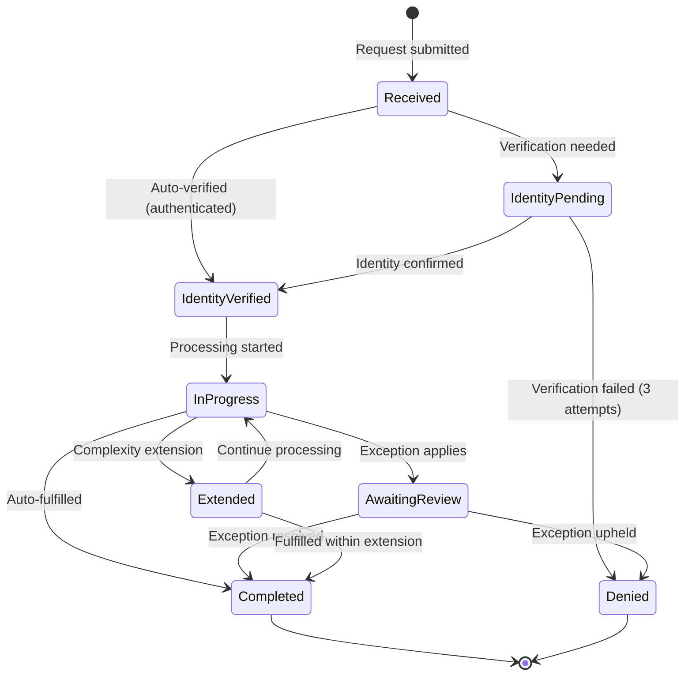

# Data Subject Request Workflow

> {{PROJECT_NAME}} — End-to-end lifecycle for data subject requests: identity verification, cross-service discovery, response generation, erasure implementation, and timeline enforcement.

---

## 1. Request Types

Under GDPR, data subjects have six core rights. Under CCPA, consumers have four. Your DSR workflow must handle all applicable request types with defined processes, SLAs, and engineering implementations.

### Rights Matrix

| Right | GDPR Article | CCPA Equivalent | Description | SLA | Complexity |
|-------|-------------|-----------------|-------------|-----|-----------|
| **Access** | Art. 15 | Right to Know | Provide a copy of all personal data | {{DSR_SLA_DAYS}} days | Medium — cross-service data discovery |
| **Rectification** | Art. 16 | N/A (implicit) | Correct inaccurate personal data | {{DSR_SLA_DAYS}} days | Low — targeted updates |
| **Erasure** | Art. 17 | Right to Delete | Delete personal data | {{DSR_SLA_DAYS}} days | High — cross-service deletion + backups |
| **Portability** | Art. 20 | N/A | Provide data in machine-readable format | {{DSR_SLA_DAYS}} days | Medium — structured export |
| **Restriction** | Art. 18 | N/A | Stop processing but retain data | {{DSR_SLA_DAYS}} days | Medium — processing flags |
| **Objection** | Art. 21 | Right to Opt-Out | Stop specific processing (e.g., marketing) | {{DSR_SLA_DAYS}} days | Low — consent withdrawal |

### Request Type Decision Logic

```typescript
// src/privacy/dsr/request-types.ts

type DSRType = 'access' | 'rectification' | 'erasure' | 'portability' | 'restriction' | 'objection';

interface DSRRequest {
  id: string;
  userId: string;
  type: DSRType;
  status: DSRStatus;
  submittedAt: Date;
  deadlineAt: Date; // submittedAt + {{DSR_SLA_DAYS}} days
  identityVerified: boolean;
  assignedTo: string | null;
  notes: string[];
  metadata: Record<string, unknown>;
}

type DSRStatus =
  | 'received'        // Just submitted
  | 'identity_pending' // Awaiting identity verification
  | 'identity_verified' // Identity confirmed
  | 'in_progress'     // Being processed
  | 'awaiting_review' // Needs human review (exceptions)
  | 'completed'       // Request fulfilled
  | 'denied'          // Request denied with documented reason
  | 'extended';       // Deadline extended (max 60 additional days under GDPR)
```

---

## 2. Identity Verification Process

You must verify the identity of the person making the request. Processing a DSR for the wrong person is itself a data breach. Over-verification is also a problem — demanding excessive proof discourages legitimate requests.

### Verification Levels

| Scenario | Verification Level | Method |
|----------|-------------------|--------|
| Authenticated user in-app | Low | Session validation — user is already logged in |
| Email from registered email address | Medium | Confirmation email with one-time link |
| Request from unrecognized email | High | Request must match 2+ data points (email + last 4 of payment + account creation date) |
| Request from legal representative | High | Power of attorney or written authorization + representative ID verification |
| Request regarding a minor | High | Parental identity verification + proof of relationship |

### Verification Implementation

```typescript
// src/privacy/dsr/identity-verification.ts

interface VerificationResult {
  verified: boolean;
  level: 'low' | 'medium' | 'high';
  method: string;
  verifiedAt: Date | null;
  failureReason?: string;
}

async function verifyDSRIdentity(request: DSRRequest): Promise<VerificationResult> {
  // Level 1: Authenticated user making request via app
  if (request.metadata.sessionToken) {
    const session = await validateSession(request.metadata.sessionToken);
    if (session && session.userId === request.userId) {
      return {
        verified: true,
        level: 'low',
        method: 'authenticated_session',
        verifiedAt: new Date(),
      };
    }
  }

  // Level 2: Request from registered email
  const user = await findUserByEmail(request.metadata.email);
  if (user && user.id === request.userId) {
    // Send verification email with one-time token
    const token = await generateVerificationToken(request.id, user.id);
    await sendVerificationEmail(user.email, token, request.type);
    return {
      verified: false, // Not yet — waiting for email confirmation
      level: 'medium',
      method: 'email_verification_pending',
      verifiedAt: null,
    };
  }

  // Level 3: Unknown email — require multiple data points
  return {
    verified: false,
    level: 'high',
    method: 'multi_factor_required',
    verifiedAt: null,
    failureReason: 'Email not recognized — requesting additional verification',
  };
}
```

---

## 3. Request Routing Architecture

DSR requests need to reach the right handler quickly. Routing is based on request type, data complexity, and whether exceptions apply.

### Routing Rules

| Request Type | Auto-Fulfillable? | Routing |
|-------------|-------------------|---------|
| Access (simple user) | Yes | Automated data export pipeline |
| Access (enterprise, complex) | Partial | Automated export + manual review for shared data |
| Rectification | Yes (standard fields) | Self-service profile edit or automated field update |
| Erasure (no exceptions) | Yes | Automated erasure pipeline |
| Erasure (with legal hold) | No | Legal review queue |
| Portability | Yes | Automated structured export (JSON) |
| Restriction | Partial | Automated flag + manual processor notification |
| Objection | Yes | Automated consent withdrawal |

### DSR API Endpoints

```typescript
// src/privacy/dsr/routes.ts

// POST /api/v1/privacy/dsr — Submit a new DSR
router.post('/api/v1/privacy/dsr', async (req, res) => {
  const { type, reason, additionalInfo } = req.body;
  const userId = req.auth.userId; // Authenticated user

  const request = await dsrService.createRequest({
    userId,
    type,
    reason,
    additionalInfo,
    ipAddress: req.ip,
    userAgent: req.headers['user-agent'],
  });

  // Auto-verify for authenticated users
  await dsrService.verifyIdentity(request.id, 'authenticated_session');

  res.status(201).json({
    requestId: request.id,
    type: request.type,
    status: request.status,
    deadline: request.deadlineAt,
    message: `Your ${type} request has been received. We will fulfill it by ${request.deadlineAt.toISOString()}.`,
  });
});

// GET /api/v1/privacy/dsr/:id — Check request status
router.get('/api/v1/privacy/dsr/:id', async (req, res) => {
  const request = await dsrService.getRequest(req.params.id);
  if (!request || request.userId !== req.auth.userId) {
    return res.status(404).json({ error: 'Request not found' });
  }

  res.json({
    requestId: request.id,
    type: request.type,
    status: request.status,
    submittedAt: request.submittedAt,
    deadline: request.deadlineAt,
    completedAt: request.completedAt,
  });
});

// GET /api/v1/privacy/dsr/:id/download — Download access/portability data
router.get('/api/v1/privacy/dsr/:id/download', async (req, res) => {
  const request = await dsrService.getRequest(req.params.id);
  if (!request || request.userId !== req.auth.userId) {
    return res.status(404).json({ error: 'Request not found' });
  }
  if (request.status !== 'completed') {
    return res.status(400).json({ error: 'Request not yet completed' });
  }

  const exportData = await dsrService.getExportData(request.id);
  res.setHeader('Content-Type', 'application/json');
  res.setHeader('Content-Disposition', `attachment; filename="data-export-${request.id}.json"`);
  res.json(exportData);
});
```

---

## 4. Cross-Service Data Discovery

The hardest part of DSR fulfillment is finding all data for a user across every service. In microservices architectures, user data is scattered across multiple databases, caches, search indices, analytics warehouses, log aggregators, and third-party systems.

### Data Discovery Registry

```typescript
// src/privacy/dsr/data-registry.ts

interface DataSource {
  name: string;
  type: 'database' | 'cache' | 'search_index' | 'object_store' |
        'analytics' | 'logs' | 'third_party' | 'backup';
  userIdField: string; // Column/field that maps to user ID
  dataCategories: string[];
  discoveryMethod: 'direct_query' | 'api_call' | 'manual';
  deletionMethod: 'hard_delete' | 'soft_delete' | 'anonymize' | 'crypto_erase' | 'api_call' | 'manual';
  estimatedQueryTime: number; // milliseconds
}

const dataSourceRegistry: DataSource[] = [
  {
    name: 'users_table',
    type: 'database',
    userIdField: 'id',
    dataCategories: ['name', 'email', 'phone', 'avatar_url', 'preferences'],
    discoveryMethod: 'direct_query',
    deletionMethod: 'hard_delete',
    estimatedQueryTime: 50,
  },
  {
    name: 'billing_records',
    type: 'database',
    userIdField: 'user_id',
    dataCategories: ['billing_address', 'payment_method_last4', 'invoices'],
    discoveryMethod: 'direct_query',
    deletionMethod: 'anonymize', // Cannot hard delete — tax obligations
    estimatedQueryTime: 100,
  },
  {
    name: 'user_content',
    type: 'database',
    userIdField: 'author_id',
    dataCategories: ['posts', 'comments', 'uploads'],
    discoveryMethod: 'direct_query',
    deletionMethod: 'hard_delete',
    estimatedQueryTime: 200,
  },
  {
    name: 'analytics_events',
    type: 'analytics',
    userIdField: 'user_id',
    dataCategories: ['page_views', 'clicks', 'session_data'],
    discoveryMethod: 'api_call',
    deletionMethod: 'anonymize',
    estimatedQueryTime: 5000,
  },
  {
    name: 'support_tickets',
    type: 'third_party',
    userIdField: 'email',
    dataCategories: ['conversation_history', 'attachments'],
    discoveryMethod: 'api_call',
    deletionMethod: 'api_call',
    estimatedQueryTime: 2000,
  },
  {
    name: 'email_service',
    type: 'third_party',
    userIdField: 'email',
    dataCategories: ['email_address', 'subscription_preferences', 'send_history'],
    discoveryMethod: 'api_call',
    deletionMethod: 'api_call',
    estimatedQueryTime: 1000,
  },
  {
    name: 'search_index',
    type: 'search_index',
    userIdField: 'author_id',
    dataCategories: ['indexed_content', 'metadata'],
    discoveryMethod: 'direct_query',
    deletionMethod: 'hard_delete',
    estimatedQueryTime: 500,
  },
  {
    name: 'object_storage',
    type: 'object_store',
    userIdField: 'path_prefix', // e.g., uploads/user_123/
    dataCategories: ['avatars', 'documents', 'exports'],
    discoveryMethod: 'direct_query',
    deletionMethod: 'hard_delete',
    estimatedQueryTime: 1000,
  },
  {
    name: 'application_logs',
    type: 'logs',
    userIdField: 'context.user_id',
    dataCategories: ['ip_address', 'user_agent', 'request_data'],
    discoveryMethod: 'api_call',
    deletionMethod: 'anonymize', // Cannot selectively delete from log streams
    estimatedQueryTime: 10000,
  },
];
```

---

## 5. Response Generation

Access and portability requests require generating a comprehensive export of all user data in a structured, machine-readable format.

### Export Format

```typescript
// src/privacy/dsr/data-export.ts

interface UserDataExport {
  exportMetadata: {
    requestId: string;
    exportDate: string;
    format: 'json';
    version: '1.0';
    dataController: string;
    contactEmail: string;
  };
  profileData: {
    name: string;
    email: string;
    phone: string | null;
    createdAt: string;
    lastLoginAt: string;
    preferences: Record<string, unknown>;
  };
  contentData: {
    posts: Array<{ id: string; content: string; createdAt: string }>;
    comments: Array<{ id: string; content: string; postId: string; createdAt: string }>;
    uploads: Array<{ id: string; filename: string; url: string; uploadedAt: string }>;
  };
  billingData: {
    invoices: Array<{ id: string; amount: number; currency: string; date: string }>;
    paymentMethodLast4: string;
    billingAddress: object;
  };
  activityData: {
    loginHistory: Array<{ timestamp: string; ipAddress: string; userAgent: string }>;
    consentHistory: Array<{ purpose: string; granted: boolean; timestamp: string }>;
  };
  thirdPartyData: {
    analyticsProfile: object | null;
    supportTickets: Array<{ id: string; subject: string; createdAt: string }>;
    emailSubscriptions: Array<{ list: string; subscribed: boolean }>;
  };
}

async function generateDataExport(userId: string, requestId: string): Promise<UserDataExport> {
  // Query all data sources in parallel
  const [profile, content, billing, activity, thirdParty] = await Promise.all([
    queryProfileData(userId),
    queryContentData(userId),
    queryBillingData(userId),
    queryActivityData(userId),
    queryThirdPartyData(userId),
  ]);

  return {
    exportMetadata: {
      requestId,
      exportDate: new Date().toISOString(),
      format: 'json',
      version: '1.0',
      dataController: '{{PROJECT_NAME}}',
      contactEmail: '{{DPO_CONTACT}}',
    },
    profileData: profile,
    contentData: content,
    billingData: billing,
    activityData: activity,
    thirdPartyData: thirdParty,
  };
}
```

---

## 6. Erasure Implementation

Erasure is the most complex DSR type. Three strategies exist, each with different trade-offs.

### Erasure Strategy Comparison

| Strategy | How It Works | Pros | Cons | Use When |
|----------|-------------|------|------|----------|
| **Hard Delete** | `DELETE FROM users WHERE id = ?` | Complete removal, simplest to verify | Referential integrity issues, no recovery | Non-critical data, user content |
| **Cryptographic Erasure** | Delete the encryption key, data becomes unrecoverable | Works for backups, fast, verifiable | Requires field-level encryption infrastructure | Backup data, archived data |
| **Anonymization** | Replace PII with random values, keep structure | Preserves analytics value, no referential integrity issues | Must be truly irreversible, regulators scrutinize | Billing records (tax), analytics |

### Erasure Pipeline

```typescript
// src/privacy/dsr/erasure-pipeline.ts

interface ErasureResult {
  source: string;
  strategy: 'hard_delete' | 'crypto_erase' | 'anonymize' | 'retained';
  recordsAffected: number;
  retainedReason?: string; // Legal obligation, etc.
  completedAt: Date;
}

async function executeErasure(userId: string, requestId: string): Promise<ErasureResult[]> {
  const results: ErasureResult[] = [];

  // 1. Hard delete user profile
  const profileResult = await db.delete(users).where(eq(users.id, userId));
  results.push({
    source: 'users_table',
    strategy: 'hard_delete',
    recordsAffected: profileResult.rowCount,
    completedAt: new Date(),
  });

  // 2. Hard delete user content
  const contentResult = await db.delete(userContent).where(eq(userContent.authorId, userId));
  results.push({
    source: 'user_content',
    strategy: 'hard_delete',
    recordsAffected: contentResult.rowCount,
    completedAt: new Date(),
  });

  // 3. Anonymize billing records (cannot delete — tax obligations)
  const billingResult = await db.update(billingRecords)
    .set({
      userName: 'REDACTED',
      userEmail: `deleted-${requestId}@redacted.invalid`,
      billingAddress: { redacted: true },
    })
    .where(eq(billingRecords.userId, userId));
  results.push({
    source: 'billing_records',
    strategy: 'anonymize',
    recordsAffected: billingResult.rowCount,
    retainedReason: 'Tax obligation — 7 year retention required',
    completedAt: new Date(),
  });

  // 4. Delete from search index
  await searchClient.deleteByQuery({ authorId: userId });
  results.push({
    source: 'search_index',
    strategy: 'hard_delete',
    recordsAffected: -1, // Search engines don't always return count
    completedAt: new Date(),
  });

  // 5. Delete from object storage
  const objects = await s3.listObjects({ Prefix: `uploads/${userId}/` });
  for (const obj of objects.Contents ?? []) {
    await s3.deleteObject({ Key: obj.Key });
  }
  results.push({
    source: 'object_storage',
    strategy: 'hard_delete',
    recordsAffected: objects.Contents?.length ?? 0,
    completedAt: new Date(),
  });

  // 6. Request deletion from third parties
  await Promise.all([
    analyticsProvider.deleteUser(userId),
    supportPlatform.deleteUser(userId),
    emailService.deleteContact(userId),
  ]);

  // 7. Cryptographic erasure for backups
  // Rotate the user's encryption key — backup data becomes unrecoverable
  await keyManagement.deleteUserKey(userId);
  results.push({
    source: 'backups',
    strategy: 'crypto_erase',
    recordsAffected: 1,
    completedAt: new Date(),
  });

  // 8. Log the erasure completion (do NOT log PII in the erasure log)
  await logComplianceEvent({
    type: 'erasure_completed',
    requestId,
    userId: `erased-${requestId}`, // Do not log the original user ID post-erasure
    sourcesProcessed: results.length,
    timestamp: new Date(),
  });

  return results;
}
```

---

## 7. Timeline Enforcement

GDPR requires DSR fulfillment within one calendar month (approximately 30 days). CCPA allows 45 days. Extensions are possible but must be documented and communicated.

### Timeline Configuration

```typescript
// src/privacy/dsr/timeline.ts

const DSR_TIMELINES = {
  gdpr: {
    standardDays: 30,
    extensionDays: 60, // Maximum 2 additional months
    extensionRequiresNotification: true,
  },
  ccpa: {
    standardDays: 45,
    extensionDays: 45, // One 45-day extension
    extensionRequiresNotification: true,
  },
};

// Deadline monitoring — run daily
async function checkDSRDeadlines(): Promise<void> {
  const now = new Date();
  const warningThreshold = new Date(now.getTime() + 7 * 24 * 60 * 60 * 1000); // 7 days

  // Find requests approaching deadline
  const approaching = await db.query.dsrRequests.findMany({
    where: and(
      not(inArray(dsrRequests.status, ['completed', 'denied'])),
      lt(dsrRequests.deadlineAt, warningThreshold)
    ),
  });

  for (const request of approaching) {
    const daysRemaining = Math.ceil(
      (request.deadlineAt.getTime() - now.getTime()) / (24 * 60 * 60 * 1000)
    );

    if (daysRemaining <= 0) {
      // OVERDUE — escalate immediately
      await alertChannel.send({
        severity: 'critical',
        message: `DSR ${request.id} (${request.type}) is OVERDUE. Deadline was ${request.deadlineAt.toISOString()}.`,
        assignedTo: request.assignedTo,
      });
    } else if (daysRemaining <= 3) {
      await alertChannel.send({
        severity: 'high',
        message: `DSR ${request.id} (${request.type}) deadline in ${daysRemaining} days.`,
        assignedTo: request.assignedTo,
      });
    } else if (daysRemaining <= 7) {
      await alertChannel.send({
        severity: 'medium',
        message: `DSR ${request.id} (${request.type}) deadline in ${daysRemaining} days.`,
        assignedTo: request.assignedTo,
      });
    }
  }
}
```

---

## 8. Exception Handling

Not every DSR must be fulfilled. GDPR and CCPA both provide exceptions. Document each exception clearly because regulators will ask.

### Exception Matrix

| Exception | Applies To | Legal Basis | Documentation Required |
|-----------|-----------|-------------|----------------------|
| Legal obligation to retain | Erasure | Tax records, financial regulations | Cite specific law + retention period |
| Freedom of expression | Erasure | Journalistic or research purposes | Case-by-case assessment |
| Public health | Erasure | Epidemiological research | Public health authority mandate |
| Legal claims | Erasure, Restriction | Ongoing or anticipated litigation | Legal counsel confirmation |
| Manifestly unfounded/excessive | Any | Repetitive requests from same person | Document pattern + offer to respond for reasonable fee |
| Unable to verify identity | Any | Cannot confirm requester is the data subject | Document verification attempts |
| Trade secrets | Access | Revealing algorithms or proprietary logic | Document what was withheld and why |

### DSR Lifecycle State Machine



### DSR Fulfillment Checklist

- [ ] DSR submission endpoint is live and documented in privacy policy
- [ ] Identity verification supports authenticated, email, and multi-factor paths
- [ ] Data discovery queries all registered data sources
- [ ] Access export includes all data categories with structured format
- [ ] Erasure pipeline covers all data stores including third parties
- [ ] Anonymization is irreversible (cannot re-identify from anonymized records)
- [ ] Cryptographic erasure is implemented for backup data
- [ ] Timeline monitoring runs daily with escalation alerts
- [ ] Exception handling is documented and requires legal sign-off
- [ ] Completion confirmation is sent to the data subject
- [ ] DSR fulfillment audit log captures all actions taken
- [ ] Retention of DSR records themselves follows {{DATA_RETENTION_DEFAULT}}
