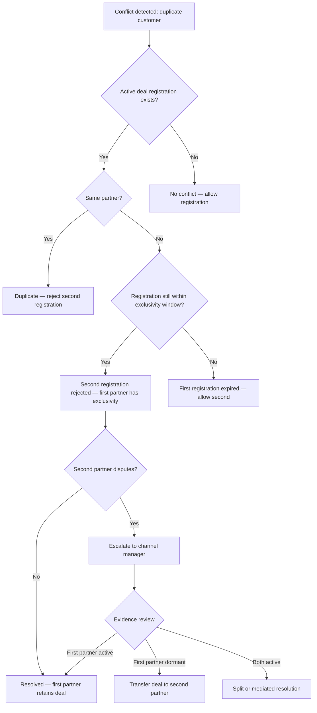

# Channel Conflict Resolution

> Channel conflict is not a question of "if" but "when." Two partners chase the same deal. A partner undercuts your direct price. A customer plays your reseller against your website. This template designs the conflict types, deal registration protections, territory rules, escalation procedures, resolution frameworks, account ownership policies, communication templates, and prevention mechanisms that keep your partner ecosystem healthy.

---

## 1. Conflict Types

### 1.1 Conflict Classification

| Conflict Type | Description | Frequency | Severity | Resolution Complexity |
|--------------|-------------|-----------|----------|----------------------|
| Partner vs. Partner | Two partners pursue the same prospect | High | Medium | Medium |
| Partner vs. Direct | Partner and your direct sales team pursue the same prospect | Very high | High | High |
| Partner vs. Affiliate | Reseller and affiliate both claim credit for same conversion | Medium | Low | Low |
| Territory overlap | Two partners with overlapping territory assignments | Medium | Medium | Medium |
| Price undercut | Partner advertises below MAP or below your direct price | Medium | High | Low (policy enforcement) |
| Customer poaching | Partner attempts to re-register an existing customer | Low | High | Medium |
| White-label identity | White-label partner's customer discovers the original product | Low | High | High |

### 1.2 Conflict Impact Assessment

| Impact Area | Low Impact | Medium Impact | High Impact |
|------------|-----------|--------------|-------------|
| Revenue | < $5K deal value | $5K - $50K deal value | > $50K deal value |
| Relationship | New partner, no history | Established partner, minor friction | Strategic partner, threatening to leave |
| Customer experience | Customer unaware of conflict | Customer confused by dual outreach | Customer frustrated, considering competitor |
| Brand perception | Internal only | Partner community aware | Public/market visibility |

---

## 2. Deal Registration as Conflict Prevention

### 2.1 Deal Registration Rules (Conflict-Focused)

| Rule | Policy | Enforcement |
|------|--------|-------------|
| Registration creates exclusivity | Approved registration grants exclusive pursuit rights for 90 days | System-enforced — blocks duplicate registrations |
| First to register wins | When two partners register simultaneously (within 24 hours), first timestamp wins | Automated with manual review for edge cases |
| Direct pipeline check | Registration against existing direct opportunities flagged for review | Automated check against CRM |
| Customer consent | For enterprise deals, customer must confirm they are working with the registering partner | Manual verification for deals > $25K |
| Dormant registration | No activity (no meetings logged) for 30 days triggers status check | Automated alert to partner + channel manager |
| Re-registration after expiry | After deal registration expires, any partner (including original) can register | System allows after expiry + 7-day cooldown |

### 2.2 Deal Registration Conflict Decision Tree



---

## 3. Territory Rules

### 3.1 Territory Assignment Models

| Model | Description | Best For | Conflict Risk |
|-------|-------------|----------|---------------|
| Exclusive territory | One partner per territory — no overlap | Limited partner count, clear geographies | Low |
| Non-exclusive territory | Multiple partners per territory | Many partners, large markets | High |
| Named accounts | Specific target accounts assigned to partner | Enterprise, ABM | Low |
| Industry vertical | Partner owns a vertical across all geographies | Vertical-focused partners | Medium |
| Hybrid | Territory + vertical combination | Complex programs | Medium |

### 3.2 Territory Definition

| Territory Dimension | Options | Example |
|--------------------|---------|---------|
| Geographic | Country, state/province, city, postal code | "US Northeast: CT, MA, ME, NH, NJ, NY, PA, RI, VT" |
| Industry vertical | SIC/NAICS codes, industry names | "Healthcare: SIC 80xx" |
| Company size | Employee count or revenue bands | "Mid-market: 100-1,000 employees" |
| Named accounts | Specific company list | "Target accounts: [Company A, Company B, ...]" |

### 3.3 Territory Overlap Resolution

| Scenario | Resolution Rule |
|----------|----------------|
| Two partners assigned overlapping territories | Channel manager mediates; split based on partner's customer base |
| Partner pursues opportunity outside assigned territory | Allowed if no territory partner exists; blocked if territory partner is active |
| Customer has offices in multiple partner territories | Primary territory determined by billing address or HQ location |
| Remote/distributed company with no clear territory | Assigned based on primary contact's location |

---

## 4. Escalation Process

### 4.1 Escalation Levels

| Level | Escalation Point | Handles | Timeline |
|-------|-----------------|---------|----------|
| Level 1 | Channel Manager | Partner vs. partner, territory questions, minor pricing issues | Resolve within 3 business days |
| Level 2 | Head of Partnerships | Complex conflicts, partner vs. direct, disputes involving top-tier partners | Resolve within 5 business days |
| Level 3 | VP Sales + VP Partnerships | High-value deals (>$100K), strategic partner threats, termination considerations | Resolve within 10 business days |
| Level 4 | Executive team (CRO/CEO) | Partnership-threatening conflicts, legal disputes, program-level policy changes | As needed |

### 4.2 Escalation Triggers

| Trigger | Automatic Escalation To |
|---------|------------------------|
| Deal value > $50K and conflict unresolved at Level 1 | Level 2 |
| Platinum partner involved in any conflict | Level 2 minimum |
| Partner threatens to leave program | Level 3 |
| Customer complaint about partner conflict | Level 2 |
| Legal threat from partner | Level 3 + Legal |
| Public/social media complaint about channel conflict | Level 3 + Comms |
| Conflict unresolved for > 10 business days | Next level |

---

## 5. Resolution Framework

### 5.1 Resolution Principles

| Principle | Application |
|-----------|-------------|
| Customer experience first | If the conflict is harming the customer, resolve in the customer's favor regardless of partner implications |
| Evidence over claims | Decisions based on documented activity (CRM logs, emails, meeting notes), not verbal claims |
| Policy consistency | Same rules apply to all partners regardless of tier (but higher tiers get faster escalation) |
| Transparency | Both parties are informed of the decision and the reasoning |
| Finality | Resolution decisions are binding; appeals go one level up only once |
| Relationship preservation | Resolution should preserve both partnerships when possible |

### 5.2 Resolution Outcomes

| Outcome | When Used | Implementation |
|---------|-----------|----------------|
| Deal assigned to Partner A | Partner A has clear priority (deal registration, territory, evidence) | Update CRM, notify both parties |
| Deal assigned to Direct | Customer prefers direct relationship, no active deal registration | Update CRM, offer partner referral fee |
| Revenue split | Both partners contributed meaningfully to the opportunity | Define split percentage, update CRM |
| Customer choice | Both partners have valid claims — let customer decide | Coordinate customer outreach with both partners |
| Compensation | Losing partner receives goodwill compensation | Lead referral, MDF credit, or future deal priority |
| Neutral territory | Deal is "open" — either party can pursue without conflict | Remove deal registration, level playing field |

### 5.3 Resolution Documentation

Every resolved conflict must be documented:

```
Conflict Resolution Record
===========================
Conflict ID:        CR-[YYYY]-[NNN]
Date reported:      [date]
Date resolved:      [date]
Reported by:        [partner name or internal team]
Conflict type:      [type from Section 1]
Partners involved:  [Partner A, Partner B, and/or Direct]
Customer:           [customer name]
Deal value:         $[amount]
Resolution level:   [Level 1/2/3/4]
Resolved by:        [name, title]

Summary:
[Brief description of the conflict]

Evidence reviewed:
- [Document/artifact 1]
- [Document/artifact 2]

Decision:
[Outcome selected and rationale]

Action items:
- [ ] [Action 1 — owner — due date]
- [ ] [Action 2 — owner — due date]

Follow-up required:
[Yes/No — if yes, describe]
```

---

## 6. Account Ownership Rules

### 6.1 Ownership Hierarchy

| Scenario | Account Owner | Rationale |
|----------|--------------|-----------|
| Partner-sourced, partner-closed | Partner | Partner did all the work |
| Partner-sourced, direct-closed (with partner consent) | Shared — partner earns referral commission | Customer needed direct relationship but partner sourced |
| Direct-sourced, partner asks to manage | Direct (partner can co-sell) | Direct relationship takes priority |
| White-label customer | White-label partner | Customer has no relationship with you |
| Customer switches from direct to partner | Partner (after 90-day transition) | Customer chose partner — respect their decision |
| Customer switches from partner to direct | Direct (after notifying partner + 90-day transition) | Customer chose direct — respect, but give partner notice |
| Partner churns — what happens to their customers? | Reassign to another partner or bring direct | 60-day transition period |

### 6.2 Ownership Transfer Process

| Step | Action | Timeline |
|------|--------|----------|
| 1 | Transfer requested (by customer, partner, or internal) | Day 0 |
| 2 | Current owner notified | Within 24 hours |
| 3 | Customer confirms preference (for customer-initiated) | Within 5 business days |
| 4 | Transition plan created | Within 5 business days |
| 5 | Handoff meeting (current owner + new owner + customer) | Within 10 business days |
| 6 | Systems updated (CRM, billing, support routing) | Day of transfer |
| 7 | 30-day post-transfer check-in | Day 30 |
| 8 | Transfer finalized — commissions adjusted | Day 30 |

---

## 7. Communication Templates

### 7.1 Conflict Acknowledgment

```
Subject: Deal conflict acknowledged — CR-[ID]

Dear [Partner Name],

We have received your report of a potential deal conflict involving
[Customer Name]. We take channel conflict seriously and will
investigate promptly.

What we know:
- Customer: [Customer Name]
- Reported conflict type: [type]
- Your deal registration: [deal reg ID]
- Conflicting party: [identified or under investigation]

Next steps:
1. We will review all evidence within 3 business days
2. Both parties will be contacted for their perspective
3. A resolution will be communicated to all parties

Your channel manager [Name] is your point of contact for updates.

Reference: CR-[ID]
```

### 7.2 Resolution Notification

```
Subject: Deal conflict resolved — CR-[ID]

Dear [Partner Name],

The deal conflict involving [Customer Name] (CR-[ID]) has been resolved.

Decision: [Outcome summary]

Rationale:
[Clear explanation of why this decision was made, referencing
specific evidence and policy]

Impact on you:
- [Specific impact — e.g., "You retain deal registration and exclusivity"]
- [Commission/revenue implications]
- [Any follow-up actions required from you]

If you wish to appeal this decision, you have 5 business days to
submit additional evidence to [escalation contact]. Appeals are
reviewed at the next escalation level.

We value your partnership and are committed to fair conflict resolution.

[Channel Manager Name]
```

### 7.3 Partner-vs-Direct Internal Escalation

```
Subject: [INTERNAL] Partner conflict with direct pipeline — CR-[ID]

Sales team,

A channel conflict has been identified between [Partner Name] and
our direct pipeline for [Customer Name].

Partner's position:
- Deal registered on [date]
- [Evidence of partner engagement]

Direct sales position:
- Opportunity created on [date]
- [Evidence of direct engagement]

Policy: {{CHANNEL_CONFLICT_POLICY}}

Requested action: [specific request]
Decision deadline: [date]

Escalation owner: [name]
```

---

## 8. Conflict Prevention

### 8.1 Prevention Mechanisms

| Mechanism | How It Works | Effectiveness |
|-----------|-------------|---------------|
| Deal registration system | Partners register opportunities early — creates exclusivity | High |
| Real-time pipeline visibility | Partners can see which accounts are "claimed" (without seeing competitor details) | High |
| Territory assignments | Clear geographic/vertical boundaries reduce overlap | Medium-High |
| Account mapping (Crossbeam, Reveal) | Identify overlaps before they become conflicts | High |
| MAP enforcement | Prevent price-based conflicts | Medium |
| Regular partner communication | Quarterly newsletters, updates on program changes | Medium |
| Partner code of conduct | Written expectations for ethical partner behavior | Medium |
| Conflict history tracking | Pattern detection — identify repeat offenders | Medium |

### 8.2 Proactive Conflict Monitoring

| Monitor | Frequency | Tool |
|---------|-----------|------|
| Duplicate deal registrations | Real-time | Portal automation |
| Partner-direct pipeline overlap | Weekly | CRM cross-reference |
| MAP compliance | Weekly | Automated price monitoring |
| Territory violation attempts | Real-time | Portal geofencing |
| Partner satisfaction survey (conflict-related) | Quarterly | Survey tool |
| Conflict resolution time tracking | Monthly | Support ticketing |

---

## 9. Channel Conflict Checklist

- [ ] Conflict types defined and classified by severity
- [ ] Deal registration system deployed with duplicate detection
- [ ] Territory assignment model selected and documented
- [ ] Territory overlap resolution rules established
- [ ] Escalation levels defined with clear ownership
- [ ] Escalation triggers automated where possible
- [ ] Resolution framework principles documented and communicated
- [ ] Resolution outcomes catalog defined
- [ ] Resolution documentation template created
- [ ] Account ownership rules published in partner agreement
- [ ] Account transfer process documented
- [ ] Communication templates created (acknowledgment, resolution, internal)
- [ ] Prevention mechanisms active (deal reg, territory, MAP monitoring)
- [ ] Proactive conflict monitoring scheduled
- [ ] Quarterly conflict audit conducted
- [ ] Partner agreement includes conflict resolution clause
- [ ] Channel manager trained on conflict resolution framework
