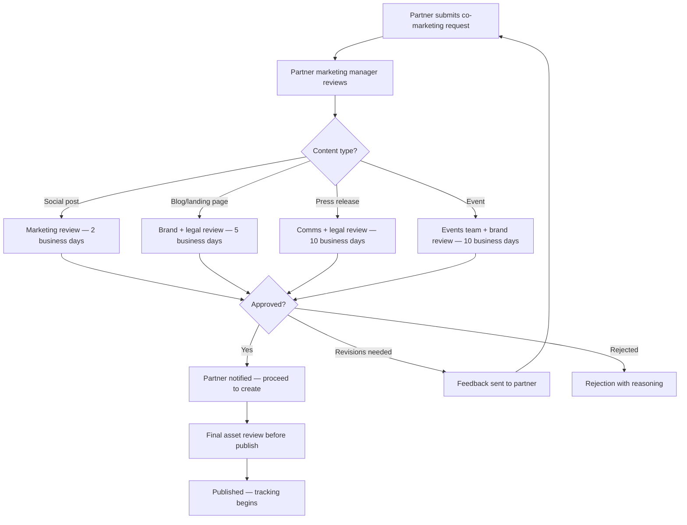

# Co-Marketing Playbook

> Co-marketing multiplies reach by combining your brand with your partners' audiences. This playbook defines the framework for joint content, events, co-branded landing pages, social campaigns, PR coordination, budget tracking, and metrics — turning partner relationships into marketing leverage without losing brand control.

---

## 1. Co-Marketing Framework

### 1.1 Program Structure

| Element | Description |
|---------|-------------|
| Annual budget | {{CO_MARKETING_BUDGET}} allocated across partner tiers |
| Budget allocation | 60% top-tier partners, 25% mid-tier, 15% emerging partners |
| Approval workflow | All co-marketing requires brand review before publishing |
| Planning cycle | Quarterly co-marketing plans aligned with product launches |
| Reporting cadence | Monthly co-marketing performance reports |

### 1.2 Co-Marketing Eligibility by Tier

| Activity | Bronze | Silver | Gold | Platinum |
|----------|--------|--------|------|----------|
| Social media co-promotion | Self-serve templates | Self-serve + review | Coordinated campaigns | Custom campaigns |
| Blog guest posts | Not eligible | One per quarter | Two per quarter | Unlimited |
| Joint webinars | Not eligible | One per year | One per quarter | Monthly cadence |
| Co-branded landing pages | Not eligible | Template-based | Custom design | Fully custom |
| Joint case studies | Not eligible | With permission | Priority | Dedicated writer |
| Event co-sponsorship | Not eligible | Not eligible | Shared booth option | Co-branded events |
| Press releases | Not eligible | Not eligible | Joint announcement | Co-authored |
| MDF (Market Development Funds) | Not eligible | Not eligible | Up to $5K/quarter | Up to $25K/quarter |

### 1.3 Approval Workflow



---

## 2. Joint Content

### 2.1 Content Types and Templates

| Content Type | Lead Time | Owner | Distribution |
|-------------|-----------|-------|-------------|
| Co-authored blog post | 3 weeks | Partner writes draft, you edit | Your blog + partner blog |
| Guest blog post | 2 weeks | Partner writes, you publish | Your blog |
| Joint ebook/whitepaper | 6 weeks | Collaborative writing | Both email lists, gated |
| Co-branded infographic | 3 weeks | Your design team, partner provides data | Social, blogs, email |
| Joint video/interview | 4 weeks | Your production, partner participates | YouTube, social, email |
| Customer success story | 4 weeks | Your writer interviews partner's customer | Both websites, sales collateral |

### 2.2 Content Guidelines

| Guideline | Rule |
|-----------|------|
| Brand voice | Must align with {{PROJECT_NAME}} voice and tone guidelines |
| Logo placement | Both logos, {{PROJECT_NAME}} logo minimum height: 40px |
| Color usage | Partner may use their colors for their section; shared sections use neutral |
| Claims | All performance claims require documented evidence |
| Competitor mentions | Never mention competitors negatively in co-marketing content |
| CTA placement | Each party gets one CTA — positioned equally |
| SEO | Target keywords agreed upon in advance; no keyword cannibalization |
| Approval | All content requires written approval from both parties before publishing |

---

## 3. Events

### 3.1 Event Types

| Event Type | Scale | Budget Range | Lead Time | Tier Requirement |
|-----------|-------|-------------|-----------|-----------------|
| Joint webinar | 50-500 attendees | $0-$2,000 | 4 weeks | Silver+ |
| Workshop / training | 10-50 attendees | $500-$5,000 | 6 weeks | Gold+ |
| Conference co-sponsorship | 500-5,000 attendees | $5,000-$50,000 | 12 weeks | Platinum |
| Partner summit (your event) | 50-200 partners | $10,000-$100,000 | 16 weeks | All tiers invited |
| Roadshow (multi-city) | 20-100 per city | $2,000-$10,000/city | 8 weeks | Platinum |
| Virtual roundtable | 10-30 attendees | $0-$500 | 2 weeks | Gold+ |

### 3.2 Webinar Playbook

| Phase | Timeline | Actions |
|-------|----------|---------|
| Planning | T-4 weeks | Agree on topic, speakers, target audience, KPIs |
| Content | T-3 weeks | Create slide deck, demo script, Q&A prep |
| Promotion | T-2 weeks | Email invites (both lists), social posts, blog announcement |
| Rehearsal | T-3 days | Tech check, run-through, backup plan |
| Live event | Day of | Host on Zoom/Teams, record, moderate Q&A |
| Follow-up | T+1 day | Send recording + slides to attendees |
| Nurture | T+1 week | Follow-up email sequence, lead handoff |
| Report | T+2 weeks | Performance report — registrations, attendance, leads generated |

---

## 4. Co-Branded Landing Pages

### 4.1 Landing Page Template

```html
<!-- co-marketing/partner-landing-page.html -->
<section class="hero">
  <div class="logos">
    
    <span class="plus">+</span>
    
  </div>
  <h1>{{JOINT_VALUE_PROPOSITION}}</h1>
  <p>{{JOINT_DESCRIPTION}}</p>
  <div class="cta-group">
    <a href="{{CTA_URL_PRIMARY}}" class="btn-primary">{{CTA_TEXT_PRIMARY}}</a>
    <a href="{{CTA_URL_SECONDARY}}" class="btn-secondary">{{CTA_TEXT_SECONDARY}}</a>
  </div>
</section>

<section class="benefits">
  <h2>Why {{PROJECT_NAME}} + {{PARTNER_NAME}}?</h2>
  <div class="benefit-grid">
    <!-- 3-4 joint benefits with icons -->
  </div>
</section>

<section class="social-proof">
  <h2>Trusted by leading companies</h2>
  <!-- Joint customer logos -->
  <!-- Joint testimonial/quote -->
</section>

<section class="form">
  <h2>Get Started</h2>
  <!-- Lead capture form — fields go to BOTH CRMs -->
  <!-- Hidden field: partner_id, utm_source, utm_medium, utm_campaign -->
</section>
```

### 4.2 Lead Routing Rules

| Scenario | Lead Goes To | Notification |
|----------|-------------|-------------|
| Form filled on co-branded page | Both CRMs simultaneously | Both partner and your team notified |
| Lead matches partner's territory | Partner gets first contact right | Your team CC'd |
| Lead matches your direct pipeline | Your team contacts; partner credited for sourcing | Partner notified of lead status |
| Neither party has relationship | Round-robin or agreed split | Both teams notified |

---

## 5. Social Media Co-Marketing

### 5.1 Social Playbook

| Platform | Content Type | Frequency | Approval |
|----------|-------------|-----------|----------|
| LinkedIn | Joint announcements, case studies, thought leadership | 2-4x/month | Pre-approved templates |
| Twitter/X | Product updates, event promotion, partner shoutouts | 4-8x/month | Pre-approved templates |
| YouTube | Joint demos, webinar recordings, interviews | 1-2x/month | Full review required |
| Instagram | Event photos, team culture, behind-the-scenes | 1-2x/month | Pre-approved templates |

### 5.2 Social Post Templates

**Partnership announcement:**
```
Exciting news! We've partnered with [@PartnerHandle] to bring you
[joint value proposition]. Together, we're helping [target audience]
[achieve outcome].

Learn more: [co-branded landing page URL]

#Partnership #[IndustryHashtag] #{{PROJECT_NAME}}
```

**Joint case study:**
```
How [@CustomerHandle] used {{PROJECT_NAME}} + [@PartnerHandle]
to [achieve specific result]:

[Key metric 1]
[Key metric 2]
[Key metric 3]

Read the full story: [case study URL]
```

**Webinar promotion:**
```
Join us and [@PartnerHandle] for a live session on [topic].

[Date] | [Time] | [Duration]

You'll learn:
- [Takeaway 1]
- [Takeaway 2]
- [Takeaway 3]

Register: [registration URL]
```

---

## 6. Press & PR Coordination

### 6.1 PR Types

| Announcement Type | Approval Required | Lead Time | Distribution |
|------------------|-------------------|-----------|-------------|
| Partnership announcement | Both comms teams | 4 weeks | Joint press release |
| Integration launch | Both product + comms | 3 weeks | Joint blog + press release |
| Joint customer win | Customer + both comms | 3 weeks | Case study + press release |
| Award/recognition | Relevant party's comms | 2 weeks | Social + press release |
| Conference talk | Both comms | 6 weeks | Event PR + social |

### 6.2 Press Release Template Structure

1. Joint headline with both company names
2. Subheadline with key value proposition
3. Quote from your executive
4. Quote from partner executive
5. Joint customer quote (if available)
6. Integration/partnership details
7. Availability and next steps
8. Both company boilerplates
9. Both media contact details

---

## 7. Budget Tracking

### 7.1 Budget Allocation Framework

| Category | % of {{CO_MARKETING_BUDGET}} | Purpose |
|----------|------------------------------|---------|
| Content creation | 25% | Blog posts, ebooks, case studies, infographics |
| Events | 30% | Webinars, workshops, conference sponsorships |
| Digital advertising | 20% | Paid social, retargeting, SEM for co-branded pages |
| Design & production | 10% | Landing pages, email templates, video production |
| MDF (Market Development Funds) | 10% | Direct partner marketing support |
| Contingency | 5% | Unplanned opportunities |

### 7.2 MDF (Market Development Funds) Rules

| Rule | Policy |
|------|--------|
| Eligibility | Gold and Platinum partners only |
| Maximum per quarter | Gold: $5,000 / Platinum: $25,000 |
| Approval | Pre-approval required before spending |
| Reimbursement | Submit receipts + results within 30 days |
| Eligible expenses | Events, advertising, content, demand gen |
| Ineligible expenses | Partner salaries, office expenses, travel |
| Performance requirement | Must demonstrate ROI — leads or pipeline generated |
| Unused MDF | Does not roll over to next quarter |

### 7.3 Budget Tracking Template

| Activity | Partner | Category | Planned Spend | Actual Spend | Leads Generated | Pipeline Created | ROI |
|----------|---------|----------|--------------|-------------|----------------|-----------------|-----|
| ___ | ___ | ___ | $___ | $___ | ___ | $___ | ___x |

---

## 8. Co-Marketing Metrics

### 8.1 KPIs

| Metric | Target | Measurement |
|--------|--------|-------------|
| Co-marketing sourced leads | 20% of total partner leads | CRM attribution |
| Co-marketing influenced pipeline | 15% of total pipeline | CRM multi-touch attribution |
| Webinar attendance rate | 40%+ of registrations | Webinar platform |
| Co-branded page conversion rate | 5%+ | Analytics |
| Social engagement rate | 3%+ on co-marketing posts | Social analytics |
| MDF ROI | 5x+ return on MDF spend | Lead and pipeline tracking |
| Partner content satisfaction | 8/10+ | Partner survey |
| Brand compliance rate | 100% | Manual audit |

### 8.2 Reporting Template

```
Co-Marketing Monthly Report — {{PARTNER_NAME}}
================================================
Period: [Month/Year]

Activities Completed:
  - [Activity 1]: [result]
  - [Activity 2]: [result]

Key Metrics:
  - Leads generated: ___
  - Pipeline influenced: $___
  - Budget spent: $___  (___% of allocation)
  - ROI: ___x

Upcoming Activities:
  - [Planned activity 1]: [date]
  - [Planned activity 2]: [date]

Budget Remaining: $___
```

---

## 9. Co-Marketing Checklist

- [ ] Co-marketing budget allocated by partner tier
- [ ] Approval workflow defined and communicated to partners
- [ ] Brand guidelines shared with all co-marketing partners
- [ ] Content templates created for each content type
- [ ] Co-branded landing page template deployed
- [ ] Lead routing rules configured for co-branded leads
- [ ] Social media post templates created and shared
- [ ] Webinar playbook documented and tested
- [ ] MDF application and reimbursement process defined
- [ ] Budget tracking spreadsheet or tool in place
- [ ] Monthly reporting template created
- [ ] KPIs defined and tracking configured
- [ ] Partner marketing portal section with downloadable assets
- [ ] Brand compliance audit scheduled (quarterly)
- [ ] Co-marketing calendar shared with all active partners
