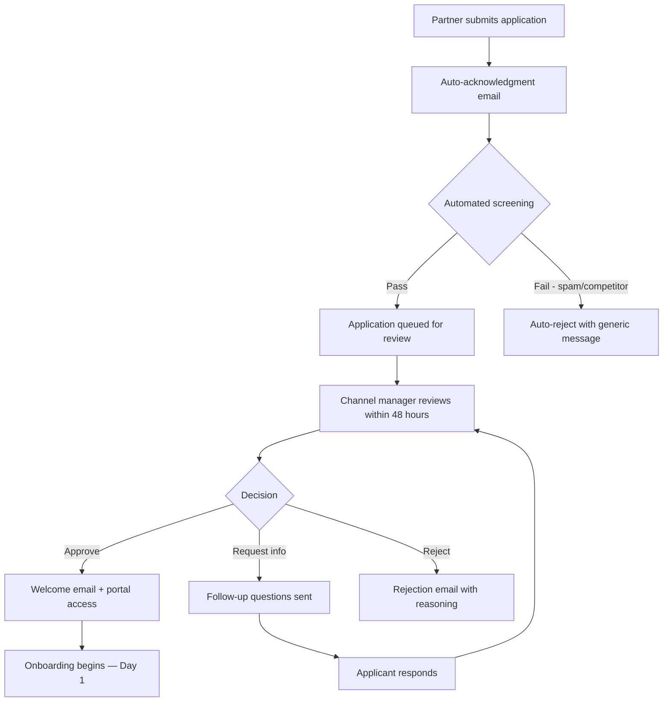

# Partner Onboarding

> The first {{PARTNER_ONBOARDING_DAYS}} days determine whether a partner becomes a revenue-generating channel or a dormant account. This template defines the complete partner onboarding journey — from application through evaluation, training, certification, and go-live — with the rigor and structure that turns new partners into productive sellers.

---

## 1. Partner Application

### 1.1 Application Form

| Field | Type | Required | Purpose |
|-------|------|----------|---------|
| Company name | Text | Yes | Identification |
| Company website | URL | Yes | Credibility verification |
| Company size (employees) | Select | Yes | Tier qualification |
| Annual revenue | Select | Yes | Capacity assessment |
| Primary contact name | Text | Yes | Relationship management |
| Primary contact email | Email | Yes | Communication |
| Primary contact phone | Phone | Yes | Escalation |
| Company address | Address | Yes | Territory mapping, tax |
| Industry vertical | Multi-select | Yes | Market alignment |
| Geographic coverage | Multi-select | Yes | Territory planning |
| Current customer count | Number | Yes | Channel capacity |
| Existing partnerships | Textarea | No | Ecosystem mapping |
| Why {{PROJECT_NAME}}? | Textarea | Yes | Motivation assessment |
| Desired partnership type | Select | Yes | Model alignment (reseller/affiliate/white-label/technology) |
| Expected first-year revenue | Select | Yes | Revenue potential |
| Sales team size | Number | Yes | Capacity planning |
| Technical team size | Number | Yes | Integration capability |
| How did you hear about our partner program? | Select | Yes | Partner recruitment channel tracking |
| Referral partner (if applicable) | Text | No | Referral attribution |

### 1.2 Application Submission Flow



---

## 2. Evaluation Scorecard

Rate each criterion from 1-5. Minimum total score for approval: 18/35 (Bronze), 25/35 (Silver), 30/35 (Gold auto-placement).

| Criterion | Weight | Score (1-5) | Notes |
|-----------|--------|-------------|-------|
| Market alignment — does their customer base match our ICP? | 2x | ___ | |
| Technical capability — can they implement/support the product? | 2x | ___ | |
| Sales capacity — do they have dedicated reps for our product? | 1.5x | ___ | |
| Geographic coverage — do they serve territories we want to grow in? | 1x | ___ | |
| Reputation — are they respected in their market? | 1.5x | ___ | |
| Commitment level — are they willing to invest in training and certification? | 1x | ___ | |
| Financial stability — can they sustain the partnership long-term? | 1x | ___ | |

### 2.1 Scoring Guide

| Score | Meaning | Evidence Required |
|-------|---------|-------------------|
| 5 — Exceptional | Best-in-class, clear strategic fit | References, case studies, market data |
| 4 — Strong | Above average, good alignment | Website review, LinkedIn research |
| 3 — Adequate | Meets minimum requirements | Application data |
| 2 — Weak | Below expectations in this area | Concerns documented |
| 1 — Poor | Significant gap, may be disqualifying | Specific reasons documented |

### 2.2 Automatic Disqualifiers

- [ ] Company is a direct competitor or subsidiary of a competitor
- [ ] Company has fewer than 2 employees (sole proprietor with no capacity)
- [ ] Company website is not functional or shows no relevant business activity
- [ ] Company is on sanctions list or in embargoed region
- [ ] Previous partnership was terminated for cause
- [ ] Company cannot agree to partner terms and conditions

---

## 3. Day 1-30 Onboarding Checklist

### Week 1 (Days 1-7): Setup & Access

- [ ] **Day 1:** Welcome email sent with partner portal credentials
- [ ] **Day 1:** Partner agreement signed (e-signature via DocuSign/PandaDoc)
- [ ] **Day 1:** Tax documents collected (W-9 / W-8BEN)
- [ ] **Day 1:** Partner portal account activated
- [ ] **Day 2:** Kickoff call scheduled with channel manager (30 min)
- [ ] **Day 2:** Partner added to partner Slack/Teams channel
- [ ] **Day 3:** Kickoff call completed — introductions, program overview, expectations
- [ ] **Day 3:** Partner provided with demo environment access
- [ ] **Day 5:** Partner admin completes portal orientation (self-service walkthrough)
- [ ] **Day 7:** Partner receives sales collateral kit (pitch deck, one-pagers, competitive battlecards)

### Week 2 (Days 8-14): Product Training

- [ ] **Day 8:** Product fundamentals training (2-hour live session or on-demand)
- [ ] **Day 9:** Product deep-dive: key features and differentiators (2 hours)
- [ ] **Day 10:** Demo environment hands-on practice
- [ ] **Day 11:** Competitive positioning training (1 hour)
- [ ] **Day 12:** Objection handling workshop (1 hour)
- [ ] **Day 14:** Product knowledge quiz (must score 80%+ to proceed)

### Week 3 (Days 15-21): Sales Enablement

- [ ] **Day 15:** Sales process training — how to position, demo, and close {{PROJECT_NAME}}
- [ ] **Day 16:** Deal registration training — how to register deals, rules, timelines
- [ ] **Day 17:** Pricing and discount training — partner pricing, margin controls, MAP policy
- [ ] **Day 18:** Partner delivers practice demo to channel manager (evaluated)
- [ ] **Day 19:** Practice demo feedback session
- [ ] **Day 20:** CRM integration setup (if applicable)
- [ ] **Day 21:** First pipeline review — identify 3-5 target accounts

### Week 4 (Days 22-{{PARTNER_ONBOARDING_DAYS}}): Certification & Go-Live

- [ ] **Day 22:** Technical certification exam (if applicable)
- [ ] **Day 23:** Sales certification exam (must score 85%+ to achieve "certified" status)
- [ ] **Day 24:** First deal registration submitted (real or practice)
- [ ] **Day 25:** Co-marketing plan drafted with channel manager
- [ ] **Day 26:** Partner listing activated on partner directory (if applicable)
- [ ] **Day 28:** Go-live readiness review with channel manager
- [ ] **Day {{PARTNER_ONBOARDING_DAYS}}:** Partner officially "active" — go-live confirmed

---

## 4. Training Modules

### 4.1 Training Curriculum

| Module | Duration | Format | Required For | Certification |
|--------|----------|--------|-------------|---------------|
| Product Fundamentals | 2 hours | Live or on-demand video | All partners | Quiz (80%+) |
| Product Deep-Dive | 2 hours | Live or on-demand video | Sales & technical | Quiz (80%+) |
| Sales Methodology | 1.5 hours | Live workshop | Sales reps | Practice demo |
| Competitive Positioning | 1 hour | On-demand video + battlecard | Sales reps | Quiz (80%+) |
| Technical Integration | 3 hours | Hands-on lab | Technical partners | Lab completion |
| Demo Mastery | 2 hours | Live workshop + practice | Sales reps | Evaluated demo |
| Deal Registration & Portal | 1 hour | Self-paced walkthrough | All partners | Portal exercise |
| Pricing & Discounting | 1 hour | Live or on-demand | Sales reps + managers | Quiz (80%+) |
| Support Escalation | 1 hour | On-demand + flowchart | Support staff | Process walkthrough |
| White-Label Configuration | 2 hours | Hands-on lab | White-label partners | Lab completion |

### 4.2 Training Delivery

| Method | When to Use | Tools |
|--------|-------------|-------|
| Live instructor-led | Kickoff training, workshops | Zoom, Google Meet |
| On-demand video | Product fundamentals, compliance | LMS (Lessonly, TalentLMS) |
| Hands-on lab | Technical integration, white-label config | Sandbox environment |
| Self-paced documentation | Portal orientation, process training | Partner portal knowledge base |
| Peer learning | Advanced topics, best practices | Partner community forum |

---

## 5. Certification Program

### 5.1 Certification Levels

| Level | Requirements | Badge | Benefits |
|-------|-------------|-------|----------|
| Certified Sales Rep | Complete sales training + 85% exam score | Bronze badge | Can register deals |
| Certified Technical Rep | Complete technical training + lab exercise | Bronze badge | Can access integration support |
| Advanced Sales | Certified + 3 closed deals + advanced training | Silver badge | Priority deal registration |
| Advanced Technical | Certified + 2 integrations completed + advanced lab | Silver badge | Direct engineering access |
| Expert | Advanced + 10 closed deals + annual recertification | Gold badge | Listed in partner directory, speaking opportunities |

### 5.2 Certification Expiration

| Aspect | Policy |
|--------|--------|
| Validity period | 12 months from certification date |
| Renewal method | Recertification exam (reduced — 30 minutes) + evidence of activity |
| Grace period | 30 days after expiration before status reverts |
| Lapsed certification | Must retake full certification to reinstate |
| New product versions | Delta training module required within 60 days of major release |

---

## 6. Technical Support for Partners

### 6.1 Support Tiers

| Support Level | Available To | Response Time | Channels | Hours |
|--------------|-------------|---------------|----------|-------|
| Standard | Bronze partners | 24 hours | Email, portal ticket | Business hours |
| Priority | Silver partners | 8 hours | Email, portal ticket, chat | Business hours |
| Premium | Gold partners | 4 hours | Email, ticket, chat, phone | Extended (7am-9pm) |
| Dedicated | Platinum partners | 1 hour | All + dedicated Slack channel | 24/7 |

### 6.2 Escalation Path

```
Partner Support Ticket
  └─→ Partner Support Team (Tier 1) — 80% resolution
        └─→ Product Support (Tier 2) — 15% resolution
              └─→ Engineering (Tier 3) — 4% resolution
                    └─→ VP Engineering (Critical) — 1%
```

---

## 7. Sales Enablement Kit

### 7.1 Collateral Package

| Asset | Format | Customizable | Update Frequency |
|-------|--------|-------------|-----------------|
| Product pitch deck | PPTX, Google Slides | Yes — add partner logo | Quarterly |
| One-page product overview | PDF | Yes — co-brand | Quarterly |
| Competitive battlecards | PDF | No — controlled content | Monthly |
| Customer case studies | PDF, web | Yes — co-brand with permission | As available |
| ROI calculator | Excel, web tool | No — standardized | Semi-annually |
| Demo script | PDF | Yes — adjust for vertical | Quarterly |
| Objection handling guide | PDF | No — controlled content | Quarterly |
| Email templates (prospecting) | Text | Yes — personalize | Quarterly |
| Social media post templates | Text + images | Yes — partner brand | Monthly |
| Webinar-in-a-box | Slide deck + script + email sequence | Yes — co-brand | Quarterly |

### 7.2 Asset Access by Tier

| Asset | Bronze | Silver | Gold | Platinum |
|-------|--------|--------|------|----------|
| Pitch deck | Standard | Standard + vertical | Custom | Custom + co-designed |
| Battlecards | Basic | Full | Full + quarterly briefing | Full + monthly briefing |
| Case studies | Public only | Public + partner-specific | All | All + custom case study development |
| ROI calculator | Web tool | Web tool + Excel | White-labeled tool | Custom-built |
| Demo environment | Shared | Dedicated | Dedicated + custom data | Dedicated + production-like |

---

## 8. Go-Live Criteria

The partner is "active" and eligible to register deals, earn commissions, and access full partner benefits only when ALL go-live criteria are met:

| Criterion | Verification Method | Required |
|-----------|-------------------|----------|
| Partner agreement signed | DocuSign/PandaDoc record | Yes |
| Tax documents on file (W-9 / W-8BEN) | Tax form storage | Yes |
| At least 1 certified sales rep | Certification system | Yes |
| At least 1 certified technical rep (if tech partner) | Certification system | Conditional |
| Portal orientation completed | Portal activity log | Yes |
| First deal registration submitted | Portal record | Yes |
| Demo delivered to channel manager | Channel manager sign-off | Yes |
| Payout method configured | Portal — bank/Stripe Connect | Yes |
| Co-marketing plan agreed | Documented plan | Recommended |
| First pipeline review completed | Channel manager notes | Yes |

---

## 9. Onboarding Checklist

- [ ] Application form captures all required information
- [ ] Evaluation scorecard defined with minimum thresholds
- [ ] Automated screening rules configured (spam, competitor detection)
- [ ] Welcome email template created with portal credentials
- [ ] Partner agreement template ready for e-signature
- [ ] Tax document collection integrated into onboarding flow
- [ ] Demo environment provisioning automated
- [ ] Training curriculum published and accessible
- [ ] Certification exams built and scoring configured
- [ ] Sales collateral kit packaged and downloadable
- [ ] Partner support escalation path documented
- [ ] Go-live criteria checklist enforced in portal
- [ ] Channel manager onboarding playbook documented
- [ ] 30/60/90 day check-in cadence scheduled
- [ ] Partner NPS survey configured at Day 30
- [ ] Onboarding completion rate tracked as program metric
