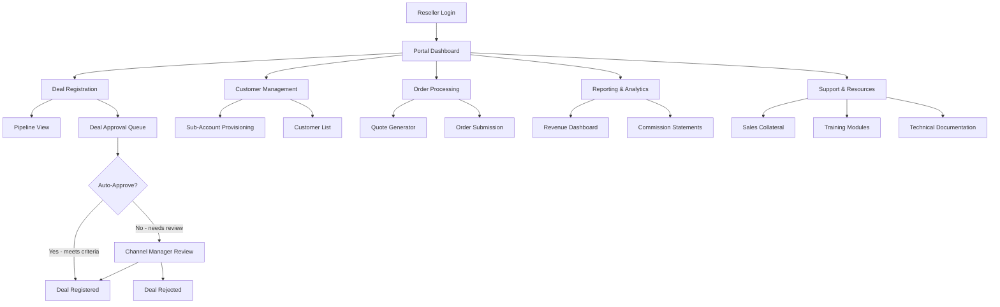

# Reseller Portal

> The command center for your reseller partners. This portal handles deal registration, customer management, margin controls, order processing, and performance reporting — everything a reseller needs to sell {{PROJECT_NAME}} without calling your team for every transaction.

---

## 1. Portal Architecture

### 1.1 System Overview



### 1.2 Authentication & Access

| Role | Access Level | Capabilities |
|------|-------------|--------------|
| Partner Admin | Full portal access | Manage users, view all deals, access reports, configure settings |
| Partner Sales Rep | Deal management | Register deals, manage assigned customers, view own pipeline |
| Partner Support | Customer view | View customer details, submit support tickets, access KB |
| Partner Finance | Billing access | View commissions, download statements, manage payout settings |
| {{PROJECT_NAME}} Channel Manager | Admin override | Review deals, adjust margins, view all partner data |

---

## 2. Deal Registration

Deal registration protects resellers from channel conflict by giving them exclusive rights to pursue a specific opportunity for a defined period.

### 2.1 Registration Form

| Field | Type | Required | Validation |
|-------|------|----------|------------|
| Customer company name | Text | Yes | Duplicate check against existing registrations |
| Customer domain | URL | Yes | Must be valid domain, not a free email provider |
| Primary contact name | Text | Yes | — |
| Primary contact email | Email | Yes | Must match customer domain |
| Primary contact phone | Phone | No | — |
| Estimated deal value (annual) | Currency | Yes | Must exceed minimum deal size (${{MINIMUM_DEAL_SIZE}}) |
| Expected close date | Date | Yes | Must be within 90 days |
| Number of seats/licenses | Number | Yes | Must be >= 1 |
| Product tier | Select | Yes | Options from pricing tiers |
| Sales stage | Select | Yes | Discovery / Demo / Proposal / Negotiation |
| Competitive situation | Multi-select | No | Competitor names |
| Notes / context | Textarea | No | Max 2000 characters |

### 2.2 Deal Registration Rules

| Rule | Value | Rationale |
|------|-------|-----------|
| Exclusivity period | 90 days from registration | Enough time to close without indefinite lockup |
| Extension policy | One 30-day extension upon request with evidence of active pursuit | Prevents gaming while protecting active deals |
| Duplicate handling | First registered wins; second registrant notified | Clear, objective rule eliminates disputes |
| Auto-expiration | Deal status set to "expired" after exclusivity period + extension | Prevents stale registrations from blocking future opportunities |
| Maximum active deals | 20 per Bronze, 50 per Silver, 100 per Gold, unlimited Platinum | Prevents spec-registration of entire market |
| Minimum deal size | Configurable per partner tier | Prevents registration of deals too small to justify protection |

### 2.3 Approval Workflow

```typescript
// services/deal-registration.ts
interface DealRegistration {
  id: string;
  partnerId: string;
  partnerTier: 'bronze' | 'silver' | 'gold' | 'platinum';
  customerDomain: string;
  estimatedACV: number;
  expectedCloseDate: Date;
  status: 'pending' | 'approved' | 'rejected' | 'expired' | 'won' | 'lost';
}

export async function processDealRegistration(
  deal: DealRegistration
): Promise<ApprovalResult> {
  // Step 1: Duplicate check
  const existing = await db.dealRegistrations.findFirst({
    where: {
      customerDomain: deal.customerDomain,
      status: { in: ['approved', 'pending'] },
      expiresAt: { gt: new Date() },
    },
  });

  if (existing) {
    return {
      status: 'rejected',
      reason: `Customer already registered by another partner (Deal #${existing.id})`,
      existingDealId: existing.id,
    };
  }

  // Step 2: Check against direct pipeline
  const directOpportunity = await crm.findOpportunity({
    domain: deal.customerDomain,
    stage: { notIn: ['closed_won', 'closed_lost'] },
  });

  if (directOpportunity) {
    return {
      status: 'needs_review',
      reason: 'Customer exists in direct sales pipeline — channel manager review required',
      directOpportunityId: directOpportunity.id,
    };
  }

  // Step 3: Auto-approve if criteria met
  const autoApprove = deal.partnerTier !== 'bronze' && deal.estimatedACV >= 5000;

  if (autoApprove) {
    await db.dealRegistrations.update({
      where: { id: deal.id },
      data: {
        status: 'approved',
        approvedAt: new Date(),
        expiresAt: addDays(new Date(), 90),
        approvedBy: 'system',
      },
    });

    return { status: 'approved', expiresAt: addDays(new Date(), 90) };
  }

  // Step 4: Queue for manual review
  return {
    status: 'pending',
    reason: 'Deal queued for channel manager review (Bronze tier or below auto-approve threshold)',
    estimatedReviewTime: '24 hours',
  };
}
```

---

## 3. Customer Management

### 3.1 Sub-Account Provisioning

Resellers can provision customer accounts directly from the portal without involving your team.

| Provisioning Step | Automated | Manual |
|------------------|-----------|--------|
| Create tenant/workspace | Yes — API call to provisioning service | — |
| Assign product tier | Yes — based on deal registration | Upgrade/downgrade requires approval |
| Set seat count | Yes — from deal registration | Overage alerts at 90% utilization |
| Configure SSO | No | Partner provides IDP metadata |
| Apply custom domain | No | Requires DNS verification |
| Enable features | Yes — tier-based feature flags | Custom feature requests need approval |

### 3.2 Customer Lifecycle View

```
┌─────────────────────────────────────────────────────────────┐
│ Customer: Acme Corp                                         │
│ Status: Active    │ Tier: Professional    │ Seats: 50/75    │
├─────────────────────────────────────────────────────────────┤
│                                                             │
│  Timeline:                                                  │
│  ──●──────────●──────────●──────────●──────────●──────────  │
│    │          │          │          │          │             │
│  Deal Reg   Won      Provisioned  Expanded   Renewal       │
│  Jan 15    Mar 1     Mar 5       Jun 15     Feb 28         │
│                                                             │
│  Health Score: 85/100  ████████████████░░░                  │
│  Usage (30d): 78% active seats                              │
│  NPS: 42                                                    │
│  Open Tickets: 2                                            │
│  Revenue (YTD): $45,000                                     │
│  Commission (YTD): $11,250                                  │
│                                                             │
│  [Manage Account]  [View Usage]  [Submit Ticket]  [Renew]   │
└─────────────────────────────────────────────────────────────┘
```

---

## 4. Margin & Discount Controls

### 4.1 Pricing Structure

| Partner Tier | Wholesale Discount | Maximum Additional Discount | Net Margin Range |
|-------------|-------------------|---------------------------|-----------------|
| Bronze | {{PARTNER_REVENUE_SHARE}}% off list | 0% | {{PARTNER_REVENUE_SHARE}}% |
| Silver | {{PARTNER_REVENUE_SHARE}}% + 5% off list | 5% additional | {{PARTNER_REVENUE_SHARE}}%-{{PARTNER_REVENUE_SHARE}}+5% |
| Gold | {{PARTNER_REVENUE_SHARE}}% + 10% off list | 10% additional | {{PARTNER_REVENUE_SHARE}}%-{{PARTNER_REVENUE_SHARE}}+10% |
| Platinum | {{PARTNER_REVENUE_SHARE}}% + 15% off list | 15% additional (with approval) | {{PARTNER_REVENUE_SHARE}}%-{{PARTNER_REVENUE_SHARE}}+15% |

### 4.2 Discount Approval Matrix

| Discount Level | Bronze | Silver | Gold | Platinum |
|---------------|--------|--------|------|----------|
| Standard wholesale | Auto-approved | Auto-approved | Auto-approved | Auto-approved |
| Up to 5% additional | Denied | Auto-approved | Auto-approved | Auto-approved |
| 5-10% additional | Denied | Channel manager | Auto-approved | Auto-approved |
| 10-15% additional | Denied | Denied | Channel manager | Auto-approved |
| 15%+ additional | Denied | Denied | Denied | VP Sales approval |

### 4.3 Minimum Advertised Price (MAP) Enforcement

- [ ] MAP policy defined and communicated to all partners
- [ ] Automated price monitoring on partner websites
- [ ] First violation: written warning with 7-day cure period
- [ ] Second violation: 30-day suspension of deal registration
- [ ] Third violation: partnership termination review

---

## 5. Reporting & Analytics

### 5.1 Partner Dashboard Metrics

| Metric | Calculation | Refresh Rate |
|--------|------------|--------------|
| Active customers | Count of provisioned, non-churned accounts | Real-time |
| Total ARR | Sum of active customer annual values | Daily |
| Pipeline value | Sum of approved deal registrations | Real-time |
| Win rate | Won deals / (Won + Lost deals) | Weekly |
| Average deal size | Total won revenue / Won deal count | Monthly |
| Commission earned (period) | Sum of commissions for selected period | Daily |
| Commission pending | Earned but not yet paid | Real-time |
| Customer health | Average health score across portfolio | Daily |
| Churn rate | Churned customers / Total customers (trailing 12M) | Monthly |
| Tier progress | Current metric values vs. next tier thresholds | Real-time |

### 5.2 Downloadable Reports

| Report | Format | Frequency |
|--------|--------|-----------|
| Commission statement | PDF, CSV | Monthly (auto-generated) |
| Pipeline report | CSV | On-demand |
| Customer list | CSV | On-demand |
| Deal registration history | CSV | On-demand |
| Revenue by customer | CSV, PDF | Quarterly (auto-generated) |
| Tier qualification scorecard | PDF | Annual (auto-generated) |

---

## 6. Order Processing

### 6.1 Order Workflow

| Stage | Action | System Behavior |
|-------|--------|----------------|
| Quote | Reseller generates quote in portal | Auto-calculate pricing with tier discount |
| Submit | Reseller submits order | Validate against deal registration, check credit |
| Approve | Auto-approve or channel manager review | Depends on order value and partner tier |
| Provision | System creates customer account | Trigger provisioning API, send welcome email |
| Invoice | Generate partner invoice | Net of wholesale discount, payment terms per tier |
| Activate | Customer account goes live | Health monitoring begins, partner notified |

### 6.2 Order API

```typescript
// api/v1/partner/orders.ts
interface CreateOrderRequest {
  dealRegistrationId: string;
  customerDetails: {
    companyName: string;
    domain: string;
    adminEmail: string;
    adminName: string;
  };
  subscription: {
    productTierId: string;
    seatCount: number;
    billingCycle: 'monthly' | 'annual';
    startDate: string;  // ISO 8601
    additionalDiscountPercent?: number;
  };
  notes?: string;
}

interface OrderResponse {
  orderId: string;
  status: 'submitted' | 'approved' | 'provisioning' | 'active' | 'rejected';
  partnerPrice: number;      // What the partner pays
  listPrice: number;         // What the end-customer would pay direct
  partnerMargin: number;     // Difference
  estimatedCommission: number;
  provisioningUrl?: string;  // Customer setup link (when active)
}
```

---

## 7. Sub-Account Provisioning API

```typescript
// api/v1/partner/provision.ts
interface ProvisionAccountRequest {
  partnerId: string;
  orderId: string;
  tenant: {
    name: string;
    slug: string;           // URL-safe identifier
    adminEmail: string;
    adminName: string;
    productTier: string;
    seatCount: number;
    features: string[];     // Feature flag keys
    branding?: {
      logo?: string;
      primaryColor?: string;
    };
  };
}

interface ProvisionAccountResponse {
  tenantId: string;
  status: 'provisioning' | 'active' | 'failed';
  adminLoginUrl: string;
  adminTempPassword: string;  // One-time, must change on first login
  apiKey: string;             // Tenant API key
  estimatedReadyAt: string;   // ISO 8601
  webhookUrl: string;         // URL to receive provisioning status updates
}

// Provisioning status webhook payload
interface ProvisioningWebhook {
  event: 'provisioning.started' | 'provisioning.completed' | 'provisioning.failed';
  tenantId: string;
  orderId: string;
  partnerId: string;
  timestamp: string;
  details?: {
    loginUrl?: string;
    errorMessage?: string;
    retryable?: boolean;
  };
}
```

---

## 8. Portal API Integration

### 8.1 API Endpoints Summary

| Endpoint | Method | Purpose |
|----------|--------|---------|
| `/api/v1/partner/deals` | GET | List deal registrations |
| `/api/v1/partner/deals` | POST | Register new deal |
| `/api/v1/partner/deals/:id` | GET | Get deal details |
| `/api/v1/partner/deals/:id/extend` | POST | Request deal extension |
| `/api/v1/partner/customers` | GET | List partner's customers |
| `/api/v1/partner/customers/:id` | GET | Get customer details |
| `/api/v1/partner/customers/:id/usage` | GET | Get customer usage metrics |
| `/api/v1/partner/orders` | POST | Submit new order |
| `/api/v1/partner/orders/:id` | GET | Get order status |
| `/api/v1/partner/provision` | POST | Provision customer account |
| `/api/v1/partner/commissions` | GET | List commission statements |
| `/api/v1/partner/commissions/:period` | GET | Get period commission detail |
| `/api/v1/partner/reports/:type` | GET | Generate report |
| `/api/v1/partner/profile` | GET | Get partner profile & tier info |
| `/api/v1/partner/resources` | GET | List sales & training resources |

### 8.2 Authentication

All portal API requests require:
- `Authorization: Bearer <partner_api_key>`
- `X-Partner-ID: <partner_id>`
- Rate limit: 100 requests/minute per partner

---

## 9. Reseller Portal Checklist

- [ ] Partner authentication and role-based access implemented
- [ ] Deal registration form with duplicate detection deployed
- [ ] Deal approval workflow (auto + manual) tested
- [ ] Customer provisioning API integrated and tested
- [ ] Margin and discount controls enforced at order submission
- [ ] MAP monitoring system active
- [ ] Dashboard metrics calculating correctly
- [ ] Commission statements generating accurately
- [ ] Downloadable reports functional (CSV, PDF)
- [ ] Order processing workflow end-to-end tested
- [ ] Sub-account provisioning completes within SLA (< 5 minutes)
- [ ] Partner notification emails (deal status, order updates) sending
- [ ] Sales collateral and training resources uploaded
- [ ] Portal performance: page load < 2 seconds
- [ ] Mobile-responsive portal layout verified
