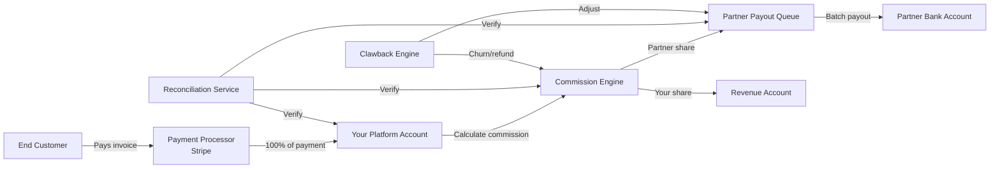

# Revenue Sharing Models

> The financial engine of your partner program. How you share revenue with partners determines whether they invest in selling {{PROJECT_NAME}} or promote a competitor instead. This template designs the commission structure, payment flow, reconciliation process, and payout infrastructure that keeps partners motivated and financially aligned.

---

## 1. Revenue Sharing Models Comparison

| Model | How It Works | Best For | Typical Range | Complexity |
|-------|-------------|----------|---------------|------------|
| Recurring revenue share | Partner earns a percentage of customer revenue for the lifetime of the account | Resellers, white-label | 20-40% | High |
| First-year commission | Partner earns a percentage of first-year revenue only | Referral partners | 15-30% | Medium |
| One-time bounty | Partner earns a flat fee per qualified lead or closed deal | Affiliate, referral | $50-$500 | Low |
| Tiered recurring | Revenue share percentage increases with volume | High-volume resellers | 20-40% (scaling) | High |
| Margin-based | Partner buys at wholesale, sets their own retail price | VARs, distributors | 25-45% discount | Medium |
| Hybrid | Combination — e.g., one-time bonus + ongoing recurring share | Enterprise partners | Varies | Very high |

### 1.1 Model Selection Matrix

| Factor | Recurring Share | First-Year Only | One-Time Bounty | Margin-Based |
|--------|----------------|-----------------|-----------------|-------------|
| Partner retention incentive | High | Low | None | Medium |
| Your margin impact (long-term) | High | Medium | Low | Medium |
| Partner attractiveness | Very high | Medium | Low | High |
| Accounting complexity | High | Medium | Low | Medium |
| Channel conflict risk | Medium | Low | Low | High |
| Partner quality alignment | High | Medium | Low | Medium |

**Recommendation for {{PROJECT_NAME}}:**

<!-- IF {{PARTNER_MODEL}} == "reseller" -->
Use **Tiered Recurring Revenue Share** at {{PARTNER_REVENUE_SHARE}}% base rate. Resellers need ongoing income to justify their investment in your product. One-time bounties will not motivate resellers to provide post-sale support.
<!-- ENDIF -->

<!-- IF {{PARTNER_MODEL}} == "affiliate" -->
Use **First-Year Commission** at {{AFFILIATE_COMMISSION}}% with a {{AFFILIATE_COOKIE_DAYS}}-day cookie window. Affiliates drive traffic but do not manage accounts, so ongoing revenue share is not justified. Pay on conversion, not on ongoing retention.
<!-- ENDIF -->

<!-- IF {{PARTNER_MODEL}} == "white-label" -->
Use **Recurring Revenue Share** at {{PARTNER_REVENUE_SHARE}}% or higher. White-label partners invest heavily in branding, sales, and support. They need recurring income to justify that investment. Consider 60/40 or 70/30 splits (in partner's favor) for high-volume partners.
<!-- ENDIF -->

---

## 2. Payment Flow

### 2.1 Revenue Flow Architecture



### 2.2 Payment Processing Timeline

| Event | Timing | Action |
|-------|--------|--------|
| Customer pays invoice | Day 0 | Payment captured by Stripe |
| Payment confirmed (not disputed) | Day 1 | Commission calculated and recorded |
| Holdback period | Days 1-30 | Commission accrues but is not payable (churn protection) |
| Commission becomes payable | Day 30 | Added to next payout batch |
| Payout batch runs | 1st and 15th of month | All payable commissions batched |
| Partner receives payout | Payout day + 2-3 business days | Bank transfer or Stripe Connect payout |
| Clawback window | 90 days from payment | If customer churns within 90 days, commission is clawed back |

---

## 3. Commission Reconciliation

### 3.1 Reconciliation Process

| Step | Frequency | Description |
|------|-----------|-------------|
| Payment ingestion | Real-time | Every Stripe payment event is captured and matched to a partner |
| Attribution verification | Real-time | Verify the deal registration, affiliate link, or referral code that sourced the customer |
| Commission calculation | Daily | Calculate commission based on payment amount, partner tier, and revenue share % |
| Holdback application | Daily | Flag commissions within holdback period as "accruing" |
| Dispute resolution | As needed | Handle attribution disputes between partners or between partner and direct |
| Payout batch preparation | Semi-monthly | Aggregate all payable commissions per partner |
| Partner statement generation | Monthly | Generate detailed commission statement for each partner |
| Annual reconciliation | Annually | Full audit of all commissions paid vs. revenue received |

### 3.2 Reconciliation Database Schema

```sql
CREATE TABLE commissions (
  id                UUID PRIMARY KEY DEFAULT gen_random_uuid(),
  partner_id        UUID NOT NULL REFERENCES partners(id),
  customer_id       UUID NOT NULL REFERENCES customers(id),
  payment_id        VARCHAR(255) NOT NULL,        -- Stripe payment intent ID
  payment_amount    DECIMAL(10,2) NOT NULL,        -- Gross payment received
  commission_rate   DECIMAL(5,4) NOT NULL,          -- e.g., 0.2500 for 25%
  commission_amount DECIMAL(10,2) NOT NULL,        -- Calculated commission
  currency          VARCHAR(3) NOT NULL DEFAULT 'USD',
  status            VARCHAR(20) NOT NULL DEFAULT 'accruing',
  -- accruing → payable → batched → paid → clawed_back
  holdback_until    TIMESTAMPTZ NOT NULL,
  payable_at        TIMESTAMPTZ,
  payout_batch_id   UUID REFERENCES payout_batches(id),
  paid_at           TIMESTAMPTZ,
  clawed_back_at    TIMESTAMPTZ,
  clawback_reason   TEXT,
  created_at        TIMESTAMPTZ NOT NULL DEFAULT NOW(),
  updated_at        TIMESTAMPTZ NOT NULL DEFAULT NOW()
);

CREATE TABLE payout_batches (
  id                UUID PRIMARY KEY DEFAULT gen_random_uuid(),
  partner_id        UUID NOT NULL REFERENCES partners(id),
  total_amount      DECIMAL(10,2) NOT NULL,
  commission_count  INTEGER NOT NULL,
  currency          VARCHAR(3) NOT NULL DEFAULT 'USD',
  status            VARCHAR(20) NOT NULL DEFAULT 'pending',
  -- pending → processing → completed → failed
  stripe_transfer_id VARCHAR(255),
  initiated_at      TIMESTAMPTZ,
  completed_at      TIMESTAMPTZ,
  failed_reason     TEXT,
  created_at        TIMESTAMPTZ NOT NULL DEFAULT NOW()
);

CREATE INDEX idx_commissions_partner ON commissions(partner_id, status);
CREATE INDEX idx_commissions_payment ON commissions(payment_id);
CREATE INDEX idx_commissions_status ON commissions(status, holdback_until);
CREATE INDEX idx_payout_batches_partner ON payout_batches(partner_id, status);
```

---

## 4. Commission Engine

### 4.1 Commission Calculation

```typescript
// services/commission-engine.ts
interface CommissionInput {
  partnerId: string;
  customerId: string;
  paymentId: string;
  paymentAmount: number;
  paymentCurrency: string;
  paymentType: 'new' | 'renewal' | 'expansion' | 'one-time';
}

interface CommissionResult {
  commissionAmount: number;
  commissionRate: number;
  holdbackUntil: Date;
  appliedRules: string[];
}

export async function calculateCommission(
  input: CommissionInput
): Promise<CommissionResult> {
  const partner = await db.partners.findUnique({
    where: { id: input.partnerId },
    include: { tier: true, overrides: true },
  });

  if (!partner) throw new Error(`Partner not found: ${input.partnerId}`);

  const rules: string[] = [];
  let rate = partner.tier.baseCommissionRate; // e.g., 0.25

  // Rule 1: Payment type adjustment
  if (input.paymentType === 'renewal') {
    rate = partner.tier.renewalCommissionRate || rate;
    rules.push(`Renewal rate: ${rate * 100}%`);
  } else if (input.paymentType === 'expansion') {
    rate = partner.tier.expansionCommissionRate || rate;
    rules.push(`Expansion rate: ${rate * 100}%`);
  } else {
    rules.push(`New business rate: ${rate * 100}%`);
  }

  // Rule 2: Partner-specific override
  const override = partner.overrides.find(o => o.type === 'commission_rate');
  if (override) {
    rate = parseFloat(override.value);
    rules.push(`Partner override applied: ${rate * 100}%`);
  }

  // Rule 3: Volume accelerator
  const ytdRevenue = await getPartnerYTDRevenue(input.partnerId);
  const accelerator = getVolumeAccelerator(ytdRevenue, partner.tier);
  if (accelerator > 0) {
    rate += accelerator;
    rules.push(`Volume accelerator: +${accelerator * 100}% (YTD: $${ytdRevenue})`);
  }

  // Rule 4: Cap at maximum rate
  const maxRate = 0.45; // Never exceed 45%
  if (rate > maxRate) {
    rate = maxRate;
    rules.push(`Capped at maximum rate: ${maxRate * 100}%`);
  }

  const commissionAmount = Math.round(input.paymentAmount * rate * 100) / 100;
  const holdbackDays = partner.tier.holdbackDays || 30;

  return {
    commissionAmount,
    commissionRate: rate,
    holdbackUntil: addDays(new Date(), holdbackDays),
    appliedRules: rules,
  };
}

function getVolumeAccelerator(ytdRevenue: number, tier: PartnerTier): number {
  const thresholds = tier.volumeAccelerators || [];
  // [ { threshold: 100000, bonus: 0.02 }, { threshold: 250000, bonus: 0.05 } ]

  let bonus = 0;
  for (const t of thresholds) {
    if (ytdRevenue >= t.threshold) bonus = t.bonus;
  }
  return bonus;
}
```

---

## 5. Payout Processing

### 5.1 Payout Methods

| Method | Minimum Payout | Processing Time | Fees | Best For |
|--------|---------------|-----------------|------|----------|
| Stripe Connect (ACH) | $50 | 2-3 business days | Free | US partners |
| Stripe Connect (Wire) | $500 | 1-2 business days | $25/transfer | International partners |
| PayPal | $25 | 1 business day | 2-3% | Small affiliates |
| Manual wire transfer | $1,000 | 3-5 business days | $30-$50 | Enterprise partners |

### 5.2 Stripe Connect Payout Code

```typescript
// services/payout-processor.ts
import Stripe from 'stripe';

const stripe = new Stripe(process.env.STRIPE_SECRET_KEY!);

export async function processPayoutBatch(batchId: string): Promise<PayoutResult> {
  const batch = await db.payoutBatches.findUnique({
    where: { id: batchId },
    include: { partner: true, commissions: true },
  });

  if (!batch || batch.status !== 'pending') {
    throw new Error(`Invalid batch: ${batchId}`);
  }

  // Update status to processing
  await db.payoutBatches.update({
    where: { id: batchId },
    data: { status: 'processing', initiatedAt: new Date() },
  });

  try {
    // Create transfer to partner's Connected Account
    const transfer = await stripe.transfers.create({
      amount: Math.round(batch.totalAmount * 100), // Stripe uses cents
      currency: batch.currency.toLowerCase(),
      destination: batch.partner.stripeConnectedAccountId,
      description: `Commission payout — ${batch.commissionCount} commissions`,
      metadata: {
        batchId: batch.id,
        partnerId: batch.partnerId,
        period: format(new Date(), 'yyyy-MM'),
      },
    });

    // Update batch and commissions
    await db.$transaction([
      db.payoutBatches.update({
        where: { id: batchId },
        data: {
          status: 'completed',
          stripeTransferId: transfer.id,
          completedAt: new Date(),
        },
      }),
      db.commissions.updateMany({
        where: { payoutBatchId: batchId },
        data: { status: 'paid', paidAt: new Date() },
      }),
    ]);

    // Send payout notification email
    await sendPartnerPayoutNotification(batch.partner, batch);

    return { status: 'completed', transferId: transfer.id };
  } catch (error) {
    await db.payoutBatches.update({
      where: { id: batchId },
      data: { status: 'failed', failedReason: error.message },
    });

    // Alert channel operations team
    await alertChannelOps('Payout failed', { batchId, error: error.message });

    return { status: 'failed', error: error.message };
  }
}
```

---

## 6. Tax Compliance (1099 / W-9)

### 6.1 US Tax Requirements

| Requirement | Threshold | Action |
|------------|-----------|--------|
| W-9 collection | Before first payout | Partner must submit W-9 during onboarding |
| 1099-NEC filing | $600+ in calendar year | File 1099-NEC with IRS by January 31 |
| 1099-K filing | $600+ via payment network (Stripe) | Stripe handles for Connect accounts |
| State filing | Varies by state | File with applicable state tax agencies |
| Backup withholding | If W-9 not provided | Withhold 24% of payments |

### 6.2 International Tax Considerations

| Region | Form | Requirement |
|--------|------|-------------|
| International (non-US) | W-8BEN / W-8BEN-E | Required for treaty benefits |
| EU | VAT registration | Verify partner VAT number |
| UK | Self-assessment | Partner's responsibility |
| Canada | T4A-NR | Withhold 25% unless treaty applies |

### 6.3 Tax Document Collection

- [ ] W-9 / W-8BEN collection integrated into partner onboarding
- [ ] Tax form validation (TIN verification via IRS e-Services)
- [ ] Annual 1099-NEC generation automated
- [ ] Tax withholding rules enforced (24% backup withholding if no W-9)
- [ ] International withholding rates applied per treaty
- [ ] Tax document storage compliant with retention requirements (7 years)

---

## 7. Attribution Rules

### 7.1 Attribution Models

| Model | How It Works | Best For | Risk |
|-------|-------------|----------|------|
| First touch | Credit goes to the partner who first referred the customer | Simple programs | Ignores partners who influenced later in the journey |
| Last touch | Credit goes to the partner whose link was last clicked | Affiliate programs | Incentivizes cookie stuffing and last-click gaming |
| Deal registration | Credit goes to the partner who registered the deal | Reseller programs | Requires enforcement of registration rules |
| Multi-touch | Credit split among all partners who contributed | Complex programs | Attribution disputes, fractional commissions |
| Qualified lead | Credit when partner-sourced lead meets qualification criteria | Referral programs | Disputes over qualification criteria |

**{{PROJECT_NAME}} attribution policy:** `{{CHANNEL_CONFLICT_POLICY}}`

### 7.2 Attribution Priority

1. Active deal registration (reseller model) — highest priority
2. Affiliate tracking cookie (within {{AFFILIATE_COOKIE_DAYS}}-day window)
3. Referral code in signup URL
4. UTM parameters matching partner campaign
5. Direct (no partner attribution) — default

---

## 8. Clawback Rules

### 8.1 Clawback Triggers

| Trigger | Clawback Amount | Timing |
|---------|----------------|--------|
| Customer churns within 90 days | 100% of commission | Immediate |
| Customer churns within 91-180 days | 50% of commission | Next payout cycle |
| Customer downgrades within 90 days | Difference between tiers | Next payout cycle |
| Customer requests refund | 100% of commission on refunded amount | Immediate |
| Fraudulent referral detected | 100% of all commissions from that source | Immediate, plus investigation |
| Partner violates MAP policy | Forfeit current month's commission | After investigation |

### 8.2 Clawback Processing

```typescript
// services/clawback-engine.ts
export async function processClawback(
  customerId: string,
  reason: ClawbackReason,
  churnDate: Date
): Promise<ClawbackResult> {
  // Find all commissions paid for this customer
  const commissions = await db.commissions.findMany({
    where: {
      customerId,
      status: { in: ['payable', 'paid'] },
    },
    orderBy: { createdAt: 'desc' },
  });

  const clawbacks: ClawbackEntry[] = [];

  for (const commission of commissions) {
    const daysSincePayment = differenceInDays(churnDate, commission.createdAt);
    let clawbackPercent = 0;

    if (daysSincePayment <= 90) {
      clawbackPercent = 1.0; // 100%
    } else if (daysSincePayment <= 180) {
      clawbackPercent = 0.5; // 50%
    }
    // Beyond 180 days: no clawback

    if (clawbackPercent > 0) {
      const clawbackAmount = commission.commissionAmount * clawbackPercent;

      await db.commissions.update({
        where: { id: commission.id },
        data: {
          status: 'clawed_back',
          clawedBackAt: new Date(),
          clawbackReason: reason,
        },
      });

      clawbacks.push({
        commissionId: commission.id,
        originalAmount: commission.commissionAmount,
        clawbackAmount,
        clawbackPercent,
      });
    }
  }

  // Deduct from next payout
  if (clawbacks.length > 0) {
    const totalClawback = clawbacks.reduce((sum, c) => sum + c.clawbackAmount, 0);
    await createClawbackDeduction(commissions[0].partnerId, totalClawback, reason);
  }

  return { clawbacks, totalClawedBack: clawbacks.reduce((s, c) => s + c.clawbackAmount, 0) };
}
```

---

## 9. Revenue Sharing Checklist

- [ ] Revenue sharing model selected and documented
- [ ] Commission rates defined per partner tier
- [ ] Commission engine calculating correctly for all payment types (new, renewal, expansion)
- [ ] Holdback period configured and enforced ({{HOLDBACK_DAYS}} days)
- [ ] Payout processing automated (Stripe Connect or alternative)
- [ ] Minimum payout thresholds configured
- [ ] Tax document collection integrated into onboarding (W-9 / W-8BEN)
- [ ] 1099-NEC generation automated for US partners
- [ ] Attribution model implemented and tested
- [ ] Attribution priority rules documented and communicated to partners
- [ ] Clawback rules defined and communicated
- [ ] Clawback engine processing correctly on churn/refund events
- [ ] Monthly commission statements generating accurately
- [ ] Partner can view commission details in portal
- [ ] Reconciliation audit passes (commissions paid match revenue received)
- [ ] Volume accelerators calculating correctly at tier boundaries
