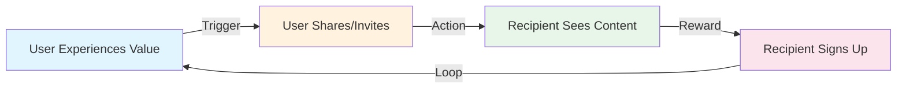
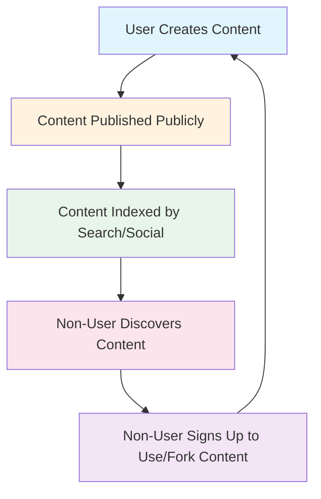
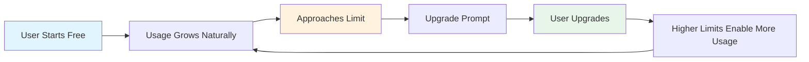

# Growth Loops

> Design the in-product loops that drive self-sustaining acquisition, engagement, retention, and monetization — replacing linear funnels with compounding cycles where every user's action feeds the next user's discovery.

---

## 1. Loop Types

Growth loops fall into four categories based on their primary outcome. A healthy PLG product has at least one loop in each category, with 2-3 loops driving the majority of growth.

### Acquisition Loops

Bring new users into the product without paid marketing.

| Loop Type | Mechanic | Example |
|-----------|----------|---------|
| Viral invite | User invites teammates to collaborate | Slack: "Invite your team" |
| Shared output | User shares a product artifact externally | Figma: shared design links |
| User-generated content | User creates public content indexed by search | Canva: public templates |
| Embedded widget | Product output is embedded on external sites | Typeform: embedded forms |
| Referral incentive | User refers others for a reward | Dropbox: free storage for referrals |
| Powered-by badge | Free-tier output carries product branding | Calendly: "Powered by Calendly" link |

### Engagement Loops

Bring existing users back to the product repeatedly.

| Loop Type | Mechanic | Example |
|-----------|----------|---------|
| Notification-driven | Activity triggers notifications that pull users back | Slack: message notifications |
| Content feed | New content from others creates a reason to return | Notion: team updates in workspace |
| Streak/habit | Product tracks consecutive usage and rewards it | Duolingo: daily streaks |
| Collaborative editing | Others editing shared content triggers return visits | Google Docs: "Someone edited your doc" |
| Digest/summary | Periodic digest email surfaces new activity | LinkedIn: weekly engagement digest |

### Retention Loops

Deepen investment so switching costs increase over time.

| Loop Type | Mechanic | Example |
|-----------|----------|---------|
| Data accumulation | More data in the product = more value = harder to leave | Notion: years of documentation |
| Integration web | More integrations = more workflows = higher switching cost | Zapier: multi-tool automations |
| Team adoption | More teammates = more shared context = harder to leave | Slack: org-wide communication history |
| Custom configuration | Custom workflows, templates, and settings | Salesforce: custom objects and reports |
| Learning curve investment | Time spent learning the product creates inertia | Figma: proficiency with specific tools |

### Monetization Loops

Drive revenue expansion through product usage.

| Loop Type | Mechanic | Example |
|-----------|----------|---------|
| Usage expansion | More usage → hits limit → upgrade | Vercel: bandwidth overages |
| Seat expansion | More team members → more seats → more revenue | Slack: per-seat pricing |
| Feature discovery | Discover advanced feature → locked → upgrade | Notion: API access on paid plan |
| Success-based | User succeeds → wants more → upgrades for scale | Mailchimp: growing subscriber list |

---

## 2. Your Product's Growth Loops

Identify 2-3 primary loops for {{PROJECT_NAME}}.

### Primary Acquisition Loop

```
Loop Name: ________________________________________
Growth Motion: {{PLG_MOTION}}

Trigger:     What causes a user to initiate the loop?
             ________________________________________

Action:      What does the user do?
             ________________________________________

Output:      What artifact or signal is created?
             ________________________________________

Channel:     How does the output reach potential new users?
             ________________________________________

Conversion:  How does the new person become a user?
             ________________________________________

Loop Metric: ________________________________________
Target:      ________________________________________
```

### Primary Engagement Loop

```
Loop Name: ________________________________________

Trigger:     ________________________________________
Action:      ________________________________________
Reward:      ________________________________________
Return:      ________________________________________

Loop Metric: ________________________________________
Target:      ________________________________________
```

### Primary Monetization Loop

```
Loop Name: ________________________________________

Usage Signal:    ________________________________________
Limit/Trigger:   ________________________________________
Upgrade Prompt:  ________________________________________
Value Delivered:  ________________________________________

Loop Metric: ________________________________________
Target:      ________________________________________
```

---

## 3. Viral Loop Design

The canonical viral loop follows a four-step cycle: trigger, action, reward, invite. Each step has a conversion rate. The product of all conversion rates determines the viral coefficient (K-factor).

### Viral Loop Architecture



### Viral Loop Conversion Funnel

| Step | Description | Conversion Rate | Benchmark |
|------|-------------|-----------------|-----------|
| Trigger rate | % of users who encounter a sharing trigger | __% | 30-60% |
| Share rate | % of triggered users who actually share/invite | __% | 10-30% |
| View rate | % of invitees who view the shared content | __% | 40-70% |
| Signup rate | % of viewers who sign up | __% | 10-30% |
| Activation rate | % of new signups who become active users | __% | 20-50% |

**K-factor = Trigger% x Share% x View% x Signup% x Activation% x Avg Invites per User**

### Real-World Viral Loop Examples

**Slack's Team Invite Loop:**
```
1. TRIGGER:  User hits a workflow blocker alone (needs teammate input)
2. ACTION:   User sends team invite via email or link
3. REWARD:   Teammate joins workspace, conversation continues
4. INVITE:   New teammate invites THEIR teammates
5. AMPLIFIER: Entire department migrates, then entire company
```
- K-factor at peak growth: ~0.7 (each workspace brought in 0.7 new workspaces)
- Viral cycle time: 3-7 days (time from invite to new user inviting others)

**Figma's Shared Design Loop:**
```
1. TRIGGER:  Designer finishes a design and needs stakeholder feedback
2. ACTION:   Designer shares a Figma link (no account needed to view)
3. REWARD:   Stakeholder views, comments, and sees the Figma experience
4. INVITE:   Stakeholder asks their team's designers to switch to Figma
5. AMPLIFIER: Design team adopts → shares with engineering → org-wide
```

**Notion's Template Loop:**
```
1. TRIGGER:  User creates a useful workflow/template
2. ACTION:   User publishes template to Notion template gallery
3. REWARD:   Template appears in search results and Notion gallery
4. INVITE:   Non-user discovers template, signs up to duplicate it
5. AMPLIFIER: New user customizes template, eventually publishes their own
```

### Designing Your Viral Loop

```
Step 1 — Trigger Design:
What moment in the user journey naturally requires sharing?
________________________________________

Step 2 — Friction Reduction:
What is the minimum-friction path from trigger to share?
(e.g., 1-click share, auto-generated link, pre-written invite)
________________________________________

Step 3 — Recipient Experience:
What does the invitee see BEFORE signing up?
(Must deliver value before asking for signup)
________________________________________

Step 4 — Signup Incentive:
Why would the invitee create an account?
________________________________________

Step 5 — Loop Closure:
How does the new user encounter their own sharing trigger?
________________________________________
```

---

## 4. Content Loop Design

Content loops differ from viral loops in that the content persists and compounds. Each piece of user-generated content is a permanent acquisition asset that attracts users through search, social, and discovery.

### Content Loop Architecture



### Content Loop Components

| Component | Your Product Design | Example (Canva) |
|-----------|-------------------|-----------------|
| Content creation tool | ________________ | Template designer |
| Publishing mechanism | ________________ | "Share as template" button |
| Discovery channel | ________________ | Google search, template gallery |
| Preview experience | ________________ | Template preview with "Use this template" CTA |
| Fork/duplicate mechanic | ________________ | "Use this template" → creates copy in new account |
| Creation incentive | ________________ | Template usage stats, creator profile |

---

## 5. Usage Loop Design

Usage loops drive expansion within accounts. As users consume more of the product, they generate signals that trigger upgrade or expansion conversations.

### Usage Loop Architecture



### Usage Expansion Signals

| Signal | Free Limit | Upgrade Threshold | Nudge Strategy |
|--------|-----------|-------------------|----------------|
| {{FREE_TIER_LIMITS}} | ________ | ________ | ________ |
| Storage | ________ | ________ | ________ |
| API calls | ________ | ________ | ________ |
| Team members | ________ | ________ | ________ |
| Projects/workspaces | ________ | ________ | ________ |

---

## 6. Loop Instrumentation

Every loop must be instrumented so you can measure conversion at each step and identify bottlenecks.

### Required Events per Loop

```typescript
// src/growth/loop-events.ts

interface LoopEvent {
  loop_id: string;          // e.g., "viral_invite", "content_publish"
  step: string;             // e.g., "trigger", "action", "conversion"
  user_id: string;
  timestamp: string;
  properties: Record<string, unknown>;
}

// Viral Loop Events
const VIRAL_LOOP_EVENTS = [
  "viral_loop.trigger_encountered",     // User hits a sharing moment
  "viral_loop.share_initiated",          // User clicks share/invite
  "viral_loop.share_completed",          // Share/invite successfully sent
  "viral_loop.invite_viewed",            // Recipient views the invite
  "viral_loop.invite_clicked",           // Recipient clicks through
  "viral_loop.signup_started",           // Recipient starts signup
  "viral_loop.signup_completed",         // Recipient completes signup
  "viral_loop.activation_achieved",      // New user reaches activation
  "viral_loop.loop_closed",             // New user triggers their own share
] as const;

// Content Loop Events
const CONTENT_LOOP_EVENTS = [
  "content_loop.content_created",        // User creates content
  "content_loop.content_published",      // Content made public
  "content_loop.content_discovered",     // Non-user views content
  "content_loop.content_cta_clicked",    // Non-user clicks signup CTA
  "content_loop.signup_from_content",    // Signup attributed to content
  "content_loop.content_forked",         // New user duplicates content
  "content_loop.new_content_created",    // Loop closure
] as const;

// Usage Loop Events
const USAGE_LOOP_EVENTS = [
  "usage_loop.limit_50_percent",         // User at 50% of limit
  "usage_loop.limit_75_percent",         // User at 75% of limit
  "usage_loop.limit_90_percent",         // User at 90% of limit
  "usage_loop.limit_reached",            // User hits limit
  "usage_loop.upgrade_prompt_shown",     // Upgrade prompt displayed
  "usage_loop.upgrade_prompt_clicked",   // User clicks upgrade
  "usage_loop.upgrade_completed",        // User upgrades plan
  "usage_loop.post_upgrade_usage",       // Usage after upgrade
] as const;
```

### Loop Dashboard Metrics

| Metric | Calculation | Target |
|--------|------------|--------|
| Loop velocity | Avg time for one complete loop cycle | ________ |
| Loop conversion | % of loop entries that complete full cycle | ________ |
| Loop contribution | % of new signups attributed to loop | ________ |
| Loop retention | % of loop-acquired users retained at D30 | ________ |
| Loop revenue | Revenue attributed to loop-acquired users | ________ |

---

## 7. Loop Optimization Playbook

### Step 1: Identify the Bottleneck

For each loop, measure conversion at each step. The step with the lowest conversion rate is your bottleneck.

```
Example: Viral Invite Loop

Trigger encountered:     1,000 users/week
Share initiated:           300 (30% conversion)  ← Acceptable
Share completed:           250 (83% conversion)  ← Good
Invite viewed:             150 (60% conversion)  ← Acceptable
Invite clicked:             45 (30% conversion)  ← BOTTLENECK
Signup completed:           35 (78% conversion)  ← Good
Activated:                  18 (51% conversion)  ← Acceptable

K-factor: 18/1000 x avg_invites = 0.018 x 5 = 0.09
```

### Step 2: Generate Hypotheses

For the bottleneck step (invite clicked = 30%), generate hypotheses:

| # | Hypothesis | Test | Expected Impact |
|---|-----------|------|-----------------|
| 1 | Invite email subject line is generic | A/B test personalized subject | +5-10% click rate |
| 2 | Landing page requires signup before seeing content | Show content preview first | +10-20% click rate |
| 3 | Invite expires too quickly | Extend expiry from 24h to 7d | +5% click rate |
| 4 | No social proof on invite page | Add "X people already using this" | +3-5% click rate |

### Step 3: Experiment and Measure

Run experiments using the framework in `activation-experiments.template.md`. Target the bottleneck step first, then move to the next lowest-converting step.

### Step 4: Monitor for Loop Decay

Loops degrade over time as channels become saturated, users become habituated, and competitors copy mechanics. Monitor loop metrics weekly and re-optimize quarterly.

**Loop health indicators:**
- [ ] Loop conversion rate is stable or improving month-over-month
- [ ] Loop velocity (cycle time) is stable or decreasing
- [ ] Loop contribution to total signups is stable or increasing
- [ ] No single loop accounts for > 70% of acquisition (diversification)
- [ ] User sentiment on sharing/invite mechanics is neutral or positive

### Anti-Patterns to Avoid

| Anti-Pattern | Problem | Fix |
|-------------|---------|-----|
| Forced invites | Users feel spammed, brand damage | Make sharing optional, value-driven |
| Invisible loops | Loop exists but users do not discover the trigger | Surface triggers at natural workflow moments |
| One-sided value | Only the inviter benefits, not the invitee | Ensure invitee gets immediate value |
| Over-optimized virality | Growth tactics undermine product quality | Set a "virality budget" per user session |
| Unmeasured loops | Running loops without instrumentation | Instrument before launching any loop |

---

## Checklist

- [ ] Identified 2-3 primary growth loops for {{PROJECT_NAME}}
- [ ] Designed viral loop with trigger → action → reward → invite flow
- [ ] Designed content loop if applicable (content-led motion)
- [ ] Designed usage loop with limit → nudge → upgrade flow
- [ ] Instrumented all loop steps with analytics events
- [ ] Established baseline conversion rates for each loop step
- [ ] Identified initial bottleneck for each loop
- [ ] Created experiment backlog for bottleneck optimization
- [ ] Set loop health monitoring cadence (weekly metrics, quarterly deep-dive)
