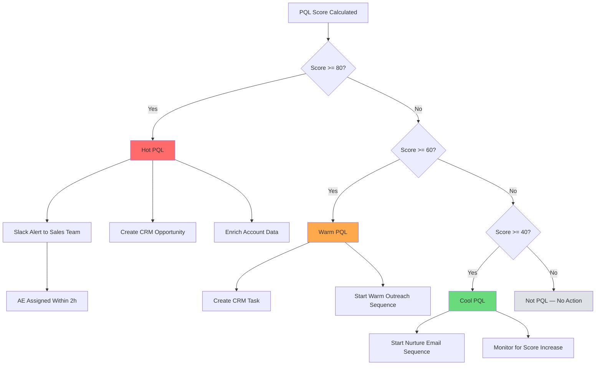

# PQL Scoring

> Build a Product-Qualified Lead scoring model that identifies free users ready for a sales conversation or self-serve upgrade — using in-product behavioral signals, weighted scoring, and automated sales handoff workflows.

---

## 1. PQL Definition

A Product-Qualified Lead (PQL) is a user or account that has demonstrated through product usage behavior that they are likely to convert to a paid plan. Unlike Marketing-Qualified Leads (MQLs), which are based on content engagement and demographic fit, PQLs are based on demonstrated product value.

### PQL vs MQL Comparison

| Dimension | PQL | MQL |
|-----------|-----|-----|
| Signal source | In-product behavior | Marketing engagement |
| Conversion rate to paid | 15-30% | 1-5% |
| Signal reliability | High (based on actual usage) | Medium (based on intent signals) |
| Data infrastructure needed | Product analytics | Marketing automation |
| Sales cycle length | 14-30 days | 60-120 days |
| Sales conversation quality | Warm (user already uses product) | Cold (user may not have tried product) |
| Best for | PLG and hybrid models | Sales-led models |

### Your PQL Definition

```
A {{PROJECT_NAME}} PQL is an account that:

1. Has completed activation ({{ACTIVATION_METRIC}})
2. Has reached a PQL score of >= {{PQL_THRESHOLD}}
3. Demonstrates at least 2 of the following signals:
   {{PQL_SIGNALS}}

PQL Score Range: 0-100
Threshold for Sales Handoff: {{PQL_THRESHOLD}}

PQL Tiers:
  Hot PQL   (score >= 80): Immediate sales outreach within 2 hours
  Warm PQL  (score >= 60): Sales outreach within 24 hours
  Cool PQL  (score >= 40): Nurture sequence, monitor for score increase
  Not PQL   (score < 40):  Continue free tier, no sales outreach
```

---

## 2. Scoring Signals

PQL signals fall into four categories: engagement depth, usage breadth, team/account signals, and timing signals. Each signal is individually weak but collectively predictive.

### Engagement Depth Signals

Measure how deeply a user engages with core features.

| Signal | Description | Weight | Threshold |
|--------|------------|--------|-----------|
| Core feature usage frequency | Times per week user engages core feature | High | >= 5x/week |
| Session duration (avg) | Average session length over last 7 days | Medium | >= 10 minutes |
| Session frequency | Sessions per week | High | >= 4 sessions/week |
| Feature depth | Number of distinct features used | High | >= 5 features |
| Advanced feature usage | Used features typically associated with power users | High | Any advanced feature |
| Data volume | Amount of data created/stored in product | Medium | >= free tier 50% |
| API usage | Programmatic access indicates technical investment | High | Any API call |
| Integration count | Number of third-party integrations connected | High | >= 2 integrations |

### Usage Breadth Signals

Measure how widely the product is used across the account.

| Signal | Description | Weight | Threshold |
|--------|------------|--------|-----------|
| Team size | Number of active users in the account | High | >= 3 users |
| Team growth rate | Rate of new user additions | High | >= 1 new user/week |
| Cross-department usage | Users from different departments | Medium | >= 2 departments |
| Workspace/project count | Number of active workspaces | Medium | >= 3 workspaces |
| Shared content volume | Content shared between team members | Medium | >= 5 shared items |

### Account-Level Signals

Firmographic and demographic signals that indicate fit.

| Signal | Description | Weight | Threshold |
|--------|------------|--------|-----------|
| Company size | Employee count from enrichment | Medium | 50-5000 employees |
| Industry fit | Industry matches ICP | Medium | In target industry list |
| Role/title | User's role indicates buying authority | Low | Manager+ title |
| Technology stack | Uses complementary tools | Low | Uses 2+ related tools |
| Company growth rate | Fast-growing companies expand faster | Low | Growing > 20% YoY |

### Timing Signals

Behavioral signals that indicate urgency or momentum.

| Signal | Description | Weight | Threshold |
|--------|------------|--------|-----------|
| Usage limit approaching | Account nearing free tier limits | High | >= 80% of limit |
| Usage spike | Sudden increase in activity | High | 3x normal activity |
| Pricing page visit | Visited pricing page | High | Any visit |
| Feature gate encounter | Hit a paid-only feature | Medium | >= 2 gate encounters |
| Trial expiry approaching | Trial ends within 3 days | High | <= 3 days remaining |
| Competitor evaluation | Mentions competitor in support/feedback | Medium | Any mention |

---

## 3. Signal Weights and Thresholds

### Weight Configuration

```typescript
// src/growth/pql-config.ts

interface PQLSignalConfig {
  id: string;
  name: string;
  category: "engagement" | "breadth" | "account" | "timing";
  weight: number;        // 1-10 (relative importance)
  threshold: number;     // Minimum value to earn points
  maxPoints: number;     // Maximum points this signal can contribute
  decay: number;         // Days after which signal value decays (0 = no decay)
  calculation: "binary" | "linear" | "logarithmic" | "step";
}

const PQL_SIGNALS: PQLSignalConfig[] = [
  // Engagement Depth (weight: high)
  {
    id: "core_feature_frequency",
    name: "Core feature usage frequency",
    category: "engagement",
    weight: 9,
    threshold: 3,           // min 3x/week
    maxPoints: 15,
    decay: 14,
    calculation: "logarithmic",
  },
  {
    id: "session_frequency",
    name: "Sessions per week",
    category: "engagement",
    weight: 8,
    threshold: 3,
    maxPoints: 12,
    decay: 7,
    calculation: "linear",
  },
  {
    id: "feature_breadth",
    name: "Distinct features used",
    category: "engagement",
    weight: 8,
    threshold: 3,
    maxPoints: 12,
    decay: 30,
    calculation: "step",
  },
  {
    id: "advanced_features",
    name: "Advanced feature usage",
    category: "engagement",
    weight: 7,
    threshold: 1,
    maxPoints: 10,
    decay: 30,
    calculation: "binary",
  },
  {
    id: "integration_count",
    name: "Integrations connected",
    category: "engagement",
    weight: 7,
    threshold: 1,
    maxPoints: 10,
    decay: 0,              // integrations don't decay
    calculation: "step",
  },

  // Usage Breadth (weight: high)
  {
    id: "team_size",
    name: "Active users in account",
    category: "breadth",
    weight: 9,
    threshold: 2,
    maxPoints: 15,
    decay: 0,
    calculation: "logarithmic",
  },
  {
    id: "team_growth",
    name: "User additions per week",
    category: "breadth",
    weight: 8,
    threshold: 1,
    maxPoints: 10,
    decay: 7,
    calculation: "linear",
  },
  {
    id: "workspace_count",
    name: "Active workspaces",
    category: "breadth",
    weight: 6,
    threshold: 2,
    maxPoints: 8,
    decay: 0,
    calculation: "step",
  },

  // Timing Signals (weight: very high — recency matters)
  {
    id: "pricing_page_visit",
    name: "Visited pricing page",
    category: "timing",
    weight: 10,
    threshold: 1,
    maxPoints: 12,
    decay: 3,               // decays fast — intent is time-sensitive
    calculation: "binary",
  },
  {
    id: "usage_limit_approaching",
    name: "Near free tier limits",
    category: "timing",
    weight: 9,
    threshold: 80,           // 80% of limit
    maxPoints: 12,
    decay: 0,
    calculation: "step",
  },
  {
    id: "feature_gate_encounter",
    name: "Hit paid feature gates",
    category: "timing",
    weight: 8,
    threshold: 1,
    maxPoints: 10,
    decay: 7,
    calculation: "linear",
  },

  // Account Signals (weight: moderate)
  {
    id: "company_size",
    name: "Company employee count",
    category: "account",
    weight: 5,
    threshold: 50,
    maxPoints: 8,
    decay: 0,
    calculation: "step",
  },
  {
    id: "industry_fit",
    name: "In target industry",
    category: "account",
    weight: 4,
    threshold: 1,
    maxPoints: 6,
    decay: 0,
    calculation: "binary",
  },
];
```

---

## 4. PQL Score Calculation

### Scoring Engine

```typescript
// src/growth/pql-scorer.ts

interface AccountSignals {
  accountId: string;
  signals: Record<string, number>;  // signal_id → raw value
  lastUpdated: string;
}

interface PQLScore {
  accountId: string;
  score: number;                    // 0-100
  tier: "hot" | "warm" | "cool" | "not_pql";
  topSignals: Array<{ signal: string; contribution: number }>;
  calculatedAt: string;
}

function calculatePQLScore(
  account: AccountSignals,
  config: PQLSignalConfig[]
): PQLScore {
  let totalPoints = 0;
  let maxPossiblePoints = 0;
  const contributions: Array<{ signal: string; contribution: number }> = [];

  for (const signal of config) {
    maxPossiblePoints += signal.maxPoints;
    const rawValue = account.signals[signal.id] ?? 0;

    // Apply threshold — no points if below threshold
    if (rawValue < signal.threshold) continue;

    // Calculate points based on calculation type
    let points = 0;
    switch (signal.calculation) {
      case "binary":
        points = signal.maxPoints;
        break;
      case "linear":
        points = Math.min(
          signal.maxPoints,
          (rawValue / (signal.threshold * 3)) * signal.maxPoints
        );
        break;
      case "logarithmic":
        points = Math.min(
          signal.maxPoints,
          (Math.log2(rawValue + 1) / Math.log2(signal.threshold * 5 + 1))
            * signal.maxPoints
        );
        break;
      case "step":
        if (rawValue >= signal.threshold * 3) points = signal.maxPoints;
        else if (rawValue >= signal.threshold * 2) points = signal.maxPoints * 0.75;
        else if (rawValue >= signal.threshold) points = signal.maxPoints * 0.5;
        break;
    }

    // Apply decay
    if (signal.decay > 0) {
      const daysSinceUpdate = getDaysSince(account.lastUpdated);
      const decayFactor = Math.max(0, 1 - daysSinceUpdate / signal.decay);
      points *= decayFactor;
    }

    // Weight the points
    points = points * (signal.weight / 10);
    totalPoints += points;

    if (points > 0) {
      contributions.push({ signal: signal.name, contribution: points });
    }
  }

  // Normalize to 0-100 scale
  const score = Math.round((totalPoints / maxPossiblePoints) * 100);

  // Determine tier
  let tier: PQLScore["tier"];
  if (score >= 80) tier = "hot";
  else if (score >= 60) tier = "warm";
  else if (score >= 40) tier = "cool";
  else tier = "not_pql";

  return {
    accountId: account.accountId,
    score,
    tier,
    topSignals: contributions.sort((a, b) => b.contribution - a.contribution).slice(0, 5),
    calculatedAt: new Date().toISOString(),
  };
}

function getDaysSince(isoDate: string): number {
  return Math.floor(
    (Date.now() - new Date(isoDate).getTime()) / (1000 * 60 * 60 * 24)
  );
}

// Batch scoring for all accounts
async function scoreAllAccounts(
  accounts: AccountSignals[],
  config: PQLSignalConfig[]
): Promise<PQLScore[]> {
  return accounts
    .map((account) => calculatePQLScore(account, config))
    .sort((a, b) => b.score - a.score);
}
```

### Score Distribution Dashboard

```
Score Distribution (update weekly):

  90-100  ████                    ____% of accounts (____  accounts)
  80-89   ██████                  ____% of accounts (____  accounts)
  70-79   █████████               ____% of accounts (____  accounts)
  60-69   ████████████            ____% of accounts (____  accounts)
  50-59   ███████████████         ____% of accounts (____  accounts)
  40-49   ██████████████████      ____% of accounts (____  accounts)
  30-39   ████████████████████    ____% of accounts (____  accounts)
  20-29   ██████████████████████  ____% of accounts (____  accounts)
  10-19   ████████████████████    ____% of accounts (____  accounts)
   0-9    ████████████████        ____% of accounts (____  accounts)

  Hot PQLs (80+):   ____ accounts (target: ____)
  Warm PQLs (60+):  ____ accounts (target: ____)
```

---

## 5. Sales Handoff Workflow

### Handoff Triggers and SLAs

| PQL Tier | Score | Handoff Action | SLA | Channel |
|----------|-------|---------------|-----|---------|
| Hot | >= 80 | Immediate assignment to AE | 2 hours | Slack alert + CRM task |
| Warm | >= 60 | Queue for next-day outreach | 24 hours | CRM task + email sequence |
| Cool | >= 40 | Add to nurture sequence | 48 hours | Automated email sequence |
| Not PQL | < 40 | No sales action | N/A | Product-led nurture only |

### Handoff Automation



### Sales Context Package

When a PQL is handed to sales, include this context to ensure informed outreach:

```
PQL Handoff Brief:
━━━━━━━━━━━━━━━━━━━━━━━━━━━━━━━━━━━━━━━━
Account:          {{account_name}}
PQL Score:        {{score}} / 100 ({{tier}} tier)
Signup Date:      {{signup_date}}
Days Active:      {{days_active}}

TOP SIGNALS:
  1. {{top_signal_1}}: {{value_1}}
  2. {{top_signal_2}}: {{value_2}}
  3. {{top_signal_3}}: {{value_3}}

USAGE SUMMARY:
  Active users:       {{active_users}} / {{total_users}}
  Sessions (7d):      {{sessions_7d}}
  Core feature usage: {{core_usage}}
  Plan limits used:   {{limit_pct}}%

BUYING SIGNALS:
  Pricing page views: {{pricing_views}} (last: {{last_pricing_visit}})
  Feature gates hit:  {{gates_hit}}
  Upgrade CTAs seen:  {{ctas_seen}}

SUGGESTED APPROACH:
  {{approach_recommendation}}
━━━━━━━━━━━━━━━━━━━━━━━━━━━━━━━━━━━━━━━━
```

### AE Outreach Templates by Tier

**Hot PQL Outreach (score 80+):**
```
Subject: Your {{PROJECT_NAME}} workspace is growing fast

Hi {{first_name}},

I noticed your team at {{company}} has been actively using {{PROJECT_NAME}} —
especially {{top_feature_used}}. Teams using {{product}} at your scale typically
get even more value from {{paid_feature}}.

Would it be worth a 15-minute call to see if there's a fit for your team?
I can also help with {{specific_pain_point_from_usage}}.

Best,
{{ae_name}}
```

**Warm PQL Outreach (score 60-79):**
```
Subject: Getting more from {{PROJECT_NAME}}

Hi {{first_name}},

I see your team has been exploring {{PROJECT_NAME}}. Wanted to share a quick
tip: teams like {{similar_company}} found that {{specific_feature}} helped
them {{specific_outcome}}.

If you're curious about unlocking {{paid_feature}}, happy to walk you through
it — no pressure.

Best,
{{ae_name}}
```

---

## 6. Model Calibration

The PQL scoring model must be calibrated regularly to ensure scores predict actual conversion.

### Calibration Process (Monthly)

```
Step 1: Pull all accounts that crossed PQL threshold in the past 60 days
Step 2: For each, record whether they converted to paid
Step 3: Calculate conversion rate by score band

Calibration Results:
| Score Band | Accounts | Converted | Rate | Target Rate |
|-----------|----------|-----------|------|-------------|
| 90-100    | ____     | ____      | ____% | > 30%      |
| 80-89     | ____     | ____      | ____% | > 20%      |
| 70-79     | ____     | ____      | ____% | > 15%      |
| 60-69     | ____     | ____      | ____% | > 10%      |
| 50-59     | ____     | ____      | ____% | > 5%       |
| 40-49     | ____     | ____      | ____% | > 3%       |
| < 40      | ____     | ____      | ____% | < 2%       |

If score band conversion rates are flat (e.g., 80-89 converts at same
rate as 60-69), your signal weights need adjustment.

Step 4: Identify signals with highest correlation to conversion
Step 5: Adjust weights for signals that over/under-predict
Step 6: Redeploy updated model
Step 7: Compare new model predictions vs old model on holdout set
```

### Model Health Metrics

| Metric | Formula | Healthy Range | Current |
|--------|---------|--------------|---------|
| Precision | true_positives / (true_positives + false_positives) | > 60% | ____% |
| Recall | true_positives / (true_positives + false_negatives) | > 70% | ____% |
| False positive rate | false_positives / total_negatives | < 20% | ____% |
| Rank correlation | Spearman rank correlation: score vs. time_to_convert | > 0.3 | ____ |
| Score-conversion monotonicity | Higher scores = higher conversion rates | Strictly increasing | Yes/No |

---

## 7. PQL vs MQL Dashboard

### Combined Pipeline View

```
                    PQL Pipeline              MQL Pipeline
                    ━━━━━━━━━━━━              ━━━━━━━━━━━━
Total Leads:        ____                      ____
Hot/Warm:           ____                      ____
Conversion Rate:    ____%                     ____%
Avg Deal Size:      $____                     $____
Avg Sales Cycle:    ____ days                 ____ days
Revenue (MTD):      $____                     $____
CAC:                $____                     $____
ROI:                ____x                     ____x

PQL Contribution:   ____% of pipeline revenue
MQL Contribution:   ____% of pipeline revenue
```

### Weekly PQL Metrics

| Metric | This Week | Last Week | Trend | Target |
|--------|-----------|-----------|-------|--------|
| New PQLs (Hot) | ____ | ____ | ↑/↓/→ | ____ |
| New PQLs (Warm) | ____ | ____ | ↑/↓/→ | ____ |
| PQL → Opp conversion | ____% | ____% | ↑/↓/→ | ____% |
| PQL → Closed Won | ____% | ____% | ↑/↓/→ | ____% |
| Avg PQL deal size | $____ | $____ | ↑/↓/→ | $____ |
| PQL response time (SLA) | ____h | ____h | ↑/↓/→ | 2h (hot), 24h (warm) |
| PQL score accuracy | ____% | ____% | ↑/↓/→ | > 60% |

---

## Checklist

- [ ] Defined PQL with specific behavioral criteria
- [ ] Identified and weighted 10+ scoring signals across all four categories
- [ ] Built PQL scoring engine (TypeScript implementation above or equivalent)
- [ ] Set PQL threshold: {{PQL_THRESHOLD}}
- [ ] Defined tier-based SLAs for sales handoff (Hot/Warm/Cool)
- [ ] Created sales context package for PQL handoff
- [ ] Built AE outreach templates for each PQL tier
- [ ] Set up automated Slack/CRM alerts for Hot PQLs
- [ ] Established monthly calibration process
- [ ] Created PQL vs MQL dashboard for pipeline visibility
- [ ] Instrumented PQL scoring signals in {{ANALYTICS_TOOL}}
