# Usage Expansion Triggers

> Define the usage signals that indicate expansion opportunities — limit approaching, team growth, feature discovery — with timing rules, nudge placement maps, and expansion revenue tracking.

---

## 1. Expansion Signal Taxonomy

Expansion signals are behavioral indicators that an account is ready for more — more seats, more features, a higher plan, or add-on products. Each signal has a different urgency, confidence level, and recommended response.

### Signal Categories

```mermaid
graph TD
    A[Expansion Signals] --> B[Usage Limit Signals]
    A --> C[Team Growth Signals]
    A --> D[Feature Discovery Signals]
    A --> E[Engagement Depth Signals]
    A --> F[External Signals]

    B --> B1[Storage approaching limit]
    B --> B2[API calls near cap]
    B --> B3[Project count at limit]
    B --> B4[Seat count at limit]

    C --> C1[New user invitations]
    C --> C2[Cross-department adoption]
    C --> C3[Admin role creation]
    C --> C4[SSO inquiry]

    D --> D1[Paid feature gate hits]
    D --> D2[Advanced feature exploration]
    D --> D3[Integration attempts]
    D --> D4[Export/API documentation views]

    E --> E1[Usage spike]
    E --> E2[Session frequency increase]
    E --> E3[Power user emergence]
    E --> E4[Multi-workspace creation]

    F --> F1[Company funding round]
    F --> F2[Company headcount growth]
    F --> F3[Competitor evaluation signals]
    F --> F4[Pricing page visits]
```



### Complete Signal Registry

| ID | Signal | Category | Urgency | Confidence | Response |
|----|--------|----------|---------|------------|----------|
| EX-001 | Storage at 80% of limit | Usage Limit | High | Very High | In-app banner + email |
| EX-002 | Storage at 95% of limit | Usage Limit | Critical | Very High | Blocking modal |
| EX-003 | API calls at 80% of rate limit | Usage Limit | High | High | Dashboard warning |
| EX-004 | Project count at limit | Usage Limit | High | Very High | Create-blocked modal |
| EX-005 | Seat count at limit | Usage Limit | High | Very High | Invite-blocked modal |
| EX-006 | New user invitations (3+ in 7 days) | Team Growth | Medium | High | Upgrade suggestion email |
| EX-007 | Users from 3+ departments active | Team Growth | Medium | High | Enterprise plan suggestion |
| EX-008 | Admin role created | Team Growth | Low | Medium | Business plan nudge |
| EX-009 | SSO/SAML inquiry via support | Team Growth | High | Very High | Enterprise sales handoff |
| EX-010 | Paid feature gate hit (first time) | Feature Discovery | Low | Medium | Tooltip explanation |
| EX-011 | Paid feature gate hit (3+ times) | Feature Discovery | Medium | High | Upgrade modal |
| EX-012 | Visited integrations page (paid tier) | Feature Discovery | Medium | Medium | Integration upgrade nudge |
| EX-013 | API docs viewed | Feature Discovery | Low | Medium | API plan suggestion |
| EX-014 | Usage 3x above 30-day average | Engagement Depth | Medium | High | Proactive account review |
| EX-015 | Daily active sessions 5+ days/week | Engagement Depth | Medium | High | Power user upgrade path |
| EX-016 | Created 2+ workspaces | Engagement Depth | Medium | Medium | Multi-workspace plan nudge |
| EX-017 | Pricing page viewed (2+ times) | External | High | Very High | Sales follow-up |
| EX-018 | Company raised funding | External | Low | Low | Congrats email + upgrade pitch |

---

## 2. Usage Limit Nudges

Usage limits are the most reliable expansion trigger. When a user approaches a limit, the nudge must balance urgency (preventing disruption) with respect (not feeling like a shakedown).

### Nudge Escalation Ladder

```
     Usage Level          Action                    UI Element
     ──────────          ──────                    ──────────
     0-50%               Nothing                   —
     50-75%              Passive indicator          Small badge in sidebar
     75-85%              Informational nudge        Yellow banner in dashboard
     85-95%              Urgent nudge               Orange banner + email
     95-100%             Critical warning           Red banner + blocking soon
     100%                Soft block                 Action blocked + upgrade modal
     100%+ grace         Hard block                 Cannot proceed without upgrade
```

### Nudge Configuration

```typescript
// src/growth/expansion-triggers.ts

interface UsageLimitConfig {
  resource: string;
  freeLimit: number;
  unit: string;
  nudges: Array<{
    threshold: number;      // percentage of limit
    type: "passive" | "informational" | "urgent" | "critical" | "blocking";
    channel: ("in_app" | "email" | "slack")[];
    message: string;
    cooldown: number;       // hours between repeat nudges
    cta: string;
  }>;
}

const USAGE_LIMITS: UsageLimitConfig[] = [
  {
    resource: "storage",
    freeLimit: 100,         // MB — adjust per {{FREE_TIER_LIMITS}}
    unit: "MB",
    nudges: [
      {
        threshold: 75,
        type: "informational",
        channel: ["in_app"],
        message: "You've used {used} of {limit} {unit} storage",
        cooldown: 168,       // once per week
        cta: "View plans",
      },
      {
        threshold: 90,
        type: "urgent",
        channel: ["in_app", "email"],
        message: "Storage almost full — {remaining} {unit} remaining",
        cooldown: 48,
        cta: "Upgrade for unlimited storage",
      },
      {
        threshold: 100,
        type: "blocking",
        channel: ["in_app", "email"],
        message: "Storage limit reached — upgrade to continue uploading",
        cooldown: 0,         // show every time action is blocked
        cta: "Upgrade now",
      },
    ],
  },
  {
    resource: "projects",
    freeLimit: 3,
    unit: "projects",
    nudges: [
      {
        threshold: 66,       // 2 of 3
        type: "passive",
        channel: ["in_app"],
        message: "1 project remaining on Free plan",
        cooldown: 168,
        cta: "See plans",
      },
      {
        threshold: 100,
        type: "blocking",
        channel: ["in_app"],
        message: "You've reached your project limit. Upgrade to create more.",
        cooldown: 0,
        cta: "Upgrade to create unlimited projects",
      },
    ],
  },
  {
    resource: "team_members",
    freeLimit: 1,
    unit: "members",
    nudges: [
      {
        threshold: 100,
        type: "blocking",
        channel: ["in_app"],
        message: "Invite your team — upgrade to add team members",
        cooldown: 0,
        cta: "Upgrade to invite teammates",
      },
    ],
  },
];
```

### Usage Meter Component

```tsx
// src/components/usage/UsageMeter.tsx

interface UsageMeterProps {
  resource: string;
  used: number;
  limit: number;
  unit: string;
}

function UsageMeter({ resource, used, limit, unit }: UsageMeterProps) {
  const pct = Math.round((used / limit) * 100);

  const color =
    pct >= 95 ? "red" :
    pct >= 85 ? "orange" :
    pct >= 75 ? "yellow" :
    "green";

  return (
    <div className="usage-meter">
      <div className="usage-meter-header">
        <span className="resource-name">{resource}</span>
        <span className="usage-text">
          {used.toLocaleString()} / {limit.toLocaleString()} {unit}
        </span>
      </div>
      <div className="usage-bar">
        <div
          className={`usage-fill usage-fill--${color}`}
          style={{ width: `${Math.min(pct, 100)}%` }}
        />
      </div>
      {pct >= 75 && (
        <a href="/settings/billing" className="upgrade-link">
          {pct >= 95 ? "Upgrade now" : "Need more?"}
        </a>
      )}
    </div>
  );
}
```

---

## 3. Team Growth Triggers

Team growth is the strongest predictor of account expansion. When an account adds users, it signals organizational adoption and increases willingness to pay.

### Team Growth Signal Pipeline

| Signal | Detection | Lag Time | Action |
|--------|-----------|----------|--------|
| First invite sent | Event: `team.invite_sent` | Immediate | Welcome flow for inviter |
| 3+ invites in 7 days | Aggregation query | 1-7 days | Team plan suggestion email |
| Users from new email domain | Domain detection | 1 day | Cross-org adoption alert |
| Admin role created | Event: `team.admin_created` | Immediate | Business plan nudge |
| SSO inquiry | Support ticket keyword | 1 day | Enterprise sales handoff |
| 10+ active users | Daily count | 1 day | Account review trigger |
| Cross-department usage | Department field analysis | 7 days | Enterprise expansion pitch |

### Team Size → Plan Mapping

```
Team Size    Suggested Plan    Rationale
─────────    ──────────────    ─────────
1            Free              Individual use case
2-5          Pro               Small team collaboration
6-20         Pro / Business    Growing team, needs admin controls
21-50        Business          Needs role-based permissions, SSO
51-200       Business / Ent    Needs audit logs, compliance
200+         Enterprise        Needs custom SLA, dedicated support
```

---

## 4. Feature Discovery Prompts

When a user discovers a paid feature organically — by navigating to it, searching for it, or attempting to use it — this is a high-intent expansion signal. The response must educate (what the feature does) and upsell (how to unlock it) without blocking exploration.

### Feature Gate Response Patterns

| Gate Type | User Experience | Best For |
|-----------|----------------|----------|
| Soft gate (preview) | User can see the feature but not use it fully | Analytics, reporting features |
| Hard gate (locked) | Feature is completely inaccessible | Security features, advanced tooling |
| Trial gate | User gets N free uses before gate activates | API calls, exports, integrations |
| Collaborative gate | Feature works for paid users, view-only for free | Shared workspaces, comments |

### Feature Discovery Tracking

```typescript
// src/growth/feature-discovery.ts

interface FeatureGateEvent {
  userId: string;
  accountId: string;
  featureId: string;
  featureName: string;
  requiredPlan: string;
  gateType: "soft" | "hard" | "trial" | "collaborative";
  encounterCount: number;    // how many times this user hit this gate
  timestamp: string;
}

// Track and escalate based on encounter count
function getGateResponse(event: FeatureGateEvent): GateResponse {
  if (event.encounterCount === 1) {
    return {
      type: "tooltip",
      message: `${event.featureName} is available on ${event.requiredPlan}`,
      cta: "Learn more",
      action: "show_feature_info",
    };
  }

  if (event.encounterCount <= 3) {
    return {
      type: "inline_banner",
      message: `You've explored ${event.featureName} ${event.encounterCount} times. Unlock it with ${event.requiredPlan}.`,
      cta: "See what's included",
      action: "show_plan_comparison",
    };
  }

  // 4+ encounters — high intent
  return {
    type: "modal",
    message: `Ready to unlock ${event.featureName}?`,
    cta: "Upgrade to ${event.requiredPlan}",
    action: "go_to_checkout",
  };
}
```

---

## 5. Timing Rules

Expansion triggers must respect user context. A well-timed nudge converts; a badly-timed one annoys.

### Global Timing Rules

| Rule | Value | Rationale |
|------|-------|-----------|
| Minimum time since signup before any expansion nudge | 48 hours | Let user experience value first |
| Maximum expansion nudges per session | 2 | Prevent nudge fatigue |
| Maximum expansion emails per week | 1 | Respect inbox |
| Cooldown after "dismiss" or "not now" | 7 days | Respect user choice |
| Cooldown after failed upgrade attempt | 3 days | May be a billing issue |
| Never show during onboarding (first 3 steps) | Always | Onboarding completion > monetization |
| Show after success moment, not during frustration | Always | Positive context increases conversion |
| Do not stack multiple nudges | Always | One clear message at a time |

### Time-of-Day Rules

| Time Window | Action |
|-------------|--------|
| User's business hours (9am-5pm local) | Full nudge set available |
| Evening (5pm-9pm) | In-app nudges only, no email |
| Night (9pm-9am) | No nudges, queue for morning |
| Weekend | In-app only, reduced frequency |

### Context-Aware Timing

```typescript
// src/growth/nudge-timing.ts

interface NudgeContext {
  userId: string;
  lastNudgeAt: string | null;
  nudgeCountToday: number;
  nudgeCountThisWeek: number;
  lastDismissAt: string | null;
  isOnboarding: boolean;
  lastSuccessEvent: string | null;
  currentSessionDuration: number;   // minutes
}

function canShowNudge(context: NudgeContext): boolean {
  // Hard blocks
  if (context.isOnboarding) return false;
  if (context.nudgeCountToday >= 2) return false;
  if (context.nudgeCountThisWeek >= 5) return false;

  // Cooldowns
  if (context.lastDismissAt) {
    const daysSinceDismiss = getDaysSince(context.lastDismissAt);
    if (daysSinceDismiss < 7) return false;
  }

  if (context.lastNudgeAt) {
    const hoursSinceNudge = getHoursSince(context.lastNudgeAt);
    if (hoursSinceNudge < 4) return false;
  }

  // Positive context: show after success, not immediately after error
  if (context.currentSessionDuration < 2) return false;  // Let user settle in

  return true;
}
```

---

## 6. Upsell Placement Map

Map where expansion nudges appear within the product. Each placement has different visibility, intrusiveness, and conversion characteristics.

### Placement Inventory

| Location | Placement Type | Visibility | Intrusiveness | Best For |
|----------|---------------|------------|---------------|----------|
| Dashboard | Usage meter widget | High | Low | Usage limit awareness |
| Sidebar | "Upgrade" link or badge | Medium | Very Low | Always-visible upgrade path |
| Settings > Billing | Plan comparison | High (when visited) | None | Intentional upgraders |
| Feature page (gated) | Lock icon + tooltip | High (in context) | Low | Feature gate education |
| Create dialog (at limit) | Blocking modal | Very High | High | Hard limit enforcement |
| Header bar | Persistent banner | Very High | Medium | Urgent limits or trials |
| Empty state | Upgrade suggestion | High | Low | First encounter with paid feature |
| Notification center | Expansion notification | Medium | Low | Team growth nudges |
| Email | Expansion email | Medium | Medium | Usage milestones |
| In-product help | "Available on Pro" | Low | Very Low | Feature discovery |

### Placement Heatmap

```
┌─────────────────────────────────────────────────────────────────┐
│  [Logo]  [Nav]  [Nav]  [Nav]         [▲ 80% storage] [Avatar]  │
│  ╔═══════════════════════════════════════════════════════╗      │
│  ║  HEADER BANNER — Trial expiring / Critical limit      ║      │
│  ╚═══════════════════════════════════════════════════════╝      │
├──────────────┬──────────────────────────────────────────────────┤
│              │                                                  │
│  [Dashboard] │   ┌─────────────────────────────────────────┐   │
│  [Projects]  │   │  Dashboard Widget                        │   │
│  [Analytics] │   │  ┌─ Usage Meter ──────────────────────┐ │   │
│  [Settings]  │   │  │  Storage: ████████░░ 80%  [Upgrade]│ │   │
│              │   │  │  Projects: ██████████ 3/3  [Upgrade]│ │   │
│  ┌────────┐  │   │  └───────────────────────────────────┘ │   │
│  │Upgrade │  │   │                                         │   │
│  │  ✨    │  │   │  ┌─ Feature Card (locked) ────────────┐ │   │
│  │Pro plan│  │   │  │  🔒 Advanced Analytics             │ │   │
│  │$X/mo   │  │   │  │  Available on Pro plan             │ │   │
│  └────────┘  │   │  │  [Learn more]                      │ │   │
│              │   │  └───────────────────────────────────┘ │   │
│              │   └─────────────────────────────────────────┘   │
├──────────────┴──────────────────────────────────────────────────┤
│  Footer                                                         │
└─────────────────────────────────────────────────────────────────┘
```

---

## 7. Expansion Revenue Tracking

### Expansion Revenue Metrics

| Metric | Formula | Target |
|--------|---------|--------|
| Expansion MRR | MRR from upgrades + seat additions + add-ons this month | $____ |
| Expansion rate | Expansion MRR / Starting MRR | > 5% monthly |
| Net revenue retention | (Starting MRR + Expansion - Contraction - Churn) / Starting MRR | > 110% |
| Upgrade conversion rate | Accounts that upgraded / Total accounts that saw upgrade prompt | {{UPGRADE_CONVERSION_TARGET}}% |
| Expansion by trigger | Revenue attributed to each trigger type | Track per signal |
| Time from trigger to upgrade | Days between expansion signal and upgrade completion | < 14 days |

### Expansion Revenue Attribution

```typescript
// src/growth/expansion-attribution.ts

interface ExpansionEvent {
  accountId: string;
  previousPlan: string;
  newPlan: string;
  mrrChange: number;
  triggerSignals: Array<{
    signalId: string;
    signalName: string;
    firstSeenAt: string;
    lastSeenAt: string;
    encounterCount: number;
  }>;
  attributionModel: "first_touch" | "last_touch" | "linear";
  upgradedAt: string;
}

// Attribution: which signal gets credit for the expansion?
function attributeExpansion(event: ExpansionEvent): Record<string, number> {
  const attribution: Record<string, number> = {};

  switch (event.attributionModel) {
    case "first_touch":
      // 100% credit to the first signal
      if (event.triggerSignals.length > 0) {
        const first = event.triggerSignals
          .sort((a, b) => new Date(a.firstSeenAt).getTime() - new Date(b.firstSeenAt).getTime())[0];
        attribution[first.signalId] = event.mrrChange;
      }
      break;

    case "last_touch":
      // 100% credit to the last signal before upgrade
      if (event.triggerSignals.length > 0) {
        const last = event.triggerSignals
          .sort((a, b) => new Date(b.lastSeenAt).getTime() - new Date(a.lastSeenAt).getTime())[0];
        attribution[last.signalId] = event.mrrChange;
      }
      break;

    case "linear":
      // Equal credit across all signals
      const share = event.mrrChange / event.triggerSignals.length;
      for (const signal of event.triggerSignals) {
        attribution[signal.signalId] = share;
      }
      break;
  }

  return attribution;
}
```

### Monthly Expansion Report

```
Month: ________

Expansion Revenue Summary:
  Starting MRR:           $________
  Expansion MRR:          $________ (+___%)
  Contraction MRR:        $________ (-___%)
  Churn MRR:              $________ (-___%)
  Net New MRR:            $________
  Net Revenue Retention:  ____%

Expansion by Trigger:
  Usage limit nudges:     $________ (____%)
  Team growth:            $________ (____%)
  Feature discovery:      $________ (____%)
  Self-serve upgrade:     $________ (____%)
  Sales-assisted:         $________ (____%)

Top Expanding Accounts:
  1. ________ — $____ expansion (trigger: ________)
  2. ________ — $____ expansion (trigger: ________)
  3. ________ — $____ expansion (trigger: ________)
```

---

## Checklist

- [ ] Catalogued all expansion signals with urgency and confidence ratings
- [ ] Configured usage limit nudge escalation ladder for each metered resource
- [ ] Implemented team growth detection (invite velocity, cross-department)
- [ ] Designed feature gate responses (tooltip → banner → modal escalation)
- [ ] Set global timing rules for nudge frequency and cooldowns
- [ ] Created upsell placement map for all product surfaces
- [ ] Instrumented expansion attribution tracking
- [ ] Set expansion revenue targets and reporting cadence
- [ ] Verified nudge timing respects onboarding grace period
- [ ] Tested all blocking modals to ensure upgrade path is clear and functional
