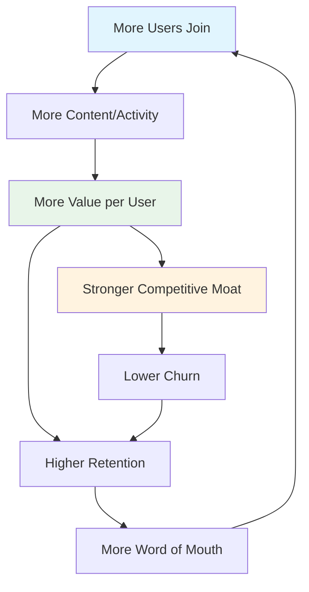

# Viral Coefficient Model

> Model your product's viral coefficient (K-factor), measure viral cycle time, design invite and referral mechanics, structure incentives, classify network effects, and benchmark against industry standards.

---

## 1. K-Factor Calculation

The viral coefficient (K-factor) measures how many new users each existing user brings into the product. A K-factor of 1.0 means every user brings in exactly one new user — self-sustaining growth. Above 1.0 means exponential growth. Below 1.0 means the viral channel supplements but does not replace other acquisition channels.

### K-Factor Formula

```
K = i × c

Where:
  i = average number of invitations sent per user
  c = conversion rate of invitations (% of invitees who become active users)

Example:
  i = 5 invitations per user
  c = 20% conversion rate
  K = 5 × 0.20 = 1.0 (self-sustaining)
```

### Detailed K-Factor Breakdown

```
                            Your Product        Benchmark
                            ────────────        ─────────
Users (current period):     ________            —
Invitations sent:           ________            —
Avg invitations per user:   ________  (i)       3-8
Invites viewed:             ________            —
View rate:                  ________%           40-70%
Invites clicked:            ________            —
Click rate:                 ________%           20-40%
Signups from invites:       ________            —
Signup rate:                ________%           10-30%
Activated from invites:     ________            —
Activation rate:            ________%           30-60%

Gross K (signup):           ________            0.3-0.8 (B2B)
Net K (activated):          ________            0.2-0.5 (B2B)

Target K:                   {{VIRAL_COEFFICIENT_TARGET}}
Gap:                        ________
```

### K-Factor Decomposition

```mermaid
graph LR
    A[1000 Users] -->|"i = 5 invites each"| B[5000 Invites Sent]
    B -->|"60% viewed"| C[3000 Invites Viewed]
    C -->|"30% clicked"| D[900 Clicks]
    D -->|"25% signed up"| E[225 Signups]
    E -->|"50% activated"| F[113 Active Users]

    style A fill:#e1f5fe
    style F fill:#e8f5e9

    F -->|"K = 113/1000 = 0.113"| G[K = 0.113]
```



### K-Factor Sensitivity Analysis

What happens if you improve each step by 20%?

| Lever | Current | +20% | K Impact |
|-------|---------|------|----------|
| Invites per user (i) | ____ | ____ | K × 1.20 |
| View rate | ____% | ____% | K × 1.20 |
| Click rate | ____% | ____% | K × 1.20 |
| Signup rate | ____% | ____% | K × 1.20 |
| Activation rate | ____% | ____% | K × 1.20 |
| All levers +20% | — | — | K × 2.49 |

The compounding effect is significant — improving each step by just 20% nearly 2.5x your K-factor.

---

## 2. Viral Cycle Time

Viral cycle time is the elapsed time for one complete viral loop iteration — from a user joining to that user's invitees joining. Shorter cycle times mean faster growth compounding, even at the same K-factor.

### Cycle Time Components

```
Viral Cycle Time = T_signup + T_activation + T_invitation + T_response + T_conversion

Where:
  T_signup:     Time to complete signup               ____ hours
  T_activation: Time from signup to activation        ____ hours
  T_invitation: Time from activation to first invite  ____ hours
  T_response:   Time from invite sent to opened       ____ hours
  T_conversion: Time from invite opened to signup     ____ hours

  Total cycle time:                                   ____ hours / ____ days
  Target cycle time:                                  ____ hours / ____ days
```

### Growth Rate with Cycle Time

```
Users at time t = Users_0 × K^(t / cycle_time)

Example with K = 0.5, starting with 1000 users:

Cycle time = 1 day:
  Day 7:   1000 × 0.5^7 = 1000 + 500 + 250 + 125 + ... ≈ 1,992 users
  Day 30:  ≈ 2,000 users (converges because K < 1)

Cycle time = 7 days:
  Day 7:   1000 + 500 = 1,500 users (only 1 cycle completed)
  Day 30:  ≈ 1,937 users (fewer cycles, same endpoint, much slower)
```

### Cycle Time Reduction Strategies

| Strategy | Target Component | Expected Reduction |
|----------|-----------------|-------------------|
| Pre-fill invite with team contacts | T_invitation | 50-70% |
| One-click invite (link sharing) | T_invitation | 30-50% |
| Push notification for invites | T_response | 40-60% |
| No-signup content preview | T_conversion | 20-30% |
| Social login for invitees | T_conversion | 30-50% |
| Immediate value on first visit | T_activation | 30-50% |
| "Invite during onboarding" step | T_invitation | 60-80% (moves invite into onboarding) |

---

## 3. Invite Mechanism Design

The invite mechanism is the core infrastructure of your viral loop. It must be frictionless for the inviter, valuable for the invitee, and trackable for your growth team.

### Invite Mechanism Options

| Mechanism | Friction | Reach | Trackability | Best For |
|-----------|---------|-------|-------------|----------|
| Email invite | Low | Direct | High | Team/workspace invites |
| Share link | Very Low | Broad | Medium | Public sharing, social |
| In-product mention (@user) | Very Low | Direct | High | Collaborative products |
| Calendar/meeting invite | Low | Direct | Medium | Scheduling products |
| Embeddable widget | None | Passive | High | Content/form products |
| Referral code | Low | Broad | High | Incentivized referrals |
| "Powered by" badge | None | Passive | Low | Free-tier branding |
| Social sharing | Low | Broad | Low | Consumer products |

### Invite Flow Design

```
INVITER EXPERIENCE:
┌─────────────────────────────────────────────────────────┐
│                                                           │
│  ┌─ Invite Teammates ───────────────────────────────┐   │
│  │                                                     │  │
│  │  Email addresses (one per line):                   │  │
│  │  ┌─────────────────────────────────────────────┐   │  │
│  │  │ alice@company.com                           │   │  │
│  │  │ bob@company.com                             │   │  │
│  │  │                                             │   │  │
│  │  └─────────────────────────────────────────────┘   │  │
│  │                                                     │  │
│  │  Or share a link:                                  │  │
│  │  ┌────────────────────────────────┐ [Copy Link]    │  │
│  │  │ https://app.example.com/j/xyz  │                │  │
│  │  └────────────────────────────────┘                │  │
│  │                                                     │  │
│  │  Personal message (optional):                      │  │
│  │  ┌─────────────────────────────────────────────┐   │  │
│  │  │ Hey, check out this tool we're using...     │   │  │
│  │  └─────────────────────────────────────────────┘   │  │
│  │                                                     │  │
│  │  [Send Invites]                                    │  │
│  │                                                     │  │
│  └─────────────────────────────────────────────────────┘  │
│                                                           │
└─────────────────────────────────────────────────────────┘

INVITEE EXPERIENCE:
┌─────────────────────────────────────────────────────────┐
│                                                           │
│  ┌─ Email Invite ────────────────────────────────────┐  │
│  │                                                     │  │
│  │  👋 Alice invited you to {{PROJECT_NAME}}          │  │
│  │                                                     │  │
│  │  "Hey, check out this tool we're using..."         │  │
│  │                                                     │  │
│  │  [Join the Team →]                                 │  │
│  │                                                     │  │
│  │  See what Alice is working on — no signup needed.  │  │
│  │  [Preview →]                                       │  │
│  │                                                     │  │
│  └─────────────────────────────────────────────────────┘  │
│                                                           │
└─────────────────────────────────────────────────────────┘
```

---

## 4. Referral Incentive Structure

Referral incentives amplify viral growth by giving users a reason to share beyond natural product usage. The incentive must be valuable enough to motivate sharing but not so valuable that it attracts low-quality referrals.

### Incentive Models

| Model | Inviter Gets | Invitee Gets | Best For |
|-------|-------------|-------------|----------|
| Double-sided credit | Account credit | Account credit | Usage-based products |
| Extended trial | Extra trial days | Extra trial days | Trial-based products |
| Feature unlock | Premium feature for X days | Premium feature for X days | Feature-gated products |
| Storage/usage bonus | Extra storage/quota | Extra storage/quota | Limit-based products |
| Cash/gift card | $X per referral | $X discount | High-ACV products |
| Charity donation | Donation in their name | Donation in their name | Mission-driven brands |
| Tiered rewards | Escalating rewards per referral milestone | First-use bonus | High-volume referrals |

### Incentive Design Rules

| Rule | Rationale |
|------|-----------|
| Always double-sided | One-sided rewards feel transactional; double-sided feels generous |
| Cap rewards per user | Prevent gaming and abuse (e.g., max 10 referrals) |
| Require activation, not just signup | Pay for value, not vanity signups |
| Time-limit rewards | "Invite within 30 days" creates urgency |
| Make reward visible | Show reward status in dashboard, not hidden in settings |
| Disclose clearly | FTC requires disclosure of incentivized referrals |

### Referral Tracking

```typescript
// src/growth/referral-tracking.ts

interface Referral {
  id: string;
  referrerId: string;
  refereeId: string | null;          // null until signup
  referralCode: string;
  channel: "email" | "link" | "social";
  status: "sent" | "viewed" | "signed_up" | "activated" | "rewarded";
  incentive: {
    referrerReward: string;
    refereeReward: string;
    rewardedAt: string | null;
  };
  createdAt: string;
  updatedAt: string;
}

interface ReferralDashboard {
  totalReferralsSent: number;
  totalSignups: number;
  totalActivated: number;
  totalRewarded: number;
  conversionRate: number;             // activated / sent
  rewardsEarned: string;              // "$X credit" or "X GB storage"
  remainingCap: number;               // referrals left before cap
}
```

---

## 5. Optimization Experiments

### High-Impact K-Factor Experiments

| ID | Lever | Experiment | Expected K Impact |
|----|-------|-----------|-------------------|
| VK-001 | Invitations (i) | Add "Invite team" step to onboarding | +0.05-0.10 |
| VK-002 | Invitations (i) | Pre-populate invite list from Google Contacts | +0.03-0.08 |
| VK-003 | Invitations (i) | Add invite prompt after first success moment | +0.02-0.05 |
| VK-004 | View rate | A/B test invite email subject lines | +0.01-0.03 |
| VK-005 | View rate | Add inviter's face/avatar to invite email | +0.01-0.02 |
| VK-006 | Click rate | Show preview of shared content in invite | +0.02-0.05 |
| VK-007 | Click rate | Add social proof to invite landing page | +0.01-0.03 |
| VK-008 | Signup rate | Allow content viewing without signup | +0.03-0.08 |
| VK-009 | Signup rate | Add Google/GitHub SSO to invite flow | +0.02-0.05 |
| VK-010 | Activation | Pre-populate workspace for invited users | +0.02-0.05 |
| VK-011 | Incentive | Test double-sided referral reward | +0.05-0.15 |
| VK-012 | Cycle time | Send invite reminder if no invites by D3 | +0.01-0.03 |

### K-Factor Improvement Tracker

```
Starting K-factor:        ________
Target K-factor:          {{VIRAL_COEFFICIENT_TARGET}}
Gap:                      ________

After VK-___:             ________ (Δ +________)
After VK-___:             ________ (Δ +________)
After VK-___:             ________ (Δ +________)
After VK-___:             ________ (Δ +________)

Current K-factor:         ________
Remaining gap:            ________
```

---

## 6. Network Effect Classification

Understanding your network effect type determines how to amplify it. Different network effects have different growth characteristics and moat strength.

### Network Effect Types

| Type | Description | Strength | Example |
|------|------------|----------|---------|
| Direct (same-side) | Product gets better for all users as more users join | Very Strong | Slack (more people = more conversations) |
| Indirect (cross-side) | Two user groups make the product valuable for each other | Strong | Uber (drivers + riders) |
| Data | Product improves as it collects more data from usage | Strong | Google Maps (traffic data) |
| Content | More user-generated content = more reasons to join | Medium-Strong | YouTube, Reddit |
| Compatibility | Product becomes standard, creating switching costs | Strong | Microsoft Office formats |
| Social | Product reflects social graph, creating identity lock-in | Medium | LinkedIn profile |

### Your Product's Network Effects

```
Primary Network Effect Type:    ________________________________________
Description:                    ________________________________________
Current Strength (1-10):        ________
Growth Impact:                  ________________________________________

Secondary Network Effect Type:  ________________________________________
Description:                    ________________________________________
Current Strength (1-10):        ________
Growth Impact:                  ________________________________________

Network Effect Measurement:
  Value per user at 10 users:   ________
  Value per user at 100 users:  ________
  Value per user at 1000 users: ________
  Ratio (1000/10):              ________x (should be > 3x for strong NE)
```

### Network Effect Flywheel



---

## 7. Benchmarks

### K-Factor Benchmarks by Category

| Category | Product | Estimated K | Notes |
|----------|---------|-------------|-------|
| **B2B Collaboration** | Slack | 0.6-0.8 | Team-based viral loop |
| | Notion | 0.3-0.5 | Template + workspace sharing |
| | Figma | 0.4-0.6 | Design sharing with stakeholders |
| | Asana | 0.3-0.5 | Project-based invites |
| **B2B Developer Tools** | Vercel | 0.2-0.4 | Deploy link sharing |
| | GitHub | 0.5-0.7 | Repository collaboration |
| | Postman | 0.3-0.5 | Collection sharing |
| **B2B Infrastructure** | Twilio | 0.1-0.2 | Low inherent virality |
| | Datadog | 0.1-0.2 | Infrastructure products rarely viral |
| **Consumer** | WhatsApp | 0.8-1.2 | Messaging requires network |
| | TikTok | 1.0-2.0+ | Content sharing viral loop |
| | Dropbox (peak) | 0.7-1.0 | Referral program + file sharing |
| **Marketplace** | Airbnb | 0.3-0.5 | Listing sharing |
| | Uber | 0.4-0.7 | Referral program |

### Target Setting Guide

```
Your product category:    ________________________________________
Comparable products:      ________________________________________
Industry K-factor range:  ________ to ________

Conservative target:      ________ (25th percentile)
Realistic target:         ________ (50th percentile)
Ambitious target:         ________ (75th percentile)

Selected target:          {{VIRAL_COEFFICIENT_TARGET}}
Timeline to achieve:      ________ months
```

### Viral Growth Projection

| Month | Users (K=0.2) | Users (K=0.5) | Users (K=0.8) | Users (K=1.0) |
|-------|-------------|-------------|-------------|-------------|
| 0 | 1,000 | 1,000 | 1,000 | 1,000 |
| 1 | 1,200 | 1,500 | 1,800 | 2,000 |
| 2 | 1,440 | 2,250 | 3,240 | 4,000 |
| 3 | 1,728 | 3,375 | 5,832 | 8,000 |
| 6 | 2,986 | 11,391 | 35,832 | 64,000 |
| 12 | 8,916 | 129,746 | 1,283,918 | 4,096,000 |

*Assumes consistent K-factor, 30-day viral cycle, and 1000 new non-viral signups/month.*

---

## Checklist

- [ ] Calculated current K-factor with all funnel step breakdowns
- [ ] Measured viral cycle time and identified longest component
- [ ] Designed primary invite mechanism (email, link, or in-product)
- [ ] Designed referral incentive structure (double-sided)
- [ ] Set K-factor target: {{VIRAL_COEFFICIENT_TARGET}}
- [ ] Created K-factor optimization experiment backlog
- [ ] Classified product's network effect type(s)
- [ ] Benchmarked K-factor against comparable products
- [ ] Built viral growth projection model
- [ ] Instrumented all viral funnel steps for measurement
- [ ] Set up weekly K-factor monitoring dashboard
